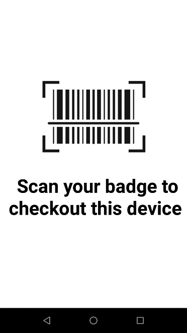

## Overview
When initiating the process to find a device, the target device must first be set to the **To Be Found** state by the administrator or manager. The “seeking” device, or the device performing the search, is used to determine the distance the user is located in relation to the “target” device, or the device to be found. Location must be enabled on the seeking device to perform the device search.

When a device is found, recommission the device to place it back into the active device pool. Alternatively, decommission the device if it needs to be removed from the active device pool.

A note can be added at any time to capture comments specific to the device to aid in tracking or identifying problems with the device. This feature is available only for administrators and managers. 

Optionally, the Check-out feature can be enabled to associate users to devices fo accountability with the scan of a barcode.
 

## Mark a Device "To Be Found"
A device must be marked "To Be Found" before a device search can take place:

1. From the device list, tap and hold the device card of the target device to find. Select **Set To Find.**

<i>Device action menu</i>

2.	The status is changed to **To Be Found** and the device is now listed in the **To Be Found** category in the dashboard.
3.	To proceed to find the device, continue to the next section [Find a Device](./#findadevice).
 

## Find a Device
The target device must be set **To Be Found** to proceed with the device search. A search is initiated from the **To Be Found** device list. For an associate, the **To Be Found** device list is displayed after starting the client app. For an administrator or manager, the **To Be Found** device list is accessible via the dashboard. 

When the user is ready to take action to perform the device search, the first step is to use the seeking device to find the access point (AP) that the target device is connected to. This provides the general location of the target device. The user walks toward the AP, then uses the Bluetooth proximity indicator on the seeking device to identify how close or far the target device is located in relation to the seeking device. To further pinpoint the device location, a sound can be played by tapping the **Play Sound** button on the seeking device to locate the target device by audio sound. 
 
To start the search process:

1.	Perform _one_ of the following in the **To Be Found** device list: Tap and hold the device card for the target device. Select **Start Finding** from the device action menu.  
<i>Device action menu</i>  
_Or,_ 
Tap on the device card for the target device to open the <b>Device Details</b> screen. Scroll down and tap <b>Start Finding.</b>
<i>Tap "Start Finding" in Device Details</i>    

2.	The device tracking screen appears. The device state is changed to **Being Found.**
3.	Check the **Connected AP** on the tracking screen on the target device. Walk towards the known location of the AP.
4.	Using the BLE proximity meter, walk towards the target device.  The BLE proximity meter identifies the overall trend on how far or how close the user is located in relation to the target device. The closer the target, the further the blue indicator bar expands to the right.  As the seeking device approaches the target device, the numerical value on the meter decreases as it reaches “Close” or “0” value. 
<i>Tracking screen with proximity meter</i>  

5.	Tap Play Sound on the seeking device. The target device emits a chirping sound to help identify its location. Walk towards the sound. Continue this step until the device is found.
6.	If the target device is found, tap **Device found.** The device is then moved to the Found state. If the device is not found, **tap Cannot find.**  The device is then moved to the **Cannot Find** state. The device is listed under the corresponding categories accessible from the dashboard.
 

## Decommission/Recommission Device
After a device is found, it should be recommissioned to place the found device back to the active device pool. This changes the device status from **Found** to **In Service.** Alternatively, to account for only active devices, recommission or decommission a device to add or remove the device to/from the active device pool. This feature to decommission/recommission a device is available only to administrators or managers.

### Decommission a Device
When a device is no longer in use or needs to be taken out of the active device pool, it can be set as “Decommissioned”.  This prevents any further device reporting to the server and applies to situations when the device is being sent for repair, the device is being replaced, or the device is deprecated and needs to be removed. 

To decommission a device:

1.	Perform _one_ of the following procedures: From the device list, tap and hold on the device card. Tap **Decommission** from the device action menu displayed. The **Device Details** screen appears. 
_Or,_  
If already in the **Device Details** screen, tap on the top right menu and select **Decommission.**
2.	The status is changed to **Decommissioned** and the user is prompted to enter a note. 
3.	If desired, add a note by entering text in the Note section to indicate the reason for the device decommission. See Add/Edit a Note section.
4.	Tap back. The note is saved and the device is placed in the **Decommissioned** category in the dashboard.

### Recommission a Device
A device can be recommissioned after being found (in the **Found** state) or previously **Decommissioned** and needs to be placed back into the active device pool (e.g. returned from repair).  Recommissioning a device restarts the device status reporting to the server. 
Steps to recommission a device:

1.	In the dashboard, scroll down and tap **Decommissioned** or **Found** to display the corresponding list of devices.
2.	Perform _one_ of the following procedures: Tap and hold the device card and select **Recommission.** 
_Or,_ 
Tap the device card to display the **Device Details** screen. Tap on the top right menu and select **Recommission.**
3.	The **Status** is changed to **In Service,** as seen in the **Device Details** screen.
4.	Tap the **Note** section to enter or edit text indicating the reason why the device is recommissioned.
 

## Add/Edit a Note
Administrators and managers can add a note to capture comments specific to the device to help in device tracking or identifying device problems.  For example, a comment could be "device screen damaged".  

To add or edit a note:

1.	From the device list of any category accessed from the dashboard, tap and hold the device card and tap **Add a Note.** If a note already exists, the option is provided to **Edit a Note.**
2.	The **Note** section appears in the **Device Details** screen prompting to enter in text.
<i>Enter a note or comment</i>  

3.	After entering text for the note, tap the back button.
4.	The note is saved and can be viewed in the **Device Details** screen.
 

## Device Check-out
[Device Check-out](../setup/#devicecheckout) is an optional feature that can be enabled by the administrator. If enabled, the user is required to scan their barcode at the start of their work shift to check-out the device, then logout at the end of their work shift to check-in the device. The check-out screen is in kiosk mode, preventing the user from accessing the device until check-out is performed. When a device is checked-out, the user is associated with the particular device until the user checks in the device. 

### Check-out
Perform a device check-out at the start of a work shift as follows:
1.	Remove the device from power to automatically display the check-out screen or launch the app on the device.
2.	The check-out screen appears, prompting to scan a barcode. When in the check-out screen, the user is prevented access to the device until check-out is performed.
<i>Device check-out</i>  

3.	Scan the barcode associated with the user by pressing the scan trigger or tapping on the barcode image on the screen. If the administrator has set a prefix string in the [barcode prefix option](../setup/#enablecheckoutcheckin), the barcode must contain the prefix specified for check-in to be successful.  
4.	A message appears indicating the user is checked-out successfully. The app is placed in the background.
5.	The user is now associated with the device.   
<!-- -->
**Note:** If Check-out is enabled, after a device is rebooted the Check-out screen may take up to one minute to be displayed.
  

### Check-In
Choose one of the following options to Check-In a device:   

**Option 1:**

1.	Launch the app.
2.	Tap on the options menu from the top right and select Check-In Device.
3.	The user is checked-in.  The check-out screen appears prompting to scan a barcode.
      
**Option 2:**

1.	Connect the device to power.
2.	The user is checked-in.  The check-out screen appears prompting to scan a barcode.
      
**Option 3:**

1.	Reboot the device.
2.	The check-out screen appears prompting to scan a barcode.
 

<!-- -->
**Option 4:**

1.	Perform a battery swap.
2.	The check-out screen appears prompting to scan a barcode.

  
<!-- -->
-----

## See Also

* [Install](../setup)
* [Usage Guide](../usage)
* [Device Central Manager CSP](/mx/devicecentralmgr) - configures Device Central settings
* [Bluetooth Manager CSP](/mx/bluetoothmgr) - controls whether a device can pair with other Bluetooth devices

