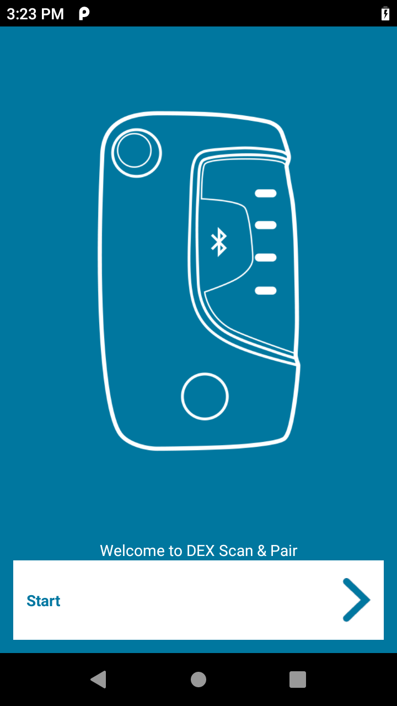
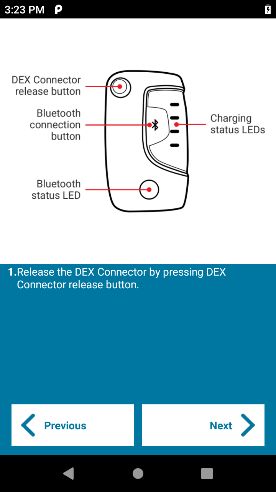
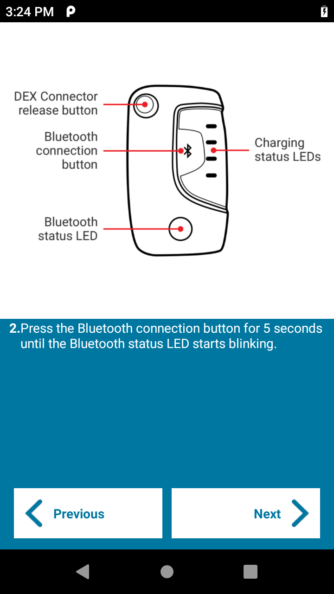
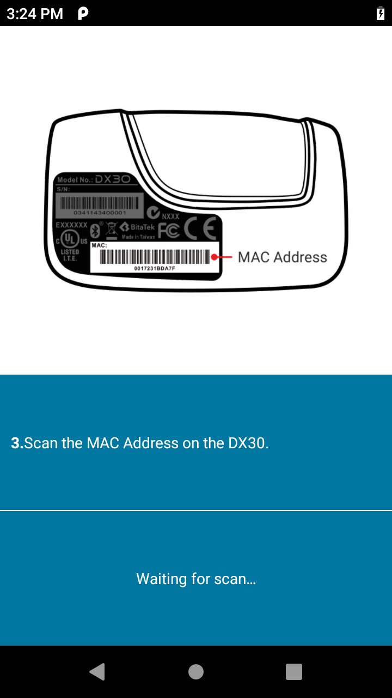
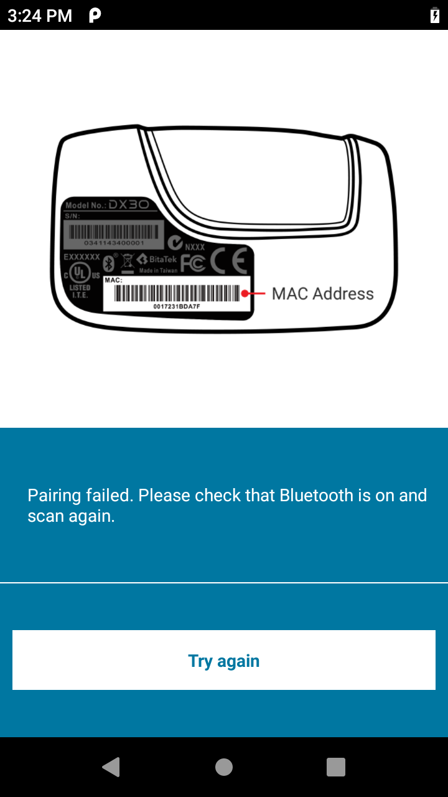
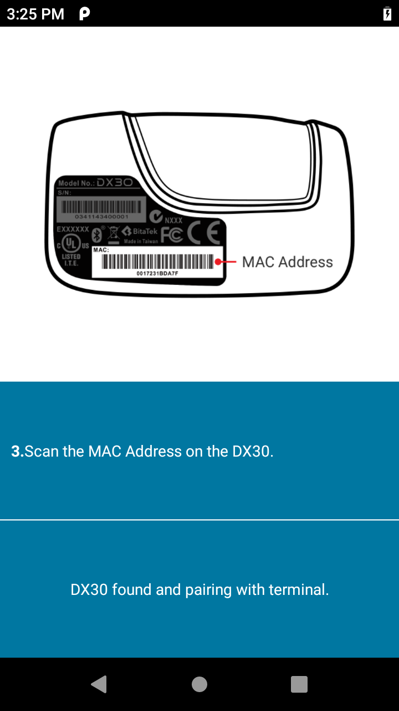
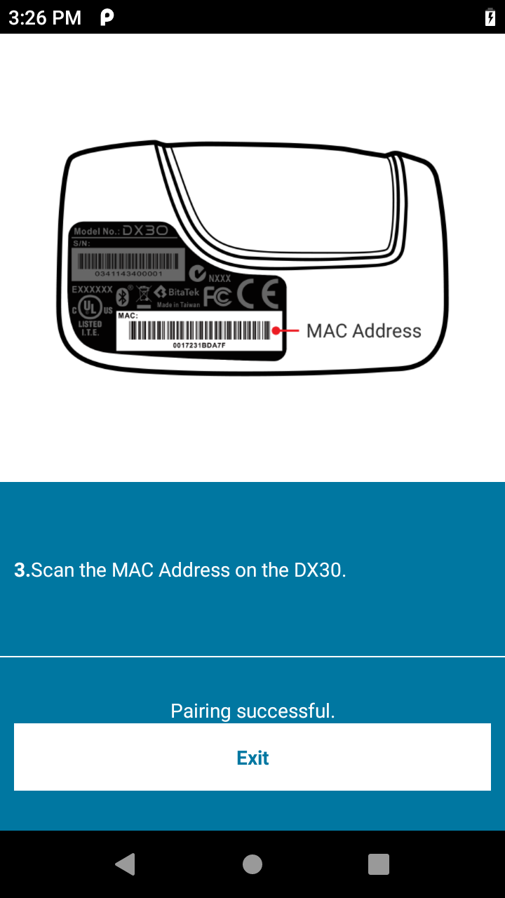

## Overview
This section provides instructions on connecting a mobile computer to the DEX30 Bluetooth accessory.

##Pairing to the DX30
To pair:
1. On the mobile computer open the Apps screen.
2. Tap **DEX Scan & Pair.** The app home screen appears.

_Figure 1. Welcome screen_
3. Tap **Start**. 
**Important:**  If Bluetooth is not enabled, a dialog appears requesting to turn on Bluetooth. Tap **Allow.**

_Figure 2. Instruction screen - step 1_
4. On the DEX30, press the release button to open the DEX connector.
5. On the mobile computer, tap **Next.**

_Figure 3. Instruction screen - step 2_
6. On the DX30, hold the Bluetooth connection button down for five seconds. The blue light flashes for a second, stops flashing, and then continues to flash indicating the DX30 is ready to pair.
7. On the mobile computer, tap **Next.** The mobile computer beeps twice indicating that scanning is enabled.

_Figure 4. Instruction screen - step 3_
8. Scan the MAC Address barcode on the DX30.
9. If scanning fails, the mobile computer beeps five times and a pairing failed message appears. Touch the back button to return to the previous screen.

_Figure 5. Pairing failed_
10. The mobile computer begins pairing with the DX30.

_Figure 6. Pairing in progress_
11. After successfully pairing, the Pairing Successful message appears.

_Figure 7. Pairing successful_
12. Tap **Exit.**

 
 
 

## See Also

* [About DEX Scan & Pair](../about)
* [Installation](../install)

