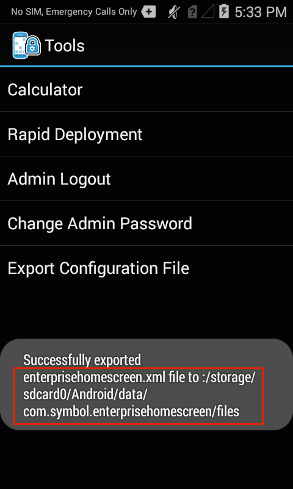

## Overview
This section assumes a basic knowledge of Enterprise Home Screen and its capabilities and essential workings. For those not familiar with Zebra's free security tool for its Android devices, please refer to the [About](../about) and [Setup](../setup) pages before continuing with this guide.  

The behavior of Enterprise Home Screen is controlled entirely through `enterprisehomescreen.xml`, an easy-to-read file that can be modified with any text editor. Included with every EHS installation, the default version of the file contains many common device security settings, plus a few standard apps. In many instances, all that's needed to begin using EHS is to add an organization's own applications and to apply its preferred security and display settings. 

This guide describes the interaction between EHS and its config file, instructions for accessing and customizing it for a company's specific requirements, and for deploying the settings to device(s). It also contains a detailed analysis of the config file itself, with explanations of each parameter and examples of how to configure it. 

## Working with the Config File
This section describes important traits of EHS and its interaction with the `enterprisehomescreen.xml` config file, and the means by which the administrator can retrieve, modify and deploy it to devices. 

#### Config File Location

* The config file is stored in `/enterprise/usr` and is invisible to most apps.
* As such, <b>Windows Explorer and Android File Transfer (Mac) cannot be used</b> to retrieve the file from its default location. 
* Deploying a config file to a device requires [ADB](http://developer.android.com/tools/help/adb.html) or an MDM system. 

For help configuring a Mac or Windows PC to use ADB, please refer to the [Connectivity Guide](../connect). 

#### Accessing the Config File

* The `enterprisehomescreen.xml` file can be exported to an unprivileged file area. 
* <b>Export the config file from the Tools menu of Admin Mode</b>.
* ADB can be used to 'pull' the config file from the privileged area to the local PC. 
* Only ADB or an MDM can 'push' the config file back to its required position for use. 

Retrieve the config file using ADB: 

    :::term
    adb pull enterprisehomescreen.xml /enterprise/usr/enterprisehomescreen.xml

Alternatively, 

&#51;. On the device, <b>launch File Browser</b> from the App Drawer:

 

 

 

#### Deploying an Edited Config File

* Once properly configured, a config file can be deployed to the device(s) with ADB or an MDM.
* If EHS is running, the settings in a deployed config file take effect immediately. 
* If EHS is in the background, the new settings take effect the next time EHS comes to the foreground.

Deploy the config file using ADB:

    :::term
    adb push enterprisehomescreen.xml /enterprise/usr/enterprisehomescreen.xml

To deploy using an MDM, please refer to [Setup](../setup/?Automated Installation) for special instructions. 

#### Config File Must be All Lower Case

* Any version of the config file that's <b>not all lower-case will be ignored</b>. 
• If the config file is missing, EHS will spawn a new config file with default settings. 
* If a mixed-case config file of the same name is deployed, it will overwrite a correctly cased file.
* An incorrectly cased config file will be treated as a missing file.

basic understanding of the installation, configuration, usage and essential workings of EHS, and are recommended for anyone unfamiliar with first-time EHS setup. Please note that everything detailed here also can be automated through a Mobile Device Management (MDM) system and with direct manipulation of the EHS config file, which is documented in the [Advanced Settings]() section. 

> <b>Note</b>: Installation and setup requires that EHS be present on a PC or Mac that can communicate with the target device and write to all storage areas. If necessary, please [download EHS](/ehs/2-3/download) and [establish connectivity between the computer and device(s)](). Then resume from here. 

## Supported Devices and APKs
Enterprise Home Screen works with most Zebra Android devices. The EHS download package includes <b>all three files</b> indicated in the table below, plus documentation and release notes. The correct APK file for a particular target device depends on the device, its operating system and some additional considerations explained below. 

## Manual Installation

> <b>Note</b>: The installer 

components. Read about how to [uninstall EHS](?Uninstallation#uninstallation) later in this guide. 

To install EHS manually using the automatic target selection (`EHS_020300.apk`) app: 

&#49;. <b>Connect the device</b> via USB to a PC or Mac.

&#50;. <b>Copy the </b>`EHS_020300.apk` <b>file</b> from the PC to any writable device folder.

Remote uninstallation of EHS is now complete. 

