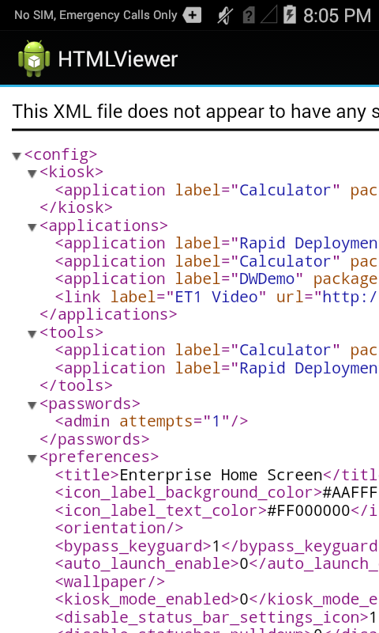
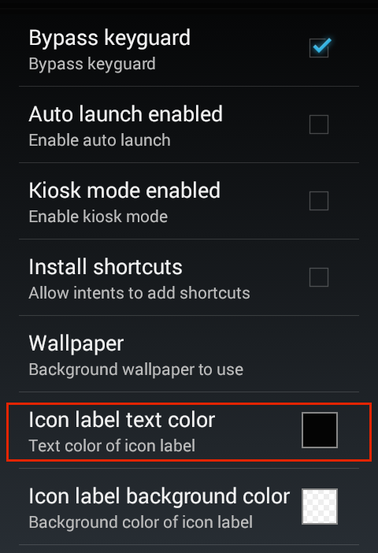
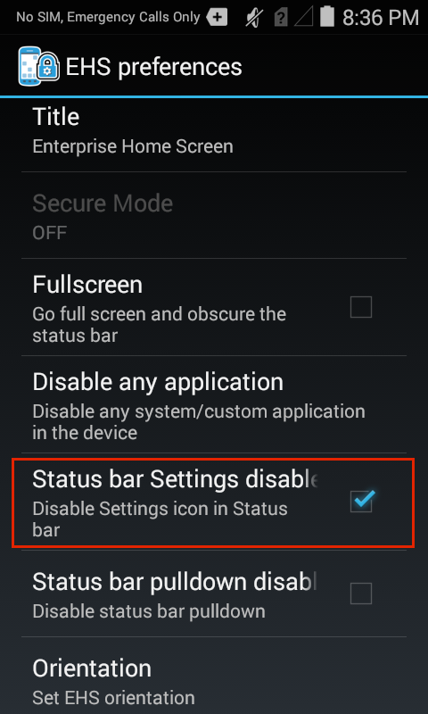
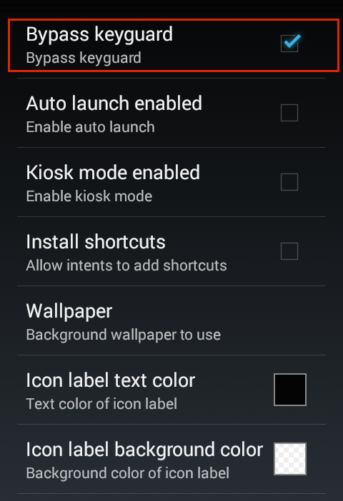
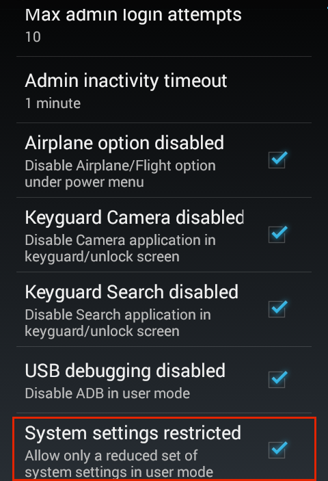
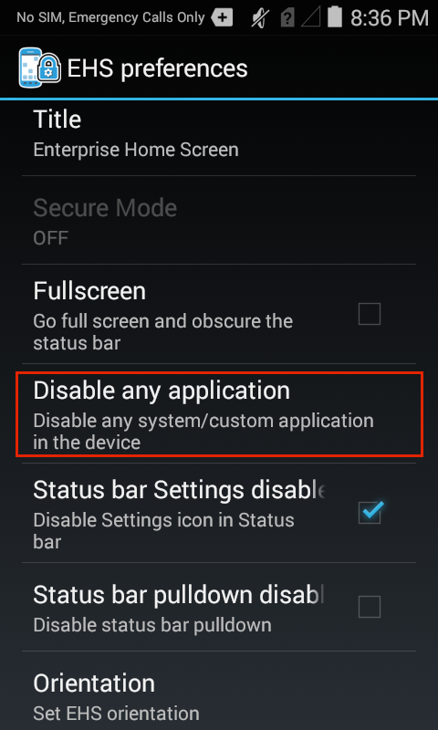

## Overview
This guide assumes a basic knowledge of Enterprise Home Screen and its capabilities and essential workings. For those not familiar with Zebra's free security tool for its Android devices, please refer to the [About](../about) and [Setup](../setup) pages before continuing with this guide. Refer to the [Special Features Guide](../features) for information about Kiosk Mode, Secure Mode and other special EHS features. 

The behavior of Enterprise Home Screen is controlled entirely through `enterprisehomescreen.xml`, an easy-to-read file that can be modified with any text editor. A default version of the file contains many common device security settings plus a few standard apps, and is part of every EHS installation. In many instances, all that's needed to begin using EHS is to add an organization's own applications and to apply its preferred security and display settings. 

This guide describes the how to add apps and configure settings using the config file alone (if the setting also can be configured through the GUI, a screenshot is shown). It details the interaction between EHS and the config file, and provides instructions for accessing and customizing the file for a company's specific requirements, and for deploying the settings to device(s). A detailed analysis of the config file follows, with explanations of each of the parameters and examples of how to configure them. 

<b>Note</b>: Many of the capabilities of EHS can be accomplished manually on the device, programmatically through [EMDK](/emdk-for-android/4-0/guide/about) or remotely using [StageNow](/stagenow/2-2/about/) or a third-party mobile device management (MDM) system (if supported by that MDM system). EHS simply puts the capabilities into a single tool.

## Working with the Config File
This section describes important interactions between EHS and the `enterprisehomescreen.xml` config file, and instructions for retrieving, modifying and deploying the file to devices. 

#### Config File Location

* The config file is stored in the `/enterprise/usr` directory on the device. (does not apply to [Secure Mode](../features#securemode))
* This directory is <b>invisible</b> to most apps, <b>including Windows Explorer and Android File Transfer (Mac)</b>. 
* The directory is <b>visible to Android File Browser</b>, which can be used to manage its contents. 
* The file is <b>accessible via Android Debug Bridge (ADB)</b> 'pull' and 'push' commands. 

> <b>Note</b>: Use caution when exposing File Browser to users; it can be used to manipulate the EHS config file and change security or other settings.

#### Config File Access

##### Using ADB

The Android Debug Bridge (ADB) is by far the most efficient way to work through the 'pull-edit-push-test' cycle for configuring and testing changes to EHS settings through the `enterprisehomescreen.xml` file. The process requires a Mac or Windows PC that's connected via USB to a device with EHS installed. For help with software setup, please refer to [Setup Guide](../setup). 

From a computer connected to a target device that has EHS installed: 

&#49;. <b>Use ADB to pull the config file</b> from its default location to the local PC: 

    :::term
    adb pull /enterprise/usr/enterprisehomescreen.xml
 

&#50;. Locate, open and <b>edit the config file</b> with a text editor, saving changes.

Important: <b>Do NOT change the file name in any way</b>. 
 

&#51;. <b>Push the edited config file</b> to the device: 

    :::term
    adb push /enterprise/usr/enterprisehomescreen.xml
 

##### What happens now? 

* Pushing a new version of the config file overwrites the old one. 
* If EHS is running, the new settings will take effect immediately. 
* If EHS is in the background, the new settings take effect the next time EHS comes to the foreground.

##### Other Notes

* Config file name must be '`enterprisehomescreen.xml`' in lower-case letters.  
* A file with any other spelling or letter case will be ignored.
* If the config file is deleted at any time, EHS will spawn a new config file with default settings.
* If a mixed-case config file of the same name is deployed, it will overwrite a correctly cased file.
* An incorrectly cased config file will be treated as missing file or cause unpredictable results.
* Once configured, a config file is suitable for [mass-deployment using an MDM](../setup/#automatedinstallation) with or without the EHS app.

##### Exporting the Config File
For device troubleshooting and certain other scenarios, it is sometimes useful to make the config file (`enterprisehomescreen.xml`) visible or to look inside the file and check its settings. The file can be made visible from Admin Mode by exporting it to a visible area of the file system. Alternatively, the config file can be viewed, copied, moved and shared via email or other means using the Android File Browser. 

<b>Note</b>: An exported file might remain invisible to the PC until the device is rebooted. 

&#49;. In Admin Mode on the device, <b>select Export Configuration File</b> from the Tools menu:

 

&#50;. <b>Tap OK</b> to confirm the action:

 

&#51;. <b>Note the location</b> in the confirmation message:

 

&#52;. <b>Drag the config file</b> (arrow) to a PC for editing using Windows Explorer, Android File Transfer (shown) or a similar means:

 
<b>Note</b>: An exported file might remain invisible to the PC until the device is rebooted. 

##### Using File Browser 
The Android File Browser offers a fast way to get a quick view inside the config file on a device. It also permits the file to be copied, moved or shared via email, Bluetooth or any means enabled on the device. 

To look inside the config file on a device: 

&#49;. In File Browser, <b>navigate to the /enterprise/usr directory</b>:

 

&#50;. <b>Long-press the</b> `enterprisehomescreen.xml`<b> file</b> to display the File Operations menu:

 

&#51;. <b>Select "Open as.."</b> to select a viewer and <b>hit Launch</b>:

 
It may be necessary to also tap 'txt' to specify the extension type.  

&#51;. The config file will open in the Android HTML Viewer:

 

## Default Config File
This section explains the `enterprisehomescreen.xml` config file, which controls all aspects of EHS behavior. The default version is shown below, followed by an explanation of the file's XML tags and the configuration options for each. 

The EHS config file is broken into five sections: 

* <b>Kiosk -</b> Specifies a single application to run when the device is in [Kiosk mode](). 
* <b>Applications -</b> The apps to be displayed when the device is in [User Mode]().
* <b>Tools -</b> The apps to be listed and launched from the User and Admin tools menus.
* <b>Passwords -</b> Stores the encrypted password for logging into Admin Mode. 
* <b>Preferences -</b> Controls which features and settings the device will display.  

##### Default `enterprisehomescreen.xml` file:

    :::xml
    <?xml version="1.0" encoding="utf-8"?>
     <kiosk>
        <application label="Calculator" package="com.android.calculator2" activity=""/>
    </kiosk>

    <config>
    <applications>
        <application label="Rapid Deployment" package="com.symbol.msp" activity="com.symbol.msp.client.RDMenu"/>
        <application label="Calculator" package="com.android.calculator2" activity="com.android.calculator2.Calculator"/>
        <application label="DWDemo" package="com.symbol.datawedge" activity="com.symbol.datawedge.DWDemoActivity"/>
        <link label="ET1 Video" url="http://www.youtube.com/watch?v=ERlIzLt-h6s"/>
    </applications>

    <tools>
        <application label="Calculator" package="com.android.calculator2" activity=""/>
        <application label="Rapid Deployment" package="com.symbol.msp" activity="com.symbol.msp.client.RDMenu"/>
    </tools>

    <passwords>
        <admin></admin>
    </passwords>

    <preferences>
        <title>Enterprise Home Screen</title>
        <icon_label_background_color>#AAFFFFFF</icon_label_background_color>
        <icon_label_text_color>#FF000000</icon_label_text_color>
        <orientation></orientation>
        <bypass_keyguard>1</bypass_keyguard>
        <auto_launch_enable>0</auto_launch_enable>
        <wallpaper></wallpaper>
        <kiosk_mode_enabled>0</kiosk_mode_enabled>
        <disable_status_bar_settings_icon>1</disable_status_bar_settings_icon>
        <disable_statusbar_pulldown>0</disable_statusbar_pulldown>
        <install_shortcuts>0</install_shortcuts>
        <exit_instead_of_reboot>0</exit_instead_of_reboot>
        <airplane_option_disabled>1</airplane_option_disabled>
        <keyguard_camera_disabled>1</keyguard_camera_disabled>
        <keyguard_search_disabled>1</keyguard_search_disabled>
        <usb_debugging_disabled>1</usb_debugging_disabled>
        <system_settings_restricted>1</system_settings_restricted>
    </preferences>
    </config>

## Config Tags
This section describes all tags in the `enterprisehomescreen.xml` file and their possible values. They're shown below in the same order they appear in the default file, and are followed by optional tags. Tags can appear in any order, but must appear within the &lt;config&gt; &lt;/config&gt; tag set. 

------

### Kiosk

Specifies the app to run when the device is in [Kiosk Mode](../features), an optional mode under which a single app fills the screen and the BACK and HOME keys cannot be used to exit the app. Kiosk Mode is activated using the &lt;kiosk_mode_enabled&gt; tag in the &lt;Preferences&gt; section. 

<b>Possible values</b>

* Label: string 
* Package: app package name 
* Activity (optional): name of the activity to be invoked when the app starts

##### Example

    <kiosk>
            <application label="Calculator" package="com.android.calculator2" activity=""/>
    </kiosk>

------

### Applications
Specifies the applications and/or browser links to be displayed to users while EHS is in User Mode. An optional activity parameter permits an app activity to be invoked when the app starts up. <b>Some apps require an activity to be specified in order to launch</b>. 

When specifying links, the package and activity parameters can be used to launch the URL with a specific app, such as Mozilla Mobile browser. If no activity is specified, EHS will launch the link using the default browser.

<b>Note</b>: Package names may vary from one Android version to another. 

<b>Possible values (apps)</b>

* Label: string
* Package: app package name 
* Activity (optional): name of the activity to be invoked when the app starts

#### Example (app)

    <applications>
        ...
        <application label="Calculator" package="com.android.calculator2" activity="com.android.calculator2.Calculator"/>
        ...
    </applications>

<b>Possible values (URLs)</b>

* Label: string
* Package: URL (http://, https:// or file://*.html only)

#### Example (URL)

    <applications>
        ...
        <link label="Mozilla Mobile" url="http://www.mozilla.org/en-US/mobile/" package="org.mozilla.firefox" activity="org.mozilla.firefox.App" />
        ...
    </applications>

In the example above, the package and activity attributes are used to launch the URL in the Mozilla Mobile browser. If the specified app (as defined in the package and activity parameters) is not present on the device, the URL will not be displayed. If no activity is specified, EHS will launch the link using the default browser. 

#### Link Removal
To remove a web link from the User Mode screen: 

1. Delete the **entire tag** (which begins with "&lt;link label=" and ends with "/&gt;" as shown above) from the &lt;applications&gt; node of the `enterprisehomescreen.xml` file. 
2. Redeploy the modified `enterprisehomescreen.xml` file to the device. 

------

#### Tools
Specifies the apps to be listed in the Tools menu of Admin and User Modes. <b>Note</b>: Package names may vary from one Android version to another. 

<b>Possible values</b>
* Label: string
* Package: app package name 
* Activity (optional): name of the activity to be invoked when the app starts

#### Example

    <tools>
        ...
        <application label="Calculator" package="com.android.calculator2" activity=""/>
        ...   
    </tools>

------

### Passwords
Stores the encrypted password for logging into Admin Mode (blank by default). <b>Do not populate this tag manually in the config file</b>. The administrator password will be stored here by EHS after being entered or changed through the Tools menu in EHS Admin Mode. EHS uses this tag to store the password as a 256-bit AES-encrypted hash. Once a password is created and stored in the config file, it can be mass-deployed along with all other settings.

The admin password <b><i>must</i></b> be entered and changed using the Admin Tools menu in the EHS GUI. 

<b>Possible values</b>

* (for EHS use only; direct user input is not supported for this tag)

#### Example

    <passwords>
        <admin></admin>
    </passwords>

------

### Preferences
These tags control various aspects of EHS behavior, security and display settings. Tags can appear in any order between the &lt;preferences&gt; &lt;/preferences&gt; tags. 

#### Title
Specifies the title bar text for the EHS app. Default of 'Enterprise Home Screen' can be changed to any string of characters. 

<b>Possible values</b>

* character string

#### Example

    <title>Enterprise Home Screen</title>

------

#### Icon Label Background
Specifies the background color of the icon label text of applications displayed in User Mode. This tag must be used for devices with screen resolution less than 480 pixels on any axis, for which the color picker in the Preferences UI is disabled. Default is #AAFFFFFF, white with an opacity value of AA (from a range of 00 to FF). Get help [picking HTML color codes](http://www.colorpicker.com/).

* AA specifies the opacity 
* RR specifies the level of RED
* GG specifies the level of GREEN
* BB specifies the level of BLUE

<b>Possible values</b>

* HTML hexadecimal color code values with or without opacity prefix (#RRGGBB or #AARRGGBB)
* Color names: red, blue, green, black, white, gray, cyan, magenta, yellow, lightgray and darkgray.

#### Examples

    <icon_label_background_color>#AAFFFFFF</icon_label_background_color>
    <icon_label_background_color>#75A319</icon_label_background_color>
    <icon_label_background_color>#80EF671B</icon_label_background_color>
    <icon_label_background_color>magenta</icon_label_background_color>

------

#### Icon Label Text Color
Specifies the color of the icon label text of applications displayed in User Mode. This tag must be used for devices with screen resolution less than 480 pixels on any axis, for which the color picker in the Preferences UI is disabled. The EHS default is #FF000000, black with an opacity value of FF (from a range of 00 to FF). Get help [picking HTML color codes](http://www.colorpicker.com/).

* AA specifies the opacity 
* RR specifies the level of RED
* GG specifies the level of GREEN
* BB specifies the level of BLUE

<b>Possible values</b>

* HTML hexadecimal color code values with or without opacity prefix (#RRGGBB or #AARRGGBB)
* Color names: red, blue, green, black, white, gray, cyan, magenta, yellow, lightgray and darkgray.

#### Examples

    <icon_label_text_color>#AAFFFFFF</icon_label_text_color>
    <icon_label_text_color>#75A319</icon_label_text_color>
    <icon_label_text_color>#80EF671B</icon_label_text_color>
    <icon_label_text_color>magenta</icon_label_text_color>

------

#### Orientation
Allows the screen orientation to be fixed in landscape or portrait mode. Omitting or leaving this setting blank (default) allows Android system settings to control screen orientation.  

<b>Possible values</b>

* landscape
* portrait
* <b>&lt;blank&gt; (default)</b>

#### Example

    <orientation></orientation>
    
------

#### Auto Launch Enable
Enables one or more apps to be automatically launched after EHS starts up. Works with optional &lt;auto_launch&gt; section. When enabled, apps specified in the &lt;auto_launch&gt; section are launched after a specified delay. <b>BACK and HOME keys can be used to exit the app</b>. Refer to [Optional Feature Tags section](#optionalfeaturetags) for more information. Disabled by default. See also: [Kiosk Mode](#kiosk). 

<b>Possible values</b>

* 1
* <b>0 (default)</b>

#### Example

    <auto_launch_enable>0</auto_launch_enable>
    
------

#### Wallpaper
Allows a background image to be specified for display in User Mode. If left unspecified, default image will be used. Supports only .PNG format files in the `/enterprise/usr` directory. 

<b>Possible values</b>

* fully qualified path to local (on-device) file

#### Example

    <wallpaper>/enterprise/usr/mybackground.png</wallpaper>
    
------

#### Fullscreen
EHS can be made to run in fullscreen mode by setting the value of this tag to 1. Default is 0. Applies only to EHS; apps launched from within EHS will behave as individually designed. Will not prevent access to the Android Status/Notification Bar on some devices. See [Disable Status Bar Settings](#disablestatusbarsettings) to prevent user access to this feature in EHS. 

<b>Possible values</b>

* 1 (sets EHS to run in full screen mode)
* <b>0 (default)</b>

#### Example

    <preferences>
        <fullscreen>1</fullscreen>
    </preferences>

------

#### Kiosk Mode Enabled
Causes the app specified in the &lt;kiosk&gt; section to be launched in full screen mode after EHS starts up and disables BACK and HOME keys to prevent users from exiting the app. Disabled by default. See also: [Auto-Launch](#autolaunch). 

> Once enabled, Kiosk Mode can be disabled by pushing a new config file with its tag set to 0 if USB Debugging is enabled. Otherwise a factory reset is required. 

<b>Possible values</b>

* 1
* <b>0 (default)</b>

#### Example

    <kiosk_mode_enabled>0</kiosk_mode_enabled>
    
------

#### Disable Status Bar Settings
Controls whether the Settings icon is displayed in the Android Status Bar, and therefore whether the Settings panel is accessible by users. <b>Not supported on all devices</b>. A setting of 0 in this tag will enable the Status Bar Settings icon. 

> Note: Changes to this setting will cause an automatic device reboot, a requirement for changes to take effect. 

<b>Possible values</b>

* <b>1 (default)</b>
* 0

#### Example

    <disable_status_bar_settings_icon>1</disable_status_bar_settings_icon>
    
------

#### Disable Statusbar Pulldown
Controls whether the Android Status Bar can be pulled down to reveal controls and notifications. The Statusbar Pulldown is enabled by default. If this tag is omitted, contains a value of 0 or is left blank, the Statusbar Pulldown will be enabled. To disable, enter a value of 1.  

<b>Possible values</b>

* 1
* <b>0 (default)</b>

#### Example

    <disable_statusbar_pulldown>0</disable_statusbar_pulldown>
    
------

#### Install Shortcuts
Controls whether shortcuts may be added to local or remote apps through Android Intents. Disabled by default. 

<b>Possible values</b>

* 1
* <b>0 (default)</b>

#### Example

    <install_shortcuts>0</install_shortcuts>
    
------

#### Exit Instead of Reboot
Controls whether EHS will trigger an automatic device reboot when a setting that requires a reboot is changed. Permits Mobile Device Management (MDM) systems to maintain device control after making such changes. <b>Note: The setting in this tag will be overridden if the [&lt;reboot_on_install_enabled&gt;](#rebootoninstallenabled) tag has a value of 1</b>. 

<b>Possible values</b>

* 1
* <b>0 (default)</b>

#### Example

    <exit_instead_of_reboot>0</exit_instead_of_reboot>
    
------

#### Reboot on Install Enabled
Controls whether the device will automatically reboot when EHS is launched for the first time after a successful installation, a requirement to activate EHS. Permits Mobile Device Management (MDM) systems to maintain device control following installation. Automatic device reboot is disabled by default. <b>Note: When enabled, this tag will override any setting of the [&lt;exit_instead_of_reboot&gt;](#exitinsteadofreboot) tag</b>. 

<b>Possible values</b>

* 1
* <b>0 (default, do not reboot)</b>

#### Example

    <preferences>
        <reboot_on_install_enabled>0</reboot_on_install_enabled >
    </preferences>

------

#### Airplane Option Disabled
Controls whether the device can be put into 'airplane mode' from the Power menu or Quick Settings bar. Depending on the device, airplane mode can disable Bluetooth, cellular, Wi-Fi and/or other wireless radios and features. EHS blocks airplane mode by default or if this tag is missing or left unspecified. Enter a value of 0 to permit the device to enter airplane mode. (Access to airplane mode from the Power menu might not be available on MC18, MC40 and MC92 devices running Android 4.4 KitKat). 

<b>Possible values</b>

* <b>1 (default)</b>
* 0 

#### Example

    <airplane_option_disabled>1</airplane_option_disabled>
    
------

#### Bypass Keyguard
Controls whether the Keyguard screen (also known as the 'Lock Screen') is displayed when the device is powered up. Keyguard is bypassed (not displayed) by default. A setting of 0 in this tag will enable the Keyguard. 

<b>Note: On devices that employ MX Multi-user features, a setting of 1 for this tag will prevent the multi-user login screen from being displayed</b>. Please refer to important [Security Notes](../features#securitynotes) involving interactions between EHS and MX Multi-user features. 

The Android Keyguard (also known as the Lock Screen).  

  

<b>Possible values</b>

* <b>1 (default, Keyguard not displayed) </b>
* 0 

#### Example

    <bypass_keyguard>1</bypass_keyguard>

------

### Keyguard Camera Disabled
Controls whether the device camera will be accessible from the Keyguard screen (also known as the "Lock Screen") when the screen lock is set to "Swipe" mode. Camera access from the Keyguard screen is disabled if this tag has a value of 1 (default) or is left unspecified. 

**The Keyguard camera is disabled only if <u>all</u> of the following conditions are true**:

* The camera app is enabled on the device
* The Keyguard screen is in "Swipe" mode 
* The camera icon is visible on the Keyguard screen 
* The Keyguard has not been bypassed using the &lt;bypass_keyguard&gt; tag

Unless **_all four_** of the above conditions are true, the value in this tag is ignored. 

**Notes**: 
* If no camera shortcut exists on the device lock screen, use of this tag is not required. 
* Disabling access to the camera app from the lock screen also disables it from the User-Mode screen on some devices, even if the camera is explicitly allowed in User Mode. This occurs if the device is rebooted from the lock screen. There are two options for preventing this. See User-Mode Camera Usage section below. 

**To prevent use of the camera, Zebra recommends using this tag <u>and</u> removing the camera app from the User Mode screen**.

<b>Possible values</b>:

* <b>1 (default)</b>
* 0 

#### Example

    <keyguard_camera_disabled>1</keyguard_camera_disabled>

#### User-Mode Camera Usage

On some devices, disabling access to the camera app from the lock screen also disables it from the User-Mode screen, even if camera usage is permitted on the device. This occurs if the device is rebooted from the lock screen; there are two options for preventing it. 

##### Option 1: Allow access to camera app from lock screen
If users are permitted to access the camera app from User Mode, some organizations also might permit access directly from the lock screen without having to unlock the device. For such cases, modify the `enterprisehomescreen.xml` file as below. 

**To allow access to camera app from lock screen**: 

    :::xml
    // Allow camera access: 

    <keyguard_camera_disabled>0</keyguard_camera_disabled>

    // Display lock screen:
    
    <bypass_keyguard>1</bypass_keyguard>

-----

##### Option 2: Add camera app to 'enabled' list

To permit access to the camera app only after the device has been unlocked, set the &lt;keyguard_camera_disabled&gt; value to "1" and add the package name of the camera app to the (optional) &lt;apps_enabled&gt; list in the `enterprisehomescreen.xml` file as below. **If no such tag exists in the file for this optional parameter, see** [Enable/Disable Apps](#enabledisableapps) **for help adding it**. 

**To allow access to camera app <u>only after device is unlocked</u>**: 

    :::xml
    <keyguard_camera_disabled>1</keyguard_camera_disabled>
    <bypass_keyguard>1</bypass_keyguard>
    ...
    <apps_enabled>
    ...
    <application package="camera.app.package.name"/> // i.e. "com.android.camera2"
    ...
    </apps_enabled>

**Note: The package name of the camera app can vary by device, Android version or other factors**.

------

### Keyguard Search Disabled
Controls whether the Search app will be accessible from the Keyguard screen (also known as the "Lock Screen") when the screen lock is set to "Swipe" mode. Search access from the Keyguard screen is disabled if this tag has a value of 1 (default) or is left unspecified. 

Applies only if **_all_** of the following conditions are true:

* The search app is enabled on the device
* The Keyguard screen is in "Swipe" mode 
* The search icon is visible on the Keyguard screen 
* The Keyguard has not been bypassed using the &lt;bypass_keyguard&gt; tag

Unless **_all four_** of the above conditions are true, the value in this tag is ignored. Note: If no search-app shortcut exists on the device lock screen, use of this tag is not required. 

**To prevent use of search, Zebra recommends using this tag _and_ removing the search app from the User Mode screen**. 

**Note**: Disabling access to the search app from the lock screen also disables it from the User-Mode screen on some devices, even if search is explicitly allowed in User Mode. This occurs if the device is rebooted from the lock screen. There are two options for preventing this. See User-Mode Search Usage section below. 

<b>Possible values</b>:

* <b>1 (default)</b>
* 0 

#### Example

    <keyguard_search_disabled>1</keyguard_search_disabled>
    
#### User-Mode Search Usage

On some devices, disabling access to the search app from the lock screen also disables it from the User-Mode screen, even if search usage is permitted on the device. This occurs if the device is rebooted from the lock screen; there are two options for preventing it. 

##### Option 1: Allow access to search app from lock screen
If users are permitted to access the search app from User Mode, some organizations also might permit access directly from the lock screen without having to unlock the device. For such cases, modify the `enterprisehomescreen.xml` file as below. 

**To allow access to search app from lock screen**: 

    :::xml
    // Allow search access: 

    <keyguard_search_disabled>0</keyguard_search_disabled>

    // Display lock screen:
    
    <bypass_keyguard>1</bypass_keyguard>

-----

##### Option 2: Add search app to 'enabled' list

To permit access to the search app only after the device has been unlocked, set the &lt;keyguard_search_disabled&gt; value to "1" and add the package name of the search app to the (optional) &lt;apps_enabled&gt; list in the `enterprisehomescreen.xml` file as below. **If no such tag exists in the file for this optional parameter, see** [Enable/Disable Apps](#enabledisableapps) **for help adding it**. 

**To allow access to search app <u>only after device is unlocked</u>**: 

    :::xml
    <keyguard_search_disabled>1</keyguard_search_disabled>
    <bypass_keyguard>1</bypass_keyguard>
    ...
    <apps_enabled>
        <application package="search.app.package.name"/> // i.e. "com.android.search"
    </apps_enabled>
    

------

#### USB Debugging Disabled
Controls whether communication via USB is permitted between the device and a computer while the device is in User Mode. A setting of 1 (default) or if left unspecified will prevent user access to the file system and all ADB functionality on the device. This setting has no bearing on Admin Mode, in which USB communication is always enabled. 

<b>Possible values</b>

* <b>1 (default)</b>
* 0 

#### Example

    <usb_debugging_disabled>1</usb_debugging_disabled>
    
------

#### System Settings Restricted
Controls whether full or limited settings are available when the device is in User Mode. A setting of 1 (default) or if left unspecified will restrict user access to device settings. <b>A setting of 0 will permit user access to all device settings</b>.

<b>Possible values</b>

* <b>1 (default)</b>
* 0 

#### Example

    <system_settings_restricted>1</system_settings_restricted>

------

## Optional Feature Tags
This section covers optional features and tags not otherwise included in the default `enterprisehomescreen.xml` file but can be activated by adding their tags to it, if desired, or are activated by EHS as needed.

------

#### Auto Launch
This feature permits any number of apps to be launched when EHS starts up. Similar to [Kiosk Mode](#kiosk), auto-launch apps are specified in a separate section, can be launched with a specific app activity (optional) and the feature is activated with a tag in the Preferences section. <b>Note</b>: Package names may vary from one Android version to another. 

Auto-launch differs from Kiosk Mode in that BACK and HOME keys can be used and it allows apps to be set to launch after a specified delay to allow for SD card mounting. Works when the &lt;auto_launch_enable&gt; tag contains a value of 1; otherwise ignored. <b>Auto-launch apps need not be listed in the &lt;applications&gt; section</b>. 

<b>Possible values</b>
* Application delay: integer (milliseconds)
* Package: app package name 
* Activity (optional): name of the activity to be invoked when the app starts

#### Example

    <auto_launch>
        <application delay="8000" package="com.android.calculator2" activity=""/>
        <application delay="5000" package="com.rovio.angrybirds" activity=""/>
    </auto_launch>

------

#### Disable/Enable Applications
Allows apps on a device to be explicitly disabled or enabled in Admin and User Modes. Use these tags to enable Settings and/or Search apps in User Mode. (Settings and Search apps are always enabled in Admin Mode, even if  &lt;apps_disabled&gt; tag is applied). Applies to both Admin and User Modes for all other apps. <b>Note</b>: Package names may vary from one Android version to another. 

<b>Notes</b>: 

* Settings defined by these tags override EHS defaults and settings applied with other tags.
* If one of these tags is present without the other, Settings and Search apps will be disabled in User Mode.
* If the same package name is present under both tags, that app will be disabled.
* Uninstalling EHS will not re-enable apps disabled using the &lt;apps_disabled&gt; tag.  
* To re-enable an app that was disabled using the &lt;apps_disabled&gt; tag, the app must be explicitly enabled using the &lt;apps_enabled&gt; tag. 
* These tags cannot be used to disable DataWedge or other services. 

<b>Possible values</b>

* Package: app package name 

#### Example

    <preferences>
        ...
        <apps_disabled>
            <application package="com.android.settings"/>
            <application package="com.android.quicksearchbox"/>
        </apps_disabled>

        <apps_enabled>
            <application package="com.android.gallery3d"/>
        </apps_enabled>
        ...
    </preferences>

------

#### Admin Max Attempts
The number of failed attempts to log into Admin Mode before EHS disables Admin Mode login. If this tag is not present or contains no value, the default of 10 will be used. Failed login attempts are added to the [EHS log](../features#ehslog). The counter is cleared after a successful login. 

#### Example

    <preferences>
        ...
        <admin_max_attempts>10</admin_max_attempts>
        ...
    </preferences>

 
EHS tracks the number of consecutive failed login attempts by adding the following attribute to the &lt;passwords&gt; tag when necessary: 

    <passwords>
        <admin attempts="10"></admin>
    </passwords>

The counter clears after a successful login.

------

#### Admin Inactivity Timeout
Controls the time (in seconds) that a device will remain in Admin Mode without activity. Add this tag to the &lt;Preferences&gt; section to specify the timeout period. The default period is 60 seconds, which will be used if this tag is missing or left unspecified. Minimum period is 15 seconds (lower values will be ignored); zero or negative value disables timeout. The timeout counter runs only when EHS is in foreground, and resets when EHS returns to the foreground. 

<b>Possible values</b>

* integer (in seconds) 

Notes: 
* 15 is the minimum value; lower values are ignored
* <b>60 seconds is the default if tag is left blank or is not present</b>
* 0 or negative value will disable the timeout function

#### Example

    <preferences>
        <admin_inactivity_timeout>600</admin_inactivity_timeout>
    </preferences>

------

#### Adding Apps/Shortcuts With Intents
When shortcuts that link to local or remote applications are added using Android Intents, EHS will add a link tag to the config file with the attributes listed below. Disabled by default. Must be enabled using the [Install Shortcuts tag](#installshortcuts). </b>Note</b>: Package names may vary from one Android version to another. 

##### Label
Represents the shortcut name; equivalent to the `Intent.EXTRA_SHORTCUT_NAME` value. 

##### URI
Represents the intent in text format; equivalent to the URI representation of the `Intent.EXTRA_SHORTCUT_INTENT` intent data.

##### Icon
Specifies the the path of the icon file stored in the device. If the extra data `Intent.EXTRA_SHORTCUT_ICON` is available in the received broadcast intent, the icon will be stored in the device as an image file.

##### icon_ref
Specifies the package name to retrieve the icon later. If the extra data `Intent.EXTRA_SHORTCUT_ICON_RESOURCE` is available in the received broadcast intent, the icon will be generated at runtime using the package name (and there is therefore no need to store the icon image in the device).

##### Example 
A shortcut added to the remote application "Microsoft Excel" via Citrix Receiver would be represented by the following link node: 

    <link label="Microsoft Excel" icon="/enterprise/usr/ehs_data/images/MicrosoftExcel.png" uri="citrixreceiver://launchapp?pid=1&inname=citrixcloud%3AMicrosoft+Excel+MS&fname=Microsoft+Excel&shortcutCookie=681181718&mobile=0&unikey=0#Intent;action=android.intent.action.VIEW;launchFlags=0x14000000;end" />

<b>EHS Notes</b>:

* When Install Shortcuts is enabled, EHS listens for the Android broadcast intent `com.android.launcher.action.INSTALL_SHORTCUT`.
* When an intent is received, EHS creates the shortcut on the user screen using data carried within the intent. 
* The data also is saved in the &lt;Applications&gt; section of the `enterprisehomescreen.xml` file as indicated above. 
* To remove a shortcut from user screen, delete the corresponding "link" tag from the config file. 
* Adding duplicate shortcuts for the same local or remote application is allowed.
* EHS does not check the validity of shortcuts; it's up to the admin to ensure that shortcuts are valid in all circumstances. 

<b>Android Notes</b>:

* The Android Launcher monitors the same broadcast intent as EHS, and therefore also receives shortcuts sent to EHS. 
* If the Android Home screen space limit is reached, Android Launcher displays an error message in EHS. 
* To elimiate the error message, temporarily [enable the Android Launcher](../setup#changethedefaultlauncher) and delete the shortcuts. 

------

Refer to the [Special Features Guide](../features) for information about Kiosk Mode, Secure Mode, Lockdown State and other special EHS features and behaviors. 

