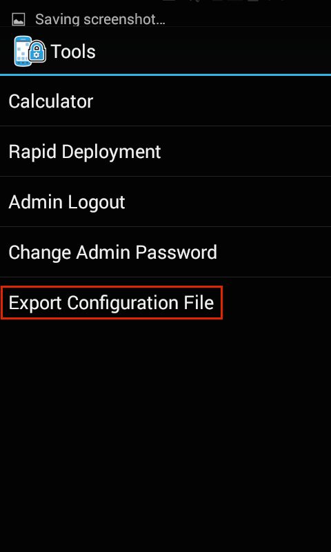

## Overview
This section assumes a basic knowledge of Enterprise Home Screen and its capabilities and essential workings. For those not familiar with Zebra's free security tool for its Android devices, please refer to the [About](../about) and [Setup](../setup) pages before continuing with this guide.  

The behavior of Enterprise Home Screen is controlled entirely through `enterprisehomescreen.xml`, an easy-to-read file that can be modified with any text editor. A default version of the file contains many common device security settings plus a few standard apps, and is part of every EHS installation. In many instances, all that's needed to begin using EHS is to add an organization's own applications and to apply its preferred security and display settings. 

This guide describes the how to add apps and configure settings using the config file alone. It details the interaction between EHS and the config file, and provides instructions for accessing and customizing the file for a company's specific requirements, and for deploying the settings to device(s). A detailed analysis of the config file follows, with explanations of each of the parameters and examples of how to configure them. 

## Working with the Config File
This section describes important interactions between EHS and the `enterprisehomescreen.xml` config file, and instructions for retrieving, modifying and deploying the file to devices. 

#### Config File Location

* The config file is stored in the `/enterprise/usr` directory on the device. 
* This directory is <b>invisible</b> to most apps, <b>including Windows Explorer and Android File Transfer (Mac)</b>. 
* The directory is <b>visible to Android File Browser</b>, which can be used to manage its contents. 
* The file is <b>accessible via Android Debug Bridge (ADB)</b> 'pull' and 'push' commands. 

> <b>Note</b>: Use caution when exposing File Broswer to users; it can be used to manipulate the EHS config file and change security or other settings.

#### Config File Access

##### Using ADB

The Android Debug Bridge (ADB) is by far the most efficient way to work through the 'pull-edit-push-test' cycle for configuring and testing changes to EHS settings through the `enterprisehomescreen.xml` file. The process requires a Mac or Windows PC that's connected via USB to a device with EHS installed. For help with this setup, please refer to the [Connectivity Guide](../connect) and [Setup Guide](../setup), as needed. 

From a computer connected to a target device that has EHS installed: 

&#49;. <b>Use ADB to pull the config file</b> from its default location to the local PC: 

    :::term
    adb pull enterprisehomescreen.xml /enterprise/usr/enterprisehomescreen.xml

&#50;. Locate, open and <b>edit the config file</b> with a text editor, saving changes.

Important: <b>Do NOT change the file name in any way</b>. 

&#51;. <b>Push the edited config file</b> to the device: 

    :::term
    adb push enterprisehomescreen.xml /enterprise/usr/enterprisehomescreen.xml

##### What happens now? 

* Pushing a new version of the config file overwrites the old one. 
* If EHS is running, the new settings will take effect immediately. 
* If EHS is in the background, the new settings take effect the next time EHS comes to the foreground.

##### Other Notes

* Config file must be named '`enterprisehomescreen.xml`' in lower-case letters.  
* A file with any other spelling or letter case will be ignored.
* If the config file is deleted at any time, EHS will spawn a new config file with default settings.
* If a mixed-case config file of the same name is deployed, it will overwrite a correctly cased file.
* An incorrectly cased config file will be treated as missing file or cause unpredictable results.
* Once configured, a config file is suitable for [mass-deployment using an MDM](../setup/#automatedinstallation) with or without the EHS app.

##### Exporting the Config File
For device troubleshooting and certain other scenarios, it is sometimes useful to make the config file visible or to look inside the file and check its settings. The file can be made visible from Admin Mode by exporting it to a visible area of the file system. Alternatively, the config file can be viewed, copied, moved and shared via email or other means using the Android File Browser. 

&#49;. In Admin Mode on the device, <b>select Export Configuration File</b> from the Tools menu:

 

&#50;. <b>Tap OK</b> to confirm the action:

 

&#51;. <b>Note the location</b> in the confirmation message:

 

&#52;. <b>Drag the config file</b> (arrow) to a PC for editing using Windows Explorer, Android File Transfer (shown) or a similar means:

 

##### Using File Browser 
The Android File Browser offers a fast way to get a quick view inside the config file on a device. It also permits the file to be copied, moved or shared via email, Bluetooth or any means enabled on the device. 

To look inside the config file on a device: 

&#49;. In File Browser, <b>navigate to the /enterprise/usr directory</b>:

 

&#50;. <b>Long-press the</b> `enterprisehomescreen.xml`<b> file</b> to display the File Operations menu:

 

&#51;. <b>Select "Open as.."</b> to select a viewer and <b>hit Launch</b>:

 
It may be necessary to also tap 'txt' to specify the extension type.  

&#51;. The config file will open in the Android HTML Viewer:

 

## Config File Tags
This section explains the `enterprisehomescreen.xml` config file, which controls all aspects of EHS behavior. The default version is shown below, followed by an explanation of the file's XML tags and the configuration options for each. 

The EHS config file is broken into five sections: 

* <b>Kiosk -</b> Specifies a single application to run when the device is in [Kiosk mode](). 
* <b>Applications -</b> The apps to be displayed when the device is in [User Mode]().
* <b>Tools -</b> The apps to be listed and launched from the User and Admin tools menus.
* <b>Passwords -</b> The number of failed login attempts before Admin Mode is locked. 
* <b>Preferences -</b> Controls which features and settings the device will display.  

##### Default `enterprisehomescreen.xml` file:

    :::xml
    <?xml version="1.0" encoding="utf-8"?>
    <config>
        <kiosk>
            <application label="Calculator" package="com.android.calculator2" activity=""/>
        </kiosk>
        <applications>
            <application label="Rapid Deployment" package="com.symbol.msp" activity="com.symbol.msp.client.RDMenu"/>
            <application label="Calculator" package="com.android.calculator2" activity="com.android.calculator2.Calculator"/>
            <application label="DWDemo" package="com.symbol.datawedge" activity="com.symbol.datawedge.DWDemoActivity"/>
            <link label="ET1 Video" url="http://www.youtube.com/watch?v=ERlIzLt-h6s"/>
        </applications>
        <tools>
            <application label="Calculator" package="com.android.calculator2" activity=""/>
            <application label="Rapid Deployment" package="com.symbol.msp" activity="com.symbol.msp.client.RDMenu"/>
        </tools>
        <passwords>
            <admin></admin>
        </passwords>
        <preferences>
            <title>Enterprise Home Screen</title>
            <icon_label_background_color>#AAFFFFFF</icon_label_background_color>
            <icon_label_text_color>#FF000000</icon_label_text_color>
            <orientation></orientation>
            <bypass_keyguard>1</bypass_keyguard>
            <auto_launch_enable>0</auto_launch_enable>
            <wallpaper></wallpaper>
            <kiosk_mode_enabled>0</kiosk_mode_enabled>
            <disable_status_bar_settings_icon>1</disable_status_bar_settings_icon>
            <disable_statusbar_pulldown>0</disable_statusbar_pulldown>
            <install_shortcuts>0</install_shortcuts>
            <exit_instead_of_reboot>0</exit_instead_of_reboot>
            <airplane_option_disabled>1</airplane_option_disabled>
            <keyguard_camera_disabled>1</keyguard_camera_disabled>
            <keyguard_search_disabled>1</keyguard_search_disabled>
            <usb_debugging_disabled>1</usb_debugging_disabled>
            <system_settings_restricted>1</system_settings_restricted>
        </preferences>
    </config>

>>>>>>> RESUME HERE MONDAY <<<<<<<

#####Tag Descriptions (in alphabetical order)

Auto launch (optional)
Auto launch will allow you to start any number of applications at startup, but will not stop the user from pressing BACK or HOME to exit auto launched applications.

    <auto_launch>
        <application delay="8000" package="com.android.calculator2" activity=""/>
        <application delay="5000" package="com.rovio.angrybirds" activity=""/>
    </auto_launch>

The delay attribute will allow you to set a wait time (in milliseconds) before the specified application is launched. If your application is installed on the SD card then you must use a delay to allow for the time it takes Android to mount the SD card.

Auto launch preferences

    <preferences>
        <auto_launch_enable>0</auto_launch_enable>
    </preferences>

Valid node values
0 
disable (default)

1 
enable

Note    <auto_launch_enable> must also be set to 1 before EHS will use the <auto_launch> section.
Kiosk launch (optional)
This section specifies the application that will be launched in Kiosk mode.

    <kiosk>
            <application label="Calculator" package="com.android.calculator2" activity=""/>
    </kiosk>

Kiosk preferences

Kiosk mode will allow you to specify one application to run at startup and will prevent the user from pressing BACK or HOME to exit that program.

    <preferences>
         <kiosk_mode_enabled>1</kiosk_mode_enabled>
    </preferences>

Valid node values
0 
disabled (default when not specified)

1 
enabled

Note    <kiosk_mode_enabled> must also be set to 1 in the preferences section before EHS will lock the device into the specified application.
Warning 
Once you have set this setting you will not be able to exit Kiosk mode unless you do one of the following:

Inside a custom developed application the Android developer has the option to write code to disable and enable Kiosk Mode. This is done through an Android specific method called intent.

Send the following intent to EHS…

Intent intent = new Intent("com.symbol.enterprisehomescreen.actions.MODIFY_KIOSK_MODE");
Intent.putExtra("enable",false);
sendBroadcast(intent);
Change Intent.putExtra("enable",true); re-enable Kiosk mode

Note    When Kiosk mode is enabled, make sure to disable the other methods of app launching such as "key remapping".
Applications
This section will add icons to the "User" home screen.

    <applications>
            <application label="Calculator" package="com.android.calculator2" activity=""/>
            <link label="ET1 Video" url="http://www.youtube.com/watch?v=ERlIzLt-h6s"/>
    </applications>
