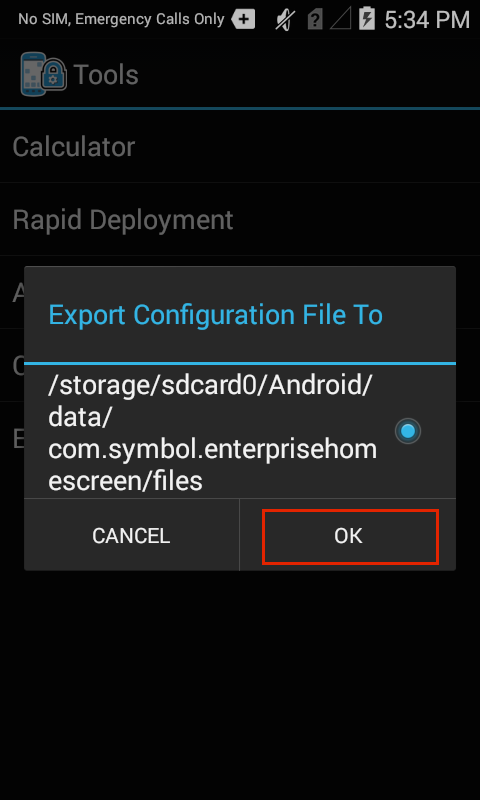
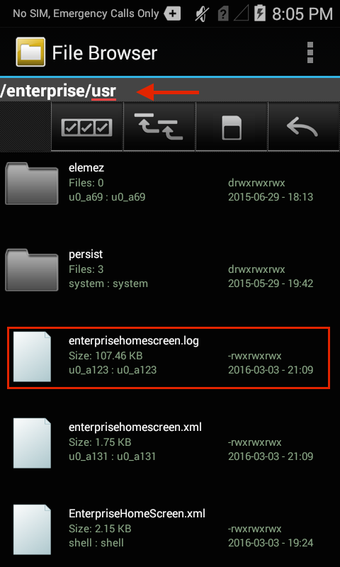
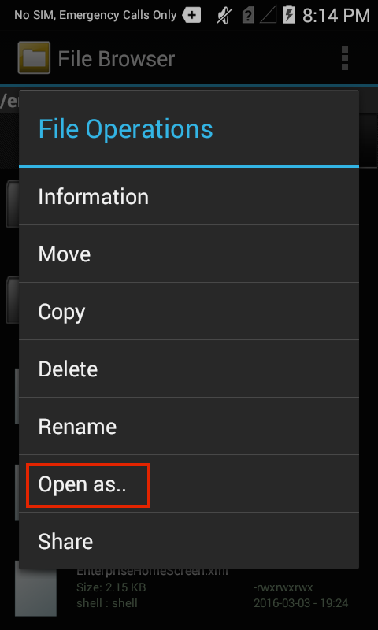

## Overview
This guide assumes a basic knowledge of Enterprise Home Screen and its capabilities and essential workings. For those not familiar with Zebra's free security tool for its Android devices, please refer to the [About](../about) and [Setup](../setup) pages before continuing with this guide. Refer to the [Advanced Features Guide](../features) for information about Kiosk Mode, Secure Mode and other special EHS features. 

The behavior of Enterprise Home Screen is controlled entirely through `enterprisehomescreen.xml`, an easy-to-read file that can be modified with any text editor. A default version of the file contains many common device security settings plus a few standard apps, and is part of every EHS installation. In many instances, all that's needed to begin using EHS is to add an organization's own applications and to apply its preferred security and display settings. 

This guide describes the how to add apps and configure settings using the config file alone. It details the interaction between EHS and the config file, and provides instructions for accessing and customizing the file for a company's specific requirements, and for deploying the settings to device(s). A detailed analysis of the config file follows, with explanations of each of the parameters and examples of how to configure them. 

## Working with the Config File
This section describes important interactions between EHS and the `enterprisehomescreen.xml` config file, and instructions for retrieving, modifying and deploying the file to devices. 

#### Config File Location

* The config file is stored in the `/enterprise/usr` directory on the device. 
* This directory is <b>invisible</b> to most apps, <b>including Windows Explorer and Android File Transfer (Mac)</b>. 
* The directory is <b>visible to Android File Browser</b>, which can be used to manage its contents. 
* The file is <b>accessible via Android Debug Bridge (ADB)</b> 'pull' and 'push' commands. 

> <b>Note</b>: Use caution when exposing File Broswer to users; it can be used to manipulate the EHS config file and change security or other settings.

#### Config File Access

##### Using ADB

The Android Debug Bridge (ADB) is by far the most efficient way to work through the 'pull-edit-push-test' cycle for configuring and testing changes to EHS settings through the `enterprisehomescreen.xml` file. The process requires a Mac or Windows PC that's connected via USB to a device with EHS installed. For help with this setup, please refer to the [Connectivity Guide](../connect) and [Setup Guide](../setup), as needed. 

From a computer connected to a target device that has EHS installed: 

&#49;. <b>Use ADB to pull the config file</b> from its default location to the local PC: 

    :::term
    adb pull enterprisehomescreen.xml /enterprise/usr/enterprisehomescreen.xml
 

&#50;. Locate, open and <b>edit the config file</b> with a text editor, saving changes.

Important: <b>Do NOT change the file name in any way</b>. 
 

&#51;. <b>Push the edited config file</b> to the device: 

    :::term
    adb push enterprisehomescreen.xml /enterprise/usr/enterprisehomescreen.xml
 

##### What happens now? 

* Pushing a new version of the config file overwrites the old one. 
* If EHS is running, the new settings will take effect immediately. 
* If EHS is in the background, the new settings take effect the next time EHS comes to the foreground.

##### Other Notes

* Config file name must be '`enterprisehomescreen.xml`' in lower-case letters.  
* A file with any other spelling or letter case will be ignored.
* If the config file is deleted at any time, EHS will spawn a new config file with default settings.
* If a mixed-case config file of the same name is deployed, it will overwrite a correctly cased file.
* An incorrectly cased config file will be treated as missing file or cause unpredictable results.
* Once configured, a config file is suitable for [mass-deployment using an MDM](../setup/#automatedinstallation) with or without the EHS app.

##### Exporting the Config File
For device troubleshooting and certain other scenarios, it is sometimes useful to make the config file visible or to look inside the file and check its settings. The file can be made visible from Admin Mode by exporting it to a visible area of the file system. Alternatively, the config file can be viewed, copied, moved and shared via email or other means using the Android File Browser. 

&#49;. In Admin Mode on the device, <b>select Export Configuration File</b> from the Tools menu:

 

&#50;. <b>Tap OK</b> to confirm the action:

 

&#51;. <b>Note the location</b> in the confirmation message:

 

&#52;. <b>Drag the config file</b> (arrow) to a PC for editing using Windows Explorer, Android File Transfer (shown) or a similar means:

 

##### Using File Browser 
The Android File Browser offers a fast way to get a quick view inside the config file on a device. It also permits the file to be copied, moved or shared via email, Bluetooth or any means enabled on the device. 

To look inside the config file on a device: 

&#49;. In File Browser, <b>navigate to the /enterprise/usr directory</b>:

 

&#50;. <b>Long-press the</b> `enterprisehomescreen.xml`<b> file</b> to display the File Operations menu:

 

&#51;. <b>Select "Open as.."</b> to select a viewer and <b>hit Launch</b>:

 
It may be necessary to also tap 'txt' to specify the extension type.  

&#51;. The config file will open in the Android HTML Viewer:

 

## Default Config File
This section explains the `enterprisehomescreen.xml` config file, which controls all aspects of EHS behavior. The default version is shown below, followed by an explanation of the file's XML tags and the configuration options for each. 

The EHS config file is broken into five sections: 

* <b>Kiosk -</b> Specifies a single application to run when the device is in [Kiosk mode](). 
* <b>Applications -</b> The apps to be displayed when the device is in [User Mode]().
* <b>Tools -</b> The apps to be listed and launched from the User and Admin tools menus.
* <b>Passwords -</b> The number of failed login attempts before Admin Mode is locked. 
* <b>Preferences -</b> Controls which features and settings the device will display.  

##### Default `enterprisehomescreen.xml` file:

    :::xml
    <?xml version="1.0" encoding="utf-8"?>
     <kiosk>
        <application label="Calculator" package="com.android.calculator2" activity=""/>
    </kiosk>

    <config>
    <applications>
        <application label="Rapid Deployment" package="com.symbol.msp" activity="com.symbol.msp.client.RDMenu"/>
        <application label="Calculator" package="com.android.calculator2" activity="com.android.calculator2.Calculator"/>
        <application label="DWDemo" package="com.symbol.datawedge" activity="com.symbol.datawedge.DWDemoActivity"/>
        <link label="ET1 Video" url="http://www.youtube.com/watch?v=ERlIzLt-h6s"/>
    </applications>

    <tools>
        <application label="Calculator" package="com.android.calculator2" activity=""/>
        <application label="Rapid Deployment" package="com.symbol.msp" activity="com.symbol.msp.client.RDMenu"/>
    </tools>

    <passwords>
        <admin></admin>
    </passwords>

    <preferences>
        <title>Enterprise Home Screen</title>
        <icon_label_background_color>#AAFFFFFF</icon_label_background_color>
        <icon_label_text_color>#FF000000</icon_label_text_color>
        <orientation></orientation>
        <bypass_keyguard>1</bypass_keyguard>
        <auto_launch_enable>0</auto_launch_enable>
        <wallpaper></wallpaper>
        <kiosk_mode_enabled>0</kiosk_mode_enabled>
        <disable_status_bar_settings_icon>1</disable_status_bar_settings_icon>
        <disable_statusbar_pulldown>0</disable_statusbar_pulldown>
        <install_shortcuts>0</install_shortcuts>
        <exit_instead_of_reboot>0</exit_instead_of_reboot>
        <airplane_option_disabled>1</airplane_option_disabled>
        <keyguard_camera_disabled>1</keyguard_camera_disabled>
        <keyguard_search_disabled>1</keyguard_search_disabled>
        <usb_debugging_disabled>1</usb_debugging_disabled>
        <system_settings_restricted>1</system_settings_restricted>
    </preferences>
    </config>

## Config Tags
This section describes all tags in the `enterprisehomescreen.xml` file and their possible values. They're shown below in the same order they appear in the default file, and are followed by optional tags. Tags can appear in any order, but must appear within the &lt;config&gt; &lt;/config&gt; tag set. 

------

### Kiosk

Specifies the app to run when the device is in [Kiosk Mode](../guide/features), an optional mode under which a single app fills the screen and the BACK and HOME keys are disabled to prevent exiting. Kiosk Mode is activated using the &lt;kiosk_mode_enabled&gt; tag. 

<b>Possible values</b>

* Label: string 
* Package: app package name 
* Activity: package name of app feature to invoke when the app starts

##### Example

    <kiosk>
            <application label="Calculator" package="com.android.calculator2" activity=""/>
    </kiosk>

------

### Applications
Specifies the applications and/or browser links to be displayed to users while EHS is in User Mode. An activity parameter permits an app function to be invoked when the app starts up. 

<b>Possible values</b>

* Label: string
* Package: app package name 
* Activity: app function package name

#### Example app

    <applications>
        ...
        <application label="Calculator" package="com.android.calculator2" activity="com.android.calculator2.Calculator"/>
        ...
    </applications>

<b>Possible values</b>

* Label: string
* Package: URL 

#### Example URL

    <applications>
        ...
        <link label="ET1 Video" url="http://www.youtube.com/watch?v=ERlIzLt-h6s"/>
        ...
    </applications>

------
#### Tools
Specifies the apps to be listed in the Tools menu of Admin and User Modes. 

<b>Possible values</b>
* Label: string
* Package: app package name 
* Activity: app function package name

#### Example

    <tools>
        ...
        <application label="Calculator" package="com.android.calculator2" activity=""/>
        ...   
    </tools>

------

### Passwords
Stores the encrypted password for logging into Admin Mode (blank by default). This tag accepts no human input; it is used by EHS to store the encrypted hash of the password entered through the EHS UI. Passwords are protected with 256-bit AES encryption and once created and stored in the config file, can be deployed along with all other settings.

<b>Possible values</b>

* Encrypted hash stored programatically by EHS (accepts no human input)

#### Example

    <passwords>
        <admin></admin>
    </passwords>

------

### Preferences
These tags control various aspects of EHS behavior, security and display settings. Tags can appear in any order between the &lt;preferences&gt; &lt;/preferences&gt; tags. 

#### Title
Specifies the title bar text for the EHS app. Default of 'Enterprise Home Screen' can be changed to any string of characters. 

<b>Possible values</b>

* character string

#### Example

    <title>Enterprise Home Screen</title>

------
#### Icon Label Background
Specifies the background color of the icon label text of applications displayed in User Mode. Default is white (FFFFFF) with an opacity value of AA (from a range of 00 to FF). Get help [picking HTML color codes](http://www.colorpicker.com/).

<b>Possible values</b>

* HTML color code

#### Example

    <icon_label_background_color>#AAFFFFFF</icon_label_background_color>
    
------
#### Icon Label Text Color
Specifies the color of the icon label text of applications displayed in User Mode. Default is black (000000) with an opacity value of FF (from a range of 00 to FF). Get help [picking HTML color codes](http://www.colorpicker.com/).

<b>Possible values</b>

* HTML color code

#### Example

    <icon_label_text_color>#FF000000</icon_label_text_color>
    
------
#### Orientation
Allows the screen orientation to be fixed in landscape or portrait mode. Omitting or leaving this setting blank (default) allows Android system settings to control screen orientation.  

<b>Possible values</b>

* landscape
* portrait
* <b>&lt;blank&gt; (default)</b>

#### Example

    <orientation></orientation>
    
------
#### Bypass Keyguard
Controls whether to display the keyguard screen lock. Disabled by default. A setting of '0' in this tag will enable the keyguard.  

<b>Possible values</b>

* <b>1 (default) </b>
* 0 

#### Example

    <bypass_keyguard>1</bypass_keyguard>
    
------
#### Auto Launch Enable
Enables one or more apps to be automatically launched after EHS starts up. Works with optional &lt;auto_launch&gt; section. When enabled, apps specified in the &lt;auto_launch&gt; section are launched after a specified delay. <b>BACK and HOME keys remain enabled</b>. Refer to [Optional Tags section](#optionaltags) for more information. Disabled by default. See also: [Kiosk Mode](#kiosk). 

<b>Possible values</b>

* 1
* <b>0 (default)</b>

#### Example

    <auto_launch_enable>0</auto_launch_enable>
    
------
#### Wallpaper
Allows a background image to be specified for display in User Mode. If left unspecified, default image will be used. 

<b>Possible values</b>

* fully qualified path to local (on-device) file

#### Example

    <wallpaper>/enterprise/usr/mybackground.png</wallpaper>
    
------
#### Kiosk Mode Enabled
Causes the app specified in the &lt;kiosk&gt; section to be launched in full screen mode after EHS starts up and disables BACK and HOME keys to prevent users from exiting the app. Disabled by default. See also: [Auto-Launch](#autolaunch). 

> Once enabled, Kiosk Mode can be disabled by pushing a new config file with its tag set to '0' if USB Debugging is enabled. Otherwise a factory reset is required. 

<b>Possible values</b>

* 1
* <b>0 (default)</b>

#### Example

    <kiosk_mode_enabled>0</kiosk_mode_enabled>
    
------
#### Disable Status Bar Settings
Controls whether the Settings icon is displayed in the Android Status Bar, and therefore whether the Settings panel is accessible by users. <b>Not supported on all devices</b>. A setting of '0' in this tag will enable the Status Bar Settings icon. 

> Note: Changes to this setting will cause an automatic device reboot, a requirement for changes to take effect. 

<b>Possible values</b>

* <b>1 (default)</b>
* 0

#### Example

    <disable_status_bar_settings_icon>1</disable_status_bar_settings_icon>
    
------
#### Disable Statusbar Pulldown
Controls whether the Android Status Bar can be pulled down to reveal controls and notifications. The Statusbar Pulldown is enabled by default. If this tag is omitted, contains a value of '0' or is left blank, the Statusbar Pulldown will be enabled. To disable, enter a value of 1.  

<b>Possible values</b>

* 1
* <b>0 (default)</b>

#### Example

    <disable_statusbar_pulldown>0</disable_statusbar_pulldown>
    
------
#### Install Shortcuts
Controls whether shortcuts may be added to local or remote apps through Android Intents. Disabled by default. 

<b>Possible values</b>

* 1
* <b>0 (default)</b>

#### Example

    <install_shortcuts>0</install_shortcuts>
    
------
#### Exit Instead of Reboot
Controls whether EHS will trigger an automatic device reboot when a setting that requires a reboot is changed. This setting is intended to permit Mobile Device Management (MDM) systems to maintain device control after making such changes. 

<b>Possible values</b>

* 1
* <b>0 (default)</b>

#### Example

    <exit_instead_of_reboot>0</exit_instead_of_reboot>
    
------
#### Airplane Option Disabled
Controls whether the device can be put into 'airplane mode.' Depending on the device, this mode can disable Bluetooth, cellular, Wi-Fi and/or other wireless radios. EHS blocks airplane mode by default or if this tag is missing or left unspecified. Enter a value of '0' to permit the device to enter airplane mode. 

<b>Possible values</b>

* <b>1 (default)</b>
* 0 

#### Example

    <airplane_option_disabled>1</airplane_option_disabled>
    
------
#### Keyguard Camera Disabled
Controls whether the device camera will be accessible from the Keyguard 'lock screen.' Camera is disabled if this tag has a value of '1' (default) or is left unspecified. 

<b>Possible values</b>

* <b>1 (default)</b>
* 0 

#### Example

    <keyguard_camera_disabled>1</keyguard_camera_disabled>
    
------
#### Keyguard Search Disabled
Controls whether the Search app will be accessible from the Keyguard 'lock screen.' Search is disabled if this tag has a value of '1' (default) or is left unspecified. 

<b>Possible values</b>

* <b>1 (default)</b>
* 0 

#### Example

    <keyguard_search_disabled>1</keyguard_search_disabled>
    
------
#### USB Debugging Disabled
Controls whether communication via USB is permitted between the device and a computer while the device is in User Mode. A setting of '1' (default) or if left unspecified will prevent user access to the device file system. This setting has no bearing on Admin Mode, in which USB communication is always enabled. 

<b>Possible values</b>

* <b>1 (default)</b>
* 0 

#### Example

    <usb_debugging_disabled>1</usb_debugging_disabled>
    
------
#### System Settings Restricted
Controls whether full or limited settings are available when the device when in User Mode. A setting of '1' (default) or if left unspecified will restrict user access to device settings. <b>A setting of '0' will permit user access to all device settings</b>.

<b>Possible values</b>

* <b>1 (default)</b>
* 0 

#### Example

    <system_settings_restricted>1</system_settings_restricted>

------

## Optional Feature Tags
This section covers optional features not included in the default `enterprisehomescreen.xml` file but can be activated by adding their tags to it, if desired.  

------
#### Auto Launch
This feature permits any number of apps to be launched when EHS starts up. Similar to Kiosk mode, auto-launch apps are specified in a separate section, can be launched with a specific app activity and the feature is activated with a tag in the Preferences section. 

Auto-launch differs from [Kiosk mode](#kiosk) in that it does not disable BACK and HOME keys and it allows apps to be set to launch after a specified delay to allow for SD card mounting. Works when the &lt;auto_launch_enable&gt; tag contains a value of 1; otherwise ignored. <b>Auto-launch apps need not be listed in the &lt;application&gt; section</b>. 

<b>Possible values</b>
* application delay: integer (milliseconds)
* Package: app package name 
* Activity: app function package name

#### Example

    <auto_launch>
        <application delay="8000" package="com.android.calculator2" activity=""/>
        <application delay="5000" package="com.rovio.angrybirds" activity=""/>
    </auto_launch>

------

Refer to the [Advanced Features Guide](../features) for information about Kiosk Mode, Secure Mode and other special EHS features. 

