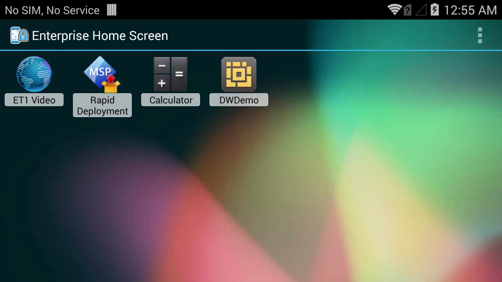
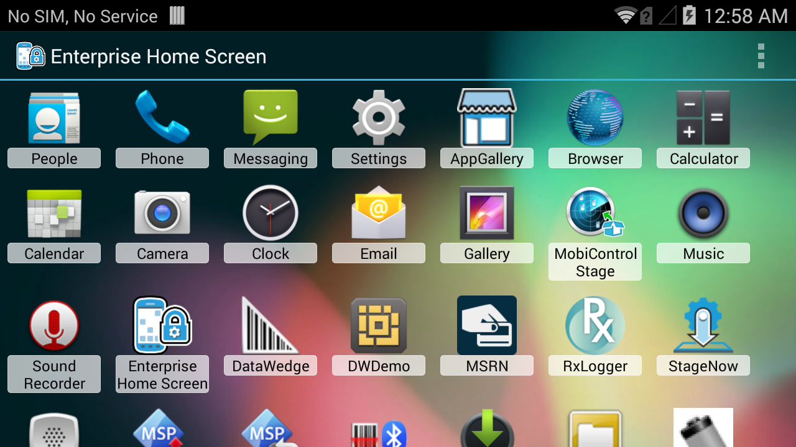
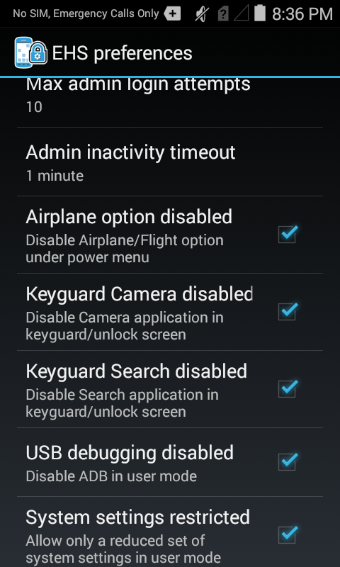

## Setup Guide

These instructions are designed to provide a basic understanding of the installation, usage and essential workings of EHS, and are recommended for anyone unfamiliar with first-time EHS setup. It should be noted, however, that everything detailed here also can be accomplished through the EHS config file, which is documented in the [Advanced Settings]() section.  

> <b>Note</b>: Installation and setup requires that EHS be present on a PC or Mac that can communicate with the target device with read/write access to all storage areas. If necessary, please [download EHS](/ehs/2-3/download) and [establish connectivity between the computer and device(s)](). Then resume from here. 

## Supported Devices and APKs
Enterprise Home Screen works with most Zebra Android devices. The download package includes **all three files** indicated in the table below plus documentation and release notes. The correct APK file for a particular target device depends on the device, its operating system and some additional considerations explained below. 

<table class="MsoNormalTable" style="" id="table2" border="1" cellpadding="3" cellspacing="0">
<tbody>
<tr>
<td style="width: 250.35pt;" width="250">

<b>Device</b>

</td>
<td style="width: 140px;">

<b>
    EHS_020300.apk</b>

</td>
<td style="width: 140px;">

<b>
    EHS_L_020300.apk</b>

</td>
<td style="width: 140px;">

<b>
    EHS_R_020300.apk </b>

</td>
</tr>
<tr bgcolor="#ccffcc" >
<td style="width: 118.35pt;"  width="250">

ET1 Jelly Bean (Android 4.1)

</td>
<td style="width: 96px;" >

<b>
    *</b>

</td>
<td style="width: 96px;" >

<b>*</b>

</td>
<td style="width: 96px;" >

<b>&nbsp;</b>

</td>
</tr>
<tr>
<td style="width: 118.35pt;" width="158">

MC40 Jelly Bean (Android 4.1)

</td>
<td style="width: 96px;">

<b>*</b>

</td>
<td style="width: 96px;">

<b>*</b>

</td>
<td style="width: 96px;" >

<b>&nbsp;</b>

</td>
</tr>
<tr>
<td style="width: 118.35pt;" width="158">

MC40 KitKat (Android 4.4)

</td>
<td style="width: 96px;">

<b>*</b>

</td>
<td style="width: 96px;">

<b>&nbsp;</b>

</td>

<td style="width: 96px;">

<b>*</b>

</td>
</tr>
<tr bgcolor="#ccffcc" >
<td style="width: 118.35pt;"  width="158">

TC55 Jelly Bean (Android 4.1)

</td>
<td style="width: 96px;" >

<b>
    *</b>
</td>
<td style="width: 96px;" >

<b>*</b>

</td>
<td style="width: 96px;" >

<b>&nbsp;</b>

</td>
</tr>
<tr bgcolor="#ccffcc" >
<td style="width: 118.35pt;"  width="158">

TC55 KitKat (Android 4.4)

</td>
<td style="width: 96px;" >

<b>
    *</b>

</td>
<td style="width: 96px;" >

<b>&nbsp;</b>

</td>
<td style="width: 96px;" >

<b>*</b>

</td>
</tr>
<tr>
<td style="width: 118.35pt;"  width="158">

MC67 Jelly Bean (Android 4.1)

</td>

<td style="width: 96px;" >

<b>
    *</b>

</td>
<td style="width: 96px;" >

<b>*</b>

</td>
<td style="width: 96px;" >

<b>&nbsp;</b>

</td>
</tr>
<tr bgcolor="#ccffcc" >
<td style="width: 118.35pt;"  width="158">

MC32 Jelly Bean (Android 4.1)

</td>
<td style="width: 96px;" >

<b>
    *</b>

</td>
<td style="width: 96px;" >

<b>*</b>

</td>
<td style="width: 96px;" >

<b>&nbsp;</b>

</td>
</tr>
<tr>
<td style="width: 118.35pt;"  width="158">

TC70 KitKat (Android 4.4.2) - BSP version 112414

</td>
<td style="width: 96px;" >

<b>
    *</b>

</td>
<td style="width: 96px;" >

<b>*</b>

</td>
<td style="width: 96px;" >

<b>&nbsp;</b>

</td>
</tr>
<tr >
<td style="width: 118.35pt;"  width="158">

TC70 KitKat (Android 4.4.3) 

</td>
<td style="width: 96px;" >

<b>
    *</b>

</td>
<td style="width: 96px;" >

<b>&nbsp;</b>

</td>
<td style="width: 96px;" >

<b>*</b>

</td>
</tr>
<tr bgcolor="#ccffcc" >
<td style="width: 118.35pt;"  width="158">

TC75 KitKat (Android 4.4)

</td>
<td style="width: 96px;" >

<b>
    *</b>

</td>
<td style="width: 96px;" >

<b>&nbsp;</b>

</td>
<td style="width: 96px;" >

<b>*</b>

</td>
</tr>
<tr>
<td style="width: 118.35pt;"  width="158">

MC18 KitKat (Android 4.4)

</td>
<td style="width: 96px;" >

<b>*</b>

</td>
<td style="width: 96px;" >

<b>
    &nbsp;</b>

</td>
<td style="width: 96px;" >

<b>*</b>

</td>
</tr>
<tr bgcolor="#ccffcc" >
<td style="width: 118.35pt;"  width="158">

MC92 KitKat (Android 4.4)

</td>
<td style="width: 96px;" >

<b>*</b>

</td>
<td style="width: 96px;" >

<b>
    &nbsp;</b>

</td>
<td style="width: 96px;" >

<b>*</b>

</td>
</tr>
<tr >
<td style="width: 118.35pt;"  width="158">

TC8000 KitKat (Android 4.4)

</td>
<td style="width: 96px;" >

<b>*</b>

</td>
<td style="width: 96px;" >

<b>
    &nbsp;</b>

</td>
<td style="width: 96px;" >

<b>*</b>

</td>
</tr>
</tbody>
</table>

## Manual Installation
These instructions apply to usage of the installer APK (`EHS_020300.apk`), which detects the target device model and operating system and installs the appropriate EHS version. If installing a device-specific APK from the table above, please substitute the file name(s) where necessary in the instructions. 

> <b>Note</b>: The installer payload includes two EHS editions, and occupies about 170 KB more device storage than a target-specific APK alone. Further, the 'EHS Installer' app remains visible in the device's App Drawer following installation and should not be removed; doing so removes the ability to properly uninstall EHS. Read about how to [uninstall EHS](?Uninstall EHS) later in this guide. 

### Manual Installation

To install EHS manually using the automatic target selection (`EHS_020300.apk`) app: 

&#49;. <b>Connect the device</b> via USB to a PC or Mac.

&#50;. <b>Copy the `EHS_020300.apk`</b> file from the PC to any writable device folder.

&#51;. On the device, <b>launch File Browser</b> from the App Drawer:

&#52;. <b>Locate and launch `EHS_020300.apk`</b>:

&#53;. <b>Tap Install</b>:

&#54;. After installation, <b>tap Open</b>:

> <b>Note</b>: If 'Done' was accidentally selected instead of 'Open' in this step, launch 'Enterprise Home Screen' from the App Drawer. Then proceed to step seven.

&#55;. <b>Tap or press the HOME key. A screen like the image below will appear: </b> 

&#56;. <b>Tap Enterprise Home Screen</b> and <b>'Just once'</b> for now. This will allow easy switching between EHS and the Android launcher during setup. This choice will be presented every time the HOME key is tapped until selecting 'Always' makes the selection permanent. 

&#57;. <b>A restart is required</b> to complete the installation (for first-time EHS installations). Again, a screen like the one above will appear. <b>Tap Enterprise Home Screen</b> and <b>Just once</b> to continue. 

###Automatic Settings Changes

EHS is now ready to use. The next step is to select which apps to display (and which to hide) while in User Mode, and to increase (or remove completely) access to device settings, if desired. When first run, EHS always defaults to User Mode, and will display a screen similar to the image below: 

<b>EHS User Mode</b>

In User Mode, the following features are disabled by default:

* Airplane mode
* USB debugging
* Access to the file system
* Keyguard (for unlocking the screen)
* Keyguard-screen camera and search functions
* The Status-bar Settings icon  
* Full access to the System Settings panel  

###Select Apps for User Mode

> <b>Note</b>: EHS selects apps for display in User Mode from apps installed on the device. <b>All apps intended for use must be installed on the device before proceeding</b>.

Enter Admin Mode and select which apps will be displayed to users:   

&#49;&#48;. <b>Tap the menu icon</b> and <b>open the Tools menu</b>:

&#49;&#49;. <b>Select Admin Login</b> and tap OK (the default password is blank):

After hitting OK, the admin version of the Tools menu will be displayed. 

&#49;&#50;. <b>Tap the BACK button</b> to dismiss the Tools menu. The Admin Mode screen similar to the image below will show all installed apps:  

If an intended app is not displayed, it must be installed before proceeding. 

&#49;&#51;. <b>Long-press an app</b> to alternatively display or hide it from the User Mode screen. Depending on the action, one of the following messages will appear after the app is selected: 

 

Repeat this step until all desired apps are displayed and undesired apps are hidden. Switch between Admin and User Modes to confirm selections. 

&#49;&#52;. If necessary, <b>select Preferences</b> from the menu while in Admin Mode: 

&#49;&#53;. Scroll the Preferences panel and select the desired settings: 

EHS disables the following features by default:

* Airplane mode
* USB debugging
* Access to the file system
* Keyguard (for unlocking the screen)
* Keyguard-screen camera and search functions
* The Status-bar Settings icon  
* Full access to the System Settings panel  

For details about these and other EHS settings, including a complete usage reference for the `EnterpriseHomeScreen.XML` configuration file, please refer to the [Advanced Settings]() section. 

## Uninstall EHS

>>>>>>> RESUME HERE WEDNESDAY <<<<<<<

Go to Apps under System Settings and select the EHS installer app in the app list and uninstall. Uninstalling the EHS Installer app from the device will automatically uninstall the EHS app as well. But this automatic uninstallation of EHS app will not happen unless you have followed steps seven and eight above.

Remote Installation using Installer APK
Install the EHS installer (EHS_020300.apk)

Launch the EHS installer. EHS installer package/activity name is "com.symbol.ehsinstaller/.EHSinstaller"

Launching the EHS installer will install the EHS application on the device. After the installation is completed, there will be two applications in the device; EHS installer app and EHS app.

Set EHS as the default home application in the device.

Please refer to EHS internal information for third party applications to get the package/activity name of the EHS application, depending on your device.

Reboot the device. This is mandatory.

Remote Uninstallation
Uninstall the EHS installer. EHS installer package name is "com.symbol.ehsinstaller".

Uninstalling the EHS installer will automatically uninstall the EHS application as well.

Note    The operations such as Installing EHS, uninstalling EHS and setting EHS as the default Launcher can be done using AppMgr feature in EMDK or StageNow. For more information, refer to the EMDK or StageNow documentation. Contact your MDM to determine if this feature is supported.
Installation using EHS_L_020300.apk or EHS_R_020300.apk

To select the appropriate EHS APK for your device please refer to the device compatibility table under Installation.

Manual Installation using EHS_L_020300.apk or EHS_R_020300.apk
The following instructions assume that you have selected the appropriate EHS APK for your device, device drivers are installed and able to read/write to the device.

Connect the device to a PC via a cradle or USB adapter cup.

Copy either EHS_L_020300.apk or EHS_R_020300.apk file to any writable folder in the device. To select the appropriate EHS APK for your device please refer to the device compatibility table under Installation.

Open File Browser from the Android application launcher screen.

Navigate to the copied folder and tap on the EHS_L_020300.apk or EHS_R_020300.apk.

Tap on the Install button.

Once the application is installed, tap the Open or Done button.

Tap the Home button.

Tap Enterprise Home Screen followed by Always.

 

 images/complete_action_using.png

 

Now reboot the device. This is mandatory.

Note    If the Just once button was tapped instead of the Always button at step eight above, continue from step seven above.
Manual Uninstallation
Go to Apps under System Settings and select the EHS app in the app list and uninstall.

Remote Installation using EHS_L_020300.apk or EHS_R_020300.apk
Install either EHS_L_020300.apk or EHS_R_020300.apk. To select the appropriate EHS APK for your device please refer to the device compatibility table under Installation.

Set EHS as the default home application in the device.

Please refer to EHS internal information for third party applications to get the package/activity name of the EHS application, depending on your device.

Reboot the device. This is mandatory.

Remote Uninstallation
Uninstall either EHS_L_020300.apk or EHS_R_020300.apk.

Please refer to EHS internal information for third party applications to get the package/activity name of the EHS application, depending on your device.

Warning 
Once installed, EHS changes some system settings in the device as given below. Uninstalling EHS or switching to another Launcher (Home screen application) will not revert these settings to the previous state. So if required, make sure to set them to the original state via Preferences or configuration files, before moving away from EHS.

EHS default settings:

Disable Settings and Search apps

Bypass device keyguard (unlock) screen

Disable Airplane/Flight option under Power menu

Disable USB debugging (ADB)

Restrict system settings

Disable status bar Settings icon

Disable accessing Camera app while on keyguard (unlock) screen

Disable accessing Search app while on keyguard (unlock) screen

