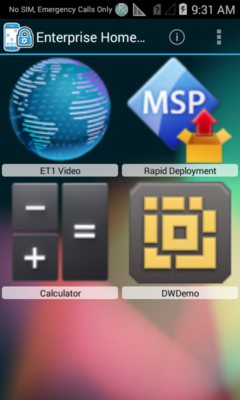

## Overview
Enterprise Home Screen is a free Android app from Zebra Technologies that provides a simple way for administrators to control access to apps and settings on a Zebra device without the need to write custom code. Using a simple touch interface, EHS easily limits usage to one or more specified applications, prevents changes to device settings and locks down the file system. It can be configured in seconds, and settings can be deployed via MDM. EHS settings are stored in a simple XML file that's easy to read and edit by hand, if necessary. 

EHS works by inserting itself in place of the stock Android app launcher and home screen. When first run, it presents a screen like the one below, offering a choice of which home app to open and whether to make the selection permanent. EHS also can be installed as the default launcher, bypassing the selector dialog. 

<b>Note</b>: Many of the capabilities of EHS can be accomplished manually on the device, programmatically through [EMDK](/emdk-for-android/4-0/guide/about) or remotely using [StageNow](/stagenow/2-2/about/) or a third-party mobile device management (MDM) system (if supported by that MDM system). EHS simply puts the capabilities into a single tool.

**[What's New in EHS 2.4](#whatsnew)**

------

The first time it's installed, EHS presents the admin with this simple choice: 

Selecting 'Always' locks EHS in as the default home app and **locks users out of the following** device features by default:

* Airplane mode
* USB debugging
* Access to the file system
* Keyguard (for unlocking the screen)
* Keyguard-screen camera and search functions
* The status-bar Settings icon  
* Full access to the System Settings panel  

Administrators can grant or restrict access to individual features or hide the settings panel entirely. 

> Ready to get started? [Download Enterprise Home Screen](https://portal.motorolasolutions.com/Support/US-EN/Resolution?solutionId=100676&redirectForm=search&searchQuery=%3FsearchType%3Dsimple%26searchTerm%3Denterprise%20home%20screen)

## Supported Devices
This version of Enterprise Home Screen has been approved for use with the Zebra Android devices listed below.

<table class="MsoNormalTable" style="" id="table2" border="1" cellpadding="3" cellspacing="0">
<tbody>

<tr>
<td style="width: 200pt;" width="250">

<b>Device</b>

</td>
<td style="width: 140px;">

<b>
    Android name</b>

</td>
<td style="width: 140px;">

<b>
    Android version</b>

</td>
</tr>

<tr bgcolor="#ccffcc" >
<td style="width: 118.35pt;"  width="250">

ET1 

</td>
<td style="width: 96px;" >

    Jelly Bean

</td>
<td style="width: 96px;" >

4.1

</td>
</tr>

<tr>
<td style="width: 118.35pt;" width="158">

MC40

</td>
<td style="width: 96px;">

Jelly Bean

</td>
<td style="width: 96px;">

4.1

</td>
</tr>

<tr>
<td style="width: 118.35pt;" width="158">

MC40

</td>
<td style="width: 96px;">

KitKat

</td>
<td style="width: 96px;">

4.4

</td>
</tr>

<tr bgcolor="#ccffcc" >
<td style="width: 118.35pt;"  width="158">

TC55

</td>
<td style="width: 96px;" >

    Jelly Bean
</td>
<td style="width: 96px;" >

4.1

</td>

</tr>
<tr bgcolor="#ccffcc" >
<td style="width: 118.35pt;"  width="158">

TC55

</td>
<td style="width: 96px;" >

    KitKat

</td>
<td style="width: 96px;" >

4.4

</td>
</tr>

<tr>
<td style="width: 118.35pt;"  width="158">

MC67

</td>
<td style="width: 96px;" >

    Jelly Bean

</td>
<td style="width: 96px;" >

4.1

</td>
</tr>

<tr bgcolor="#ccffcc" >
<td style="width: 118.35pt;"  width="158">

MC32

</td>
<td style="width: 96px;" >

    Jelly Bean

</td>
<td style="width: 96px;" >

4.1

</td>
</tr>

<tr>
<td style="width: 118.35pt;"  width="158">

TC70

</td>
<td style="width: 96px;" >

    KitKat

</td>
<td style="width: 96px;" >

4.4.2

</td>
</tr>

<tr >
<td style="width: 118.35pt;"  width="158">

TC70

</td>
<td style="width: 96px;" >

    KitKat

</td>
<td style="width: 96px;" >

4.4.3

</td>
</tr>

<tr bgcolor="#ccffcc" >
<td style="width: 118.35pt;"  width="158">

TC75

</td>
<td style="width: 96px;" >

    KitKat

</td>
<td style="width: 96px;" >

4.4

</td>
</tr>

<tr>
<td style="width: 118.35pt;"  width="158">

MC18

</td>
<td style="width: 96px;" >

KitKat

</td>
<td style="width: 96px;" >

    4.4

</td>
</tr>

<tr bgcolor="#ccffcc" >
<td style="width: 118.35pt;"  width="158">

MC92

</td>
<td style="width: 96px;" >

KitKat

</td>
<td style="width: 96px;" >

    4.4

</td>
</tr>

<tr >
<td style="width: 118.35pt;"  width="158">

TC8000

</td>
<td style="width: 96px;" >

KitKat

</td>
<td style="width: 96px;" >

    4.4

</td>
</tr>
<tr >
<td style="width: 118.35pt;"  width="158">

WT6000

</td>
<td style="width: 96px;" >

Lollipop

</td>
<td style="width: 96px;" >

    5.0

</td>
</tr>
</tbody>
</table>

## What's New

### New in EHS 2.4:

>**End of Support for EHS on Jelly Bean:** EHS 2.4 will be the last version of Enterprise Home Screen that will be supported by Zebra on devices running Android Jelly Bean. 
>**Online-only documentation**: Beginning with EHS 2.4, the user guide will no longer be bundled in with the download package.

* **[Bundle Data Option](../settings#bundle) -** allows injection of app parameters, user data or other key-value pairs into an app on launch. 

* **[App Launch Flags](../settings*applaunchflags) -** permit one or more Android Intent flags to be specified when an application is launched, directing launch behavior as required. 

* **[Service Auto-Launch](../settings#serviceautolaunch) -** permits one or more Android services to be started whenever EHS launches. 

* **[Wildcard Character](../settings#applications) -** reduces the lines of code required in the EHS config file to specify apps for display in User Mode.

* **[Custom App Icons](../settings#icon) -** permits customized icons for apps and links, overriding the default system icons. 

* **[Custom Title-bar Icons](../settings#titlebariconfile) -** permits a custom icon to be displayed in the EHS Title Bar, overriding the default EHS icon. 

* **[App Icon Size](../settings#appiconsize) -** provides five sizes for Admin- and User-mode application icons.

<!-- 
_The icon size UI is accessible from Admin or User Modes (default shown)_.  

_The User Mode screen with XXL icons_. -->
* **[Battery and Wi-Fi Quick View](../setup#batteryandwifiquickview) -** displays real-time status of the device battery and Wi-Fi signal on a single screen.

* **Support for the Zebra WT6000 -** wearable computer running Android 5.0 Lollipop (see [Lollipop Support Notes](#lollipopsupportnotes). 

* **[App Icon Label Text Color](../settings#iconlabeltextcolor) -** is now white on a transparent background to improve readability. 

> To implement these features, [download Enterprise Home Screen 2.4](https://portal.motorolasolutions.com/Support/US-EN/Resolution?solutionId=100676&redirectForm=search&searchQuery=%3FsearchType%3Dsimple%26searchTerm%3Denterprise%20home%20screen).

>**End of Support for Android Jelly Bean devices -** Support for Zebra devices running Android Jelly Bean will end with EHS 2.4. Zebra will continue to support devices running EHS 2.4 and previous versions through its Support Central customer portal. 

------

New in  EHS 2.3:
* [Enable/disable device reboot](../settings#rebootoninstallenabled) when EHS is first launched after installation. 
* TC8000 KitKat version 4.4 support (added January, 2016)

#### Lollipop Support Notes

* **This**
* **That**
* **This**

Starting from Android L, EHS feature Status bar pull down does not work as expected. On those devices, Pulling down the Status bar may still be able to be disabled using UI Manager feature in EMDK or StageNow. For more information, refer to the EMDK or StageNow documentation. Contact your MDM to determine if this feature is supported."

In Android L devices, recent apps are persistent even after a reboot. So use either StageNow or MDM for clearing recent app list before deploying EHS. This is mandatory.
(can add this under ""Security notes- recent app list"" section)

Screen pinning is a new feature in Lollipop that allows users to lock the screen to a certain app, so the person using it only has access to one app. Use either Screen pinning or EHS’s kiosk app, but not both at once.  If EHS’s kiosk mode is to be used, EHS will recommend disabling screen pinning in advance. 

In Android L devices, Device orientation can be changed through quick settings panel. By default EHS does not set an Orientation; uses the system default. 
But if an Orientation is set in EHS, it cannot be further configured through Quick Settings panel. For example when EHS Admin has set the orientation to landscape through EHS and handed over the device to a normal User, then even though the User wants to change it to AutoRotate via quick settings panel (this shortcut is a feature in Lollipop) it’s not doable. "

In Android Lollipop devices, "Bypass Keyguard" feature does not bypass the key guard or the lock screen after a device reboot . (Ed, we don't have a solution currently even via StageNow/EMDK  for this issue. so we don't talk about any solution here other than giving the isssue. the issue is there only in Lollipop. Issue is NOT there in Jellybean or kitkat)

EHS Disable Status bar Pull-down feature does not support in devices with Android Lollipop and above. Deprecated EHS feature starting from Lollipop. Instead use UI Manager feature in stageNow/EMDK to disable  status bar pull down. Better to mention in launhpad as well. (FYI: the feature works fie in all JB and KK devcies)

1. ""Disable Status bar Pull-down"" feature does not support in devices with Android Lollipop and above. Instead use eiter stageNow/EMDK to disable  status bar pull down.
2. ""Bypass Keyguard"" feature does not bypass the key guard or the lock screen after a device reboot in Android Lollipop devices. (Ed, we don't have a solution via StageNow/EMDK currently, so we have to document this as a knwon issue in EHS on lollipop devices."

Not supported on all devices. In unsupported devices, status bar settings may still be able to be disabled using UI Manager feature in EMDK or StageNow. For more information, refer to the EMDK or StageNow documentation. Contact your MDM to determine if this feature is supported."