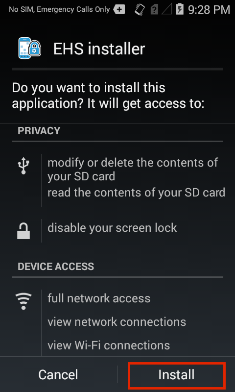
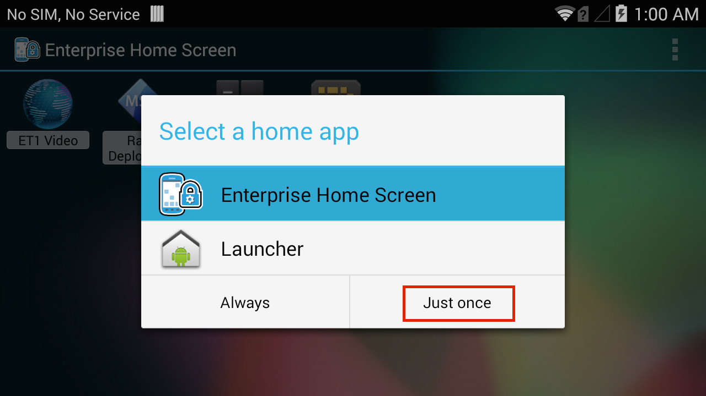
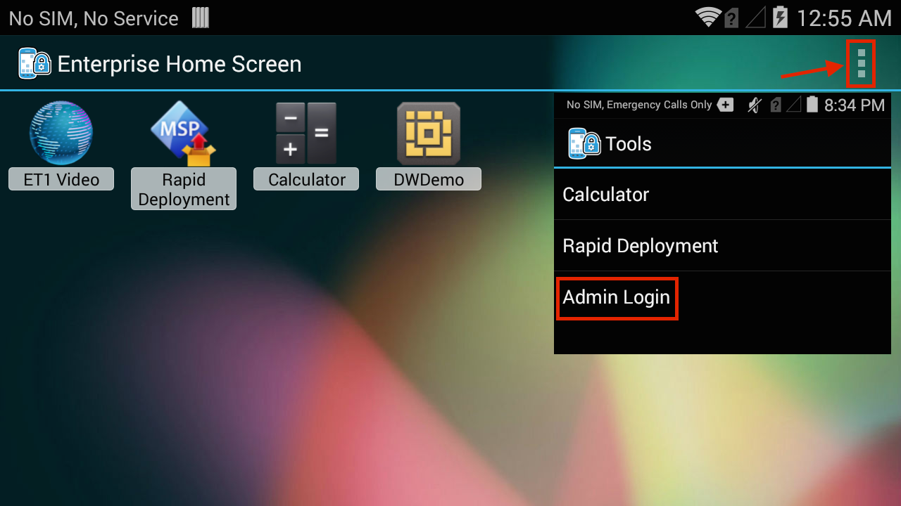
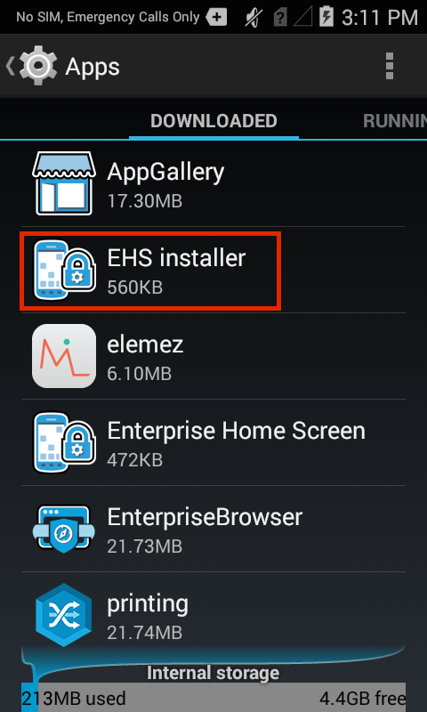

## Overview

These instructions provide a basic understanding of the installation, configuration, usage and essential workings of Enterprise Home Screen, and are recommended for anyone unfamiliar with first-time EHS setup. Please note that everything detailed here also can be automated through a Mobile Device Management (MDM) system and with direct manipulation of the EHS config file, which is documented in the [Advanced Settings](../settings) section. 

Many of the capabilities of EHS can be accomplished manually on the device, programmatically through [EMDK](/emdk-for-android/4-0/guide/about) or remotely using [StageNow](/stagenow/2-2/about/) or a third-party mobile device management (MDM) system (if supported by that MDM system). EHS simply puts these capabilities into a single, convenient tool.

> <b>Note</b>: Installation and setup requires that EHS be present on a PC or Mac that can communicate with the target device and write to all storage areas. If necessary, please [download EHS](/ehs/2-4/download) and establish connectivity between the computer and device. Then resume from here. 

## Supported Devices and APKs
Enterprise Home Screen works with most Zebra Android devices. The EHS download package includes <b>all three files</b> indicated in the table below, plus documentation and release notes. The correct APK file for a particular target device depends on the device, its operating system and some additional considerations explained below. 

<table class="MsoNormalTable" style="" id="table2" border="1" cellpadding="3" cellspacing="0">
<tbody>
<tr>
<td style="width: 250.35pt;" width="250">

<b>Device</b>

</td>
<td style="width: 140px;">

<b>
    EHS_020404.apk</b>

</td>
<td style="width: 140px;">

<b>
    EHS_L_020300.apk</b>

</td>
<td style="width: 140px;">

<b>
    EHS_R_020404.apk </b>

</td>
</tr>
<tr bgcolor="#ccffcc" >
<td style="width: 118.35pt;"  width="250">

ET1 Jelly Bean (Android 4.1)

</td>
<td style="width: 96px;" >

<b>
    *</b>

</td>
<td style="width: 96px;" >

<b>*</b>

</td>
<td style="width: 96px;" >

<b>&nbsp;</b>

</td>
</tr>
<tr>
<td style="width: 118.35pt;" width="158">

MC40 Jelly Bean (Android 4.1)

</td>
<td style="width: 96px;">

<b>*</b>

</td>
<td style="width: 96px;">

<b>*</b>

</td>
<td style="width: 96px;" >

<b>&nbsp;</b>

</td>
</tr>
<tr>
<td style="width: 118.35pt;" width="158">

MC40 KitKat (Android 4.4)

</td>
<td style="width: 96px;">

<b>*</b>

</td>
<td style="width: 96px;">

<b>&nbsp;</b>

</td>

<td style="width: 96px;">

<b>*</b>

</td>
</tr>
<tr bgcolor="#ccffcc" >
<td style="width: 118.35pt;"  width="158">

TC55 Jelly Bean (Android 4.1)

</td>
<td style="width: 96px;" >

<b>
    *</b>
</td>
<td style="width: 96px;" >

<b>*</b>

</td>
<td style="width: 96px;" >

<b>&nbsp;</b>

</td>
</tr>
<tr bgcolor="#ccffcc" >
<td style="width: 118.35pt;"  width="158">

TC55 KitKat (Android 4.4)

</td>
<td style="width: 96px;" >

<b>
    *</b>

</td>
<td style="width: 96px;" >

<b>&nbsp;</b>

</td>
<td style="width: 96px;" >

<b>*</b>

</td>
</tr>
<tr>
<td style="width: 118.35pt;"  width="158">

MC67 Jelly Bean (Android 4.1)

</td>

<td style="width: 96px;" >

<b>
    *</b>

</td>
<td style="width: 96px;" >

<b>*</b>

</td>
<td style="width: 96px;" >

<b>&nbsp;</b>

</td>
</tr>
<tr bgcolor="#ccffcc" >
<td style="width: 118.35pt;"  width="158">

MC32 Jelly Bean (Android 4.1)

</td>
<td style="width: 96px;" >

<b>
    *</b>

</td>
<td style="width: 96px;" >

<b>*</b>

</td>
<td style="width: 96px;" >

<b>&nbsp;</b>

</td>
</tr>
<tr>
<td style="width: 118.35pt;"  width="158">

TC70 KitKat (Android 4.4.2) - BSP version 112414

</td>
<td style="width: 96px;" >

<b>
    *</b>

</td>
<td style="width: 96px;" >

<b>*</b>

</td>
<td style="width: 96px;" >

<b>&nbsp;</b>

</td>
</tr>
<tr >
<td style="width: 118.35pt;"  width="158">

TC70 KitKat (Android 4.4.3) 

</td>
<td style="width: 96px;" >

<b>
    *</b>

</td>
<td style="width: 96px;" >

<b>&nbsp;</b>

</td>
<td style="width: 96px;" >

<b>*</b>

</td>
</tr>
<tr bgcolor="#ccffcc" >
<td style="width: 118.35pt;"  width="158">

TC75 KitKat (Android 4.4)

</td>
<td style="width: 96px;" >

<b>
    *</b>

</td>
<td style="width: 96px;" >

<b>&nbsp;</b>

</td>
<td style="width: 96px;" >

<b>*</b>

</td>
</tr>
<tr>
<td style="width: 118.35pt;"  width="158">

MC18 KitKat (Android 4.4)

</td>
<td style="width: 96px;" >

<b>*</b>

</td>
<td style="width: 96px;" >

<b>
    &nbsp;</b>

</td>
<td style="width: 96px;" >

<b>*</b>

</td>
</tr>
<tr bgcolor="#ccffcc" >
<td style="width: 118.35pt;"  width="158">

MC92 KitKat (Android 4.4)

</td>
<td style="width: 96px;" >

<b>*</b>

</td>
<td style="width: 96px;" >

<b>
    &nbsp;</b>

</td>
<td style="width: 96px;" >

<b>*</b>

</td>
</tr>
<tr >
<td style="width: 118.35pt;"  width="158">

TC8000 KitKat (Android 4.4)

</td>
<td style="width: 96px;" >

<b>*</b>

</td>
<td style="width: 96px;" >

<b>
    &nbsp;</b>

</td>
<td style="width: 96px;" >

<b>*</b>

</td>
</tr>
<tr >
<td style="width: 118.35pt;"  width="158">

WT6000 Lollipop (Android 5.0)

</td>
<td style="width: 96px;" >

<b>*</b>

</td>
<td style="width: 96px;" >

<b>
    &nbsp;</b>

</td>
<td style="width: 96px;" >

<b>*</b>

</td>
</tr>
</tbody>
</table>
&#42; _EHS 2.4 will be the final version that supports Zebra devices running Android Jelly Bean_.

## Manual Installation
These instructions apply to direct installation (from a computer to a single device) using the installer APK that detects the target device model and operating system and installs the appropriate EHS version. If installing a device-specific APK from the table above, be sure to substitute the filename(s) where necessary in the instructions. 

> <b>Note</b>: The installer payload includes two EHS editions, and occupies about 170 KB more device storage than a target-specific APK alone. Further, the 'EHS Installer' app remains visible in the device's App Drawer following installation and should not be removed; doing so removes the ability to automatically uninstall all EHS components. Read about how to [uninstall EHS](?Uninstallation#uninstallation) later in this guide. 

**To install EHS manually using the automatic target selection APK and app**: 

&#49;. <b>Connect the device</b> via USB to a PC or Mac.

&#50;. <b>Copy the APK file</b> from the PC to any writable device folder.

&#51;. On the device, <b>launch File Browser</b> from the App Drawer:

 

&#52;. <b>Locate and launch the APK file</b>:

 

&#53;. <b>Tap Install</b>:

 

&#54;. After installation, <b>tap Open</b>:

If 'Done' was accidentally selected instead of 'Open,' launch 'Enterprise Home Screen' from the App Drawer and proceed.

&#55;. <b>Tap or press the HOME key. A screen like the image below will appear: </b> 

 

&#56;. <b>Select Enterprise Home Screen</b> and <b>tap 'Just once'</b> for now. This will allow easy switching between EHS and the Android launcher during setup. This choice will be presented every time the HOME key is tapped until selecting 'Always' makes the selection permanent. 

&#57;. <b>A restart is required</b> to complete the installation (for first-time EHS installations). Again, a screen like the one above will appear. <b>Select Enterprise Home Screen</b> and <b>tap Just once</b> to continue or select 'Always' to make the selection permanent. To undo this choice, see [Change the Default Launcher](#changethedefaultlauncher) section below. 

### Select Apps for User Mode 
EHS is now ready to use. The next steps are for selecting which apps to display (and which to hide) while in User Mode, and for configuring the level of user access to device settings. When first run, EHS always defaults to User Mode, and will display a screen similar to the image below: 

<b>EHS User Mode</b>

> <b>Note</b>: EHS selects apps for display in User Mode from apps installed on the device. <b>All apps intended for use must be installed on the device before proceeding</b>.

Enter Admin Mode and select which apps will be displayed to users:   

&#49;&#48;. <b>Tap the menu icon</b> and <b>open the Tools menu</b>:

 

&#49;&#49;. <b>Select Admin Login</b> and tap OK (the default password is blank):

 

After hitting OK, the admin version of the Tools menu will be displayed. 

&#49;&#50;. <b>Tap the BACK button</b> to dismiss the Tools menu. The Admin Mode screen similar to the image below will show all apps installed on the device.  

 

> <b>Note</b>: If an app intended for use is not displayed, it must be installed before proceeding. 

&#49;&#51;. <b>Long-press an app icon</b> to alternatively display or hide it from the User Mode screen. Depending on the app's status when long-pressed, one of the following messages will appear: 

 

Repeat this step until desired apps are selected for display. To confirm selections, switch between Admin and User Modes by logging in and out of Admin Mode from the Tools menu. 

### User Access to Settings
EHS provides extensive control over which device settings (such as networking) and resources (such as cameras and the file system) will be available to users when the device is in User Mode. Administrators can allow complete control of all device settings, limit access to just a few settings, or hide device settings completely. 

In User Mode, the following features are disabled by default:

* Airplane mode
* USB debugging
* Access to the file system
* Keyguard (for unlocking the screen)
* Keyguard-screen camera and search functions
* The status-bar Settings icon  
* Full access to the System Settings panel  

**To select which settings will be available while the device is in User Mode and/or to modify other User Mode preferences**:

&#49;&#52;. While in Admin Mode, <b>Select Preferences</b> from the menu:  

 

&#49;&#53;. Scroll the Preferences panel and <b>select the desired settings</b>: 

For scenarios that require even more security, EHS offers Secure and Kiosk modes, which are documented in the [Advanced Features]() section. For a complete usage reference for the `enterprisehomescreen.xml` configuration file, please refer to the [Advanced Settings]() section. 

## Automated Installation
These instructions apply to remote installation of EHS, an `enterprisehomescreen.xml` config file, or both, from an organization's own MDM server to multiple managed devices. Alternatively, remote deployment and management can be accomplished through Zebra's [EMDK](/emdk-for-android/4-0/guide/about) or [StageNow](/stagenow/2-2/about/) tools using the [App Manager](/mx/#app-manager) service. 

This section covers use of the EHS Installer (`EHS_020xxx.apk`), which detects the target device model and operating system and installs the appropriate EHS version and the default config file if none is present. If installing a config file or device-specific APK from the 'Supported Devices and APKs' table above, be sure to add or substitute the filename(s) where necessary in the instructions. 

> <b>Note</b>: The EHS Installer payload includes two EHS editions, and occupies about 170 KB more device storage than a target-specific APK alone. Further, the 'EHS Installer' app remains visible in the device's App Drawer following installation and should not be removed; doing so removes the ability to automatically uninstall all EHS components. Read about how to [uninstall EHS](?Uninstallation#uninstallation) later in this guide. 

**To install EHS using an MDM, instruct the MDM to do the following, in this order**:

&#49;. If desired, <b>create an</b> `enterprisehomescreen.xml`<b> file</b> containing the desired user apps and settings. Otherwise, EHS will be installed with its default settings and apps. Refer to the [Advanced Settings]() section for detailed instructions on the creation and editing of config files. 

&#50;. <b>Deploy EHS and the config file</b> (if any) to the device(s). This includes the target-specific or non-target specific file and the XML file created in the previous step.

&#51;. <b>Launch the app</b> using the following package and activity commands: 

<table class="MsoNormalTable" style="" id="table2" border="1" cellpadding="3" cellspacing="0">
<tbody>
<tr>
<td style="width: 300.35pt;" width="250">

Deployed file

</td>
<td style="width: 300px;">

    Package name

</td>
<td style="width: 300px;">

    Main activity/class name

</td>

</tr>
<tr bgcolor="#ccffcc" >
<td style="width: 118.35pt;"  width="250">

EHS_020xxx.apk (EHS Installer)

</td>
<td style="width: 96px;" >

com.symbol.ehsinstaller

</td>
<td style="width: 96px;" >

com.symbol.ehsinstaller.EHSinstaller

</td>
</tr>

<tr>
<td style="width: 118.35pt;" width="158">

EHS_L_020xxx.apk

</td>
<td style="width: 96px;">

com.motorolasolutions.enterprisehomescreen

</td>
<td style="width: 96px;">

com.motorolasolutions.enterprisehomescreen.HomeScreenActivity

</td>
</tr>

<tr>
<td style="width: 118.35pt;" width="158">

EHS_R_020xxx.apk

</td>
<td style="width: 96px;">

com.symbol.enterprisehomescreen

</td>
<td style="width: 96px;">

com.symbol.enterprisehomescreen.HomeScreenActivity

</td>
</tr>
</tbody>
</table>
 

&#52;. <b>Set Enterprise Home Screen as the default</b> home application on the device.  

&#53;. <b>Reboot the device</b> to complete the installation. This is a <b>required step</b>. 

The capabilities of MDM systems vary. Please refer to the MDM documentation for specific information about how to configure these commands. 

> <b>Note</b>: App installation, uninstallation, setting the default launcher and other operations can be achieved using the [App Manager](/mx/#app-manager) through Zebra's [EMDK](/emdk-for-android/4-0/guide/about) or [StageNow](/stagenow/2-2/about/) tools. 

## Uninstallation

### Manual Uninstallation
To remove EHS, simply use the Android App Manager to <b>uninstall the EHS Installer</b>. This automatically removes both the EHS Installer and the Enterprise Home Screen app. 

&#49;. From the Admin Mode screen, <b>Select Settings</b>:  

 

&#50;. <b>Tap Apps</b> to bring up the Android App Manager: 

 

&#51;. Locate and <b>Tap EHS Installer</b>:

 

&#52;. <b>Tap the Uninstall button</b>:

 

&#53;. <b>Click OK</b> to confirm:

 

####OPTIONAL
The steps above do not remove the `enterprisehomescreen.xml` configuration file from the `/enterprise/usr` folder, which could effect the behavior of EHS versions installed later.  

**To remove an old version of the `enterprisehomescreen.xml` file**:

&#54;. Connect the device to a computer with Android Debug Bridge (ADB) installed.

&#55;. At a command prompt, execute the following command:
    
    :::term
    adb shell rm /enterprise/usr/enterprisehomescreen.xml

Manual uninstallation of EHS is now complete. 

> <b>Note</b>: USB Debugging, [System Settings Restricted](../settings#systemsettingsrestricted), and some other device settings configured by EHS might not revert to the state they were in prior to EHS installation. Zebra recommends reconfiguring the device as required <u>prior to the removal of EHS</u>. 

### Automated Uninstallation
These instructions apply to remote uninstallation using an organization's own MDM server to remove EHS from multiple managed devices. This task also can be accomplished through Zebra's [EMDK](/emdk-for-android/4-0/guide/about) or [StageNow](/stagenow/2-2/about/) tools using the [App Manager](/mx/#app-manager) service. 

**To uninstall EHS using an MDM, instruct the MDM to do the following**:

&#49;. <b> Uninstall (remove) the EHS app</b> referencing the package and activity names as indicated in the table below. Uninstalling the EHS Installer will also remove the EHS application that it installed. If a target-specific APK (i.e. `EHS_L_020xxx.apk` or `EHS_R_020xxx.apk`) was deployed, the package/activity name specific to that APK must be referenced when uninstalling it. 

<table class="MsoNormalTable" style="" id="table2" border="1" cellpadding="3" cellspacing="0">
<tbody>
<tr>
<td style="width: 300.35pt;" width="250">

Deployed file

</td>
<td style="width: 300px;">

    Package name

</td>
<td style="width: 300px;">

    Main activity/class name

</td>

</tr>
<tr bgcolor="#ccffcc" >
<td style="width: 118.35pt;"  width="250">

EHS_020xxx.apk (EHS Installer)

</td>
<td style="width: 96px;" >

com.symbol.ehsinstaller

</td>
<td style="width: 96px;" >

com.symbol.ehsinstaller.EHSinstaller

</td>
</tr>

<tr>
<td style="width: 118.35pt;" width="158">

EHS_L_020xxx.apk

</td>
<td style="width: 96px;">

com.motorolasolutions.enterprisehomescreen

</td>
<td style="width: 96px;">

com.motorolasolutions.enterprisehomescreen.HomeScreenActivity

</td>
</tr>

<tr>
<td style="width: 118.35pt;" width="158">

EHS_R_020xxx.apk

</td>
<td style="width: 96px;">

com.symbol.enterprisehomescreen

</td>
<td style="width: 96px;">

com.symbol.enterprisehomescreen.HomeScreenActivity

</td>
</tr>
</tbody>
</table>
 

> <b>Note</b>: USB Debugging, [System Settings Restricted](../settings#systemsettingsrestricted), and some other device settings configured by EHS might not revert to the state they were in prior to EHS installation. Zebra recommends reconfiguring the device as required <u>prior to the removal of EHS</u>. 

The capabilities of MDM systems vary. Please refer to the MDM documentation for specific information about how to configure these commands. 

&#50;. <b>OPTIONAL</b>: If a new `enterprisehomescreen.xml` configuration file will be deployed with the new version of EHS, **skip to Step 3**. Otherwise, instruct the MDM to remove the file `/enterprise/usr/enterprisehomescreen.xml` from the device. This will clear configuration settings from the previously installed EHS app. 

>**Warning**: Do not remove the `/enterprise/usr` folder; it could effect the behavior of other apps. 

&#51;. It is sometimes necessary to <b>reboot the device</b> to complete the uninstallation. 

Remote uninstallation of EHS is now complete. 

**Note: Capabilities of MDM systems vary. Please refer to the MDM documentation for specific information about command usage**. 

-----

## Change the Default Launcher
Removing EHS as the default launcher on a device can be done with a simple change in the Settings panel or by uninstalling EHS. Either of these scenarios can be accomplished manually on the device, programmatically through EMDK or remotely using StageNow or an MDM (if supported). 

If EHS is removed from the device and the Android Launcher is the only remaining launcher on the device, it will become the default launcher. **If more than one launcher will remain on the device after EHS is removed, a new default launcher should be selected to ensure desired operation**.  

**The following process applies only to Android 4.4.3 and higher**. To remove EHS as the default launcher on Android versions prior to 4.4.3, follow the instructions (above) for manually uninstalling EHS using Android App Manager. 

**To manually change the default launcher on a device without removing EHS**: 
(Android 4.4.3 and higher)

&#49;. In Admin Mode <b>open the Settings panel and tap Home</b>: 

 

&#50;. <b>Tap on the Android Launcher</b> to select it as the default launcher and Home screen.  

<b>Note</b>: The trash can icon seen here offers an alternative means of uninstalling EHS and restoring the Android Launcher. 

## Battery and Wi-Fi Quick View
In addition to the separate panels for viewing Battery and Wi-Fi status provided in the menus of Admin- and User-Mode Launcher screens, EHS provides Quick View, an alternate way of accessing real-time status of these critical devices from a single screen.

**To view Battery and Wi-Fi status**: 

From Admin or User Mode, **tap the "i" icon** as indicated below:

The Battery/Wi-Fi Quick View panels appears, displaying real-time status of both devices:

 

