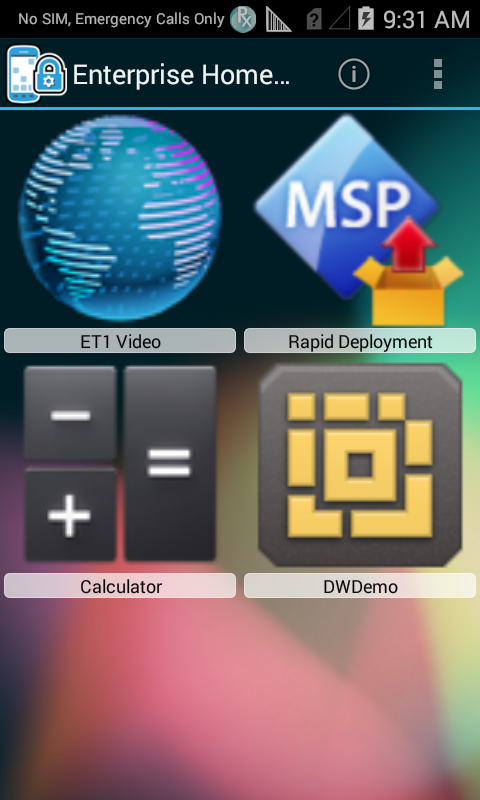

## Overview
Enterprise Home Screen is a free Android app from Zebra Technologies that provides a simple way for administrators to control access to apps and settings on a Zebra device without the need to write custom code. Using a simple touch interface, EHS easily limits usage to one or more specified applications, prevents changes to device settings and locks down the file system. It can be configured in seconds, and settings can be deployed via MDM. EHS settings are stored in a simple XML file that's easy to read and edit by hand, if necessary. 

EHS works by inserting itself in place of the stock Android app launcher and home screen. When first run, it presents a screen like the one below, offering a choice of which home app to open and whether to make the selection permanent. EHS also can be installed as the default launcher, bypassing the selector dialog. 

<b>Note</b>: Many of the capabilities of EHS can be accomplished manually on the device, programmatically through [EMDK](../../../../emdk-for-android) or remotely using [StageNow](../../../../stagenow) or a third-party mobile device management (MDM) system (if supported by that MDM system). EHS simply puts the capabilities into a single tool.

_Enterprise Home Screen does not support localization_. 

**[What's New in EHS 2.6](#newinehs26)**

------

The first time it's installed, EHS presents the admin with this simple choice: 

Selecting "Always" locks EHS in as the default home app and **locks users out of the following** device features by default:

* Airplane mode
* USB debugging
* Access to the file system
* Keyguard (for unlocking the screen)
* Keyguard-screen camera and search functions
* The status-bar Settings icon  
* Full access to the System Settings panel  

Administrators can grant or restrict access to individual features or hide the settings panel entirely. 

> **Note: After selecting "Always," some devices require a 10-second pause before restarting to ensure the change remains persistent**. 

Ready to get started? [Download Enterprise Home Screen 2.6](https://www.zebra.com/us/en/support-downloads/software/utilities/enterprise-home-screen.html)

-----

## Supported Devices
This version of Enterprise Home Screen has been approved for use with the Zebra Android devices listed below.

<table class="MsoNormalTable" style="" id="table2" border="1" cellpadding="3" cellspacing="0">
<tbody>

<tr bgcolor="#ccffcc" >
<td style="width: 150.35pt;" width="200">

<b>Device</b>

</td>

<td style="width: 220px;">

<b>
    Android 4.4 (KitKat)</b>

</td>
<td style="width: 220px;">

<b>
    Android 5.0/5.1 (Lollipop) </b>

</td>
<td style="width: 220px;">

<b>
    Android 6.0 (Marshmallow) </b>

</td>
</tr>

<td style="width: 118.35pt;"  width="158">

ET50/ET55

</td>
<td style="width: 96px;" >

<b>&nbsp;</b>

</td>
<td style="width: 96px;" >

<b>*</b>

</td>
<td style="width: 220px;" >

<b>*</b>

</td>
</tr>

<tr>
<td style="width: 150.35pt;"  width="250">

MC18

</td>
<td style="width: 220px;" >

<b>
    *</b>

</td>
<td style="width: 220px;" >

<b>*</b>

</td>
<td style="width: 220px;" >

<b>&nbsp;</b>

</td></tr>

<tr>
<td style="width: 150.35pt;"  width="250">

MC32

</td>
<td style="width: 220px;" >

<b>
    &nbsp;</b>

</td>
<td style="width: 220px;" >

<b>*</b>

</td>
<td style="width: 220px;" >

<b>&nbsp;</b>

</td></tr>

<tr >
<td style="width: 118.35pt;" width="158">

MC40

</td>
<td style="width: 96px;">

<b>*</b>

</td>
<td style="width: 96px;" >

<b>*</b>

</td>
<td style="width: 220px;" >

<b>&nbsp;</b>

</td>
</tr>

<tr>
<td style="width: 118.35pt;"  width="158">

MC67

</td>
<td style="width: 96px;" >

<b>
    *</b>

</td>
<td style="width: 96px;" >

<b>&nbsp;</b>

</td>
<td style="width: 220px;" >

<b>&nbsp;</b>

</td>

<tr >
<td style="width: 118.35pt;"  width="158">

MC92

</td>
<td style="width: 96px;" >

<b>
    *</b>

</td>
<td style="width: 96px;" >

<b>&nbsp;</b>

</td>
<td style="width: 220px;" >

<b>&nbsp;</b>

</td>
</tr>

<tr >
<tr>
<td style="width: 118.35pt;" width="158">

TC51 / TC56

</td>

<td style="width: 96px;">

<b>&nbsp;</b>

</td>

<td style="width: 96px;" >

<b>&nbsp;</b>

</td>
<td style="width: 220px;" >

<b>*</b>

</td>
</tr>

<tr >
<td style="width: 118.35pt;" width="158">

TC55

</td>
<td style="width: 96px;">

<b>*</b>

</td>
<td style="width: 96px;" >

<b>&nbsp;</b>

</td>
<td style="width: 220px;" >

<b>&nbsp;</b>

</td>
</tr>
<tr>
<td style="width: 118.35pt;" width="158">

TC70

</td>
<td style="width: 96px;">

<b>*</b>

</td>
<td style="width: 96px;">

<b>*</b>

</td>
<td style="width: 220px;" >

<b>&nbsp;</b>

</td>
</tr>
<td style="width: 118.35pt;" width="158">

TC70x

</td>
<td style="width: 96px;">

<b>&nbsp;</b>

</td>
<td style="width: 96px;">

<b>&nbsp;</b>

</td>
<td style="width: 220px;" >

<b>*</b>

</td>
</tr>
<tr>
<td style="width: 118.35pt;"  width="158">

TC75

</td>
<td style="width: 96px;" >

<b>
    *</b>

</td>
<td style="width: 96px;" >

<b>*</b>

</td>
<td style="width: 220px;" >

<b>&nbsp;</b>

</td>

<tr >
<td style="width: 118.35pt;" width="158">

TC75x

</td>
<td style="width: 96px;">

<b>&nbsp;</b>

</td>
<td style="width: 96px;" >

<b>&nbsp;</b>

</td>
<td style="width: 220px;" >

<b>*</b>

</td>
</tr>

<tr>
<td style="width: 118.35pt;"  width="158">

TC8000

</td>
<td style="width: 96px;" >

<b>
    *</b>

</td>
<td style="width: 96px;" >

<b>*</b>

</td>
<td style="width: 220px;" >

<b>&nbsp;</b>

</td>

<tr >
<td style="width: 118.35pt;"  width="158">

WT6000

</td>
<td style="width: 96px;" >

<b>
    &nbsp;</b>

</td>
<td style="width: 96px;" >

<b>*</b>

</td>
<td style="width: 220px;" >

<b>&nbsp;</b>

</td>
</tr>

</tbody>
</table>

## New in EHS 2.6

* **Support for ET50/ET55** tablet computers running Marshmallow

-----

## New in EHS 2.5

### Device Support:
* [MC32](https://www.zebra.com/us/en/products/mobile-computers/handheld/mc3200.html) running Android 5.1.1 Lollipop (see [Android 6.x Marshmallow Notes](#androidmarshmallownotes))
* [TC51/TC56](https://www.zebra.com/us/en/products/mobile-computers/handheld/tc51-tc56.html) and [TC75x](https://www.zebra.com/us/en/products/mobile-computers/handheld/tc7x-touch-computer-series.html) Touch Computers running Android Marshmallow 6.0.1 (see [Android 6.x Marshmallow Notes](#androidmarshmallownotes))
* [ET50/ET55 Tablet Computers](https://www.zebra.com/us/en/products/tablets/et50-55.html) running Android Lollipop 5.1.1 (see [Android 5+ Notes](#androidlollipopandmarshmallownotes) and [ET50/ET55 Device Notes](#et50et55devicenotes)) 
* [TC8000 Touch Mobile Computer and Scanner](https://www.zebra.com/us/en/products/mobile-computers/handheld/tc8000.html) running Android Lollipop 5.1.1 (see [Android 5+ Notes](#androidlollipopandmarshmallownotes))
* [TC70/TC75 Touch Computers](https://www.zebra.com/us/en/products/mobile-computers/handheld/tc7x-touch-computer-series.html) running Android Lollipop 5.1.1 (see [Android 5+ Notes](#androidlollipopandmarshmallownotes)) 
* The [MC67](https://www.zebra.com/us/en/products/mobile-computers/handheld/mc67-mobile-computer-series.html) Mobile Computer Series running Android 4.4 KitKat (see [Android 4.4 Notes](#androidkitkatnotes)) 

### Update for June, 2017:

* **Support added for [MC18](https://www.zebra.com/us/en/products/mobile-computers/handheld/mc1x-personal-shopper-series.html) and [MC40](https://www.zebra.com/us/en/products/mobile-computers/handheld/mc40-mobile-computer-series.html) running Lollipop**
* **Support added for [TC70x](https://www.zebra.com/us/en/products/mobile-computers/handheld/tc7x-touch-computer-series.html) running Marshmallow** 

### EHS 2.5 No Longer Supports:
* **Devices with Android 4.1.2 Jelly Bean**
* **TC70 with Android 4.4.2 KitKat** (BSP version 112414)
 
**Zebra continues to support EHS on the TC70 with Android 4.4.2 KitKat and on Zebra devices running Jelly Bean**. [Download EHS 2.4](../../../2-4/download) to target these devices. 

### New Features in EHS 2.5:
* **Easier download and installation**. The EHS 2.5 download package now includes a single APK for installing on all supported Zebra devices; no more multi-APK installer. 

* **Now links to [TechDocs](../../../../)**, Zebra's premier web site for user-facing documentation--now a standard component on every EHS installation.
 

[Download Enterprise Home Screen 2.5](https://www.zebra.com/us/en/support-downloads/software/utilities/enterprise-home-screen.html)

------

### Android Lollipop and Marshmallow Notes 
**_Apply to devices running Android Lollipop 5.x and higher (including Marshmallow)_**:

* **[Status Bar Pull-down](../settings#disablestatusbarpulldown) behavior has changed**. A new feature in [UI Manager](/mx/uimgr) allows the Status Bar Pull-down (referred to there as Notification Pulldown) to be controlled through EMDK, StageNow or a third-party mobile device management (MDM) system, overriding any EHS setting. Applies only to devices with MX 6.0 and higher, which is for Android Lollipop and later. 

* **[Status Bar Settings Icon](../settings#disablestatusbarsettings) behavior has changed**. While disabling such access to the Settings panel is not supported through EHS on all devices, a new feature in [UI Manager](/mx/uimgr) allows the Status Bar Settings Icon (referred to there as Notification Quick Settings Icons) to be controlled through EMDK, StageNow or a third-party MDM system, overriding any EHS setting. Applies only to devices with MX 6.0 and higher, which is for Android Lollipop and later; any prior device limitations remain. 

* **Android L retains the Recent Apps list after device reboot**. If this poses a security risk, the list can be cleared using [App Manager](/mx/appmgr) through EMDK, StageNow or a third-party MDM system. For more information, see [Security Notes](../features#securitynotes) in the Advanced Features section. 

* **[Kiosk Mode](../features#kioskmode) should not be used with Screen Pinning**, a feature in Android L that works in a similar way.

* **The [Bypass Keyguard](../settings#bypasskeyguard) feature fails to unlock the screen after an Android L device is rebooted**. This feature works normally on devices running KitKat and Jelly Bean. 

* **Android L allows [screen orientation](../settings#orientation) to be changed through the Quick Settings panel** only when EHS is configured to accept the System orientation setting (the EHS default). If an EHS administrator sets the orientation to landscape or portrait mode, the device user will no longer be able to change the orientation setting.

-----

### Android Marshmallow Notes
**_Apply to devices running Android 6.x Marshmallow only_**:

* **Selecting EHS as the default launcher will not be permanent** after a reboot on some devices if the selection was made while in User Mode.  **To avoid this issue, switch to Admin Mode** and press the HOME button; the "Select a home app" pop-up appears. **Select EHS and tap "Always"** to make the selection permanent.

* **If Location Permission is revoked** on a device running Android 6.0 Marshmallow, a blank list of available access points will be presented under "Scan Results" in the "Wireless info" screen in EHS. Enabled by default, Location Permission is accessed in **Settings -> Apps -> EHS -> Permissions**. 

* **If Wi-Fi is disabled** on a Marshmallow device, the MAC address will be shown as "Unknown" in the "Wireless info" screen in EHS.

-----

### Android KitKat Notes 
**_Applies to devices running Android 4.4+ KitKat only_**:

* **When starting up in Kiosk Mode on a device running KitKat**, a "please wait" prompt remains displayed. Press the HOME key to launch the Kiosk-Mode app and resume normal behavior. 

------

### ET50/ET55 Device Notes

**Applies to Zebra ET50 and ET55 devices with Google Mobile Services (GMS) only**.  

* **The Launcher selection pop-up does not appear** when the HOME button is pressed while in User Mode, preventing a user or administrator from easily selecting the default Launcher app on the device.  **To avoid this issue, switch to Admin Mode** and press the HOME button; the "Select a home app" pop-up appears. **Select EHS and tap "Always"** to make the selection permanent.

* **A permanent system UI crash could occur if EHS is uninstalled remotely (i.e. via MDM) while in User Mode**. Before uninstalling EHS remotely, Zebra recommends pushing to the device an EHS configuration file (`enterprisehomescreen.xml`) with the Search app enabled.

See the [Advanced Settings](../settings) section for a complete `enterprisehomescreen.xml` configuration file reference. 

------

## New in EHS 2.4

* **Support for the [Zebra WT6000](https://www.zebra.com/us/en/products/mobile-computers/wearable-computers/wt6000.html) -** wearable terminal running Android 5.0 Lollipop. (see [Android Notes](#androidlollipopandmarshmallownotes)) 

* **[Bundle Data Option](../settings#bundle) -** allows injection of app parameters, user data or other key-value pairs into an app on launch. 

* **[App Launch Flags](../settings#applaunchflags) -** permit one or more Android Intent flags to be specified when an application is launched, directing launch behavior as required. 

* **[Service Auto-Launch](../settings#serviceautolaunch) -** permits one or more Android services to be started whenever EHS launches. 

* **[Wildcard Character](../settings#applications) -** reduces the lines of code required in the EHS config file to specify apps for display in User Mode.

* **[Custom App Icons](../settings#icon) -** permits customized icons for apps and links, overriding the default system icons. 

* **[Custom Title-bar Icons](../settings#titlebariconfile) -** permits a custom icon to be displayed in the EHS Title Bar, overriding the default EHS icon. 

* **[App Icon Size](../settings#appiconsize) -** provides five sizes for Admin- and User-mode application icons.

<!-- 
_The icon size UI is accessible from Admin or User Modes (default shown)_.  

_The User Mode screen with XXL icons_. -->
* **[Battery and Wi-Fi Quick View](../setup#batteryandwifiquickview) -** displays real-time status of the device battery and Wi-Fi signal on a single screen.

* **[App Icon Label Text Color](../settings#iconlabeltextcolor) -** is now white on a transparent background to improve readability. 

------

## New in EHS 2.3
* [Enable/disable device reboot](../settings#rebootoninstallenabled) when EHS is first launched after installation. 
* TC8000 KitKat version 4.4 support (added January, 2016)
