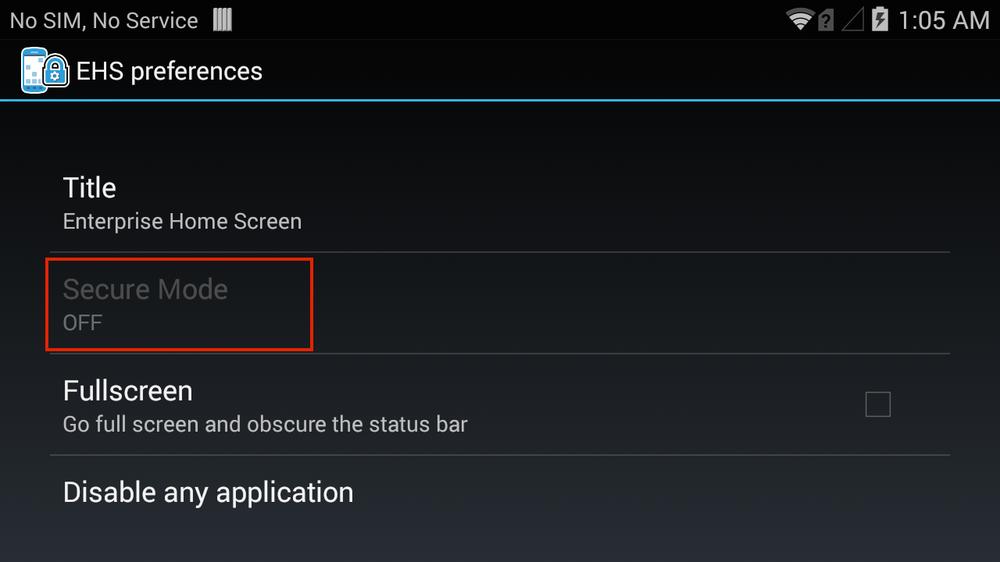
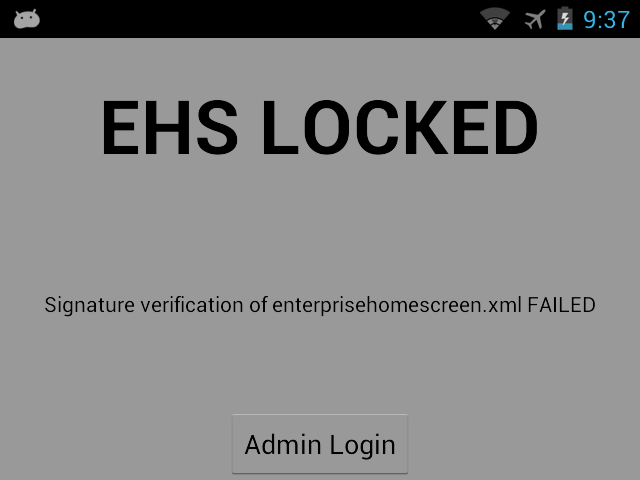

## Overview

This guide covers advanced EHS features such as Kiosk Mode and Secure Mode. It assumes a working knowledge of Enterprise Home Screen and use of its [Advanced Settings](../settings) through direct manipulation of the `enterprisehomescreen.xml` config file. For those not familiar with these procedures, please refer to the [About](../about) and [Setup](../setup) pages and the [Advanced Settings Guide](../settings) before continuing. 

<b>Note</b>: Many of the capabilities of EHS can be accomplished manually on the device, programmatically through [EMDK](../../../../emdk-for-android) or remotely using [StageNow](../../../../stagenow) or a third-party mobile device management (MDM) system (if supported by that MDM system). EHS simply puts the capabilities into a single tool.

## Kiosk Mode
Kiosk Mode is designed for devices to run a single application, often with a touch-based UI. Examples include retail price checkers, auto parts look-ups, patient check-in systems and so on. Kiosk Mode also can be useful when dedicating a device to a single user and/or task, such as a retail clerk's hand-held barcode scanner. Kiosk Mode places the app in full-screen mode and prevents the BACK and HOME keys from being used to exit the app by mapping those keys to the Kiosk app's most recent activity. 

Also see the EHS [Auto-Launch](../settings#autolaunch) feature, which provides functionality similar to Kiosk Mode without changing the HOME and BACK key functions. 

##### Android Platform Notes: 
* **On devices running Android 5.x Lollipop**, Kiosk Mode should not be used with Screen Pinning, an feature in Android L and higher that provides similar functionality.
* **On devices running Android 4.4 KitKat**, a "please wait" prompt remains displayed when starting up the device in Kiosk Mode. Press the HOME key to launch the Kiosk app and resume normal behavior. 

##### Kiosk Mode tags:
<b>&lt;kiosk&gt;</b> - Specifies the app that will run when Kiosk Mode is enabled

<b>&lt;kiosk_mode_enabled&gt;</b> - Toggles the feature on and off
 

### Enable Kiosk Mode

In the `enterprisehomescreen.xml` file:

1. Specify the Kiosk app in the [&lt;kiosk&gt; section](../settings#kiosk) of the config file. 
2. Enter a value of '1' in the [&lt;kiosk_mode_enabled&gt; tag](../settings#kioskmodeenabled) in the Preferences section of the file. 
3. If USB Debugging is desired in Kiosk Mode, enter a value of '0' in the [&lt;usb_debugging_disabled&gt; tag](../settings#usbdebuggingdisabled).  
(See [Disable Kiosk Mode](#disablekioskmode) below for details). 

<b>Security Note</b>: When using Kiosk Mode, be sure to disable 'key remapping' and other possible methods of launching applications, which would thereby defeat Kiosk Mode safeguards. 

### Disable Kiosk Mode
Once Kiosk Mode is enabled it can be disabled in only one of two ways (without writing custom program code):

* <b>If USB Debugging was not disabled for User Mode</b>, disable Kiosk Mode by pushing to the device a config file with a value of '0' in the &lt;kiosk_mode_enabled&gt; tag.

* <b>If USB Debugging was disabled for User Mode</b>, perform a factory reset. 

##### Control Kiosk Mode Programmatically
Kiosk Mode can be controlled from within an Android application using Android Intents. The following JavaScript code shows how to enable and disable Kiosk Mode programmatically:  

	:::javascript
	//Disable Kiosk Mode:
	Intent intent = new Intent("com.symbol.enterprisehomescreen.actions.MODIFY_KIOSK_MODE");
 	Intent.putExtra("enable",false);
 	sendBroadcast(intent);

	//Enable Kiosk Mode:
	Intent intent = new Intent("com.symbol.enterprisehomescreen.actions.MODIFY_KIOSK_MODE");
 	Intent.putExtra("enable",true);
 	sendBroadcast(intent);

<b>Security Note</b>: When using Kiosk Mode, be sure to disable "key remapping" and other possible methods of launching applications, which would thereby defeat Kiosk Mode safeguards. 

------

## Secure Mode

In Secure Mode, EHS will accept only a signed EHS configuration file, thereby preventing unauthorized changes to the file. To operate in Secure mode, EHS requires a signed config file (`enterprisehomescreen.xml`) and a matching signature file (`enterprisehomescreen.pem`) to be present on the device. 

A device not in Secure Mode is running in Normal Mode, which is the default. When in Normal Mode, EHS will accept an unsigned config file and act on any configuration settings within it, as long as the name of the file and its contents meet [EHS specifications](../settings).

### Enable Secure Mode
These instructions require [Android Debug Bridge (ADB)](https://developer.android.com/studio/command-line/adb.html) for communication with the device and [OpenSSL for Windows](#installopenssl) for the creation of device certificate and private key files. If necessary, please install ADB and OpenSSL before proceeding. 

**Important: To enable Secure Mode in EHS, manual file-push is no longer supported in Android N (and higher) for installing a device root certificate**. Deployment of certificates to a device to enable Secure Mode requires use of the Certificate Manager Setting Type in [Zebra StageNow](../../../../stagenow) or the Certificate Manager CSP in [EMDK](../../../../emdk-for-android)'s Profile Manager.  

&#49;. Create a device root certificate (`caroot.pem`) and private key (`privatekey.pem`) using the following OpenSSL command: 

	:::term
	C:\OpenSSL-Win32\bin\openssl req -x509 -nodes -days 365 -newkey rsa:2048 -keyout privatekey.pem -out caroot.pem
 

&#50;. Using a text editor, <b>create a</b> `certificate.xml` <b>file</b> as shown below: 

	<?xml version="1.0" encoding="UTF-8"?>
	<certificate>
	        <install>
	                <source>/sdcard/caroot.pem</source>
	                <alias>CARootCert1</alias>
	        </install>
	</certificate>

&#51;. <b> Copy the</b> `caroot.pem` <b>to the SD card</b> on the device. 

&#52;. <b>Push</b> `certificate.xml` to the device </b> using Android File Browser or the following command ADB: 

	:::term
	adb push certificate.xml /enterprise/device/settings/mdm/autoimport/

This will cause the root certificate to be installed on the device (**Note: Manual push is not supported on devices running Android N**).

&#53;. To confirm installation, <b> pull the</b> `Results.xml` <b>file</b> with the following command:

	:::term
	adb pull /enterprise/device/settings/mdm/autoimport/Results.xml.

&#54;. <b>Create the EHS configuration file</b> (`enterprisehomescreen.xml`) as described in the [Advanced Settings](../settings) section.

&#55;. <b>Sign the config file</b> using the following OpenSSL command:

	C:\OpenSSL-Win32\bin\openssl dgst -sign privatekey.pem -out enterprisehomescreen.pem enterprisehomescreen.xml

If successful, the process of signing the `enterprisehomescreen.xml` file will produce a signature file called `enterprisehomescreen.pem`.

> <b>Important</b>: Be sure to use the same version of OpenSSL to sign the config file as was used to generate the root certificate.

&#56;. <b>Push the signed config and signature files</b> to the `/enterprise/usr` folder.

&#57;. <b>Install and run the EHS .apk </b> as described in the [Setup Guide](../setup). 

At launch, EHS will attempt to match the config and signatures files with the device certificate. If successful, EHS will enter Secure mode and implement the settings in the signed config file. 

To confirm, the current operating mode can be viewed in the Preferences panel when in Admin Mode. The image below shows that Secure Mode is OFF: 

 

If matching is unsuccessful, the device will go into a [Lockdown State](#lockdownstate) (see below).

> <b>Note</b>: When EHS enters Secure Mode, the configuration and signature files are moved from the `/enterprise/usr` folder to a secure location. To retrieve the config file from a device in Secure Mode, use the [Export Configuration File](../settings#configfileaccess) option available under the Tools menu in Admin Mode.

------

### Disable Secure Mode
The first step in returning a device to Normal Mode is to disable Secure Mode. This requires removal of EHS from the device and must be done by an administrator.  

To remove EHS from a device running in Secure Mode:  

* Enter Admin Mode and [uninstall EHS](../setup#uninstallation), or
* Perform an Enterprise Reset (refer to the device manual for details). 

With Secure-Mode EHS removed, follow the [EHS Setup Guide](../setup#manualinstallation) for normal installation. 

------

## Lockdown State
A device running in Secure Mode will enter Lockdown State if the signed config file (`enterprisehomescreen.xml`) and its matching signature file (`enterprisehomescreen.pem`) cannot be verified against the corresponding certificate installed on the device. When this state is reached, the device will display a screen similar to the image below along with the reason for the lockdown. 

 

### Recovery from Lockdown State
There are two ways to recover from Lockdown State and return a device to Secure Mode operation:

##### Method 1: Replace Signature Files
Copy the valid EHS config and signature files to the `/enterprise/usr` directory on the device. This will cause EHS to exit the Lockdown State, import the config file and return to Secure Mode. The valid files can be copied manually via ADB or deployed using an MDM.

##### Method 2: Delete Signature File
Log into Admin Mode and delete the signature file from the `/enterprise/usr` directory. This will cause EHS to exit the Lockdown State and enter Secure Mode. This method will work only if EHS was already running in Secure Mode. If EHS was previously running in Normal Mode and entered Lockdown State due to an unsuccessful attempt to switch to Secure Mode, EHS returns to Normal Mode when the signature file is deleted. 

<b>Note: Whether running in Normal or Secure Mode, reaching the maximum number of 10 unsuccessful admin login attempts (or the number otherwise specified in the EHS config file) will disable Admin Mode login. To exit this state, copy a valid config file (and its matching signature file if previously running in Secure Mode) to the device or delete the existing signature file remotely via MDM</b>.

------

## EHS Log

EHS records all major activities, failures and security events in the `/enterprise/usr/enterprisehomescreen.log` file. These include failed attempts to enter Admin Mode, switches of the operating mode and all EHS errors. The log is a plain text file and can be retrieved with ADB or an MDM and viewed with any text editor.  

For more information about logging, see [Logging Preferences](../settings/#loggingdisabled). 

_In EHS 2.7 and higher, logging can be disabled through the UI or config file._
 

------

## EHS File Interactions

<h3 id="X812">How EHS reacts to file operations</h3>

<table rules="all"
width="100%"
frame="border"
cellspacing="0" cellpadding="4">
<col width="25%" />
<col width="25%" />
<col width="25%" />
<col width="25%" />
<tbody>
<tr>
<td align="left" valign="top">
Current mode
</td>
<td align="left" valign="top">
Operation
</td>
<td align="left" valign="top">
Results
</td>
<td align="left" valign="top">
Recovery
</td>
</tr>
<tr>
<td align="left" valign="top">
Normal Mode
</td>
<td align="left" valign="top">
Copy a new enterprisehomescreen.xml file into /enterprise/usr folder
</td>
<td align="left" valign="top">
New configuration takes effect; device remains in Normal Mode.
</td>
<td align="left" valign="top">

</td>
</tr>
<tr>
<td align="left" valign="top">
Normal Mode
</td>
<td align="left" valign="top">
Copy an invalid pem file (i.e. pem file does not match the XML file in /enterprise/usr folder)
</td>
<td align="left" valign="top">
Lockdown Mode screen appears immediately
</td>
<td align="left" valign="top">
Delete the pem file in /enterprise/usr folder remotely or through local admin login. Device resumes in Normal Mode with existing configuration.
</td>
</tr>
<tr>
<td align="left" valign="top">
Normal Mode
</td>
<td align="left" valign="top">
Copy a new XML file followed by its corresponding pem file into /enterprise/usr folder
</td>
<td align="left" valign="top">
Once the XML file is detected, the new configuration takes effect in Normal Mode.

When the pem file is copied:

<em>Signature verification SUCCESS:</em> Device enters Secure Mode.

<em>Signature verification FAILURE:</em> Lockdown Mode screen appears immediately with error.
</td>
<td align="left" valign="top">

</td>
</tr>
<tr>
<td align="left" valign="top">
Normal Mode
</td>
<td align="left" valign="top">
Copy a new pem file followed by the corresponding XML file into /enterprise/usr folder
</td>
<td align="left" valign="top">
As soon as pem file is copied the device will enter Lockdown State. Once the relevant XML file is copied, lockdown screen will vanish and device will enter Secure Mode with new configuration taking effect.

WARNING: The recommended order is to copy the XML file first and the pem file second.
</td>
<td align="left" valign="top">

</td>
</tr>
</tbody>
</table>

<table rules="all"
width="100%"
frame="border"
cellspacing="0" cellpadding="4">
<col width="25%" />
<col width="25%" />
<col width="25%" />
<col width="25%" />
<tbody>
<tr>
<td align="left" valign="top">
Current mode
</td>
<td align="left" valign="top">
Operation
</td>
<td align="left" valign="top">
Results
</td>
<td align="left" valign="top">
Recovery
</td>
</tr>
<tr>
<td align="left" valign="top">
Secure Mode
</td>
<td align="left" valign="top">
Copy a new XML file into /enterprise/usr folder
</td>
<td align="left" valign="top">
New configuration does NOT take effect, since the relevant pem file has not been copied. Hence the device remains in the previous configuration, in Secure Mode.

Note:  Device does not go to Lockdown State in this case
</td>
<td align="left" valign="top">

</td>
</tr>
<tr>
<td align="left" valign="top">
Secure mode
</td>
<td align="left" valign="top">
Copy a new XML file and the corresponding pem file into /enterprise/usr folder
</td>
<td align="left" valign="top">
<em>Signature verification SUCCESS:</em> Device remains in Secure Mode. New configuration takes effect.

<em>Signature verification FAILURE:</em> New configuration does NOT take effect and device enters Lockdown State."
</td>
<td align="left" valign="top">
Delete the XML file and pem file in /enterprise/usr folder remotely or through local admin login. Device will resume in Secure Mode with previous configuration.
</td>
</tr>
<tr>
<td align="left" valign="top">
Secure mode
</td>
<td align="left" valign="top">
Copy only a pem file into /enterprise/usr folder
</td>
<td align="left" valign="top">
Lockdown screen appears immediately
</td>
<td align="left" valign="top">
Option 1: Copy the XML file (corresponding to the pem file) via Admin login to the device or remotely. Lock down screen will vanish immediately and the new configuration will take effect.

Option 2: Delete the pem file in /enterprise/usr folder: lock down screen will vanish immediately and the device will remain in previous configuration."
</td>
</tr>
</tbody>
</table>

<table rules="all"
width="100%"
frame="border"
cellspacing="0" cellpadding="4">
<col width="33%" />
<col width="33%" />
<col width="33%" />
<tbody>
<tr>
<td align="left" valign="top">
Current state
</td>
<td align="left" valign="top">
Operation
</td>
<td align="left" valign="top">
Results
</td>
</tr>
<tr>
<td align="left" valign="top">
Lockdown State
</td>
<td align="left" valign="top">
Admin logs into the device and copies a new XML file and the corresponding pem file via file browser in the device.
</td>
<td align="left" valign="top">
<em>Signature verification SUCCESS:</em> Device enters into Secure Mode and new configuration takes effect.

<em>Signature verification FAILURE:</em> Lockdown Screen appears. New configuration does not take effect.
</td>
</tr>
<tr>
<td align="left" valign="top">
Lockdown State
</td>
<td align="left" valign="top">
Copy a new XML file and the corresponding pem file remotely.
</td>
<td align="left" valign="top">
<em>Signature verification SUCCESS:</em> Lockdown screen vanishes, device enters Secure Mode, new configuration takes effect.

<em>Signature verification FAILURE:</em> Lock down screen remains, new configuration does not take effect.
</td>
</tr>
<tr>
<td align="left" valign="top">
Lockdown State
</td>
<td align="left" valign="top">
Delete the pem file in /enterprise/usr folder remotely or through local admin login.
</td>
<td align="left" valign="top">
<em>If the device was in Secure Mode previously:</em> Lockdown screen vanishes and the device resumes in Secure Mode with previous configuration.

<em>If the device was in Normal Mode previously:</em> Lockdown screen vanishes and the device resumes in Normal Mode with previous configuration.
</td>
</tr>
<tr>
<td align="left" valign="top">
Lockdown State
</td>
<td align="left" valign="top">
Do not change any files in the /enterprise/usr folder. Uninstall and re-install EHS.
</td>
<td align="left" valign="top">
When EHS is launched, lockdown screen appears.
</td>
</tr>
<tr>
<td align="left" valign="top">
Lockdown State
</td>
<td align="left" valign="top">
Delete the XML file and pem file in /enterprise/usr folder. Then uninstall and re-install EHS.
</td>
<td align="left" valign="top">
EHS is launched in Normal Mode
</td>
</tr>
</tbody>
</table>

------
## Security Notes
This section covers important interactions between EHS and Android features that might impact device security or application behavior. 

### Recent Apps List

* Accessing an app from the Recent Apps list could represent a security risk; apps not cleared from the list can be activated with the BACK button, potentially exposing a non-EHS home screen.
* On Android Nougat devices, **the Recent Apps button can be Enabled/Disabled**. It is disabled by default to prevent the use of multi-window mode. 
* EHS does not add apps or activities to the Android Recent Apps list, but apps/activities launched from within EHS might. Such apps/activities could launch others that might appear on the Recent Apps list and pose a security risk.  
* The Recent Apps list can be cleared on pre-Android L devices by rebooting the device. 
* Android L devices retain the Recent Apps list after a reboot. Use [App Manager](/mx/appmgr) through EMDK, StageNow or a third-party MDM system to clear the list. 
* To manually clear Recent Apps, bring up the Recent Apps list by long-pressing the Home or Menu button (depending on the device) until the list appears, then swipe away each app.

### EHS and MX Multi-user

* If using EHS with Zebra's MX Multi-user feature, it's important to disable the EHS Bypass Keyguard feature. Failure to do so will prevent the MX multi-user login screen from being displayed. Refer to the [Bypass Keyguard tag](../settings#bypasskeyguard) for settings instructions. 
* MX Multi-user has the ability to override EHS-imposed restrictions on access to System Settings. Users logged in as an MX Admin will have full access to System Settings at all times. MX non-admin users by default will have access only to Sound, Display and About screens. 

### Other Unintended Access

* On devices running Android 4.4 KitKat, users might gain access to Airplane mode, Wi-Fi, Bluetooth and other device settings via the Quick Settings menu in the Notification drop-down. This can be prevented with the [Disable Status Bar Settings tag](../settings#disablestatusbarsettings). 
* Wireless capabilities also can be individually disabled through these MX modules: 
	* [SettingsMgr](../../../../mx/settingsmgr) for Airplane Mode and Wi-Fi 
	* [UiMgr](../../../../mx/uimgr) for Quick Settings and the "Gear" icon
	* [WirelessMgr](../../../../mx/wirelessmgr) for Bluetooth, GPS, NFC and WWAN 
* MX modules are accessible using EMDK or StageNow tools. 
* Taking a screenshot (by pressing the "volume-down" and "Power" buttons simultaneously) while in User Mode might expose users to the Gallery app or to apps used for sharing images such as Gmail and MMS. To prevent this, disable such unwanted apps in the Disable/Enable Applications section of [Optional Feature Tags section](../settings#optionalfeaturetags).
* If the Programmable Keys feature on the Android System Settings panel is used to program a key to launch an application, that key mapping will be available in User Mode. 

------

## Install OpenSSL

Installing OpenSSL tool on Windows PC: 

&#49;. [Download OpenSSL 1.0.1g or above](http://slproweb.com/products/Win32OpenSSL.html) for Windows. 

&#50;. Install OpenSSL on a computer with connectivity to the target device.

&#51;. Dismiss the Visual C++ 2008 warning, if any, during installation and complete the installation.

&#52;. At the command prompt, navigate to the OpenSSL installed folder (c:\OpenSSL-Win32\ by default)

&#53;. Set the OpenSSL configuration environment variable by executing the following command:
 
	C:\OpenSSL-Win32\ Set OPENSSL_CONF=C:\OpenSSL-Win32\bin\openssl.cfg

OpenSSL can now be used to sign EHS files. 

------

