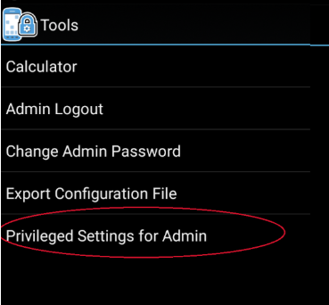
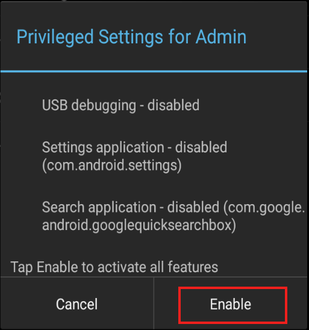

## Overview

This guide covers advanced EHS features such as Kiosk Mode and EHS Logging. It assumes a working knowledge of Enterprise Home Screen and use of its [Advanced Settings](../settings) through direct manipulation of the `enterprisehomescreen.xml` config file. For those not familiar with these procedures, please refer to the [About](../about) and [Setup](../setup) pages and the [Advanced Settings Guide](../settings) before continuing. 

<b>Note</b>: Many of the capabilities of EHS can be accomplished manually on the device, programmatically through [EMDK](../../../../emdk-for-android) or remotely using [StageNow](../../../../stagenow) or a third-party Enterprise Mobile Management (EMM) system (if supported by that EMM system). EHS simply puts the capabilities into a single tool.

> **Note**: Secure Mode is discontinued in EHS 3.0 and higher. 

-----

## Multi-user Mode

EHS 3.1 and higher supports the Multi-user Mode implemented on devices running Android 8.x Oreo and higher. The feature works through the concept of User Profiles, which allow for Primary, Secondary and Guest users, each with different sets of apps, capabilities and access privileges. In EHS, Multi-user Mode operates under the rules listed below. 

#### Multi-user Rules

* Settings files for the Primary user deployed to one or more devices apply to all users of that device. 
* Settings changes made by the Primary user automatically apply to secondary/guest users.
* Secondary/Guest users' configurations MUST be inherited from the primary user. Secondary/Guest users are not allowed to reconfigure (either via XML file push or Admin mode preferences manually). Only primary user has the Admin mode, secondary users or guest do not have Admin mode. Config XML file pushed in secondary users or guests will not be consumed by EHS.
FROM TUT-27633:

this is a about Android behavior of "Guest" user in multi user environment in Oreo. we have to make a note of that under EHS Multi user section.

when you have added a Guest in your device and when you switched to that Guest, a prompt comes up asking to select either "Start over" or "Continue" (this is given by the OS). so to continue working with EHS, you should always select "Continue" there.

"Start over" - To let a new guest use your device, or to delete data from the previous guest, choose Start over. 
"Continue" - To keep using data from the previous guest session, choose Continue.
note: if you do "start over" it will be a new Guest and hence the EHS app no longer exists under Guest. this is the Android behavior for any android app running in the device, not only for EHS.

 FROM TUT-27634:
we need to mention this under EHS multi user section.

Admin inactivity does not auto logout Admin (Primary user's) if we switch from Primary user to any other Users and stay in secondary user until timeout is passed and then come back to primary user. basically Admin is not logged out in primary user even after inactivity timeout has expired from any other Secondary user. 

In MU, EHS feature "Admin inactivity time out" works per-user only.

 

Steps:

Create some Secondary users in the device.
Login to Admin mode in Primary user and set the admin inactivity timeout as 15 seconds.
switch to Secondary user and leave device idle until 15 seconds passes
switch back to Primary user   
>>> Result: still the Primary user is in Admin mode (because 15 sec timeout has not taken place)
 FROM TUT-28619: 

this piece of info should go under multi-user support from EHS.

this is a usage note under Pinned shortcut feature (that was added in EHS 3.0) w,r,t multi-user support.

When a shortcut is pinned in primary user, it will get added only to primary user's home screen. it does not get added to secondary users' or guest's user screen. so the behavior of pinned shortcuts is per-user only.

This EHS behavior is identical to Android stock launcher behavior. There also the pinned shortcut is visible to the added user only. 

 

Test case: 

create primary user, a secondary user and guest.
Login to primary user >> open chrome >> open any link and add link to home screen EHS >> shortcut is added to primary user
switch to secondary user >>  cannot see the added shortcut there on SU's home screen.
From TUT-28247:
this is an outcome of TUT-27407

we need to add a usage note under MU section regarding enable/disable keyguard camera/search app feature;

in EHS config, when camera/search in keyguard is enabled and also the device has multiple users created (primary user, secondary users, guest);

then when the user is moving from primary to secondary through lock screen (swipe type lock screen), at the first landing to lock screen, they might not see the camera/search icon as expected. but if they do suspend/resume then the camera/search icons will appear on the lock screen as expected.

 

From TUT-27852:

when Multi user is enabled, SDcard getting disabled for all the users including Primary user. 

We need to update EHS techdocs regarding this. basically EHS customers will not be able to access SDcard when Multi User enabled.

affected features:

1. Admin cannot export Configuration from EHS when Multi user is enabled. external sd card will not be listed under export config folder list.

2. Users cannot use walpaper/title bar icon present in external storage when multi user is enabled 

 

From TUT-27635:

need to add a note for the below.

it's mandatory to install and first launch EHS while in Primary user.

In manual and mass deployment, EHS should always be installed in Primary user first and launched in Primary user.

reason: Mx dependent EHS features work while in primary user only. none of the Mx dependent features will work for secondary users. so there will be mis-behaviors if you install EHS and run EHS for secondary users first. if we do it first in primary user, the settings will be applied in primary user and be persistent thereafter.
 
-----

## GMS Restricted Mode

On GMS devices running Android 8.x Oreo and higher, Zebra implements a feature called [GMS Restricted Mode](/mx/appmgr/#mainfunctionality), an optional state that disables all GMS applications and services (i.e. Gmail, Google Maps, etc.) on the device (that are safe to disable) and removes their icons from the Android Launcher. **Although these apps and services also are disabled on devices running EHS, <u>their icons remain visible in the EHS Preferences -> Disable Applications</u>** panel. 

Attempts to enable any of the effected apps&ndash;either through the UI or by pushing a config file&ndash;result in failure and are added to the [EHS log](../features#ehslog). Users attempting to enable GMS apps through the UI also see a failure message on the screen.

-----

## Kiosk Mode
Kiosk Mode is designed for devices to run a single application, often with a touch-based UI. Examples include retail price checkers, auto parts look-ups, patient check-in systems and so on. Kiosk Mode also can be useful when dedicating a device to a single user and/or task, such as a retail clerk's hand-held barcode scanner. Kiosk Mode places the app in full-screen mode and prevents the BACK and HOME keys from being used to exit the app by mapping those keys to the Kiosk app's most recent activity. 

Also see the EHS [Auto-Launch](../settings#autolaunch) feature, which provides functionality similar to Kiosk Mode without changing the HOME and BACK key functions. 

##### Kiosk Mode tags:
<b>&lt;kiosk&gt;</b> - Specifies the app that will run when Kiosk Mode is enabled

<b>&lt;kiosk_mode_enabled&gt;</b> - Toggles the feature on and off
 

### Enable Kiosk Mode

In the `enterprisehomescreen.xml` file:

1. Specify the Kiosk app in the [&lt;kiosk&gt; section](../settings#kiosk) of the config file. 
2. Enter a value of '1' in the [&lt;kiosk_mode_enabled&gt; tag](../settings#kioskmodeenabled) in the Preferences section of the file. 
3. If USB Debugging is desired in Kiosk Mode, enter a value of '0' in the [&lt;usb_debugging_disabled&gt; tag](../settings#usbdebuggingdisabled).  
(See [Disable Kiosk Mode](#disablekioskmode) below for details). 

<b>Security Note</b>: When using Kiosk Mode, be sure to disable 'key remapping' and other possible methods of launching applications, which would thereby defeat Kiosk Mode safeguards. 

### Disable Kiosk Mode
Once Kiosk Mode is enabled it can be disabled in only one of two ways (without writing custom program code):

* <b>If USB Debugging was not disabled for User Mode</b>, disable Kiosk Mode by pushing to the device a config file with a value of '0' in the &lt;kiosk_mode_enabled&gt; tag.

* <b>If USB Debugging was disabled for User Mode</b>, perform a factory reset. 

##### Control Kiosk Mode Programmatically
Kiosk Mode can be controlled from within an Android application using Android Intents. The following JavaScript code shows how to enable and disable Kiosk Mode programmatically:  

	:::javascript
	//Disable Kiosk Mode:
	Intent intent = new Intent("com.symbol.enterprisehomescreen.actions.MODIFY_KIOSK_MODE");
 	Intent.putExtra("enable",false);
 	sendBroadcast(intent);

	//Enable Kiosk Mode:
	Intent intent = new Intent("com.symbol.enterprisehomescreen.actions.MODIFY_KIOSK_MODE");
 	Intent.putExtra("enable",true);
 	sendBroadcast(intent);

<b>Security Note</b>: When using Kiosk Mode, be sure to disable "key remapping" and other possible methods of launching applications, which would thereby defeat Kiosk Mode safeguards. 

-----

## Privileged Settings

In EHS 3.0 (and higher), certain features once automatically enabled when entering Admin Mode must now be enabled manually. EHS refers to these as Privileged Settings:

* USB debugging
* The Android Settings panel app
* The Google Search app

Most notably, activation of USB Debugging enables the Android Debug Bridge (adb) and its ability to transfer files to and from a device. The Privileged Settings state on the device is indicated by a pop-up whenever the user enters Admin Mode: 

_Tap "OK" to dismiss_. 
 

All three Privileged Settings are enabled as a group through an Admin-mode UI control and **are disabled automatically when re-entering User Mode**.

**To access Privileged Settings**: 

1. While in Admin Mode, **go to Tools -> Privileged Settings for Admin**: 

 
2. The current state (disabled) is shown.   **Tap "Enable" to activate Privileged Settings**: 

 
3. Privileged Settings are enabled immediately. **Tap "OK" to continue**.

 

-----

**To disable Privileged Settings**: 

2. **Go to Tools -> Privileged Settings for Admin**: 

 
3. The current state (enabled) is shown.   **Tap "Restore" to disable all three features**: 

 
4. Features are disabled immediately and a confirmation dialog appears. **Tap "OK" to continue**.

 

------

## EHS Log

EHS records all major activities, failures and security events in the `/enterprise/usr/enterprisehomescreen.log` file. These include failed attempts to enter Admin Mode, switches of the operating mode and all EHS errors. The log is a plain text file and can be retrieved with ADB or an EMM and viewed with any text editor.  

For more information about logging, see [Logging Preferences](../settings/#loggingdisabled). 

_In EHS 2.7 and higher, logging is disabled through the UI or config file._
 

**IMPORTANT**: Secure Mode is discontinued in EHS 3.0 and higher. Log files are no longer designated as "SECURED" or "UNSECURED" in log entries.  

------

## Security Notes
This section covers important interactions between EHS and Android features that might impact device security or application behavior. 

### Recent Apps List

* Accessing an app from the Recent Apps list could represent a security risk; apps not cleared from the list can be activated with the BACK button, potentially exposing a non-EHS home screen.
* On Android Nougat devices, **the Recent Apps button can be Enabled/Disabled**. It is disabled by default to prevent the use of multi-window mode. 
* EHS does not add apps or activities to the Android Recent Apps list, but apps/activities launched from within EHS might. Such apps/activities could launch others that might appear on the Recent Apps list and pose a security risk.  
* Some devices retain the Recent Apps list after a reboot. Use [App Manager](/mx/appmgr) through EMDK, StageNow or a third-party EMM system to clear the list. 
* To manually clear Recent Apps, bring up the Recent Apps list by long-pressing the Home or Menu button (depending on the device) until the list appears, then swipe away each app.

### EHS and MX Multi-user

* If using EHS with Zebra's MX Multi-user feature, it's important to enable the device Lock Screen. Failure to do so will prevent the MX multi-user login screen from being displayed. Use the [DevAdmin](/mx/devadmin) features of Zebra's StageNow or EMDK tools to configure this setting.
* MX Multi-user has the ability to override EHS-imposed restrictions on access to System Settings. Users logged in as an MX Admin will have full access to System Settings at all times. MX non-admin users by default will have access only to Sound, Display and About screens. 

### Other Unintended Access

* On devices running Android 4.4 KitKat, users might gain access to Airplane mode, Wi-Fi, Bluetooth and other device settings via the Quick Settings menu in the Notification drop-down. This can be prevented with the [Disable Status Bar Settings tag](../settings#disablestatusbarsettings). 
* Wireless capabilities also can be individually disabled through these MX modules: 
	* [SettingsMgr](../../../../mx/settingsmgr) for Airplane Mode and Wi-Fi 
	* [UiMgr](../../../../mx/uimgr) for Quick Settings and the "Gear" icon
	* [WirelessMgr](../../../../mx/wirelessmgr) for Bluetooth, GPS, NFC and WWAN 
* MX modules are accessible using EMDK or StageNow tools. 
* Taking a screenshot (by pressing the "volume-down" and "Power" buttons simultaneously) while in User Mode might expose users to the Gallery app or to apps used for sharing images such as Gmail and MMS. To prevent this, disable such unwanted apps in the Disable/Enable Applications section of [Optional Feature Tags section](../settings#optionalfeaturetags).
* If the Programmable Keys feature on the Android System Settings panel is used to program a key to launch an application, that key mapping will be available in User Mode. 

------

## Install OpenSSL

Installing OpenSSL tool on Windows PC: 

&#49;. [Download OpenSSL 1.0.1g or above](http://slproweb.com/products/Win32OpenSSL.html) for Windows. 

&#50;. Install OpenSSL on a computer with connectivity to the target device.

&#51;. Dismiss the Visual C++ 2008 warning, if any, during installation and complete the installation.

&#52;. At the command prompt, navigate to the OpenSSL installed folder (c:\OpenSSL-Win32\ by default)

&#53;. Set the OpenSSL configuration environment variable by executing the following command:
 
	C:\OpenSSL-Win32\ Set OPENSSL_CONF=C:\OpenSSL-Win32\bin\openssl.cfg

OpenSSL can now be used to sign EHS files. 

------

