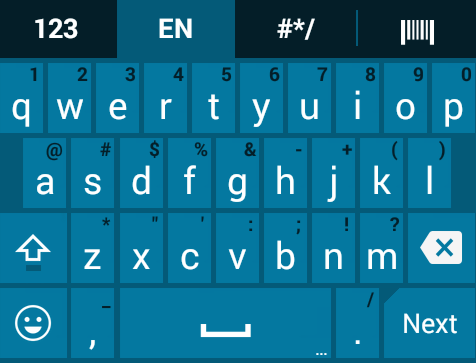

## Overview

Enterprise Keyboard Designer is a free GUI tool for Windows 7, 8 or 10 that can create custom keyboards, button bars and other application-specific input layouts **for use on Zebra Android devices with Zebra's [Enterprise Keyboard](/enterprise-keyboard) 3.2 (and higher) installed**. EKD is designed for making specialized **input panels invoked programmatically through Android intents** to enhance an application and enable efficient and accurate data entry when specific input situations arise. 

>**NOTE**: This tool is ***NOT*** intended for creating layouts to replace any general-purpose keyboard.

 

#### EKD is perfect for making...
* Numerical and/or symbolic input layouts
* Function key layouts
* Custom login screens
* Function/scan combo button bars
* Application-specific menus and pick-lists
* Custom button-bars of any kind
* Input panels of custom size or shape (i.e. narrow, vertical, horizontal, etc.)

#### EKD should NOT be used...
* To create a general-purpose keyboard replacement
* On devices that do not have Zebra Enterprise Keyboard 3.2 (or higher) installed

Enterprise Keyboard Designer employs a drag-and-drop interface for quickly creating any number of customized keyboard designs to address specific input requirements. It provides control over fonts, images, key codes, layout transparency and many other layout properties. An unlimited number of custom key layouts can be created, deployed to devices and called by customer apps as needed to match specific types of input. **Zebra Enterprise Keyboard (EKB) must be installed to make use of custom EKD layouts**. EKB is preinstalled on many Zebra devices and available as a side-load for others. 

***Click image to enlarge, ESC to exit*** *EKD features a simple drag-and-drop UI with device simulator to allow quick creation of purpose-built key layouts  configured for specific key actions that can be modified for different devices and screen resolutions*.

<b>Zebra's Enterprise Keyboard offers many enhancements over the stock Android Keyboard, including tabbed layouts with "swipe-to-switch" functionality, programmable keys and much more. And the EKB color scheme is designed to be visible in a variety of dark and light conditions. 
 
 

***Zebra Enterprise Keyboard***
 
 

***Stock Android keyboard***

 

### `IMPORTANT - PLEASE READ`
* **Enterprise Keyboard 3.2 (or higher) must be installed on the device** to display layouts made with EKD.
* **<u>Only one keyboard or custom key layout can be displayed on the device screen at a time</u>**. When a custom key layout is displayed, all other keyboards are hidden, including the standard Enterprise Keyboard alpha-numeric layout. 
* **To display an EKD layout, it must be called by an app using intents** (see [EKB APIs section](/enterprise-keyboard/latest/guide/apis)).
* **Apps on the device can access <u>only a single EKD project file</u>**, but multiple layouts can be saved in that single project file and called independently through intents.  
* EKD projects are saved and deployed as encrypted files that can be decrypted on the device only by **DataWedge, Enterprise Browser and Enterprise Keyboard** and applications running on a Zebra Android device. 
* Layout files can be imported into Enterprise Keyboard Designer and modified or supplemented with additional keys and/or layouts. 
* **Zebra recommends resetting to the default input device when quitting an app that uses EKB**. 

> **Note**: In this guide, the terms “button” and “key” are used interchangeably. 

-----

## General Usage Notes

* **The Enterprise Keyboard Designer <u>must be used only in full screen mode**</u>. Resizing the Enterprise Keyboard Designer application window after starting a Project can result in unpredictable behavior. 
* **The number of allowable characters in a button label field is dependent on width of the key**. To avoid automatic key resizing, button label should not exceed available width. 
* **The font size used for a button label is dependent on the size of the key being labeled**. To avoid automatic key resizing, select a point size appropriate for the size of the button.
* **The secondary text button label field is dependent on the width of the key**. To avoid automatic key resizing, the secondary button label should not exceed available width.
* **Zebra recommends that button image size not exceed 100 KB**. Larger images are supported but might impact performance of the layout. 
* When switching layouts, a thin white line is sometimes shown at the bottom or sides of the background key layout in the device simulator, but has no effect on the simulated display.
* The following reserved names must not be used in Model Input fields (PressAction, LongPressAction, etc.) or in KeyEvents: 
 * Scantrigger
 * deviceInfo
 * calculator
 * switch-abc
 * switch-123
 * switch-&#35;&#42;&#47;
 * switch-scan
 * customLayout
 * key-keyincaps

-----