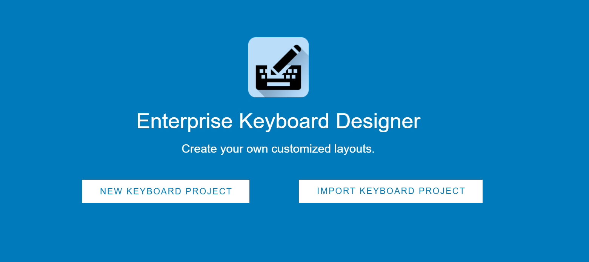
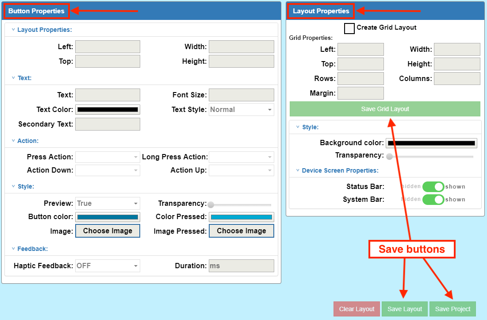

## Overview

Each Enterprise Keyboard Designer project contains one or more key layouts, which are defined as any grouping of keys. Layouts are created using “drag and drop” or the “grid layout” option and are saved as a single encrypted file. The project name becomes the file name, with “`.encrypted`” as the file extension (i.e. `myTC75Layout.encrypted`). 

-----

## I. Create Project

1. Launch the Enterprise Keyboard Designer utility: 
 
  
2. **Click the “NEW KEYBOARD PROJECT”** button:
 
  
2. **Enter a project name and click “Submit”** or press ENTER (recommended 15 character max): 
 
  
3. **Select a target device** from the drop-down and click the “Confirm” button:  
 
  

**When the project name is displayed in the upper-left corner of the main designer screen (as below), EKD is ready to create custom layouts**.

> **Note**: Once a project is created, its target device and other project-level settings cannot be changed.

## II. Create Layout(s)

Before beginning a layout, please make note of the following: 

##### Usage Notes

* All buttons should be placed within the bounds of the layout background. A layout must not be resized so that it hides any key or button.
* When switching from one layout to another during design, a thin white line is sometimes visible at the bottom or sides of the layout background in the device simulator. This has no effect on the simulated display.
* Button positions sometimes shift slightly when switching layouts. 

### Using Drag-and-drop

1. From the main designer screen, **click the menu button** in the upper-left corner:  
 
 _Click image to enlarge, ESC to exit_.
  
  
2. **Click the [+] icon to create a new layout** or select an existing layout to edit:  
 
 _Click image to enlarge, ESC to exit_.
  
  
3. **Select the device orientation** and click the “Confirm” button:
 
 _Click image to enlarge, ESC to exit_.
  
  
4. **Enter a layout name and press ENTER**.  **`NOTE:`** Layout names are case-sensitive, must be unique within a project and may contain only alpha-numeric characters.  **Zebra recommends layout names contain a <u>maximum of 15 characters</u>**.  The name of the current layout appears in the upper-left corner of the screen: 
 
 _Click image to enlarge, ESC to exit_.
  
  
 **Note: Buttons shown in the sample images are for illustration purposes. They DO NOT appear in layouts created with EKD**.
  
  
5. With the mouse pointer on the simulated device screen, **drag to create a layout background** in approximately the desired position on the simulator: 
 
 _Click image to enlarge, ESC to exit_.
  
  
6. **Drag the layout on the device screen** to reposition and resize as needed:  
 
 _Click image to enlarge, ESC to exit_.
  
  
7. **Drag the desired key(s) from the key panel** (at right) to the layout, dragging to resize and/or reposition as needed:
 
 _Click image to enlarge, ESC to exit_.
  
 **To move a key**, drag it within the key layout background or double-click it (to select) and move it using the arrow keys on the host computer keyboard. 
 **To resize a key**, drag the key's right and bottom edges within the key layout background or select it and edit the "Layout Properties" fields in the button Properties panel.
  
8. **Repeat Step 7** until the layout is configured as desired. 
9. **Click "Save Layout" button** to store settings. 
10. **Click "Save Project" to create a project file for deployment**.

-----

### Using Grid Layout

**The Grid layout option** automatically fills the layout with a matrix of equally spaced buttons based using the specified number of columns and rows. Once created, buttons can be relocated on the grid as desired. The new layout is placed along the left and bottom edges of the simulator and can be resized if needed. **`WARNING:`** Checking the Grid Layout box clears any existing layout. 

1. From the main designer screen, **click the menu button** in the upper-left corner:  
 
 _Click image to enlarge, ESC to exit_.
  
  
2. **Click the [+] icon to create a new layout** or select an existing layout to edit:  
 
 _Click image to enlarge, ESC to exit_.
  
  
3. **Select the device orientation** and click the “Confirm” button:
 
 _Click image to enlarge, ESC to exit_.
  
  
4. **Enter a layout name and press ENTER**.  **`NOTE:`** Layout names are case-sensitive, must be unique within a project and may contain only alpha-numeric characters.  **Zebra recommends layout names contain a <u>maximum of 15 characters</u>**.  The name of the current layout appears in the upper-left corner of the screen: 
 
 _**Note**: Buttons shown in the sample images are for illustration; they DO NOT appear in EKD layouts_.
  
  
5. **Check the Grid Layout checkbox** and set grid properties.  
 **`WARNING:`** Checking this box clears the current layout, if any.
 
 _Click image to enlarge, ESC to exit_.
  
  
  Grid Properties 
 <b>Left -</b> Layout position offset (in pixels) from the left edge of the screen. **Must be no greater than 90% of device horizontal resolution** (deviceWidth property) **(min = 0)**. 
 <b>Top -</b> Layout position offset (in pixels) from the top edge of the screen. **Must be no greater than 90% of device vertical resolution** (deviceHeight property) including softSystemBar, if any **(min = 0)**. 
 <b>Width -</b> Overall width (in pixels) of the layout **(min = 80; max = deviceWidth)**.  
 <b>Height -</b> Overall height (in pixels) of the layout **(min = 80; max = deviceHeight)**.  
 <b>Rows -</b> Number of rows in the layout, divided equally across the specified Height **(min = 1)**. 
 <b>Columns -</b> Number of columns in the layout, divided equally across the specified Width **(min = 1)**.  
 <b>Margin -</b> Distance (in pixels) between Grid boxes, each of which stores one button **(min = 2; max = 10)**.  
  **See [Zebra device specs](https://www.zebra.com/us/en/support-downloads/mobile-computers.html) for device resolution information**. 
  **See [Grid Usage Notes](#gridusagenotes) for important restrictions**. 
   
6. **Double-click within each grid box to select it**. Then set its button properties: 
 
 _Click image to enlarge, ESC to exit_.
  
  
7. **Click "Save Grid Layout" button** to store settings.  
 **To move a key**, drag it within the key layout background or double-click it (to select) and move it using the arrow keys on the host computer keyboard. 
 **To resize a key**, drag the key's right and bottom edges within the key layout background or select it and edit the "Layout Properties" fields in the Button Properties panel. 
8. **Repeat Step 6** until all buttons in the layout are configured as desired. 
9. **Click "Save Project" to create a project file for deployment**.
 

#### Grid Usage Notes
* Button and layout property settings are enabled only after saving the Grid layout.
* **Once a grid is created, its properties&ndash;including the number of columns and rows&ndash; cannot be changed**.
* **For the best layout performance, Zebra recommends the following**: 
 * **Horizontal layouts**: max rows = 5; max columns = 15
 * **Vertical layouts**: max rows = 15; max columns = 5
* Departure from recommended values might cause unpredictable button positioning or layout performance. 
* **Layout drag-and-drop and resize features are disabled** when using Grid Layout. 
* **Button-drag and -resize features are enabled** only after saving the Grid Layout.
* Style Properties can be configured when using drag-and-drop or grid layout functions. 
* When switching between layouts in a project, resizing or changing layout position might effect a Grid layout design.

-----

## III. Set Button Properties

### Button Position 

**Double-click a button to select it and adjust its properties. Use the Control key to select multiple keys simultaneously (see [Multi-selection Properties](#multiselectionproperties), below)**. Selected key(s) are indicated by a red border, and supported input fields for Button Properties are enabled. Changes to properties appear immediately on the selected button(s).

**The Layout Properties** section of the Button Properties panel refers to the left and top offsets and the width and height of the selected button. All measurements are in pixels. 

**If the layout was created using drag-and-drop**, at least one key must be selected from the key panel and dropped into the layout before beginning. Double-click a key to change its default property settings.

**If the layout was created using Grid Layout**, double-click on box(es) in the grid to configure button properties.

### Layout Properties (within Button Properties panel)

**Left -** Layout offset (in pixels) from the left edge of the screen. **Value must fall between the layout's left and right boundaries**.  

**Top -** Layout offset (in pixels) from the top edge of the screen. **Value must fall between the layout's upper and lower boundaries**.

**Width -** Specifies the width (in pixels) of the selected button. **Value must be less than the layout width (min = 50)**.

**Height -** Specifies the height (in pixels) of the selected button. **Value must be less than the layout height (min = 50)**.

**To move a key**, drag it within the key layout background or double-click it (to select) and move it using the arrow keys on the host computer keyboard.

**To resize a key**, drag the key's right and bottom edges within the key layout background or select it and edit the "Layout Properties" fields in the Button Properties panel.

-----

### Multi-selection Properties

**The following properties can be assigned when multiple buttons are selected**: 

* **Text**
* **Secondary Text**
* **Font Size** 
* **Text Color**
* **Text Style** 
* **Preview value** 
* **Transparency**
* **Button Color**
* **Color pressed** 
* **Haptic Feedback**
* **Duration**

**The following properties can <u>NOT</u> be assigned when selected multiple buttons are selected**: 

* **Button action properties**: 
 * Press Action
 * Long Press Action
 * Action Up
 * Action Down
 * Image 
 * Image pressed
* **Layout properties**:
 * Left
 * Top
 * Width
 * Height 

#### Usage Notes
* **Deleting a group of selected buttons** using the “Delete” key on the host computer’s keyboard is not supported.
* **The same button property minimum and maximum value rules apply** when individual or multiple buttons are selected. 

-----

### Text Properties

**Text -** Specifies the button label (displayed text) for the selected button. **<u>Must be blank if an image is selected</u> as button background**.

**Font Size -** Specifies the font size (in points) of the button label text for the selected button **(min = 10; max = 25)**. 

**TextColor -** Specifies the color of the button label text for the selected button. 

**TextStyle –** Specifies the style of the button label text for the selected button. Drop-down values: Normal, Bold, BoldItalic, Italic. 

**SecondaryText -** Specifies the secondary button label displayed in the upper-right corner of the selected button. Indicates the key’s output or Action when long-pressed. **<u>Must be blank if an image is selected</u> as button background**.

### Notes
* The text input field accepts all characters, including Chinese.
* All key-label text (including secondary text) is ignored if a key image is specified.
* The font size used for a button label is dependent on the size of the button being labeled. To avoid automatic button resizing, select a font size appropriate for the size of the button.
* The number and size of characters in the button text and secondary text fields should correspond to the key size to avoid automatic size changes.
* The position of secondary text can exceed button height if the button is too small. To overcome this issue, increase button height.

-----

### Action Properties

**PressAction -** Defines the action taken when the selected Button is pressed and released. Accepts a predefined command string only (see below). Overridden by ActionDown property. 

**LongPressAction –** Defines the action taken when the selected button is long-pressed. Accepts a predefined command string only (see below). Overridden by ActionUp property. 

**ActionDown -** Defines the action to be taken immediately upon button press (before it is released). Accepts a predefined command string only (see below). Overrides PressAction property. 

**ActionUp -** Defines the action to be taken when the selected key is released (after being pressed). Accepts a predefined command string only (see below). Overrides Long Press Action property.

-----

### Style Properties
**Preview -** Used to expose the value of a key when pressed. The key value is previewed only if the preview value is set to “true” (default for all keys).

**Transparency -** Used to specify the transparency for the selected key from 0 (opaque) to 100 (fully transparent). Changes appear immediately on the device simulator. 

**Button Color -** Used to specify the color of the selected key. Changes appear immediately on the device simulator.

**ColorPressed -** Used to specify the color of the selected key when the key is pressed. Changes appear on the device simulator when the key is pressed. 

**Image -** Used to specify an image to fill the space of the selected key. After selection, the image appears immediately on the device simulator. When the layout is saved, selected image(s) are embedded within the “.encrypted” file. Supports `.jpg` and `.png` image file formats. 

**ImagePressed -** Used to specify an image to be displayed when the button is pressed. After selection, the image appears on the device simulator when the button is pressed. When the layout is saved, selected image(s) are embedded within the “.encrypted” file. Supports `.jpg` and `.png` image file formats.

-----

### Feedback Properties
_Applies only to devices that support vibration_.  

**HapticFeedback -** Used to control whether the device vibrates when the selected button is clicked. Set the value to “true” to vibrate (**default = false**).

**Duration -** Used to specify the duration (in ms) of vibration when the “Haptic Feedback” property is set to true **(min = 40 (default); max = 1000)**. 

-----

## IV. Set Layout Properties

### Style Properties

**Background Color -** Specifies the color of the key layout. Changes appear in the layout immediately after clicking OK in the color picker. 

**Transparency -** Used to select of the transparency from 0 (opaque) to 100 (fully transparent) of the key layout Background using a slider. Changes appear immediately.

-----

### Simulator Properties

**Status Bar -** Used to show/hide the Status bar (which contains notifications and system icons) at the top of the device simulator screen. The layout “Top” coordinate changes based on this setting, which depends on status bar setting configured at the application level. **Must be hidden for full-screen applications**.

**System Bar -** Used to show/hide the System (navigation) bar at the bottom of the device simulator screen. The layout “Top” coordinate changes based on this setting, which depends on System bar setting configured at the application level. **Must be hidden for full-screen applications**. 

-----

### Predefined Command Strings

**Perform KeyEvent action -** Used to generate a particular KeyEvent or output as a character. Specify the key and value in key-value format from among the [standard Android KeyEvent values](https://developer.android.com/reference/android/view/KeyEvent). The KeyEvent for a key can be captured inside JavaScript onKeyDown events and output the value, if associated. It should be written in the format below. 

**Note**: Command strings are case sensitive. 

* To capture a lower-case "a" the action should be “key-29”
* To capture an upper-case "A" the action should be “keyincaps-29”
* To capture a Unicode character, the action should be “uc-003C”

**See [all Unicode characters](https://unicode-table.com/en/)** 
**See all [Android KeyEvent values](https://developer.android.com/reference/android/view/KeyEvent)**

<b>Switch layouts with taps or swipes</b> across the keypad:  

**Action to Switch Layout -** Use the key-value pairs below to switch to a specific layout when using Zebra Enterprise Keyboard.

-----

### Predefined commands

**switch-abc -** switches to the default “abc” (alphabetic) layout

**switch-123 -** switches to the “123” (numeric) layout

**switch-scan -** switches to the “scan” (scanning button) layout

**switch-&#35;&#42;&#47; -** switches to the “&#35;&#42;&#47;” (symbolic) layout

**switch- [LayoutName] -** switches to the named custom layout

-----

### Layout Usage Notes 	
* The layout names shown above (“abc," “123," “scan” and “&#35;&#42;&#47;”) are reserved for default Enterprise Keyboard layouts and cannot be used as custom layout names. 
* **Switching layouts is supported on Enterprise Keyboard only**.
* The following reserved names must not be used in Model Input fields (PressAction, LongPressAction, etc.) or in KeyEvents: 
 * Scantrigger
 * deviceInfo
 * calculator
 * switch-abc
 * switch-123
 * switch-&#35;&#42;&#47;
 * switch-scan
 * customLayout
 * key-keyincaps
* While the key action can be configured to execute a command, Enterprise Keyboard currently supports only the “scantrigger” action command, which scans a barcode using DataWedge.
* The Enterprise Browser ButtonBar API accepts several predefined commands as button actions. Refer to the Enterprise Browser TechDocs for more information. 

-----

### Save Layout

To save the current layout data, click the “Save Layout” button in the lower-right corner of the main designer screen or the “Save Grid Layout” button in the Layout Properties panel.

### Save Project

To save the current key layout project, click the “Save Project” button. A dialog appears indicating the location of the saved “`.encrypted`” file. Take note of the save directory for later reference. 

### Delete a Key

1. In the layout that contains the key to be deleted, **double-click on the the key to be deleted**; the selected key is surrounded by a dotted red line. 
3. **Press the “Delete” key on the host computer’s keyboard**. A confirmation dialog appears. 
4. **Click “Yes”** on the confirmation dialog to delete. 

### Clear a Layout 
1. In the layout to be cleared, **Click the red “Clear Layout” button**. 
3. **Click “Yes”** to confirm the deletion of all layout elements. 

> Data for custom layout(s) and key-value assignment(s) is stored in the key layout definition file, a single encrypted file on the development host computer. To deploy, simply push this file to the desired mobile device(s) and activate custom layouts through application intents. Layouts are available immediately upon deployment.  **Deployment instructions follow below**. 

-----

## V. Deploy Layout(s)

The data for custom key layout(s) is stored in the custom key-layout definition file, an encrypted file generated by the Enterprise Keyboard Designer. This file contains information about key locations, key-value assignments, etc. for each key layout created. This single file can contain as many as 20 layout groups, each of which defines a layout. **It's important to note that an app can access only a single layout file on the device, so all layouts required for a device MUST be stored in that single file**. 

#### To deploy a key layout definition file:

1. **Locate the key layout definition file** (i.e. `LayoutProjectName.encrypted`) on the development host computer.  
 By default, the files are saved in the download directory of the current user:  
 `c:\Users\userName\Downloads\LayoutProjectName.encrypted` 
 **NOTE**: When clicking EKD's "Save Project" button, the default folder is shown as in the image below: 
 
 _Click image to enlarge, ESC to exit_.
  
2. In the "Language and input" Settings panel on the device, **set Enterprise Keyboard as a default keyboard**.
3. **Push definition file to the device** folder: 
 `/enterprise/device/settings/ekb/config/`

**Custom key layouts are available on the device immediately upon file deployment**. 

## Import an EKD Project
Layout projects can be saved and modified later for use on different devices, adapted for different applications or screen sizes and appended with additional layouts. 

**To import a project**: 

1. On the Enterprise Keyboard Designer’s launch screen, **click the “IMPORT KEYBOARD PROJECT” button**. 
2. **Navigate to and double-click the project** (“`.encrypted`” file) to import.
3. **Select the target device** using the drop-down menu and click the “Confirm” button.
4. **Click the EKD menu button** to view a list of layouts available for editing. 
5. **Select the layout to be edited and click the edit icon**. The layout is displayed in the device simulator and its name is displayed the top-left corner. 
6. **Edit the layout as desired**.
7. **To add a new layout to the project**, click the [+] icon on the EKD menu and follow steps in the [Crete Layout(s)](#iicreatelayouts) section. 
8. **Repeat Step 7** until the layout is configured as desired. 
9. **Click "Save Layout" button** to store settings. 
10. **Click "Save Project" to create a project file for deployment**.

-----

## General Usage Notes

* **The Enterprise Keyboard Designer <u>must be used only in full screen mode**</u>. Resizing the Enterprise Keyboard Designer application window after starting a Project can result in unpredictable behavior. 
* **To display EKD layouts on a device, Enterprise Keyboard must be installed on that device** and set as the default input source.
* **The number of allowable characters in a button label field is dependent on width of the key**. To avoid automatic key resizing, button label should not exceed available width. 
* **The font size used for a button label is dependent on the size of the key being labeled**. To avoid automatic key resizing, select a point size appropriate for the size of the button.
* **The secondary text button label field is dependent on the width of the key**. To avoid automatic key resizing, the secondary button label should not exceed available width.
* **Zebra recommends that button image size not exceed 100 KB**. Larger images are supported but might impact performance of the layout. 
* When switching layouts, a thin white line is sometimes shown at the bottom or sides of the background key layout in the device simulator, but has no effect on the simulated display.
* The following reserved names must not be used in Model Input fields (PressAction, LongPressAction, etc.) or in KeyEvents: 
 * Scantrigger
 * deviceInfo
 * calculator
 * switch-abc
 * switch-123
 * switch-&#35;&#42;&#47;
 * switch-scan
 * customLayout
 * key-keyincaps

-----
