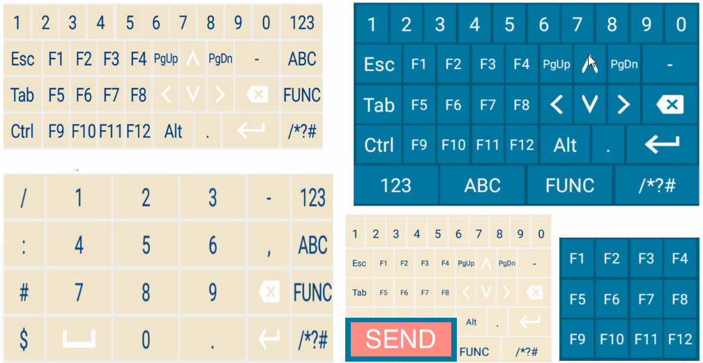
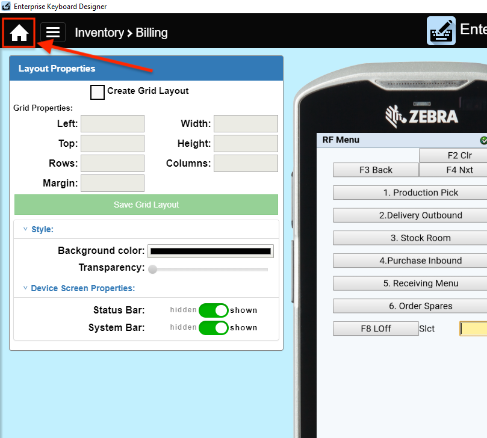

#### [What's new in v1.4](#prerequisites)

## Overview

Enterprise Keyboard Designer (EKD) is a free GUI tool for Windows that can be used to create customized key layouts to enhance an application and enable efficient and accurate data entry. **Layouts created with EKD work on Zebra Android devices that use Zebra's [Enterprise Keyboard (EKB)](/enterprise-keyboard) 3.2 (and higher)**, and can be displayed **programmatically using Android intents or through DataWedge 7.4.44 (and higher)** when specific input situations arise. Learn more [about Enterprise Keyboard](/enterprise-keyboard) and [configuring DataWedge for EKB](/datawedge/latest/guide/utilities/ekb/).

EKD employs a drag-and-drop interface with control over fonts, images, key codes, layout transparency and many other layout properties. As many as 20 custom key layouts can be created, and are stored in a "layout definition file," which is deployed to devices and called by apps as needed to match specific types of input. **Zebra Enterprise Keyboard (EKB) must be installed and set as the default input method to make use of custom EKD layouts**. EKB is preinstalled on many Zebra devices and available as a user app for others. See [supported Zebra devices](/enterprise-keyboard/3-2/download/) for more information. 

_Sample layouts made with Enterprise Keyboard Designer. Click image to enlarge, ESC to exit_.
 

-----

#### USE EKD FOR:
* Numerical and/or symbolic input layouts 
* Function-key layouts
* Layouts that combine function keys with buttons for scanning or other purposes
* Key and button layouts with custom colors, images and levels of transparency
* Layouts of custom size or shape (i.e. narrow, vertical, horizontal, etc.)
* Customized responses that pop up in a list when a button is pressed 
* Custom key layouts for Zebra Enterprise Browser (EB 2.5 or later only)

#### DO NOT USE EKD:
* To create a general-purpose device keyboard replacement
* On devices that do not have Zebra Enterprise Keyboard 3.2 (or higher) installed and set as the default

-----

### Prerequisites

* Computer running Windows 7, 8 or 10
* Enterprise Keyboard Designer 1.2 (or higher) installed [(how to download)](../../download)
* One or more [supported Zebra devices](https://www.zebra.com/us/en/support-downloads/software/productivity-apps/enterprise-keyboard.html) running Android 7.x Nougat or higher
* To display layouts on a device, it must have Zebra Enterprise Keyboard 3.2 (or higher) installed and set as the default input source. Learn more [about Enterprise Keyboard](/enterprise-keyboard).

-----

## What's New in v1.4

* A new **"<u>[Canned text](../usage/#cannedtext)</u>"** feature allows a list of predefined text messages to be assigned to a key in EKD and displayed in a drop-down list on devices running Enterprise Keyboard when the key is pressed. This can help simplify, quicken and standardize responses to common questions or situations. **Requires EKB 3.4 or later**. 

* **<u>[Set Default Layout](../usage/#iicreatelayouts)</u>** now allows selection of a custom keyboard layout to be used as the default layout in the device, to appear whenever any input field receives focus. **Requires EKB 3.4 or higher**. 

* **<u>A new Home button</u>** simplifies project start-up and importing of saved projects:  

***Click image to enlarge, ESC to exit***. 
 

* **EKD layouts can now be used with [Enterprise Browser 2.5](/enterprise-browser)** or later. 

### New Tutorials

* [Dynamically Switching Keyboards](https://developer.zebra.com/blog/dynamically-switching-keyboards-zebra-android-devices) | Implementation details and sample code by Zebra engineering
* [Exploring the Enterprise Keyboard API](https://developer.zebra.com/blog/exploring-enterprise-keyboard-api) | Working with EKD-made Layouts by Zebra engineering

-----

## Usage Snapshot

EKD features a simple drag-and-drop UI to allow quick creation of purpose-built key layouts configured for specific key actions that can be modified for different devices and screen resolutions. A device simulator helps ensure that what is seen in the tool is similar to the layouts being deployed.  

***Click image to enlarge, ESC to exit***. 
 

### `IMPORTANT - PLEASE READ`
* <u>**Enterprise Keyboard Designer must be used only in full screen mode**</u>. Resizing the EKD application window after starting a project can result in unpredictable behavior.
* **Enterprise Keyboard 3.2 (or higher) must be installed and set as the default input method on the device** to display layouts made with EKD.  Learn more [about Enterprise Keyboard](/enterprise-keyboard). 
* **<u>Only one keyboard or custom key layout can be displayed on the device screen at a time</u>**. When a custom key layout is displayed, all other keyboards are hidden, including the standard Enterprise Keyboard alpha-numeric layout. 
* **To display an EKD layout, it must be called by an app using intents** (see [EKB APIs section](/enterprise-keyboard/latest/guide/apis)).
* **Apps on the device can access <u>only a single EKD project file</u>**, but as many as 20 layouts can be saved in that single project file and called independently through intents.  
* EKD projects are saved and deployed as encrypted files that can be decrypted on the device only by **Enterprise Keyboard and Enterprise Browser**. 
* Layout files can be imported into EKD and modified or supplemented with additional keys and/or layouts. 
* **When using DataWedge to switch layouts**, the EKB fixed layout is sometimes shown briefly or until the focus changes again. 
* **When custom layouts are displayed, <u>all EKB settings, preferences and functions are suspended</u>**.
* **The terms “button” and “key” are used interchangeably** in this guide.

> **`NOTE:`** This tool is ***NOT*** intended for creating layouts to replace any general-purpose keyboard.

-----

