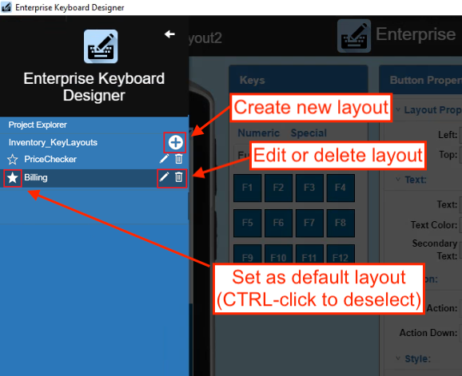
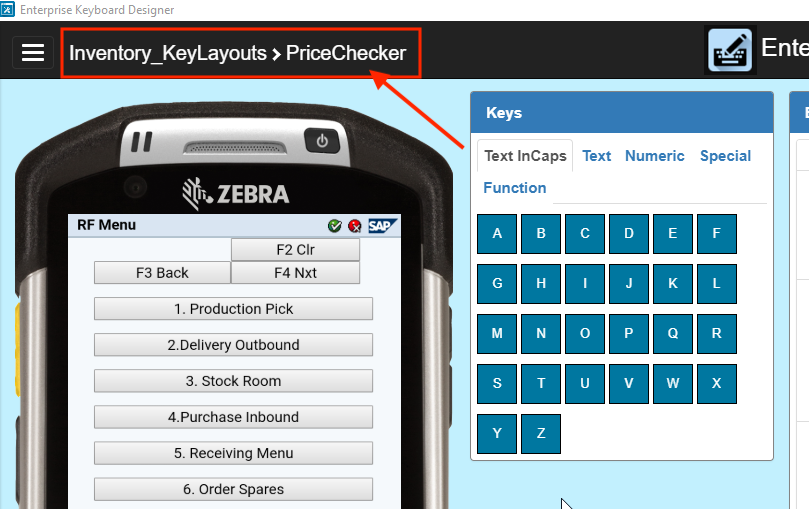
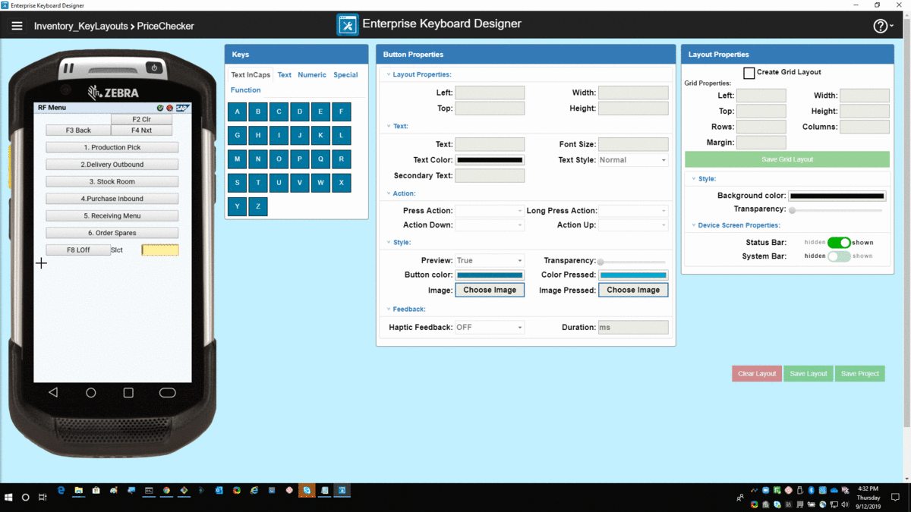
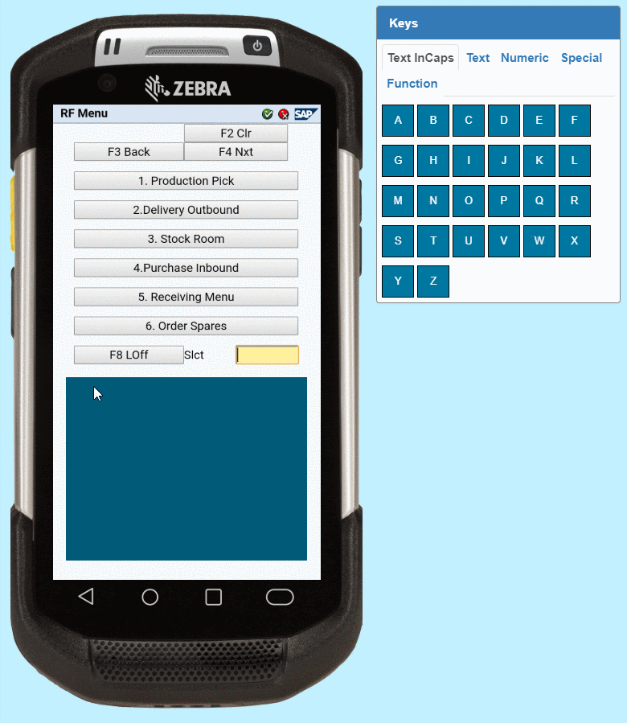
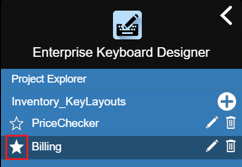
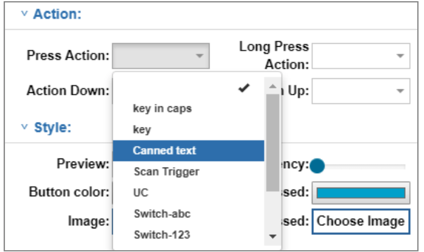
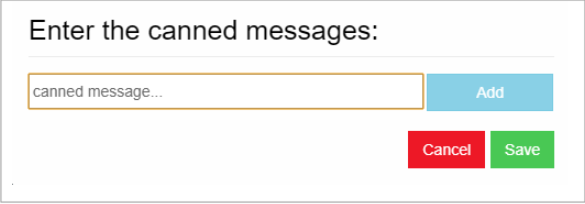
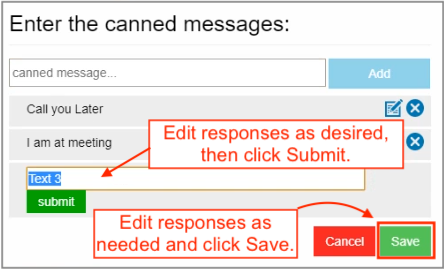
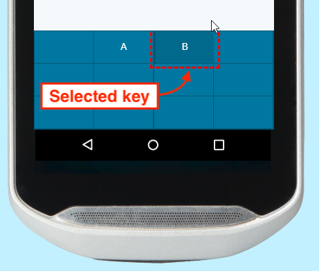

## Overview

Each Enterprise Keyboard Designer project contains one or more key layouts, which are defined as any grouping of keys. Layouts are created using “drag and drop” or the “grid layout” option and are saved as a single encrypted file. The project name becomes the file name, with “`.encrypted`” as the file extension (i.e. `myTC75Layout.encrypted`). 

### New in EKD 1.4

##### Enterprise Keyboard Designer 1.4 (and later) includes: 

* **The ability to create predefined responses** that appear in a list for easy selection, which further improves the speed and accuracy of responses when using Enterprise Keyboard (**requires EKB 3.4 or later**). [Learn more](#predefinedresponses). 

* **The ability to set a default custom layout** to be displayed whenever an input field receives focus. [Learn more](#iicreatelayouts).

> **NOTE: Both of these new features require Enterprise Keyboard 3.4 or later on the device**. 

-----

### General Usage Notes

* **The Enterprise Keyboard Designer <u>must be used only in full screen mode**</u>. Resizing the Enterprise Keyboard Designer application window after starting a Project can result in unpredictable behavior. 
* **To display EKD layouts on a device, Enterprise Keyboard must be installed on that device** and set as the default input source.
* The "Switch-Scan" Press Action (which is supposed to invoke the EKB "scan" layout) sometimes brings up a different layout. 
* **The order of layout names shown in the EKD layout menu can vary** from the list returned by the `GET available keyboard layouts` intent API. See [Enterprise Keyboard APIs](/enterprise-keyboard/latest/guide/apis) for details.
* Deployed layouts sometimes look slightly different than their appearance in the device simulator.    
* **Do NOT deploy empty key layouts**; they can cause Enterprise Keyboard to behave unpredictably.
* **When using DataWedge to switch layouts**, the EKB fixed layout is sometimes shown briefly or until the focus changes again. 
* **When custom layouts are displayed, <u>all EKB settings, preferences and functions are suspended</u>**.

> **Note**: In this guide, the terms “button” and “key” are used interchangeably. 

-----

## I. Create Project

1. Launch the Enterprise Keyboard Designer utility: 
 
  
2. **Click the “NEW KEYBOARD PROJECT”** button:
 
  
2. **Enter a project name and click “Submit”** or press ENTER (recommended 15 character max): 
 
  
3. **Select a target device** from the drop-down and click the “Confirm” button:  
 
  

**When the project name is displayed in the upper-left corner of the main designer screen (as below), EKD is ready to create custom layouts**.

> **Note**: Once a project is created, its target device and other project-level settings cannot be changed.

## II. Create Layout(s)

Before beginning a layout, please make note of the following: 

##### Usage Notes

* All buttons should be placed within the bounds of the layout background. A layout must not be resized so that it hides any key or button.
* When switching from one layout to another during design, a thin white line is sometimes visible at the bottom or sides of the layout background in the device simulator. This has no effect on the simulated display.
* Button positions sometimes shift slightly when switching layouts during design. 

### Using Drag-and-drop

1. From the main designer screen, **click the menu button** in the upper-left corner:  
 
 _Click image to enlarge, ESC to exit_.
  
  
2. **Click the [+] icon to create a new layout**:
 
 _Click image to enlarge, ESC to exit_.
  
  
3. **Select the device orientation** and click the “Confirm” button:
  
 **`NOTE:`** Orientation option **NOT** available on CC600, CC6000, MC33, MC93, PS20, TC8x, VC80x or VC83x devices.
 
 _Click image to enlarge, ESC to exit_.
  
  
4. **Enter a layout name and press ENTER**.  **`NOTE:`** Layout names are case-sensitive, must be unique within a project and may contain only alpha-numeric characters.  **Zebra recommends layout names contain a <u>maximum of 15 characters</u>**.  The name of the current layout appears in the upper-left corner of the screen: 
 
 _Click image to enlarge, ESC to exit_.
  
  
 **Note: Buttons shown in the sample images are for illustration purposes. They DO NOT appear in layouts created with EKD**.
  
  
5. With the mouse pointer on the simulated device screen, **drag to create a layout background** in approximately the desired position on the simulator: 
 
 _Click image to enlarge, ESC to exit_.
  
  
6. **Drag the layout on the device screen** to reposition and resize as needed:  
 
 _Click image to enlarge, ESC to exit_.
  
  
7. **Drag the desired key(s) from the key panel** (at right) to the layout, dragging to resize and/or reposition as needed:
 
 _Click image to enlarge, ESC to exit_.
  
8. **Repeat Step 7** until the layout is configured as desired. 
9. **Click "Save Layout" button** to store the project settings. 
 **NOTE**: To set layout as the default (to appear whenever EKB is used), click on the layout's star icon:
 
10. **Click "Save Project" to create a project file for deployment**.

> **NOTE: Setting the default layout from EKD requires Enterprise Keyboard 3.4 or later on the device**. 

-----

### Using Grid Layout

**The Grid layout option** automatically fills the layout with a matrix of equally spaced buttons based on the specified number of columns and rows. The new layout is placed along the left and bottom edges of the simulator and can be resized (and buttons relocated) as needed. **`WARNING:`** Checking the Grid Layout box clears any existing layout. 

1. From the main designer screen, **click the menu button** in the upper-left corner:  
 
 _Click image to enlarge, ESC to exit_.
  
  
2. **Click the [+] icon to create a new layout**:
 
 _Click image to enlarge, ESC to exit_.
  
  
3. **Select the device orientation** and click the “Confirm” button:
  
 **`NOTE:`** Orientation option **NOT** available on CC600, CC6000, MC33, MC93, PS20, TC8x, VC80x or VC83x devices.
 
 _Click image to enlarge, ESC to exit_.
  
  
4. **Enter a layout name and press ENTER**.  **`NOTE:`** Layout names are case-sensitive, must be unique within a project and may contain only alpha-numeric characters.  **Zebra recommends layout names contain a <u>maximum of 15 characters</u>**.  The name of the current layout appears in the upper-left corner of the screen: 
 
 _**Note**: Buttons shown in the sample images are for illustration; they DO NOT appear in EKD layouts_.
  
  
5. **Check the Grid Layout checkbox** and set grid properties.  
 **`WARNING:`** Checking this box clears the current layout, if any.
 
 _Click image to enlarge, ESC to exit_.
  
  
  Grid Properties 
 <ul>
 <li><b>Left -</b> Layout position offset (in pixels) from the left edge of the screen. **Min = 0; max = 90% of device horizontal resolution (deviceWidth property)**.</li>
 <li><b>Top -</b> Layout position offset (in pixels) from the top edge of the screen. **Min = 0; max = 90% of device vertical resolution (deviceHeight property) with softSystemBar, if any**.</li>
 <li><b>Width -</b> Overall width (in pixels) of the layout **(min = 80; max = deviceWidth)**. </li>
 <li><b>Height -</b> Overall height (in pixels) of the layout **(min = 80; max = deviceHeight)**. </li>
 <li><b>Rows -</b> Number of rows in the layout, divided equally across the specified Height **(min = 1)**.</li>
 <li><b>Columns -</b> Number of columns in the layout, divided equally across the specified Width **(min = 1)**.</li> 
 <li><b>Margin -</b> Distance (in pixels) between Grid boxes, each of which stores one button **(min = 2; max = 10)**. </li></ul>
  **See [Zebra device specs](https://www.zebra.com/us/en/support-downloads/mobile-computers.html) for device resolution information**. 
  **See [Grid Usage Notes](#gridusagenotes) for important restrictions**. 
   
6. **Double-click within each grid box to select it**. Then set its button properties: 
 
 _Click image to enlarge, ESC to exit_.
  
  
7. **Click "Save Grid Layout" button** to store settings.  **`NOTE:` Once a grid is saved, its properties cannot be changed**.
8. **Repeat Step 6** until all buttons in the layout are configured as desired. 
9. **Click "Save Layout" button** to store the project settings. 
 **NOTE**: To set layout as the default (to appear whenever EKB is used), click on the layout's star icon:
 
10. **Click "Save Project" to create a project file for deployment**.
 

> **NOTE: Setting the default layout from EKD requires Enterprise Keyboard 3.4 or later on the device**. 

#### Grid Usage Notes
* Button and layout property settings are enabled only after saving the Grid layout.
* **Once a grid is created, its properties&ndash;including the number of columns and rows&ndash; cannot be changed**.
* **For the best layout performance, Zebra recommends the following**: 
 * **Horizontal layouts**: max rows = 5; max columns = 15
 * **Vertical layouts**: max rows = 15; max columns = 5
* Departure from recommended values might cause unpredictable button positioning or layout performance. 
* **Layout drag-and-drop and resize features are disabled** when using Grid Layout. 
* **Button-drag and -resize features are enabled** only after saving the Grid Layout.
* Style Properties can be configured when using drag-and-drop or grid layout functions. 
* When switching between layouts in a project, resizing or changing layout position might effect a Grid layout design.

-----

## III. Set Button Properties

### Button Positioning
Buttons can be positioned and resized within a layout by dragging manually, by using the keys on the host computer's keyboard, or by setting their coordinates in the Layout Properties panel. 

> **Note**: In this guide, the terms “button” and “key” are used interchangeably. 

#### Manual Positioning

**Double-click a button to select it and adjust its position and properties**. Selected key(s) are indicated by a red border, and supported input fields for Button Properties are enabled. Changes to most properties appear immediately on the selected button(s).

**To move a key**, drag it within the key layout background or double-click it (to select) and move it using the arrow keys on the host computer keyboard. **To resize a key**, drag the key's right and bottom edges within the key layout background or select it and edit the "Layout Properties" fields in the Button Properties panel.

**The Layout Properties** section of the Button Properties panel refers to the left and top offsets and the width and height of the selected button. All measurements are in pixels. **If the layout was created using drag-and-drop**, at least one key must be selected from the key panel and dropped into the layout before these properties can be set. Double-click a key to change its default property settings. **If the layout was created using Grid Layout**, double-click on box(es) in the grid to configure button properties.

-----

### (Button) Layout Properties

* **Left -** Layout offset (in pixels) from the left edge of the screen. **Value must fall between the layout's left and right boundaries**.  
* **Top -** Layout offset (in pixels) from the top edge of the screen. **Value must fall between the layout's upper and lower boundaries**.
* **Width -** Specifies the width (in pixels) of the selected button. **Value must be less than the layout width (min = 50)**.
* **Height -** Specifies the height (in pixels) of the selected button. **Value must be less than the layout height (min = 50)**.

> `IMPORTANT:` **The button layout properties above DO NOT support multi-key selection**; behavior is unpredictable.  

-----

### Text Properties

* **Text -** Specifies the button label (displayed text) for the selected button **(max = 5)**; **<u>must be blank if an image is selected</u> as button background**.
* **Font Size -** Specifies the font size (in points) of the button label text for the selected button **(min = 10; max = 25)**. 
* **TextColor -** Specifies the color of the button label text for the selected button. 
* **TextStyle –** Specifies the style of the button label text for the selected button. Drop-down values: Normal, Bold, BoldItalic, Italic. 
* **SecondaryText -** Specifies the secondary button label displayed in the upper-right corner of the selected button. Indicates the key’s output or Action when long-pressed  **(max = 2); <u>must be blank if an image is selected</u> as button background**.

#### Usage Notes

* **Button property minimum and maximum value rules** are the same for individual and multi-key selections. 
* **Deleting a group of multi-selected keys** using the “Delete” key on the host computer’s keyboard is not supported. Keys must be deleted individually. 
* The text input field accepts all characters, including Chinese.
* All key-label text (including secondary text) is ignored if a key image is specified.
* The font size used for a button label is dependent on the size of the button being labeled. To avoid automatic button resizing, select a font size appropriate for the size of the button.
* The number and size of characters in the button text and secondary text fields should correspond to the key size to avoid automatic size changes.
* The position of secondary text can exceed button height (and be positioned out of view) if button is too small. To avoid this issue, increase button height.

-----

### Action Properties

* **PressAction -** Defines the action taken when the selected Button is pressed and released. Accepts only the predefined command strings in drop-down menu (see below).  
**Overridden by ActionDown property. Default = no action**.
* **LongPressAction –** Defines the action taken when the selected button is pressed and held. Accepts only the predefined command strings in drop-down menu (see below).  
**Overridden by ActionUp property. Default = no action**.
* **ActionDown -** Defines the action to be taken immediately upon button press (before it is released). Accepts only the predefined command strings in the drop-down menu (see below).  
**Overrides PressAction property. Default = no action**.
* **ActionUp -** Defines the action to be taken when the selected key is released (after being pressed). Accepts only the predefined command strings in the drop-down (see below).  
**Overrides LongPressAction property. Default = no action**.

`IMPORTANT:` **The Action properties above DO NOT support multi-key selection**.

#### Button Actions
Button Actions supported by EKD include predefined command strings for generating keyEvent output and for switching the key layout currently displayed on the device. 

**Perform keyEvent Action -** Used to generate a particular keyEvent or output a character. Enter the key and value in key-value format from among the standard [Android keyEvent values](https://developer.android.com/reference/android/view/keyEvent). The keyEvent for a key can be captured inside JavaScript onKeyDown events and outputs the value, if associated. The drop-down action commands are selected using the steps below. 

-----

#### To assign a keyEvent value: 

1. In the Action section of the Button Properties panel, **select the desired Action from the drop-down**: 

 _Click image to enlarge, ESC to exit_.
 
2. For keycodes (i.e. key in caps, Unicode, etc), a box pops up <u>similar</u> to the one below.  **Enter a single value corresponding to the type of Action selected**:  

 _Click image to enlarge, ESC to exit_.
 
3. **Repeat Steps 1 and 2** until each button contains the desired Action.  
4. **Click "Save Layout" button** to store the project settings. 
5. **Click "Save Project" to create a project file for deployment**.
* **Predefined command strings -** Enter an Android keyEvent value in the pop-up:
 * **key in caps -** Outputs an upper-case letter corresponding to the keyValue entered.
 * **key -** Outputs the lower-case character corresponding to the keyValue entered.
 * **"Canned text" -** displays a list of [predefined responses](#predefinedresponses) (see below).
 * **UC -** Outputs the Unicode character corresponding to the Unicode value entered.
* **Actions to switch the layout -** Use the key-value pairs below to switch to a specific layout. 
 * **Switch-abc -** Switches to the Enterprise Keyboard standard alpha-numeric layout.
 * **Switch-123 -** Switches to the fixed numeric layout.
 * **Switch-Scan -** Switches to the “scanning button" layout.
 * **Switch-&#35;&#42;&#47; -** Switches to the “&#35;&#42;&#47;” (symbolic) layout.
 * **Switch-CustomLayout -** Switches to a custom layout (enter a valid layout name in the pop-up).
 * **Scan Trigger -** Scans a barcode using DataWedge, which must be configured in advance of this command. See [DataWedge documentation](/datawedge/latest/guide/utilities/ekb/) for more information. **Supported only with Press Action**.

**See [all Unicode characters](https://unicode-table.com/en/)** 
**See all [Android keyEvent values](https://developer.android.com/reference/android/view/KeyEvent)**

> **Note: Entries are case sensitive**. 

#### Usage Notes 	

* **Switching layouts is supported on Enterprise Keyboard only**.
* **Do NOT use the terms shown below as custom names**; they are reserved for default Enterprise Keyboard layouts: 
 * abc
 * 123
 * scan
 * &#35;&#42;&#47;
 * Scantrigger
 * switch-abc
 * switch-123
 * switch-&#35;&#42;&#47;
 * switch-scan
 * customLayout
 * key-[any Content]

-----

### Predefined Responses

A list of predefined responses can be assigned to any key and appears in a pop-up list when that key is pressed. This can help improve the speed and accuracy of responses when using Enterprise Keyboard. Tapping on a predefined response enters the text into the focused field as if it had been typed in manually. 

`IMPORTANT:` **Use of the plus sign (+) in predefined responses can result in unpredictable behavior**. 

**Example Responses**:
* "I'm in a meeting...please call back later"
* "Unable to talk now...please send a text"
* "Application busy...try again later"
* "Please refer to patient record"
* "Item out of stock"

> **NOTE: This feature requires Enterprise Keyboard 3.4 or later on the device**. 

#### To create predefined response(s): 

1. **Create (or select) a button** in the current layout.  
2. **In the Action section** of the Button Properties panel, **select "Canned text" from the drop-down**: 

 _Click image to enlarge, ESC to exit_.
 
3. **Enter a desired response** in the pop-up:
 
 `IMPORTANT:` **Use of the plus sign (+) in predefined responses can result in unpredictable behavior**.  
4. Click "Add" to store the response and add another.
5. Repeat Steps 3 and 4 until all responses are stored.
6. Click "Save" to store all responses and exit pop-up.
7. **Click "Save Layout" button** to store the new project settings. 
 **NOTE**: To set layout as the default (to appear whenever EKB is used), click on the layout's star icon:
 
8. **Click "Save Project" to create a project file for deployment**.
 

##### Predefined responses are stored and deployed with the layout.

> **NOTE: Setting the default layout from EKD requires Enterprise Keyboard 3.4 or later on the device**. 

-----

#### To edit or delete Predefined Response(s): 

1. **Open the key layout project that contains the response list(s)** to be modified.
2. In the layout, **select the button that contains the response list(s)** to be edited.  
3. **In the Action section** of the Button Properties panel, **select "Canned text" from the drop-down**:
 
 _Click image to enlarge, ESC to exit_.
 
 A pop-up appears with the list of responses currently stored with that button:
 
 _Click image to enlarge, ESC to exit_.
4. **To Delete response(s)**, click the "X" for the response(s). **<u>Then skip to Step 8</u>**. 
 `WARNING:` Responses are deleted immediately. This action cannot be undone. 
5. **To Edit, click the edit button** for the response to be edited: 
 
 _Click image to enlarge, ESC to exit_.
6. **Edit the response** as desired and **click Submit**. 
 `IMPORTANT:` **Use of the plus sign (+) in predefined responses can result in unpredictable behavior**. 
7. **Repeat Steps 5 and 6** until all predefined responses appear as desired.  
8. **Click Save to store changes and exit the pop-up**. 
9. **Click "Save Layout" button** to store the new project settings. 
 **NOTE**: To set layout as the default (to appear whenever EKB is used), click on the layout's star icon:
 
10. **Click "Save Project" to create a project file for deployment**.
 

##### Predefined responses are stored and deployed with the layout.

> **NOTE: Setting the default layout from EKD requires Enterprise Keyboard 3.4 or later on the device**. 

-----

### Style Properties

Changes to these settings appear immediately in the device simulator unless otherwise noted. 

* **Preview -** When True, displays the value of a key when pressed **(default = True)**.
* **Transparency -** Used to select the transparency for the selected key from 0 (opaque) to 100 (fully transparent) **(default = opaque)**. 
* **Button Color -** Used to select the color of the selected key using the standard Windows color picker **(default = blue)**. 
* **ColorPressed -** Used to select the color of the selected key when the key is pressed using the standard Windows color picker.  
* **Image -** Used to select an image to fill the space of the selected key. When the layout is saved, selected image(s) are embedded within the “.encrypted” file. **Supports** `.jpg` **and** `.png` **image files. Zebra recommends using files of 100 KB or less for optimal layout performance. File name must begin with an alpha-numeric character**. 
* **ImagePressed -** Used to select an image to be displayed when the button is pressed. After selection, the image appears on the device simulator when the button is pressed. When the layout is saved, selected image(s) are embedded within the “.encrypted” file. **Supports** `.jpg` **and** `.png` **image files. Zebra recommends using files of 100 KB or less for optimal layout performance. File name must begin with an alpha-numeric character**. 

#### Usage Notes
* **Button property minimum and maximum value rules** are the same for individual and multi-key selections. 
* **Deleting a group of multi-selected keys** using the “Delete” key on the host computer’s keyboard is not supported. Keys must be deleted individually. 

-----

### Feedback Properties
_Applies only to devices that support vibration_.  

* **HapticFeedback -** Used to control whether the device vibrates when the selected button is clicked. Set the value to “true” to vibrate (**default = false**).
* **Duration -** Used to enter the duration (in ms) of vibration when the “Haptic Feedback” property is set to true **(min = 40 (default); max = 1000)**. 

**NOTE:** Button property minimum and maximum value rules are the same for individual and multi-key selections. 

-----

### Multi-key Selection
Use the CTRL key on the host computer's keyboard to select multiple keys simultaneously. Selected key(s) are indicated by a red border, and supported input fields for Button Properties are enabled. Changes to properties appear immediately on the selected button(s). Properties are described in their relevant sections above. 

_Click image to enlarge, ESC to exit_.
 

**These properties can be assigned to multiple buttons simultaneously**: 

* **Text**
* **Secondary Text**
* **Font Size** 
* **Text Color**
* **Text Style** 
* **Preview value** 
* **Transparency**
* **Button Color**
* **Color pressed** 
* **Haptic Feedback**
* **Duration**

**These properties CANNOT be assigned <u>to multi-selected keys</u>**: 

* **Button action properties**: 
 * **Press Action**
 * **Long Press Action**
 * **Action Up**
 * **Action Down**
 * **Image**
 * **Image pressed**
* **Layout properties**:
 * **Left**
 * **Top**
 * **Width**
 * **Height** 

#### Usage Notes
* **Button property minimum and maximum value rules** are the same for individual and multi-key selections. 
* **Deleting a group of multi-selected keys** using the “Delete” key on the host computer’s keyboard is not supported. Keys must be deleted individually.  
* **Button layout (i.e. width, height, etc.) and action properties (Press, LongPress, etc.) <u>MUST NOT be changed using multi-key selection</u>**; behavior is unpredictable.

-----

## IV. Set Layout Properties

### Style Properties

* **Background Color -** Specifies the color of the key layout. Changes appear in the layout immediately after clicking OK in the color picker. 
* **Transparency -** Used to select of the transparency from 0 (opaque) to 100 (fully transparent) of the key layout Background using a slider. Changes appear immediately.

-----

### Simulator Properties

* **Status Bar -** Used to show/hide the Status bar (which contains notifications and system icons) at the top of the device simulator screen. The layout “Top” coordinate changes based on this setting, which depends on status bar setting configured at the application level. **Must be hidden for full-screen applications**.
* **System Bar -** Used to show/hide the System (navigation) bar at the bottom of the device simulator screen. The layout “Top” coordinate changes based on this setting, which depends on System bar setting configured at the application level. **Must be hidden for full-screen applications**. 

-----

### Save Layout

To save the current layout data, click the “Save Layout” button in the lower-right corner of the main designer screen or the “Save Grid Layout” button in the Layout Properties panel.

### Save Project

#### To save the current key layout project: 

1. **Click the “Save Project” button**. 
 A dialog appears indicating the location of the saved “`.encrypted`” file: 
 
_EKD's "Save Project" button invokes a dialog showing the default save-to folder_. 
2. **Take note of the save directory** for reference during deployment. 

-----

### Delete a Key

1. In the layout that contains the key to be deleted, **double-click on the the key to be deleted**; the selected key is surrounded by a dotted red line. 
2. **Press the “Delete” key on the host computer’s keyboard**. A confirmation dialog appears. 
3. **Click “Yes”** on the confirmation dialog to delete. 

**NOTE**: Keys must be deleted individually; multi-select is not supported for key deletion. 

### Clear a Layout 
1. In the layout to be cleared, **Click the red “Clear Layout” button**. 
2. **Click “Yes”** to confirm the deletion of all layout elements in the current layout. 

-----

## V. Deploy Layout(s)

The data for custom key layout(s) is stored in the custom key-layout definition file, an encrypted file generated by the Enterprise Keyboard Designer. This file contains information about key locations, key-value assignments, etc. for each key layout created. This single file can contain as many as 20 layout groups, each of which defines a layout. **NOTE: An app can access only a single layout file on the device; all layouts required for a device MUST be stored in that single file**. 

#### Output a project file for deployment:

1. **Locate the key layout definition file** (i.e. `LayoutProjectName.encrypted`) on the development host computer.  
 By default, the files are saved in the download directory of the current user:  
 `c:\Users\userName\Downloads\LayoutProjectName.encrypted` 
 **NOTE**: When clicking EKD's "Save Project" button, the default save-to folder is shown as in the image below: 
 
 _Click image to enlarge, ESC to exit_.
  
2. In the "Language and input" Settings panel on the device, **set Enterprise Keyboard as a default input source**.
3. **Push definition file to the device** folder: 
 `/enterprise/device/settings/ekb/config/` 

 **Custom key layouts are available on the device immediately upon file deployment**. 

### Also See

* **[Enterprise Keyboard deployment guide](/enterprise-keyboard/latest/guide/deploy)** | Mass deployment of EKB and key layout files
* **[Enterprise Keyboard APIs](/enterprise-keyboard/latest/guide/apis)** | Switching key layouts programmatically
* **[DataWedge Configuration](/datawedge/latest/guide/utilities/ekb/)** | Using key layouts with DataWedge 

-----
  
## VI. Switch Layouts

This section explains the program logic involved when switching layouts with Android intents when focus of an input field changes. 

> For programming guidance, see [Enterprise Keyboard APIs](/enterprise-keyboard/latest/guide/apis).  
> For changing layouts through DataWedge, see the [DataWedge EKB configuration guide](/datawedge/latest/guide/utilities/ekb/). 

### Requirements

* **EKB v3.2 installed and activated on the target device(s)** and set as the default input source
* **A *<u>single</u>* EKD layout file** (i.e. `myProject.encrypted`) in the following device folder:  
 `/enterprise/device/settings/ekb/config/`
* **Layout file must contain ALL layouts** being used by apps on the device

-----

### Use Case 1

This case describes an Android app with two text input fields. Substitute sample names shown below with those in the deployed layout definition file (i.e. `myLayout.encrypted`). [More info](/enterprise-keyboard/latest/guide/deploy/). 

* `editText1` input field uses the standard Enterprise Keyboard fixed layout, which includes numeric, alpha-numeric, scan and symbol keyboards manually switchable by the user as needed.  
* `editText2` input field uses a custom layout made with EKD that contains keys specifically designed for a particular type of input. 

**Program logic for switching between standard and custom layouts** according to changes from `onFocus` listener: 

#### When the `editText1` field gets focus, send the following intents to display the EKB fixed layout:

1. Send `ENABLE` intent to Enterprise Keyboard fixed layout.
2. Send `RESET` to the custom EKB layout.
3. When the `onReceive()` method receives a result type value of `DEFAULT_LAYOUT`, **send a** `SHOW` **intent to the EKB fixed layout** to display it. 

#### When the focus changes to `edittext2`, send the following intents to show the custom layout:

1. Send a `SET` intent to set the custom layout. 
**Note**: If the custom layout name is not known, send a `GET` intent <u>**_before_** the calling the onFocus change listener</u> to receive a list of all available layout names in the layout file. Then send the `SET` intent with the name of the desired layout. 
2. On `focusOut` of `editText1`, send `ENABLE` "false" intent the EKB fixed layout to disable it.

> **`IMPORTANT:` Enterprise Keyboard must be enabled if the application goes to the background** to avoid a device user resetting the layout from outside the app.

-----

### Use Case 2

This case describes an Android app with two text input fields, both requiring custom layouts alternated within a specific time interval: 

* `editText1` input field uses a custom layout called `numericLayout.encrypted`  
* `editText2` input field uses a custom layout called `functionLayout.encrypted`

**Program logic for switching between two custom layouts** according to changes from `onFocus` listener: 

#### When the `editText1` field gets focus, send the following intents to display `numericLayout`:

1. Send a `SET` intent for `numericLayout.encrypted` to set the custom numeric layout. 
**Note**: If the custom layout name is not known, send a `GET` intent <u>**_before_** the calling the onFocus change listener</u> to receive a list of all available layout names in the layout file. Then send the `SET` intent with the name of the desired layout. 

#### When the focus changes to `edittext2`, send the following intents to show the custom layout:

1. Send a `SET` intent for `functionLayout.encrypted` to set the custom function-key layout. 
**Note**: If the custom layout name is not known, send a `GET` intent <u>**_before_** the calling the onFocus change listener</u> to receive a list of all available layout names in the layout file. Then send the `SET` intent with the name of the desired layout. 

> **`IMPORTANT:` Enterprise Keyboard must be enabled if the application goes to the background** to avoid a device user resetting the layout from outside the app.

-----

## Import an EKD Project
Layout projects can be saved and modified later for use on different devices, adapted for different applications or screen sizes and appended with additional keys and/or key layouts. 

#### To import a project: 

1. On the Enterprise Keyboard Designer’s launch screen, **click the “IMPORT KEYBOARD PROJECT” button**. 
2. **Navigate to and double-click the project** (“`.encrypted`” file) to import.
3. **Select the target device** using the drop-down menu and click the “Confirm” button.
4. **Click the EKD menu button** to view a list of layouts available for editing. 
5. **Select the layout to be edited and click the edit icon**. The layout is displayed in the device simulator and its name is displayed the top-left corner. 
6. **Edit the layout as desired**.
7. **To add a new layout to the project**, click the [+] icon on the EKD menu and follow steps in the [Create Layout(s)](#iicreatelayouts) section. 
8. **Repeat Step 7** until the layout is configured as desired. 
9. **Click "Save Layout" button** to store the new project settings. 
10. **Click "Save Project" to create a project file for deployment**.

-----

<!-- 10/21/19- removed per eng. 
* **The number of allowable characters in a button label field is dependent on width of the key**. To avoid automatic key resizing, button label should not exceed available width. 
* **The font size used for a button label is dependent on the size of the key being labeled**. To avoid automatic key resizing, select a point size appropriate for the size of the button.
* **The secondary text button label field is dependent on the width of the key**. To avoid automatic key resizing, the secondary button label should not exceed available width.
* **Zebra recommends that button image size not exceed 100 KB**. Larger images are supported but might impact performance of the layout. 
* When switching layouts, a thin white line is sometimes shown at the bottom or sides of the background key layout in the device simulator, but has no effect on the simulated display.
* The following reserved names must not be used in modal input fields (PressAction, LongPressAction, etc.) or in keyEvents: 
 * Scantrigger
 * deviceInfo
 * calculator
 * switch-abc
 * switch-123
 * switch-&#35;&#42;&#47;
 * switch-scan
 * customLayout
 * key-keyincaps

 -->
 -----
