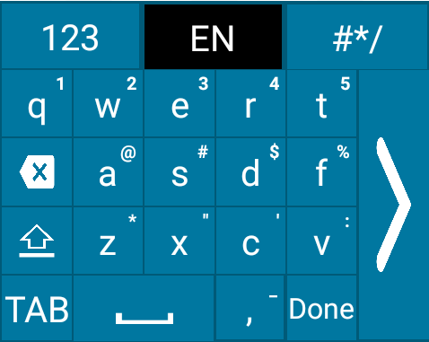
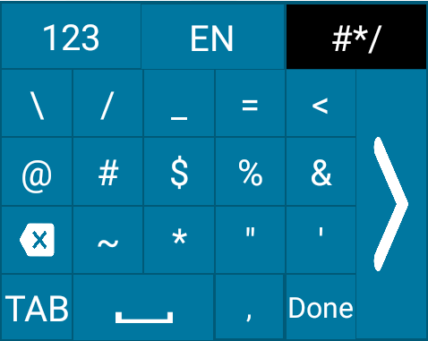

## Overview

Enterprise Keyboard Designer (EKD) offers pre-developed sample layouts for a variety of devices and uses to help enable quick deployment. Developed by Zebra engineers, sample layouts can be deployed immediately or customized to best suit the needs of an organization. 

<!-- 
_Sample layouts made with Enterprise Keyboard Designer. Click image to enlarge, ESC to exit_.
 
 -->
#### Notes

* **Custom layouts can be used on devices with Enterprise Keyboard 3.2 or later installed and configured as the default input source**. 
* **Each download includes the** `.encrypted` **file for deployment** to devices along with screenshots of the packaged layouts. 
* **To enable or disable the system and status bars on a device**, import the desired layout(s) into EKD, configure as desired and export and deploy the new file. 

#### Also See 

* [Customizing Keyboard Settings](#customizingkeyboardsettings) | Settings customization guide 
* [Dynamically Switching Keyboards](https://developer.zebra.com/blog/dynamically-switching-keyboards-zebra-android-devices) | Implementation details and sample code by Zebra engineering

-----

### Portrait-mode Devices

**Opaque (non-transparent) layouts designed for devices used mostly in vertical orientation**. 

* **Layout File**: `Portrait_NonTransparent.encrypted` 
* **Orientation**: Portrait
* **Opacity**: Non-transparent
* **Devices**: MC33, MC93, PS20, TC51, TC56, TC52, TC57, TC72, TC77, TC75x, TC70x, TC8x

##### Click image to enlarge, ESC to exit: 

_"FunctionKeys"_

 

_"Numeric"_

 

_"Qwerty"_

 

_"QwertyCaps"_

 

_"SpecialSymbols"_

 

-----

**Transparent layouts designed for devices used mostly in vertical orientation**. 

* **Layout File**: `Portrait_Transparent.encrypted`
* **Orientation**: 
* **Opacity**: 
* **Devices**: WT6000

##### Click image to enlarge, ESC to exit: 

_"FunctionKeys"_

 

_"Numeric"_

 

_"Qwerty"_

 

_"QwertyCaps"_

 

_"SpecialSymbols"_

 

[Download "Portrait_Layouts.zip"](Portrait_Layouts.zip) (includes two portrait layout files and all screenshots in this section) 

-----

### Landscape-mode Devices

Layouts designed for tablets, vehicle computers and other devices used mostly in horizontal orientation. 

* **Layout File**: `LandScape_NonTransparent.encrypted` 
* **Orientation**: 
* **Opacity**: 
* **Devices**: CC600, CC6000, ET51, ET56, L10, VC80x, VC83x

##### Click image to enlarge, ESC to exit: 

_"FunctionKeys"_

 

_"Numeric"_

 

_"Qwerty"_

 

_"QwertyCaps"_

 

_"SpecialSymbols"_

 

-----

Landscape layout designed for Zebra WT6000 devices. 

* **Layout File**: `LandScape_Transparent.encrypted` 
* **Orientation**: Landscape
* **Opacity**: Non-transparent
* **Devices**: WT6000

##### Click image to enlarge, ESC to exit: 

_"FunctionKeys"_

 

_"Numeric"_

 

_"Qwerty"_

 

_"QwertyCaps"_

 

_"SpecialSymbols"_

 

[Download "Landscape_Layouts.zip"](Landscape_Layouts.zip) (includes two layout files and all screenshots shown in this section) 

-----

### For EC30

Portrait layout and split layouts designed for Zebra EC30 devices.

* **Layout File**: `EC30_Split_Layouts.encrypted`  
* **Orientation**: Portrait
* **Opacity**: Non-transparent
* **Devices**: EC30

> **`NOTE:` These layouts **require Enterprise Keyboard 3.6.1.4** or later on the device.

##### Click image to enlarge, ESC to exit: 

_"Numeric"_

 

_"Qwerty Split1"_

 

_"Qwerty Split2"_

 

_"Symbols Split1"_

 

_"Symbols Split2"_

 

[Download "EC30_SplitLayout.zip"](EC30_SplitLayout.zip) (includes layout file and all screenshots shown below)

-----

### SAP Package

Layouts designed for apps that use the Enterprise Browser for SAP package.  

To use this layout in an EB app, set the app's `Config.xml` file as follows: 

	:::xml
	<KeyboardType  value="enterprisekeyboard"/>

* **Layout File**: `EKBCustomLayouts.encrypted` 
* **Orientation**: Landscape
* **Opacity**: 
* **Devices**: 

##### Click image to enlarge, ESC to exit: 

_"Functional Keys"_

 

_"Numeric"_

 

_"Qwerty"_

 

_"Symbols"_

 

[Download "EB_SAP_apk_layouts.zip"](EB_SAP_apk_layouts.zip) (includes layout file and all screenshots shown below) 

-----
<!-- 
## Customizing Keyboard Settings

#### This Section Covers: 

* Assignment of [keyboard languages](#languages)
* Setting keyboard [preferences](#preferences)
* [Text correction settings](#textcorrection)
* Long key-press and other [advanced settings](#advanced)
* [Remapping programmable keys](#remappingkeys)

#### Also See

* [Using EKB with DataWedge](#datawedge)
* [Changing key layouts programmatically](#dynamicinputmethod)
* [Navigation using TAB keys](#tabkeynavigation)
* [Scanner control](#scannercontrol)

> **NOTE:** Screen contents and colors vary by Android version.    
-->

## Also See

* [Dynamically Switching Keyboards](https://developer.zebra.com/blog/dynamically-switching-keyboards-zebra-android-devices) | Implementation details and sample code by Zebra engineering
* [Exploring the Enterprise Keyboard API](https://developer.zebra.com/blog/exploring-enterprise-keyboard-api) | Working with EKD-made Custom Layouts by Zebra engineering

<!-- 

### For WT6000

Landscape layout designed for Zebra WT6000 devices. 

* **Layout File**: `LandScape_Transparent.encrypted` 
* **Orientation**: Landscape
* **Opacity**: Non-transparent
* **Devices**: WT6000

[Download]() includes layout file and screenshots shown below. 

##### Click image to enlarge, ESC to exit: 

_"FunctionKeys"_

 

_"Numeric"_

 

_"Qwerty"_

 

_"QwertyCaps"_

 

_"SpecialSymbols"_

 

----- 

Portrait split-layouts designed for Zebra EC30 devices.

* **Layout File**: 
* **Orientation**: Portrait (split design)
* **Opacity**: 
* **Device**: EC30 

##### Click image to enlarge, ESC to exit: 

_"Numeric"_

 

_"Qwerty Split1"_

 

_"Qwerty Split2"_

 

_"Symbols Split1"_

 

_"Symbols Split2"_

 

-----
-->

