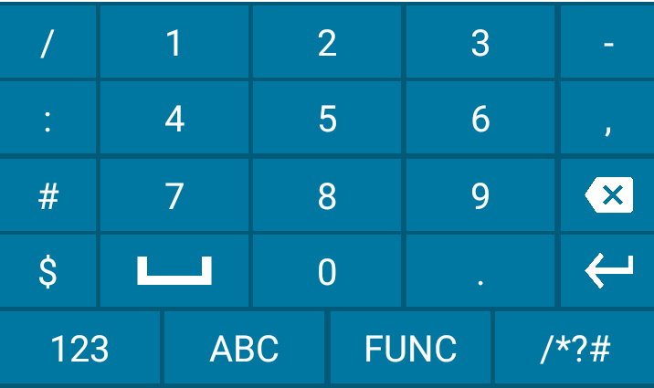

## Overview

Enterprise Keyboard Designer (EKD) now offers pre-developed sample layouts for a variety of devices and uses to help enable quick deployment. Developed by Zebra engineers, sample layouts can be deployed immediately or customized to best suit the needs of an organization. 

_Sample layouts made with Enterprise Keyboard Designer. Click image to enlarge, ESC to exit_.
 

**Custom layouts can be used on devices with Enterprise Keyboard 3.2 or later installed and configured as the default input source**. 

> Each download includes the `.encrypted` file for deployment to devices along with screenshots of the packaged layouts. 

#### Also See 

* [Customizing Keyboard Settings](#customizingkeyboardsettings) | Settings customization guide 
* [Dynamically Switching Keyboards](https://developer.zebra.com/blog/dynamically-switching-keyboards-zebra-android-devices) | Implementation details and sample code by Zebra engineering

-----

### Portrait-mode Layouts

Opaque (non-transparent) layouts designed for devices used mostly in vertical orientation. 

Click image to enlarge, ESC to exit: 

_"FunctionKeys"_ 
 

_"Numeric"_ 
 

_"Qwerty"_ 
 

_"QwertyCaps"_ 
 

_"SpecialSymbols"_ 
 

* **Layout File**: `Portrait_NonTransparent.encrypted` 
* **Orientation**: Portrait
* **Opacity**: Non-transparent
* **Devices**: MC33, MC93, PS20, TC51/TC56, TC52/TC57, TC72/TC77, TC75x/TC70x, TC8x

[Download]()

-----

Transparent layouts designed for the Zebra WT6000 and other devices used mostly in horizontal orientation. 

functionkeys.png
numeric.png
qwerty.png
qwertyCaps.png
specialsymbols.png

* **Orientation**: 
* **Opacity**: 
* **Devices**: WT6000
* **File**: `Portrait_Transparent.encrypted`

-----
### Horizontal Layouts

#### Landscape, non-transparent

Layouts designed for tablets and vehicle computers. 

* **Orientation**: 
* **Opacity**: 
* **Devices**: L10, ET51/56, CC600/CC6000, VC80x/VC83x
* **File**: `LandScape_NonTransparent.encrypted` 

functional.png
Numbers.png
qwerty.png
qwertyCaps.png
symbols.png

[Download]()

-----

* **Orientation**: 
* **Opacity**: 
* **Devices**: WT6000
* **File**: `LandScape_Transparent.encrypted` 

functional.png
Numbers.png
qwerty.png
qwertyCaps.png
symbols.png

-----

### For EC30

Portrait layout designed for Zebra EC30 devices.

* **Orientation**: 
* **Opacity**: 
* **Devices**: EC30
* **File**: `Portrait_Transparent.encrypted` 

[Download]()

FunctionalKeys.png
Numeric.png
Qwerty.png
Symbols.png

-----

numeric.png
qwerty_split1.png
qwerty_split2.png
symbols_split1.png
symbols_split2.png

* **Orientation**: Portrait (split design)
* **Opacity**: 
* **Device**: EC30 
* **File**: `EC30_Split_Layouts.encrypted` 

[Download]()

-----

### For WT6000

Landscape layout designed for Zebra WT6000 devices.

* **Orientation**: Landscape
* **Opacity**: 
* **Devices**: WT6000
* **File**: `LandScape_Transparent.encrypted` 

[Download]()

 
-----

### SAP Package

`EKBCustomLayouts.encrypted` 
file its only applicable to EB SAP package should be used with 

To use this layout, set the `Config.xml` file as follows: 

	:::xml
	<KeyboardType  value="enterprisekeyboard"/>
 
FunctionalKeys.png
Numeric.png
Qwerty.png
Symbols.png

* **Orientation**: Landscape
* **Opacity**: 
* **Devices**: 
* **File**:  

-----

----- 

Important Note:

Based on device model, enable or disable system and status bar by importing encrypted file to Enterprise Keyboard Designer Tool

For EC30_Split_Layouts.encrypted  is supported in EKB client 3.6.1.4 and above .

EKB 3.2 (and higher) supports the use of custom key layouts created with [Enterprise Keyboard Designer](/ekd) (EKB Designer or EKD), a free GUI tool for Windows-based systems that provides control over fonts, images, key codes, layout transparency and many other layout properties. As many as 20 custom layouts (see below) can be deployed to devices and **displayed programmatically using Android intents or DataWedge 7.4.44 (or higher)** when specific input situations arise. 

-----

## Customizing Keyboard Settings

#### This Section Covers: 

* Assignment of [keyboard languages](#languages)
* Setting keyboard [preferences](#preferences)
* [Text correction settings](#textcorrection)
* Long key-press and other [advanced settings](#advanced)
* [Remapping programmable keys](#remappingkeys)

#### Also See

* [Using EKB with DataWedge](#datawedge)
* [Changing key layouts programmatically](#dynamicinputmethod)
* [Navigation using TAB keys](#tabkeynavigation)
* [Scanner control](#scannercontrol)

> **NOTE:** Screen contents and colors vary by Android version.   

-----

## Also See

* [Dynamically Switching Keyboards](https://developer.zebra.com/blog/dynamically-switching-keyboards-zebra-android-devices) | Implementation details and sample code by Zebra engineering
* [Exploring the Enterprise Keyboard API](https://developer.zebra.com/blog/exploring-enterprise-keyboard-api) | Working with EKD-made Custom Layouts by Zebra engineering
