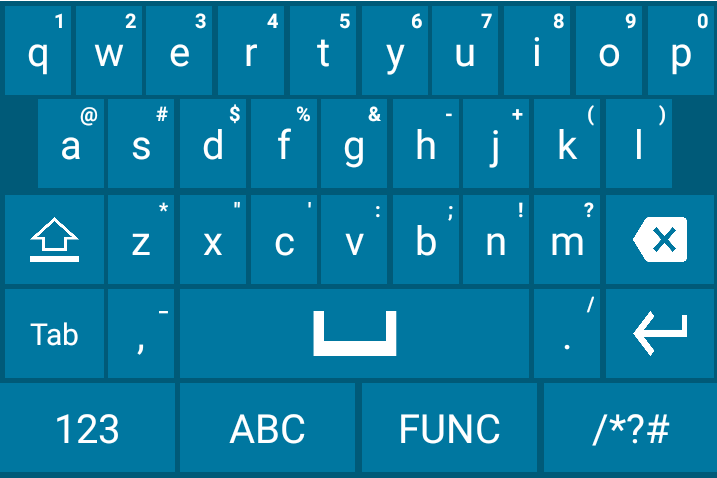

## Overview

Enterprise Keyboard Designer (EKD) now offers pre-developed sample layouts for a variety of devices and uses to help enable quick deployment. Developed by Zebra engineers, sample layouts can be deployed immediately or customized to best suit the needs of an organization. 

_Sample layouts made with Enterprise Keyboard Designer. Click image to enlarge, ESC to exit_.
 

#### NOTES

**Custom layouts can be used on devices with Enterprise Keyboard 3.2 or later installed and configured as the default input source**. 

Based on device model, enable or disable system and status bar by importing encrypted file to Enterprise Keyboard Designer Tool

Each download includes the `.encrypted` file for deployment to devices along with screenshots of the packaged layouts. 

#### Also See 

* [Customizing Keyboard Settings](#customizingkeyboardsettings) | Settings customization guide 
* [Dynamically Switching Keyboards](https://developer.zebra.com/blog/dynamically-switching-keyboards-zebra-android-devices) | Implementation details and sample code by Zebra engineering

-----

### Portrait-mode Layouts

Opaque (non-transparent) layouts designed for devices used mostly in vertical orientation. 

Click image to enlarge, ESC to exit: 

_"FunctionKeys"_

 

_"Numeric"_

 

_"Qwerty"_

 

_"QwertyCaps"_

 

_"SpecialSymbols"_

 

* **Layout File**: `Portrait_NonTransparent.encrypted` 
* **Orientation**: Portrait
* **Opacity**: Non-transparent
* **Devices**: MC33, MC93, PS20, TC51/TC56, TC52/TC57, TC72/TC77, TC75x/TC70x, TC8x

**[Download]()** includes layout file and screenshots shown above. 

-----

Transparent layouts designed for the Zebra WT6000 and other devices used mostly in horizontal orientation. 

Click image to enlarge, ESC to exit: 

_"FunctionKeys"_

 

_"Numeric"_

 

_"Qwerty"_

 

_"QwertyCaps"_

 

_"SpecialSymbols"_

 

* **Layout File**: `Portrait_Transparent.encrypted`
* **Orientation**: 
* **Opacity**: 
* **Devices**: WT6000

[Download]() includes layout file and screenshots shown above. 

-----
### Landscape, Non-transparent

Layouts designed for tablets and vehicle computers. Click image to enlarge; ESC to exit: 

_"FunctionKeys"_

 

_"Numeric"_

 

_"Qwerty"_

 

_"QwertyCaps"_

 

_"SpecialSymbols"_

 

* **Layout File**: `LandScape_NonTransparent.encrypted` 
* **Orientation**: 
* **Opacity**: 
* **Devices**: L10, ET51/56, CC600/CC6000, VC80x/VC83x

[Download]() includes layout file and screenshots shown above. 

-----

### For WT6000

Landscape layout designed for Zebra WT6000 devices. Click image to enlarge; ESC to exit:

_"FunctionKeys"_

 

_"Numeric"_

 

_"Qwerty"_

 

_"QwertyCaps"_

 

_"SpecialSymbols"_

 

* **Layout File**: `LandScape_Transparent.encrypted` 
* **Orientation**: Landscape
* **Opacity**: Transparent
* **Devices**: WT6000

[Download]() includes layout file and screenshots shown above. 

-----

### For EC30

Portrait layout designed for Zebra EC30 devices.

_"Numeric"_

 

_"Qwerty Split1"_

 

_"Qwerty Split2"_

 

_"Symbols Split1"_

 

_"Symbols Split2"_

 

* **Layout File**: `Portrait_Transparent.encrypted` 
* **Orientation**: 
* **Opacity**: 
* **Devices**: EC30

[Download]() includes layout file and screenshots shown above. 

-----

Portrait split-layouts designed for Zebra EC30 devices.

_"Numeric"_

 

_"Qwerty Split1"_

 

_"Qwerty Split2"_

 

_"Symbols Split1"_

 

_"Symbols Split2"_

 

* **Layout File**: `EC30_Split_Layouts.encrypted` 
* **Orientation**: Portrait (split design)
* **Opacity**: 
* **Device**: EC30 

[Download]() includes layout file and screenshots shown above. 

> **`NOTE:` This layout **requires Enterprise Keyboard 3.6.1.4** or later on the device.

-----

### SAP Package

Layouts designed for use with the Enterprise Browser for SAP package. Click image to enlarge; ESC to exit:  

_"Functional Keys"_

 

_"Numeric"_

 

_"Qwerty"_

 

_"Symbols Split1"_

 

To use this layout, set the `Config.xml` file as follows: 

	:::xml
	<KeyboardType  value="enterprisekeyboard"/>
 

* **Layout File**: `EKBCustomLayouts.encrypted` 
* **Orientation**: Landscape
* **Opacity**: 
* **Devices**: 

[Download]() includes layout file and screenshots shown above. 

-----

----- 

Important Note:

Based on device model, enable or disable system and status bar by importing encrypted file to Enterprise Keyboard Designer Tool

For EC30_Split_Layouts.encrypted  is supported in EKB client 3.6.1.4 and above .

EKB 3.2 (and higher) supports the use of custom key layouts created with [Enterprise Keyboard Designer](/ekd) (EKB Designer or EKD), a free GUI tool for Windows-based systems that provides control over fonts, images, key codes, layout transparency and many other layout properties. As many as 20 custom layouts (see below) can be deployed to devices and **displayed programmatically using Android intents or DataWedge 7.4.44 (or higher)** when specific input situations arise. 

-----

## Customizing Keyboard Settings

#### This Section Covers: 

* Assignment of [keyboard languages](#languages)
* Setting keyboard [preferences](#preferences)
* [Text correction settings](#textcorrection)
* Long key-press and other [advanced settings](#advanced)
* [Remapping programmable keys](#remappingkeys)

#### Also See

* [Using EKB with DataWedge](#datawedge)
* [Changing key layouts programmatically](#dynamicinputmethod)
* [Navigation using TAB keys](#tabkeynavigation)
* [Scanner control](#scannercontrol)

> **NOTE:** Screen contents and colors vary by Android version.   

-----

## Also See

* [Dynamically Switching Keyboards](https://developer.zebra.com/blog/dynamically-switching-keyboards-zebra-android-devices) | Implementation details and sample code by Zebra engineering
* [Exploring the Enterprise Keyboard API](https://developer.zebra.com/blog/exploring-enterprise-keyboard-api) | Working with EKD-made Custom Layouts by Zebra engineering
