## Overview

Enterprise Keyboard Designer (EKD) offers predeveloped sample layouts for a variety of devices and uses to help enable quick deployment. Developed by Zebra engineers, sample layouts can be deployed immediately or customized to best suit the needs of an organization. 

#### Notes:

`IMPORTANT, PLEASE READ`
* **Custom layouts require Enterprise Keyboard 3.2 or later installed on the device and configured as the default input source**. 
* **Downloads include the** `.encrypted` **file for device deployment**; each file contains all layouts shown in its section. 
* **For proper layout rendering, it might be necessary to enable or disable the system and status bars on a device**. This is done by importing the desired layout(s) into EKD, configuring as desired and exporting and deploying the new file. See the [Layout Properties section](../guide/usage/#ivsetlayoutproperties) of the Usage Guide for more information. 

#### Also See 

* [Deploying Layouts](../guide/usage/#vdeploylayouts) | Instructions for pushing layout files to a device
* [Customizing Keyboard Settings](../guide/usage/#iiisetbuttonproperties) | Complete guide to setting button properties 
* [Dynamically Switching Keyboards](https://developer.zebra.com/blog/dynamically-switching-keyboards-zebra-android-devices) | **Article**: Custom layout implementation with sample code, by Zebra engineering
* [Exploring the Enterprise Keyboard API](https://developer.zebra.com/blog/exploring-enterprise-keyboard-api) | **Article**: Working with EKD layouts, by Zebra engineering

-----

## Sample Key Layouts

### Portrait, Transparent

**See-through layouts designed for devices used mostly in vertical orientation**. 

* **Layout File**: `Portrait_Transparent.encrypted`
* **Orientation**: Portrait
* **Opacity**: Transparent
* **Devices**: EC30, all vertically oriented devices**&#42;**

<i> &#42; <strong>When used on devices other than the EC30</strong>, this layout requires changes to system and status bar settings for proper rendering. See [Overview Notes](#overview) for more information.</i>

<!-- 
***&#42;When used on devices other than the EC30**, this layout requires changes to system and status bar settings for proper rendering. See [Notes](#overview) for more information*.
 -->
#### **[Download this layout file](Portrait_Transparent.encrypted) |** Contains all key layouts below 

##### Click an image to enlarge, ESC to exit: 

_"FunctionKeys"_

 

_"Numeric"_

 

_"Qwerty"_

 

_"QwertyCaps"_

 

_"SpecialSymbols"_
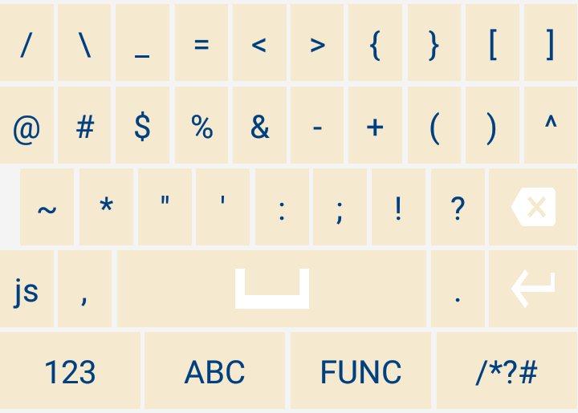
 

-----

### Portrait, Non-transparent

**Opaque (non-transparent) layouts designed for devices used mostly in vertical orientation**. 

* **Layout File**: `Portrait_NonTransparent.encrypted` 
* **Orientation**: Portrait
* **Opacity**: Non-transparent
* **Devices**: MC33, MC93, PS20, TC51, TC52, TC56, TC57, TC72, TC77,  TC70x, TC75x,TC8x

#### **[Download this layout file](Portrait_NonTransparent.encrypted) |** Contains all key layouts below 

##### Click an image to enlarge, ESC to exit: 

_"FunctionKeys"_

 

_"Numeric"_

 

_"Qwerty"_

 

_"QwertyCaps"_
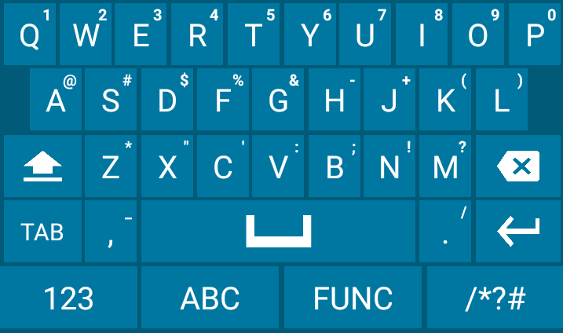
 

_"SpecialSymbols"_

 

-----

### Landscape, Transparent

**Landscape layouts with a see-through background designed for Zebra WT6000** and other devices used mostly in horizontal orientation. 

* **Layout File**: `Landscape_Transparent.encrypted` 
* **Orientation**: Landscape
* **Opacity**: Transparent
* **Devices**: WT6000, all horizontally oriented devices**&#42;**

<i> &#42; <strong>When used on devices other than the WT6000</strong>, this layout requires changes to system and status bar settings for proper rendering. See [Overview Notes](#overview) for more information.</i>

<!-- 
***&#42;When used on devices other than the WT6000**, this layout requires changes to system and status bar settings for proper rendering. See [Notes](#overview) for more information*.
 -->
#### **[Download this layout file](Landscape_Transparent.encrypted) |** Contains all key layouts below

##### Click an image to enlarge, ESC to exit: 

_"FunctionKeys"_

 

_"Numeric"_
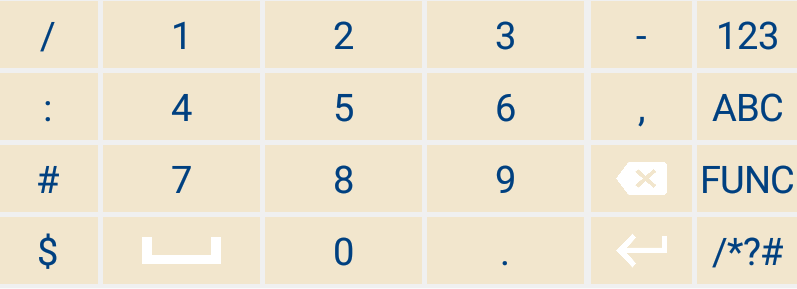
 

_"Qwerty"_
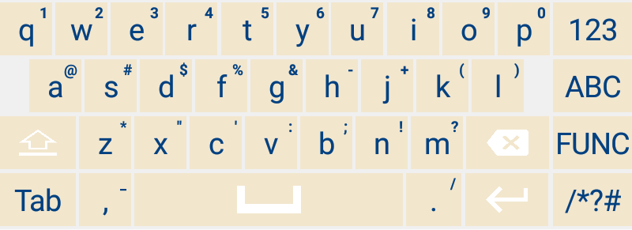
 

_"QwertyCaps"_

 

_"SpecialSymbols"_

 

-----

### Landscape, Non-transparent

**Layouts designed for tablets, vehicle computers and other devices used mostly in horizontal orientation**. 

* **Layout File**: `Landscape_NonTransparent.encrypted` 
* **Orientation**: Landscape
* **Opacity**: Non-transparent
* **Devices**: CC600, CC6000, ET51, ET56, L10, VC80x, VC83x

#### **[Download this layout file](Landscape_NonTransparent.encrypted) |** Contains all key layouts below 

##### Click an image to enlarge, ESC to exit: 

_"FunctionKeys"_

 

_"Numeric"_

 

_"Qwerty"_

 

_"QwertyCaps"_

 

_"SpecialSymbols"_
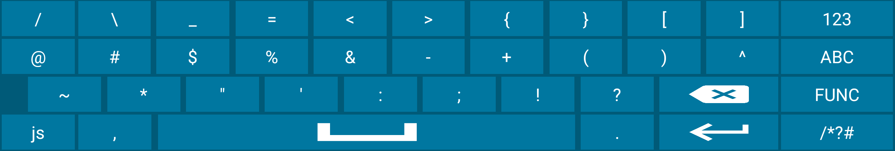
 

-----

### SAP Portrait, Non-transparent

**Layouts designed for apps that use the Enterprise Browser package for the SAP ITSmobile solution**. [Learn more about EB for ITSmobile](https://techdocs.zebra.com/enterprise-browser/latest/guide/sap/). 

To use this layout in an EB app, set the app's `Config.xml` file as follows: 

	:::xml
	<KeyboardType  value="enterprisekeyboard"/>

* **Layout File**: `EKBCustomLayouts.encrypted` 
* **Orientation**: Portrait
* **Opacity**: Non-transparent
* **Devices**: All [devices supported by Enterprise Browser](https://www.zebra.com/us/en/support-downloads/software/developer-tools/enterprise-browser.html) 

#### **[Download this layout file](SAPLayouts.encrypted) |** Contains all key layouts below 

##### Click an image to enlarge, ESC to exit: 

_"Functional Keys"_

 

_"Numeric"_
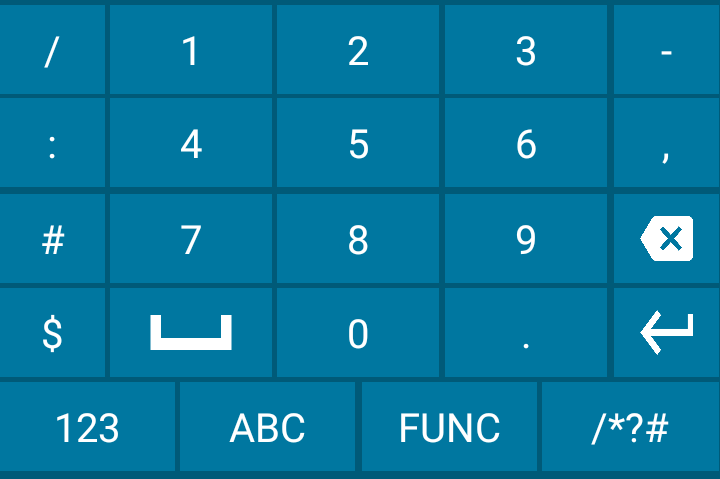
 

_"Qwerty"_

 

_"Symbols"_
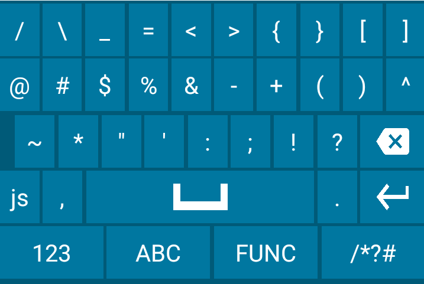
 

-----

### Split Portrait, Non-transparent

**Portrait layout and split-key layouts designed for the small screen of the Zebra EC30 device**.

* **Layout File**: `EC30_Split_Layouts.encrypted`   
* **Orientation**: Portrait 
* **Opacity**: Non-transparent 
* **Devices**: EC30 

#### **[Download this layout file](EC30_Split_Layouts.encrypted) |** Contains all key layouts below 

> **`NOTE:` These layouts require Enterprise Keyboard 3.6.1.4** or later on the device.

##### Click an image to enlarge, ESC to exit: 

_"Numeric"_
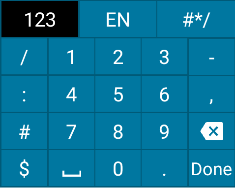
 

_"Qwerty Split1"_

 

_"Qwerty Split2"_

 

_"Symbols Split1"_

 

_"Symbols Split2"_

 

-----

### Zoom Portrait, Non-transparent

**Opaque (non-transparent) layouts designed for devices used mostly in the vertical orientation**. When a qwerty or symbol key is tapped, the keys immediately surrounding it appear, and can be alternatively selected by dragging. 

* **Layout File**: `Auto_Zoom_Y2020_Layouts.encrypted`
* **Orientation**: Portrait
* **Opacity**: Non-transparent
* **Devices**: EC30, MC33, MC93, PS20, TC51, TC52, TC56, TC57, TC72, TC77, TC70x, TC75x, TC8x

#### **[Download this layout file](Auto_Zoom_Y2020_Layouts.encrypted) |** Contains all key layouts below 

#### Notes: 
* **These layouts require Enterprise Keyboard 3.9** or later on the device.
* **The file name `Auto_Zoom_Y2020_Layouts.encrypted` is reserved**; it <u>must NOT be renamed nor used for any other custom layout</u>.

 

##### Click an image to enlarge, ESC to exit: 

_"Numeric"_
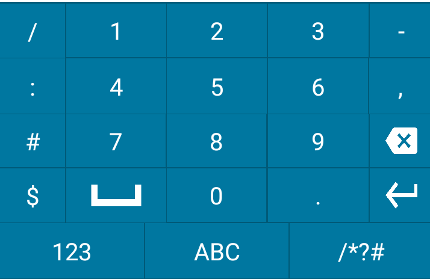
 

_"Symbols"_
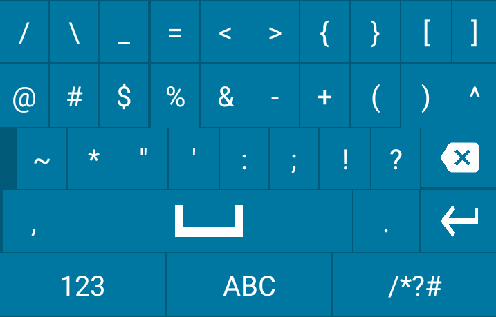
 

_"Symbols Zoomed"_

 

_"Qwerty"_

 

_"Qwerty Zoomed"_
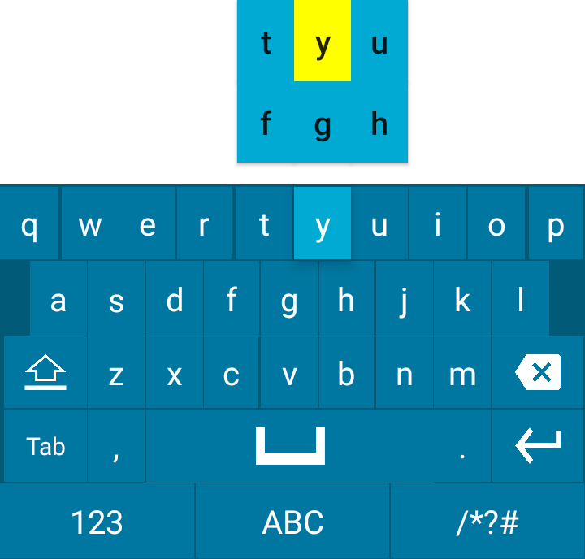
 

-----

## Also See

* [Deploying Layouts](../guide/usage/#vdeploylayouts) | Instructions for pushing layout files to a device
* [Customizing Keyboard Settings](../guide/usage/#iiisetbuttonproperties) | Complete guide to setting button properties 
* [Dynamically Switching Keyboards](https://developer.zebra.com/blog/dynamically-switching-keyboards-zebra-android-devices) | **Article**: Custom layout implementation with sample code, by Zebra engineering
* [Exploring the Enterprise Keyboard API](https://developer.zebra.com/blog/exploring-enterprise-keyboard-api) | **Article**: Working with EKD layouts, by Zebra engineering
