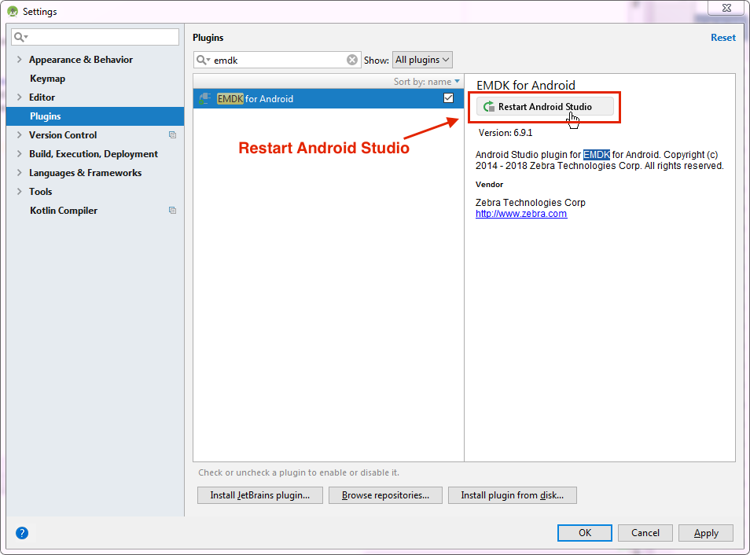
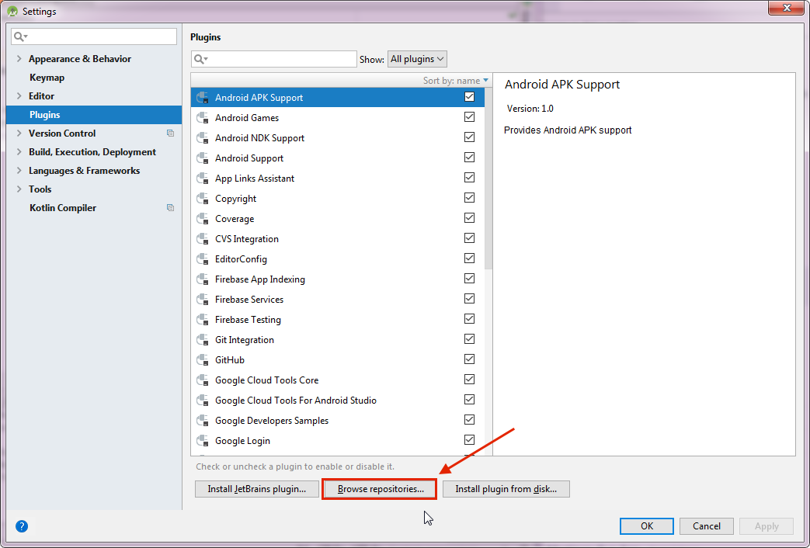
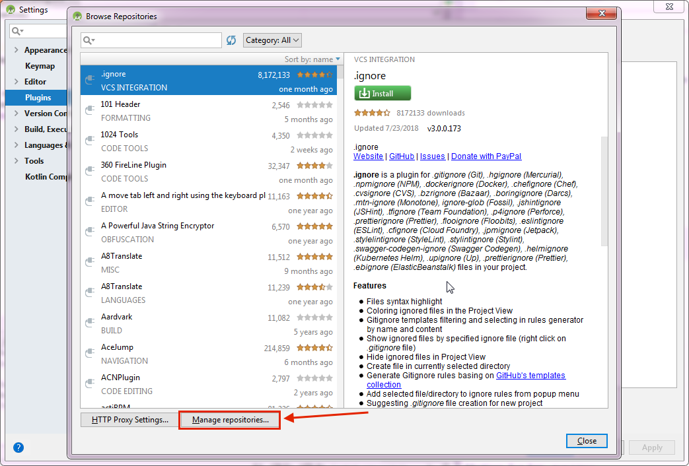
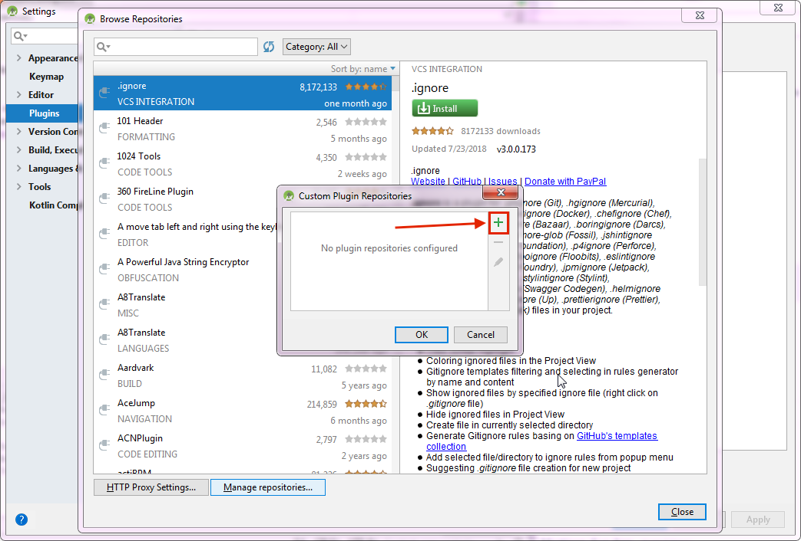

## Overview

**This document describes how to set up Mac OS and Windows computers to work with the EMDK for Android SDK**. EMDK extends Android Studio with tools to interface and configure Zebra Android devices and their peripherals, including imagers, scanners and magstripe and RFID readers. EMDK tools enable developers to easily create powerful line-of-business applications that help maximize workflow efficiency. 

### Prerequisites
The following software is required to use EMDK for Android:

**Windows**:
* Windows 7, 8, 8.1, 10 (32- or 64-bit)
* [Android Studio](https://developer.android.com/studio/) 2.2 or higher (includes OpenJDK) 
* [Java Development Kit (JDK)](https://www.oracle.com/technetwork/java/javase/downloads/index.html) 7u45 or higher (**optional**)

**Mac OS**:  
* Mac OS X (aka macOS) 10.10.5 Yosemite or later
* [Android Studio](https://developer.android.com/studio/) 2.2 or higher (includes OpenJDK)
* [Java Development Kit (JDK)](https://www.oracle.com/technetwork/java/javase/downloads/index.html) 7u75 or higher (**optional**)

> **Note**: Zebra recommends OpenJDK, which is bundled with Android Studio 2.2 and higher.

<!-- 1/30/18- removed per eng. TUT-22799
* Installed via Android SDK manager: 
	* The Android API 19 packages
	* The Android SDK Build-tools rev.21.1.x or higher

removed 
* Java for macOS 2014-10x or later

repo: 
https://raw.githubusercontent.com/meipitakotuwa/plugin/master/6.9/updatePlugins.xml

 -->

### Install EMDK

1. [Uninstall prior EMDK installations](#uninstallemdk) and related files, if any.  
1. Download [Android Studio](https://developer.android.com/studio/) and install.
2. **Activate OpenJDK**: 
   a. Open an Android Studio project (if not already open). 
   b. Select **File -> Project Structure**. 
   c. In the left-hand pane **select "SDK Location"** (if not already selected). 
   d. Confirm that "Use embedded JDK (recommended)" is checked.
3. **Install the EMDK plug-in**: 
   a. In Android Studio, select **File -> Settings.** 
   b. In the left-hand pane, **select "Plugins"** settings page. 
   c. **Enter "emdk" in the search box**: 
    •  If no result appears, skip to Step d. 
   
_Click to enlarge_. 
    •  If any version prior to 6.10 appears (as shown above), **select it and click the "Uninstall" button**. 

_Click to enlarge_. 
    •  Click the **"Restart Android Studio"** button. 
    •  Select **File -> Settings.** 
    •  In the left-hand pane, **select "Plugins"** settings page. 
    •  Proceed to Step d. 
   d. **Click "Browse repositories..."** button. 
   
_Click to enlarge_. 
   e. **Click "Manage repositories..."** button.  
   
_Click to enlarge_. 
   f. **Click "+"** and enter URL of the repository containing the EMDK plug-in:  
   
_Click to enlarge_. 
   g. **Click "Check Now"** button. 
   h. **Click OK** on all confirmation boxes that appear.  
5. Install the EMDK SDK: 
   a. **Create an Android project** (File -> New -> New Project...). 
   b. **Navigate to** `build.gradle` **file** in app module. 
   c. **Add the line below to the dependencies section**: 
		:::java
		implementation 'com.symbol:emdk:6.10.12
   d. **If using Gradle 3.3 or lower**, also add:  
		:::java
		compile 'com.symbol:emdk:6.10.12

> **Note**: The Java version used to compile a project is based on the `compileSdkVersion` selected for the project. Different versions of Android support different versions of Java. If necessary, the default Java version can be overridden. [Learn more](https://developer.android.com/studio/intro/studio-config#jdk). 

**Note**: Mac OS and Windows dialog boxes might vary slightly. 

<!-- 
#### `MORE IMAGES TO FOLLOW`
   `https://raw.githubusercontent.com/meipitakotuwa/plugin/master/6.9/updatePlugins.xml` 

 -->

-----

### Uninstall EMDK

#### Windows 

1. **Close Android Studio**, if open.
2. From the Windows -> "Symbol EMDK for Android" menu **select "Uninstall."**  
3. **Follow prompts** to complete the uninstallation.

#### Mac OS

**Note**: This process references folders that are hidden by default. To unhide, see section below. 

**In the Mac OS Finder**:

1. **Remove SDK add-ons**:
   * Navigate to the `/Users/[userName]/Library/Android/sdk/add-ons` directory. 
   * Remove any `addon-symbol_emdk-symbol-XX` folders. 
2. **Remove Wizard Core**:
   * Navigate to the `/Users/Shared` directory.
   * **Remove the "Symbol EMDK for Android" folder**.
3. **Remove Wizard plug-in**:
   * **Open Applications** folder.
   * Locate and **right-click Android Studio** app.
   * **Select "Show Package Contents"** from the menu.
   * Navigate to `Contents` -> `plugins` directory.
   * **Remove** `com.symbol.emdk.wizard.intellijIdea` **folder**, if present.

-----

**To unhide Mac OS folders**:

1. **Open Terminal** app (in Finder -> Applications -> Utilities).
2. **Paste the following into Terminal** window (and hit RETURN): 

		:::term
		defaults write com.apple.finder AppleShowAllFiles YES

3. **Right-click on the Finder icon** (in the Dock) Hold the "Option/alt" key 
4. **Select "Relaunch"** from the menu to make hidden files visible. 
5. To reverse, replace "YES" with "NO" in Terminal command and repeat Step 3. 

