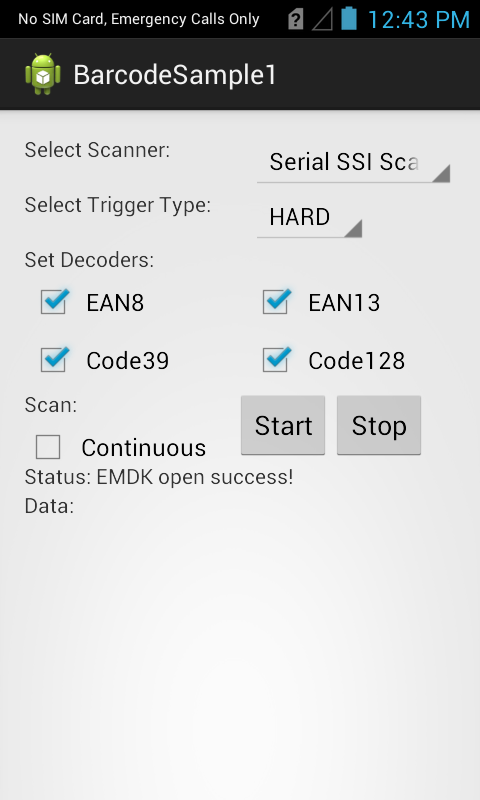
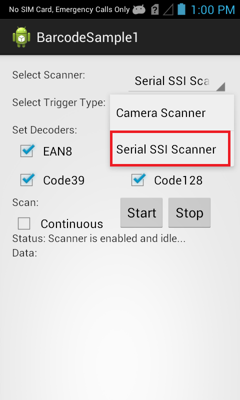
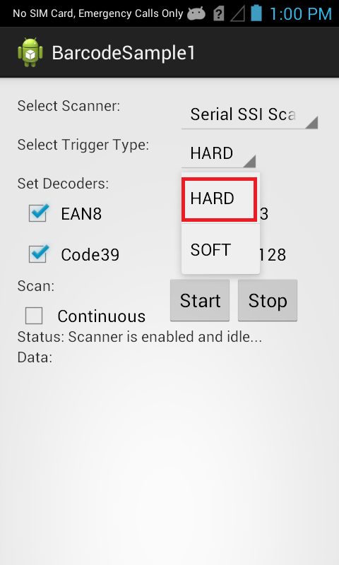
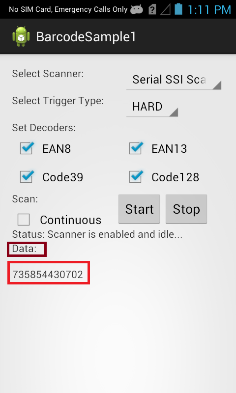

##Overview
The EMDK for Android is used when you wish to handle all barcode scanning entirely in Java using [Barcode/Scanning APIs](/emdk-for-android/6-9/api) introduced in EMDK V3.0. These APIs work independently of any [Data Capture profiles](/emdk-for-android/6-9/mx/data-capture/barcode).  

>**Note**: As of EMDK 6.8, DataWedge can no longer be configured for data capture through Profile Manager. Zebra recommends using the [DataWedge APIs](/datawedge/latest/guide/api/) instead.

The available actions in the [Barcode/Scanning API](/emdk-for-android/6-9/api) are:
  
* Set [Scanner Device](/emdk-for-android/6-9/api/barcode/BarcodeManager-DeviceIdentifier/)  
* Set [TriggerType](/emdk-for-android/6-9/api/barcode/Scanner)
* Set [Decoder Params](/emdk-for-android/6-9/api/barcode/ScannerConfig-DecoderParams)
* Set [Reader Params](/emdk-for-android/6-9/api/barcode/ScannerConfig-ReaderParams)
* Set [Scan Params](/emdk-for-android/6-9/api/barcode/ScannerConfig-ScanParams)
* Scan barcodes based on selected features   

This sample application permits barcode scanning based on selected scanner, trigger type and few [Decoder Params](/emdk-for-android/6-9/api/barcode/ScannerConfig-DecoderParams).

##Requirements
Android API 22 (or higher) must be installed via the SDK Manager before attempting to load this sample.

##Loading the Sample Application
The following guide will walk you through setting up the EMDK samples in your IDE.

* [Android Studio](/emdk-for-android/6-9/guide/emdksamples_androidstudio)

##Using This Sample
1. When the application starts it should look like the following.
  
  
  
2. Set scanner to "Serial SSI Scanner", which is the default one". 

  

3. Set Trigger Type to "HARD".

  

  > Note: Trigger Type "HARD" lets you scan the barcode using device's hard scan key whereas "SOFT" allows you to scan without using devic's hard scan key.

4. Keep all checkboxes checked for decoder params and this is how it should look after setting all fields.
    
      

5. Click "Start" button and the status will be updated.

   
 
6. Since we selected Trigger Type as "HARD", press the hard scan key of Symbol device and scan a particular barcode. It will get the scanned barcode data in "Data" field of UI.
   
    
  

