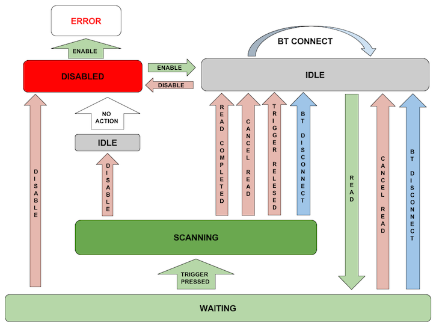

##Barcode API

The EMDK Barcode API provides applications with the ability to read numerous barcode label formats using a variety of built-in and pluggable cameras, imagers, lasers and scanners. For the full list, see [scanners supported by EMDK for Android](../about/#devicessupported).

### API Notes

The `BarcodeManager` is the primary object to enumerate the supported scanner devices and access the scanner devices to read barcodes.

**Points to consider during application design**:

* For scanning barcodes, an app should use either the barcode APIs or the DataCapture feature of ProfileManager. Apps cannot access both at the same time. 

* The EMDKManager > BarcodeManager takes precedence over the DataCapture feature of the ProfileManager.

* The EMDKManager > BarcodeManager must be released before another application can use it.

* When a scanner is disconnected and reconnected, calling any method on the barcode object will result in an `INVALID_OBJECT` error. As a remedy, register the application for connection notifications so it can be notified of reconnections and programmatically re-initialize the scanner.

* If a Bluetooth Scanner is not paired, enabling that scanner will automatically launch the pairing utility, prompting the user to scan a barcode (displayed on the mobile device) to pair the scanner with the mobile device.

* Control of scanning hardware is exclusive. When a scanning app takes control of a scanner, it must release it when quitting or going to the background before other apps can access that scanner.  

* Disabling the scanner cancels the pending read in progress and closes the session, allowing others applications to use the device. 

**To disable the scanner, use the code below**:

        :::java
        // Release the barcode manager resources:
        //
            if (emdkManager != null) {
                emdkManager.release(FEATURE_TYPE.BARCODE);
            }

<!-- Full code sample provided by engineering:
        :::java
    // De-initialize scanner
    //
    if (scanner != null) {
        try {
            scanner.cancelRead();
            scanner.disable();

            scanner.removeDataListener(this);
            scanner.removeStatusListener(this);

            scanner.release();

            scanner = null;
        } catch (Exception e) {

            textViewStatus.setText("Status: " + e.getMessage());
        }
    }

    // Remove connection listener
    //
    if (barcodeManager != null) {
        barcodeManager.removeConnectionListener(this);
        barcodeManager = null;
    }

    // Release the barcode manager resources
    //
    if (emdkManager != null) {
        emdkManager.release(FEATURE_TYPE.BARCODE);
    }
 -->

-----

### Getting Barcode Manager

EMDK must be opened before getting the `BarcodeManager` object: 

        :::java
        BarcodeManager barcodeManager = (BarcodeManager)emdkManager.getInstance(FEATURE_TYPE.BARCODE);

Before exiting, release the `BarcodeManager` object: 

-----

### Getting Scanner

There are two options here:

1.  **Get Scanner using DeviceIdentifier without device enumeration**

	Use the BarcodeManager.getDevice(DeviceIdentifier deviceIdentifier) API

	If the specified Device Identifier is not supported on the target platform, call to “getDevice” will return null.

        :::java
        Scanner scanner = barcodeManager.getDevice(DeviceIdentifier.BLUETOOTH_IMAGER_RS6000);

2.  **Get Scanner using ScannerInfo from device enumeration**

    Use the BarcodeManager.getSupportedDevicesInfo () first and then pass one of the received ScannerInfo objects to BarcodeManager.getDevice(ScannerInfo scnInfo)

        :::java
        
        List<ScannerInfo> supportedDevList =

        barcodeManager.getSupportedDevicesInfo();
        
        Scanner scanner = null;
        
        Iterator<ScannerInfo> it = deviceList.iterator();

        while(it.hasNext()) {
        
        ScannerInfo scnInfo = it.next();

        if(scnInfo.getDeviceIdentifier()==DeviceIdentifier.BLUETOOTH_IMAGER_RS6000){
        
        scanner = barcodeManager.getDevice(scnInfo);

        break;

        }

        }

-----

### Using Scanner

The scanner must be enabled first to open a session with the hardware. If scanner is already enabled by another application, this will throw an exception with error as "scanner in use." Zebra recommends disabling the scanner when finished using it. It will otherwise remain locked by the current application and will be unavailable other applications that want to use it.

The `Scanner.enable()` method is an async call and exception will be thrown if any error occurs during a request. After the scanner is successfully enabled, the `IDLE` status event is sent to the application using a registered status listener. If an error occurs while enabling the scanner, the `ERROR` status is sent to application using the registered status listener.

Issuing any read request while the previous read is pending will result in an error. Zebra recommends waiting for the `IDLE` status from the application before issuing the next command to read barcodes.

### Configuring the Scanner

The EMDK Barcode API provides three categories of scanner configuration to control the behavior of the scanner. The scanner configurations are "Decoder Parameters," "Reader Parameters" and "Scan Parameters." 

An app can get current settings by calling the `Scanner.getConfig()` method after the scanner is successfully enabled. This method returns a `ScannerConfig` object.

An app can modify the `ScannerConfig` object returned by `Scanner.getconfig`. The modified `ScannerConfig` object must be set by calling `Scanner.setConfig(ScannerConfig)` before the settings will take effect. The user must call the `Scanner.setConfig(ScannerConfig)` only when the scanner is enabled and in idle state. The modified settings applied will persist until the scanner object is released. This means that when an app calls `enable()` after `disable()`, all the latest configuration parameter values will be set automatically.  

Setting scanner configurations is not allowed while a read is pending. If a read is pending, the developer must call the `Scanner.cancelRead()` and must wait for the idle status through the register status listener before setting the configuration.

The code below shows how to disable the Code 128 symbology and set beam timer for imager:

        :::java
        try {
                ScannerConfig scannerConfig = scanner.getConfig();
                scannerConfig.decoderParams.code128.enabled = false; 
                
                //Set beam timer for imager
                config.readerParams.readerSpecific.imagerSpecific.beamTimer = 4000;
                scanner.setConfig(config); 
        } catch (ScannerException e) {
        //Error occurred and the error can be obtained by e.getResult()
        }

Calling `SetConfig()` should be done in the Status callback. This allows a check that the scanner is indeed `IDLE` and that no scanner read is pending.

Below is an example of how that should be done:

        :::java
        @Override
        public void onStatus(StatusData statusData) {
                ScannerStates state = statusData.getState();
                switch(state) {
                case IDLE:
                        if(!scanner.isReadPending()){
                        // call SetConfig() here
                        }
                break;
                }
        }

-----

### Decoder Parameters

The `ScannerConfig.DecoderParams` class provides an interface for the developer to enable or disable decoder symbologies, such as Code39, Code128, Code93, UPCEAN, etc.  

The following code disables the Code128 symbology:

        :::java
        scannerConfig.decoderParams.code128.enabled = false;

-----

### Reader Parameters

The `ScannerConfig.ReaderParams` class provides an interface for configuring scanner engine-specific settings for `LaserSpecific`, `ImagerSpecific` and `CameraSpecific` related parameters such as picklist, aim type, aim timer, beam timer, illumination mode, etc.

The following code shows how to modify the beam timer for different scanner engines:

        :::java
        //Set beam timer for camera
        config.readerParams.readerSpecific. cameraSpecific.beamTimer = 4000;
        //Set beam timer for imager
        config.readerParams.readerSpecific.imagerSpecific.beamTimer = 4000;
        //Set beam timer for laser
        config.readerParams.readerSpecific.laserSpecific.beamTimer = 4000;

-----

### Scan Parameters

The `ScannerConfig.ScanParams` class provides an interface for configuring scanner parameters such as decode LED time, vibrate on successful decode, beep on successful decode, beep audio file, etc. 

The following code sets the decode LED time to 75:

        :::java
        config.scanParams.decodeLEDTime = 75;

-----

## Scanner States

The diagrams below illustrate the states that a barcode scanner will transition through while using the EMDK Barcode Scanning APIs.

### Hardware Trigger

### Software Trigger

