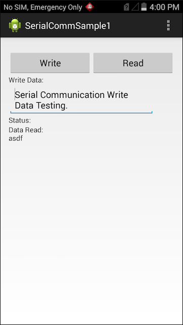

##Overview
This sample demonstrates the EMDK Serial Communication API to enable support for DEX in your application. DEX (data exchange) is a format for collecting audit and event data from vending machines.

>Note: In order to use Serial **Read** functionality, you must first apply a patch provided in [SPR-28877](https://spr.motorolasolutions.com/ViewSPR.aspx?sprID=28877). To obtain this patch, contact Zebra Support.

##Prerequisites

**Items Needed**
* One of the approved devices listed above
* TC7X SNAP On DEX cable ( CBL-TC7X-DEX1-01 )

For more information about setting up the EMDK please see the [EMDK Setup Guide](/emdk-for-android/6-8/guide/setup).

>Note: Although this sample may work with previous versions of the EMDK, it is advised to [update the EMDK runtime](../../guide/setupDevice/) on your device before loading this sample.

##Requirements
Android API 19 must be installed via the SDK Manager before attempting to load this sample.

##Loading the Sample Application
The following guide will walk you through setting up the EMDK samples in your IDE.

* [Android Studio](/emdk-for-android/6-8/guide/emdksamples_androidstudio)
)

##Using This Sample
1. With the Snap on DEX cable attached, the application should look like the following when it starts.  
    
2. Press the **Write** button. The application should display a message that it has sent the text from the edit field in number of bytes sent in the status area.
      
3.  Press the **Read** button.  The application will continue to read for 10 seconds and then display the read data in the status area.
     
  

