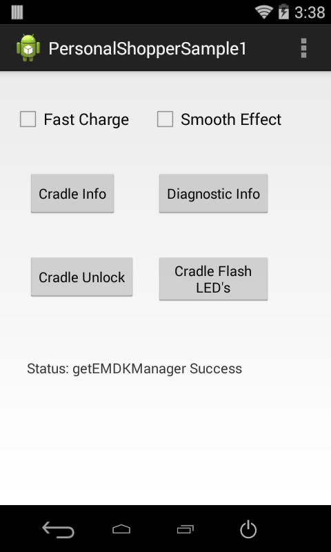
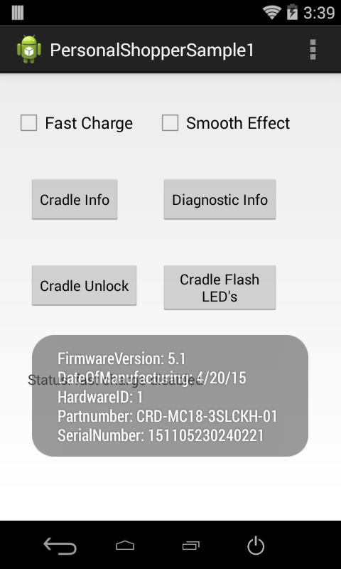
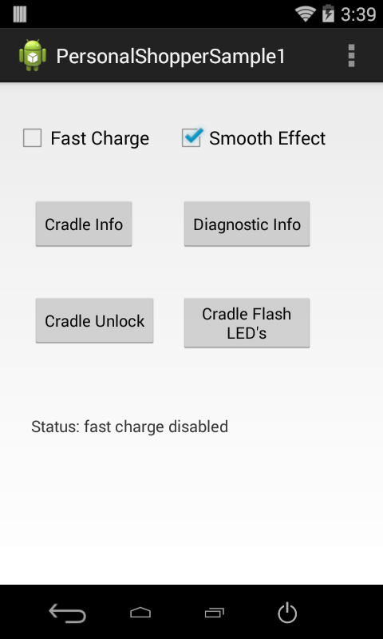

##Overview
This sample application will show how the Personal Shopper APIs can be used to interact with the MC18 Cradle programmatically.

##Requirements
Android API 22 (or higher) must be installed via the SDK Manager before attempting to load this sample.

##Loading the Sample Application
The following guide will walk you through setting up the EMDK samples in your IDE.

* [Android Studio](/emdk-for-android/6-9/guide/emdksamples_androidstudio)

##Using This Sample

1.  With the MC18 seated in the cradle. Launch the PersonalShopper API sample.
 When the application starts it should look like the following.

  

2. Press the **Fast Charge** checkbox to enable/disable fast charging.

  

3. Press the **Cradle Info** button to retrieve information about the cradle, such as the cradle's firmware version.

  

4. Press the **Diagnostic Info** button to retrieve information such as the the MC18 battery capacity.

  

5. Press the **Cradle Unlock** button to unlock the crade, which will allow the MC18 to be removed.

  

6. Press the **Cradle Flash LED's** button, which will flash the cradle LED's 5 times.

  

7. Press the **Smooth Effect** checkbox to enable/disable smoothing effect and then press the **Cradle Flash LED's** button again. Notice how the
LED's fade in and out, instead of an abrupt on/off state change.

  

