## Overview

This guide will walk you through creating an EMDK For Android application that will use Mx features introduced in EMDK for Android API to perform device configurations. Mx represents a suite of Enterprise Features on top of standard, commercially available Android Open Source Project. So this tutorial will focus on [Persist Manager](../../mx/persistance) API, which allows user to persist configuration XML's. These XML's contain various Mx device configuration settings that user may want to persist even after performing Factory Reset or Enterprise Reset on the device. The persisted settings are applied by default when we Factory or Enterprise Reset the device so that user does not have to apply them manually again and again. This is the main purpose of Mx Persist Manager feature. Overall, the Persist Manager API supports following features:   

**1. Adding XML to be Persisted:**

Using this feature, user can create a new XML to be persisted that has specific configuration settings. (Ex. Mx Clock details)

   > Note: The profile feature "Data Capture Manager" will not be persisted.

**2. Removing a Persisted XML:**

User can remove a specific persisted XML through wizard or API query.

**3. Query to Receive List of all Persisted XML's:**  

This feature allows user to use EMDK V 2.1 API to query Persist Manager in order to receive a list of all persisted XML's.

**4. Query based on Parameters:** 
 
Using this feature, user can find a specific persisted XML based on Persist Manager attributes that were used while persisting the XML. These attributes are:

* PersistAsVersion
* PersistAsOrder
* PersistIfError

**5. Apply Persisted XML settings after Enterprise Reset:**

This feature re-sends the persisted XML's to the Mx Framework after an Enterprise Reset. This helps in re-applying configuration settings back to the device for which user had Persisted these XML's.

   > Note: 
   > In order for associated files to survive an "Enterprise Reset" they must be placed in the Enterprise Folder on the device. A "Factory Reset" will not persist any profiles features.  

So now we will create a tutorial to demonstrate how the configuration XML's are persisted and retrieved using Persist Manager API. Moreover we would perform an enterprise reset on the device and see how the configuration settings are re-applied to the device by designing our tutorial in following steps:

* We would store a Clock and App Manager's install configuration settings and create Persist Manager to store XML for each setting.
* It means we would change the Clock timing using Mx Clock and install any application using App Manager install feature, which will be stored by Persist Manager. 
* We would then deliberately change the Clock timings and uninstall the application that we had installed.
* We will then perform an Enterprise Reset on Symbol Android device (Ex. TC55 in this Tutorial)
* Finally we will ensure how the persisted Clock and App Manager settings are re-applied automatically. It means you would see the Clock is reset to the time you had set and the application installed back to the device from the path provided.     
   
###Prerequisites
* Download the APK for sample App from [here](https://github.com/Zebra/examples-emdk/archive/AllInstalledApps.zip)
* Download the respective Enterprise Reset package (zip file) according to your device OS version from [here](https://portal.motorolasolutions.com/Support/US-EN/Mobile+Networks+RFID+and+BarCode+Scanners/Mobile+Computers/Handheld+Computers/TC55) and copy that file in SD card/Internal memory of the device.

    > Note: This above link provides the Update Packages of TC55 device only, which we have used in this tutorial. If you are using some other Symbol Android device then download the respective update package from [here](https://portal.motorolasolutions.com/Support/US-EN/Mobile+Networks+RFID+and+BarCode+Scanners/Mobile+Computers/Handheld+Computers)

## Creating The Project

> Note: Provide "MxPersistManagerTutorial" as the project name for this tutorial.

Start by creating a new Android Studio [project](/emdk-for-android/6-10/tutorial/tutCreateProjectAndroidStudio).

## Adding The Persist Manager Profile Feature
1. Click [here](/emdk-for-android/6-10/tutorial/tutAddProfileManagerFeature) to see how to add a specific feature to the Profile Manager.

2. Provide "PersistManagerProfile" as the Profile Name for this tutorial.

	> Note: You can provide any Profile Name but make sure to access it with the similar name in the Android code.  
   
3. Now, you can see all these MX features on the left hand side of the Profile Editor window. We will persist two XML's for two Mx features in this tutorial. The first feature is Clock. So select the "Clock" feature from the list and click "Right Arrow".

    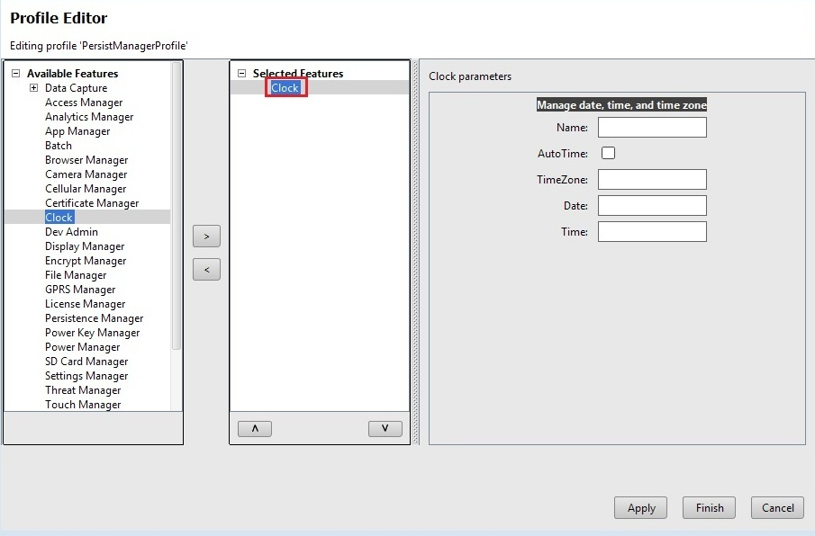

    Set the Clock details by providing Timezone, Date and Time values. All the timings need to be in UTC. It means if you want to set the Timezone to PST, you will need to set the clock to GMT time and it will automatically change it to the local time for you.

    > Note: It means the time you enter always has to be in GMT.

    ForEample:  
	* **Name**: MxClock
	* **TimeZone**: GMT-07:00
	* **Date**: 2014-18-15
	* **Time**: 20:00:00

    Here , we have set the Timezone as GMT-07:00. It means if we want to set the PST time of 1PM, we have to set the GMT time as 8PM (20:00:00 in 24 hour format) and it will automatically set the PST time of 1PM for us.

    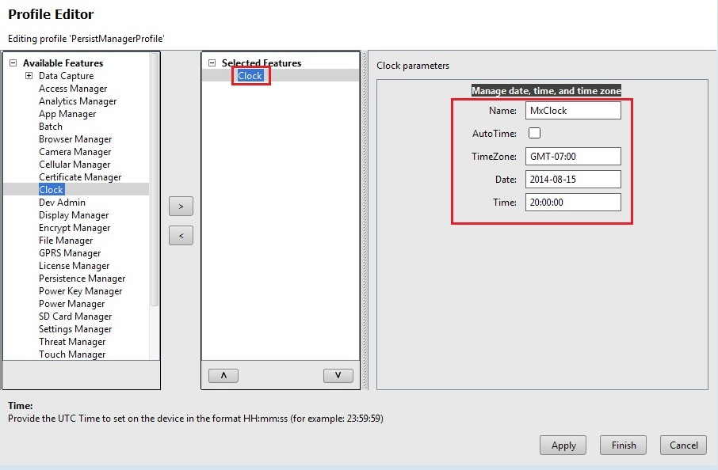   
 
4. Click Apply and your Clock profile is created.    
  
    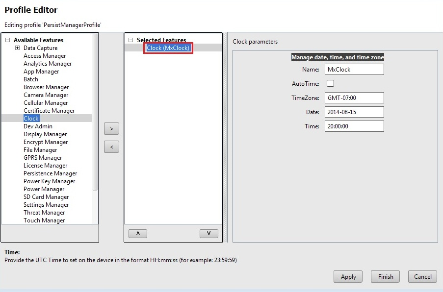

5. So now we will persist the Clock settings by creating a Persist Manager for Clock. To proceed with this, select "Persistence Manager" feature from the list and click "Right Arrow".

    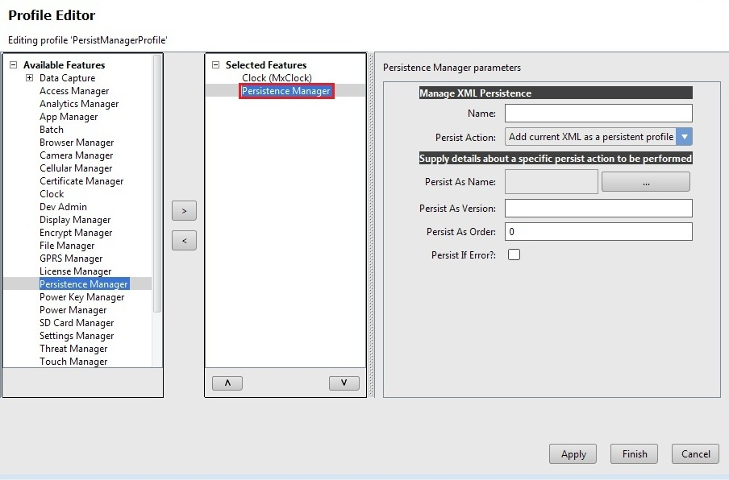 

6. Provide some name in the Name field (Ex. PersistClock). Select Persist Action as "Add current XML as a persistent profile". Select Persist as Name field and a Name Selector dialog will appear. If you want to remove any persisted XML, select Persist Action as "Remove the specified persistent profile". 

    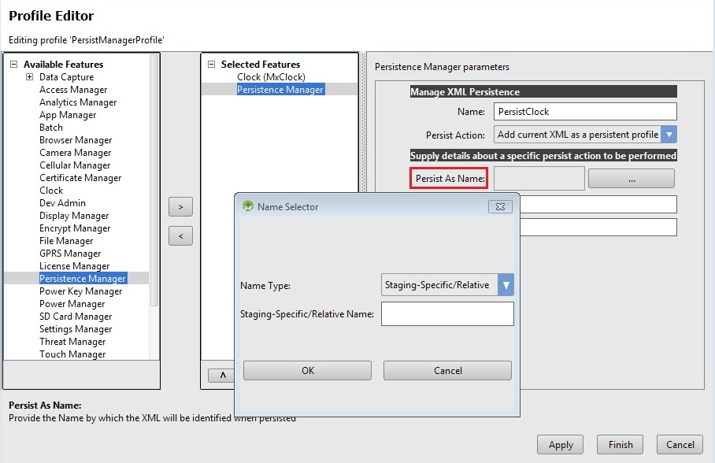

    Select Name Type as Generic/Absolute from the drop-down option and provide Generic/Absolute Name in the field (Ex. clock_profile). 

    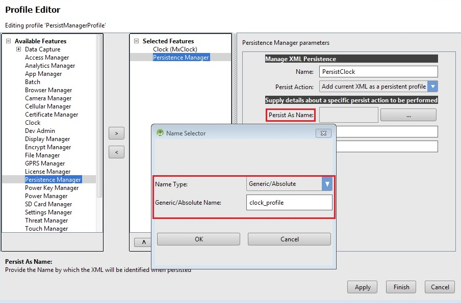

7. Click OK. Enter 1 for "Persist As Version". Enter 1 for "Persist As Order". Check the "Persist if Error" field. This field will persist the XML even if Profile Creation returns error.

    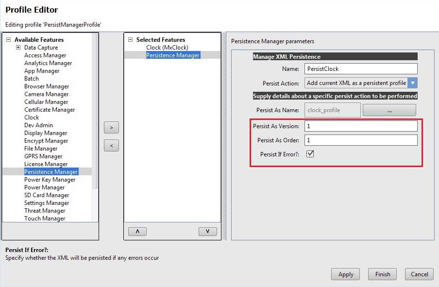

    Click Apply and the persist settings for the Clock feature will be added. 

    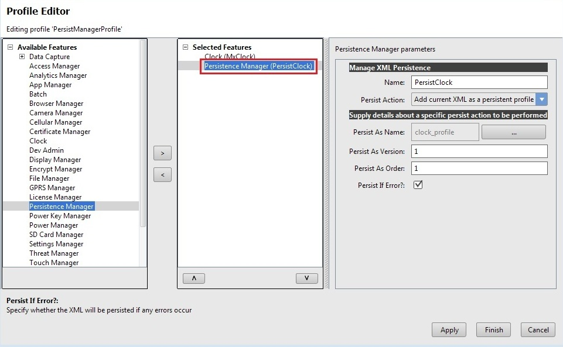

8. So far we have added the Persist configurations for Clock feature. Now its time to persist App Manager feature as discussed earlier. We will follow similar steps as we did for Clock. Select "App Manager" feature and Click "Right Arrow". It will show "App Manager" parameter list.

    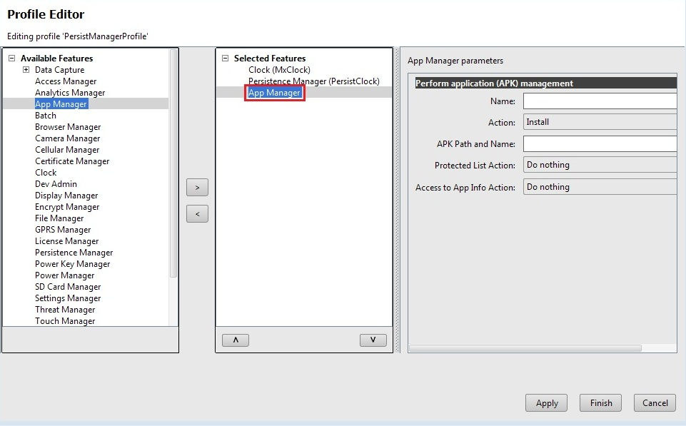

9. Provide some name in the Name field (Ex. MxAppManager). Select Action as "Install" and Provide the APK path to the SD Card of the application that we had downloaded earlier (Ex. /storage/sdcard1/AllInstalledApps.apk). So this feature will install the app in the device from the provided APK file.

    > Note: The SD Card path may be different on different devices.

    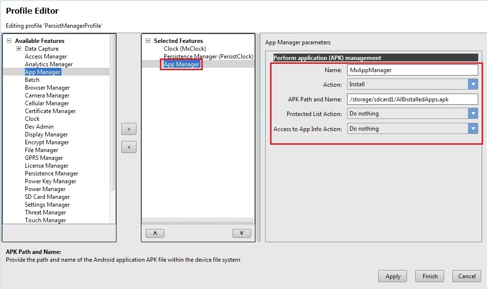

10. We will add another Persist Manager to persist the App Manager settings. So select "Persistence Manager" from the feature list and click "Right Arrow".

    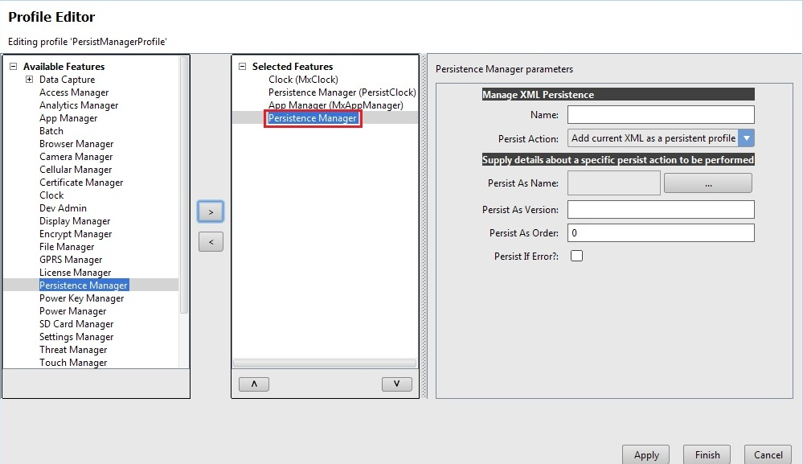

11. Provide some name in the Name field (Ex. PersistAppManager). Select Persist Action as "Add current XML as a persistent profile". If you want to remove any persisted XML, select Persist Action as "Remove Persistent the specified persistent profile". Select the "Persist As Name" field and provide Absolute/Generic path as we did earlier for the Clock (Ex. PersistAppManager). Enter 1 for "Persist As Version". Enter 1 for "Persist As Order". Check the "Persist if Error" field. This field will persist the XML even if Profile Creation returns error.

    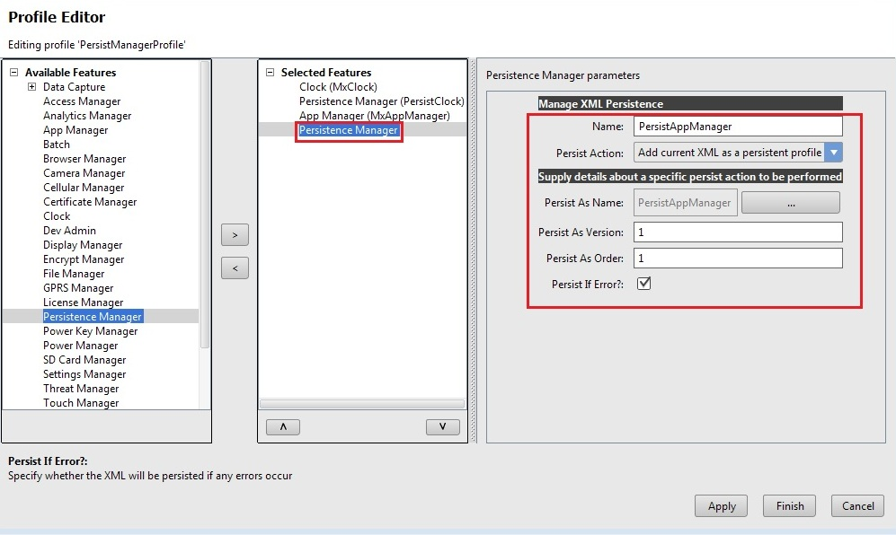  
  
12. Click Apply and Finish. 

    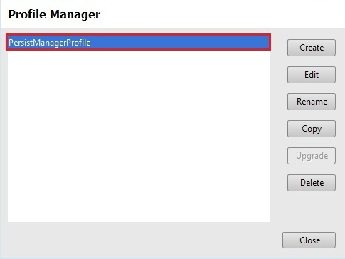  

13. Click "Close". This will create our Persist Manager Profile that is ready to Persist details for Clock and App manager features of Mx.   

    >Note:  
    >Now the "EMDKConfig.xml" is created under "\assets" folder. This file will contain a definition of all of your profiles that you create. 
  
14. You can inspect the "EMDKConfig.xml" to see it is reflecting the changes made to the parameters via EMDK Profile Manager GUI earlier.  However, it is advised that this file not be manually updated and only be controlled via the Profile Manager.

    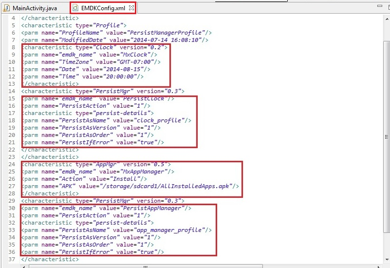    

## Enabling Android Permissions
1. Modify the Application's Manifest.xml to use the EMDK library and to set permission for the EMDK.
  
    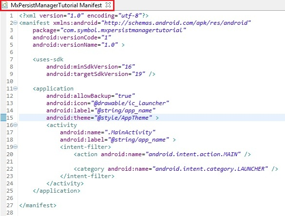

    You must first enable permissions for 'com.symbol.emdk.permission.EMDK':  
   
        :::xml
        <uses-permission android:name="com.symbol.emdk.permission.EMDK"/> 

    Then you must enable the library:  
      
        :::xml
        <uses-library android:name="com.symbol.emdk"/>

    When done, your manifest.xml should look like:

    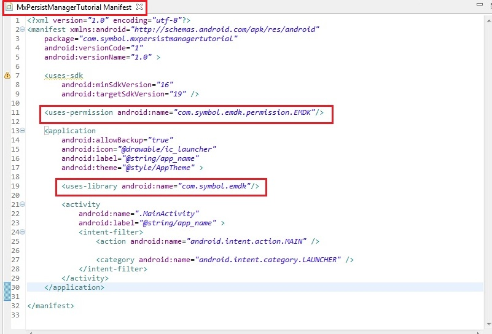 

##Adding Some Code    
1. Now we will start to add some code. 

    First you must add references to the libraries:  
    
        :::java
        import com.symbol.emdk.*;  
        import com.symbol.emdk.EMDKManager.EMDKListener;  
		import android.widget.Toast;    

    Then you must extend the activity to implement EMDKListener. 
    
        :::java
        public class MainActivity extends Activity implements EMDKListener {  
          
            .. .. .. .. .. .. ...  
          
            @Override  
            public void onClosed() {  
                   // TODO Auto-generated method stub  
            }  
          
            @Override  
            public void onOpened(EMDKManager emdkManager) {  
                   // TODO Auto-generated method stub  
            }  
          
        }      

    We will now create some global variables to hold the profile name as well as instance objects of EMDKManager and ProfileManager with a status variable while applying the profile. Some of the variables are used to hold the name, type and description in case of any errors. These variables would be used throughout the code.

    >Note:
    >Verify the Profile name in the code with the one created in the Profile Manager. They both should be identical.    
    
        :::java
        // Assign the profile name used in EMDKConfig.xml
	    private String profileName = "PersistManagerProfile";

	    // Declare a variable to store ProfileManager object
	    private ProfileManager profileManager = null;

	    // Declare a variable to store EMDKManager object
	    private EMDKManager emdkManager = null;

		// Contains the parm-error name (sub-feature that has error)
		private String errorName = "";

		// Contains the characteristic-error type (Root feature that has error)
		private String errorType = "";

		// contains the error description for parm or characteristic error.
		private String errorDescription = "";

		// contains status of the profile operation
		private String status = "";

    In the onCreate method, we call getEMDKManager so that the EMDK can be initialized and checked to see if it is ready. 

        :::java
        //The EMDKManager object will be created and returned in the callback.  
        EMDKResults results = EMDKManager.getEMDKManager(getApplicationContext(), this);  
          
        //Check the return status of getEMDKManager  
		if (results.statusCode == EMDKResults.STATUS_CODE.SUCCESS) {

			// EMDKManager object creation success

		} else {

			// EMDKManager object creation failed

		}

    So far your code should look like:
     
     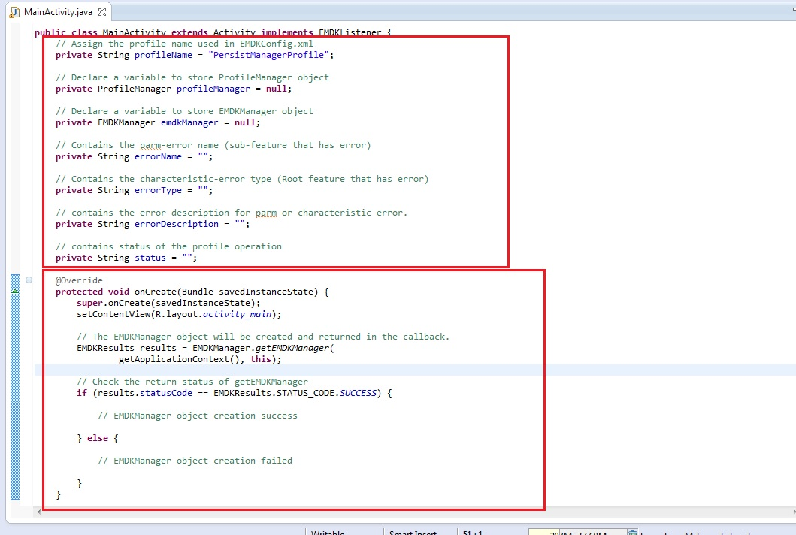 

2. Now we need to use the `onOpened` method to get a reference to the EMDKManager. The EMDKListener interface will trigger this event when the EMDK is ready to be used. The EMDKListener interface must be implemented in order to get a reference to the EMDKManager APIs. This event will pass the EMDKManager instance and we assign it to the global variable `emdkManager` that we created in the previous steps. We then use that instance object to get an instance of ProfileManager and assign it to the global variable `profileManager`. This is how we will interface with the APIs in the rest of the code:

    > Note: 
    > Rename the argument of `onOpened` method from `arg0` to `emdkManager`  

        :::java
        // This callback will be issued when the EMDK is ready to use.
		this.emdkManager = emdkManager;

		// Get the ProfileManager object to process the profiles
		profileManager = (ProfileManager) emdkManager
				.getInstance(EMDKManager.FEATURE_TYPE.PROFILE);         
    
    Now that we have a reference to ProfleManager, we use it to install and activate the profile we built earlier using the `processProfile` method. We could have also performed this action at a different time, say when someone pressed a button, but we chose to do it as soon as the EMDK was ready:

		:::java
		if (profileManager != null) {
			String[] modifyData = new String[1];

			// Call processPrfoile with profile name and SET flag to create the profile. The modifyData can be null.
			EMDKResults results = profileManager.processProfile(profileName,
					ProfileManager.PROFILE_FLAG.SET, modifyData);

			if (results.statusCode == EMDKResults.STATUS_CODE.CHECK_XML) {

			} else {
			  // Show dialog of Failure
				AlertDialog.Builder builder = new AlertDialog.Builder(this);
				builder.setTitle("Failure");
				builder.setMessage("Failed to persist profile...")
						.setPositiveButton("OK",
								new DialogInterface.OnClickListener() {
									public void onClick													(DialogInterface dialog,
											int id) {

									}
								});
				AlertDialog alert = builder.create();
				alert.show();
			}

		}

    This `processProfile` method returns the result of applying a particular profile that we set using EMDK Profile Wizard in [EMDKResults](/emdk-for-android/6-10/api/core/EMDKResults) reference. If the profile is successfully processed, it returns the status as `CHECK_XML` and then we go on and parse the response to get further details whether the profile was applied successfully or not. Otherwise we display a Failure message in a [dialog](http://developer.android.com/reference/android/app/AlertDialog.html).

	> Note: 1. There is a difference between processing a profile successfully and applying a profile successfully.

	> Note: 2. If the status is other than `CHECK_XML`, we are simply displaying a failure message. You can actually go ahead and check different types of status and display the appropriate message accordingly, which is not in the scope of this sample tutorial.

	In case of `CHECK_XML` status, We retrieve  XML response string from the result using `getStatusString` method.

		:::java
		// Get XML response as a String
		String statusXMLResponse = results.getStatusString();

	Further, we would parse this XML response string using [XML Pull Parser](http://developer.android.com/reference/org/xmlpull/v1/XmlPullParser.html) in order to get the status and error parameters if any. XML Pull Parser is an interface that defines parsing functionality provided in [XMLPULL V1 API](http://www.xmlpull.org/) (visit this website to learn more about API and its implementations). In the parsing we would be looking for specific status tags (Error Name, Error Type and Error Description) in case of any errors and if found, we would get those values in the respective global variables that we have declared in previous step.

		:::java
		try {
			// Create instance of XML Pull Parser to parse the response
			XmlPullParser parser = Xml.newPullParser();
			// Provide the string response to the String Reader that reads
			// for the parser
			parser.setInput(new StringReader(statusXMLResponse));
			// Call method to parse the response
			parseXML(parser);
			} catch (XmlPullParserException e) {
				e.printStackTrace();
			}

	> Note: Here we have called the method `parseXML` to parse XML response string. We will declare the method in the next step. 

	Once the response is parsed, we would display the result of applying this profile in a [dialog](http://developer.android.com/reference/android/app/AlertDialog.html) by calling `displayResults` method, which we would declare in coming steps.

		:::java
		// Method call to display results in a dialog
		displayResults();

    Your complete `onOpened` method should now look like:
    
    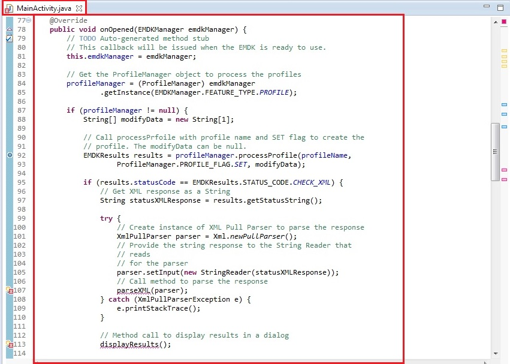 

    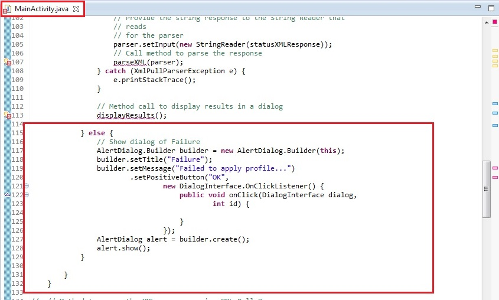

3. You will see few errors as we have not declared the respective methods to parse the response and display result. Lets do it one by one. In this step, we will create a method `parseXML` that uses [XML Pull Parser](http://developer.android.com/reference/org/xmlpull/v1/XmlPullParser.html) to parse the XML string response and set the status and error parameters if any.

	In the reponse, we are supposed to capture `name` and `desc` for `parm-error` tag, `type` and `desc` for `characteristic-error` tag in case of any errors.

		:::java
		// Method to parse the XML response using XML Pull Parser
		public void parseXML(XmlPullParser myParser) {
		int event;
		try {
			event = myParser.getEventType();
			while (event != XmlPullParser.END_DOCUMENT) {
				String name = myParser.getName();
				switch (event) {
				case XmlPullParser.START_TAG:
					// Get Status, error name and description in case of
					// parm-error
					if (name.equals("parm-error")) {
						status = "Failure";
						errorName = myParser.getAttributeValue(null, "name");
						errorDescription = myParser.getAttributeValue(null,
								"desc");

						// Get Status, error type and description in case of
						// parm-error
					} else if (name.equals("characteristic-error")) {
						status = "Failure";
						errorType = myParser.getAttributeValue(null, "type");
						errorDescription = myParser.getAttributeValue(null,
								"desc");
					}
					break;
				case XmlPullParser.END_TAG:

					break;
				}
				event = myParser.next();

			  }
		    } catch (Exception e) {
			e.printStackTrace();
		    }
		}

    Your complete `parseXML` method should now look like:
    
    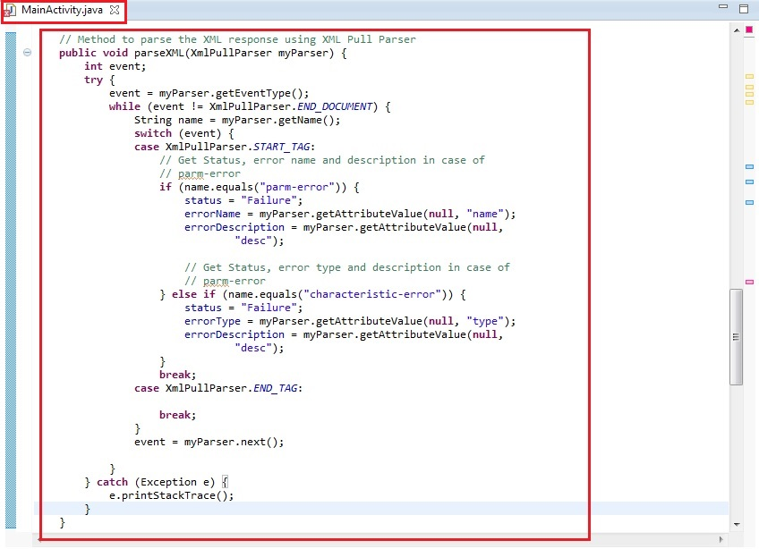 

4. You will still see one error as we need to declare `displayResults` method to display the result of profile operation in a [dialog](http://developer.android.com/reference/android/app/AlertDialog.html). Before displaying the results, we should form the content of the result to be shown first, specifically in case of errors. This could be done by creating `buildFailureMessage` method.
 
    In this method, the error message in case of error is formed using following way: 

    * Name and description of error if the response contains `parm-error`.
    * Type and description of error if the response contains `characteristic-error`.
    * Name, type and description of error if the response contains both `parm-error` and `characteristic-error`.

	The `buildFailureMessage` method would have following code to match the above mentioned criteria.  

		:::java
		// Method to build failure message that contains name, type and
		// description of respective error (parm, characteristic or both)
		public String buildFailureMessage() {
		  String failureMessage = "";
		  if (!TextUtils.isEmpty(errorName) && !TextUtils.isEmpty(errorType))
			 failureMessage = errorName + " :" + "\n" + errorType + " :" + "\n"
					+ errorDescription;
		  else if (!TextUtils.isEmpty(errorName))
			 failureMessage = errorName + " :" + "\n" + errorDescription;
		  else
			 failureMessage = errorType + " :" + "\n" + errorDescription;
		  return failureMessage;

		}

    `buildFailureMessage` method should look like:
    
    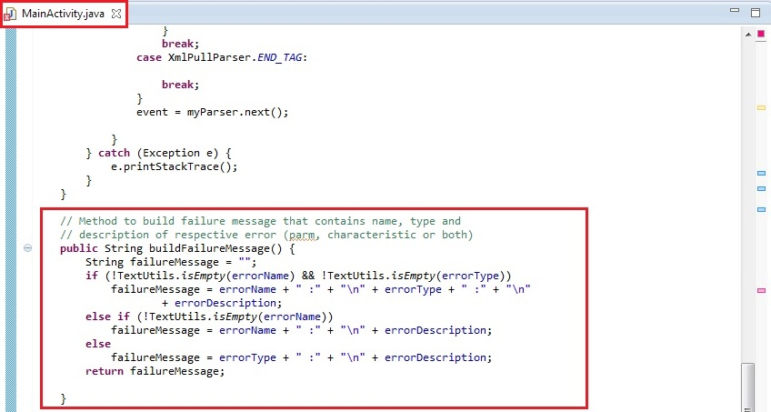

5. In this step, we will add `displayResults` method to display the result of profile operation in a [dialog](http://developer.android.com/reference/android/app/AlertDialog.html). The dialog would display status as `Success` or `Failure` with corresponding message based on the response of profile operation.

		:::java
		// Method to display results (Status, Error Name, Error Type, Error
		// Description) in a
		// dialog
		public void displayResults() {
		  // Alert Dialog to display the status of the Profile creation
		  // operation of MX features
		  AlertDialog.Builder alertDialogBuilder = new AlertDialog.Builder(
				MainActivity.this);

		  if (TextUtils.isEmpty(errorDescription)) {
			alertDialogBuilder.setTitle("Success");
			alertDialogBuilder.setMessage("Profile Successfully Applied...");
		  } else {
			// set title
			alertDialogBuilder.setTitle(status);
			// call buildFailureMessage() method to set failure message in
			// dialog
			alertDialogBuilder.setMessage(buildFailureMessage());
		  }

		  alertDialogBuilder.setCancelable(false).setPositiveButton("OK",
				new DialogInterface.OnClickListener() {
					public void onClick(DialogInterface dialog, int id) {
					}
				});
		  // create alert dialog
		  AlertDialog alertDialog = alertDialogBuilder.create();

		  // show it
		  alertDialog.show();

	    }  

    The method `displayResults` should look like:
    
    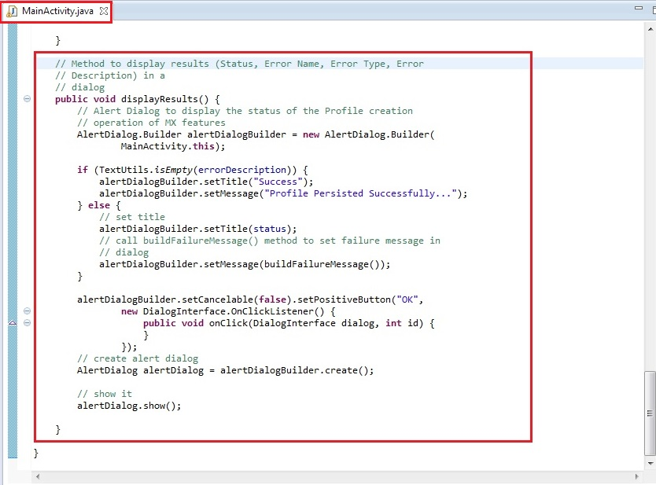

	You can see that all the errors are gone.  
    
6. Now let's override the "onDestroy" method so we can release the EMDKManager resources:  

        :::java
        @Override  
        protected void onDestroy() {  
            // TODO Auto-generated method stub  
            super.onDestroy();  
            //Clean up the objects created by EMDK manager  
            emdkManager.release();  
        } 

    Your onDestroy method should now look like this:  

    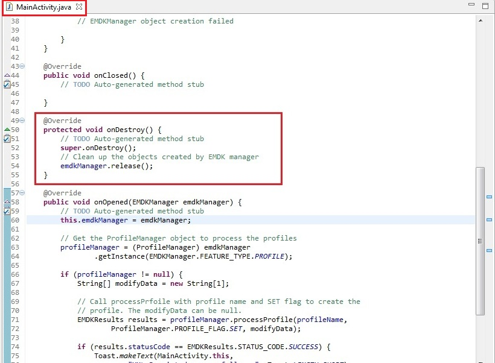 

That's it!!! We are done with all the coding and configuration part. Now let us run the application.
 
## Running the Application

1. Connect the device (having the latest EMDK runtime) to USB port. 

    > Note:   
    > Make sure the device is in USB debug.

    Check the Date-Time of the phone before running the app

    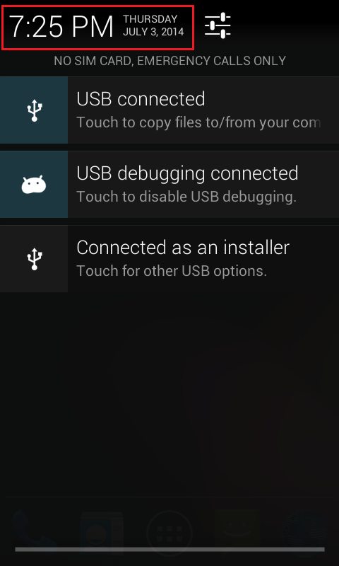
  
2. Run the application. The Clock and and App Manager configurations are applied and persisted in the device. It means you can now see the Clock Date-Time has been changed to the one we had set in the wizard. You can also see that EMDK App Manager has installed the application "AllInstalledApps" whose APK path we had provided in the wizard earlier. 
  
	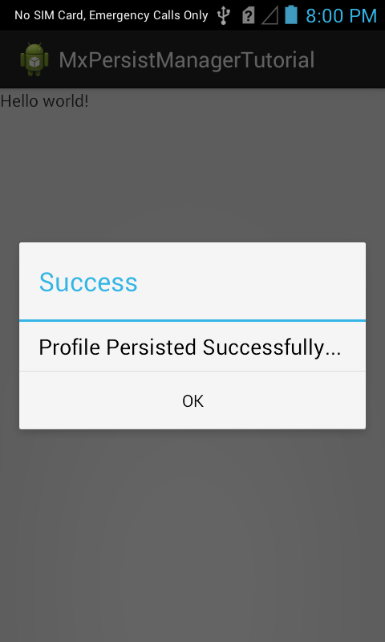

	> Note: In case of any errors, you will see a Failure status with respective error message in that dialog.

    Now check the Date-Time of the device. You could see that it has changed to the one we set in the wizard during Profile Creation.

    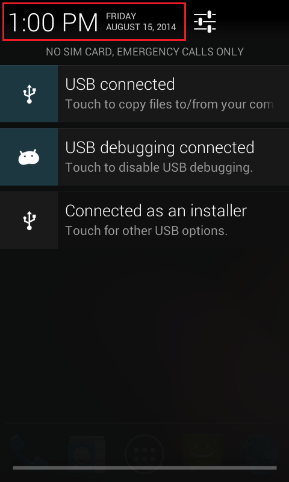

    You can also see that APK path of the application we had provided in the wizard during Profile creation has been installed successfully on the device using App Manager's install feature.

    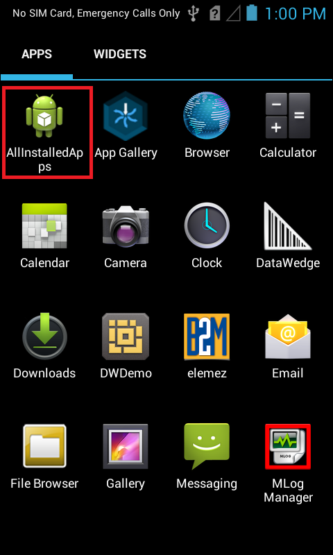
  
3. These configurations were implemented and applied by the respective Mx feature (Clock and App Manager) but the settings are persisted in the XML file by the Persist Manager. If you open the File browser of TC 55 and go to "/enterprise/usr/persist/mxframework/persistmgr", you will find the two XML's persisted that were created using Persist Manager for Clock and App Manager features of Mx. 

    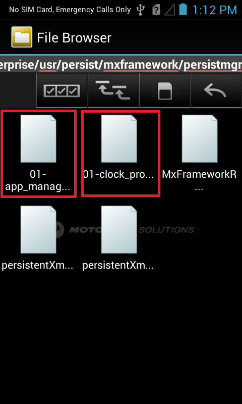

5. Now we will see how these Clock and App Manager settings are re-applied automatically after performing Enterprise Reset on the device.

    > Note: Enterprise Reset erases all the user installed applications and resets the Clock to the default time. But in our case system will read the details from Persisted XML files and apply changes to the device.
    > Make sure that the Enterprise Reset package (zip file) is present in the device's SD Card.

6. Let us perform Enterprise Reset on the TC55 Android device. Simultaneously press the Power, Programmable and Volume Up buttons 
 
    The TC55 shuts down and then reboots. Now select the Enterprise Reset Package (Zip File) stored in the SD Card by navigating to the path. It will complete the Enterprise Reset by erasing data and reboot the device with the default configurations.

6. Once the Enterprise Reset is completed, Persist Manager resends the persisted XML's to the Mx Framework, which is captured by the device. These settings are then re-applied to the device. This is how the Persist Manager works in order to Persist and apply the Mx device configuration features.

    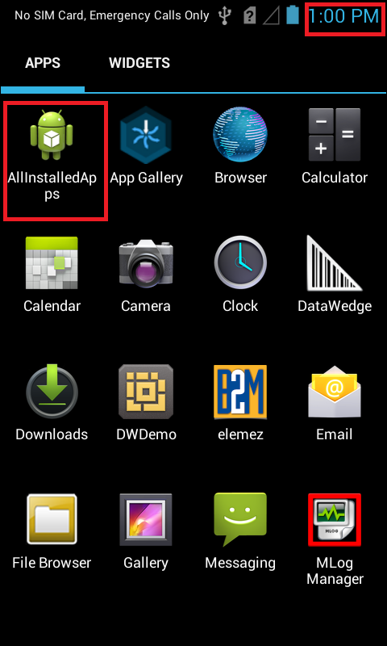

##Important Programming Tips##

1. It is required to do the following changes in the application's AndroidManifest.xml:  
  
    >Note:
    >* Include the permission for EMDK:  
    
        :::xml
        <uses-permission android:name="com.symbol.emdk.permission.EMDK"/>
    
	>Note:
    >* Use the EMDK library:  
    
        :::xml
        <uses-library android:name="com.symbol.emdk"/>
  
2. Installing the EMDK for Android application without deploying the EMDK runtime on the Symbol Android device will fail because of missing shared library on the device.
 
4. Use the DataWedge v1.7.12 or higher version to test the ProfileManager.processProfile() for DataWedge profiles.

## What's Next
Now that you have learned how to configure and persist device configuration XML's using Persist Manager on your Symbol devices through applications, let us try to understand and implement some of the other Mx features. So in the next tutorial, we will concentrate on the "GPRS Manager" Mx feature and try to explore this feature by creating a tutorial.

