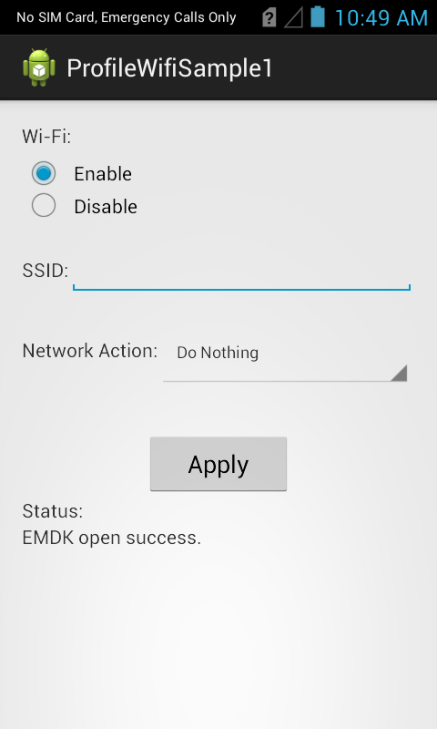
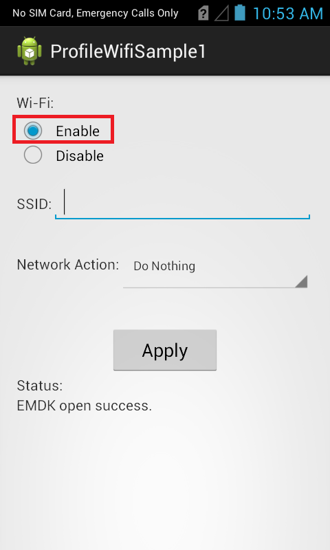
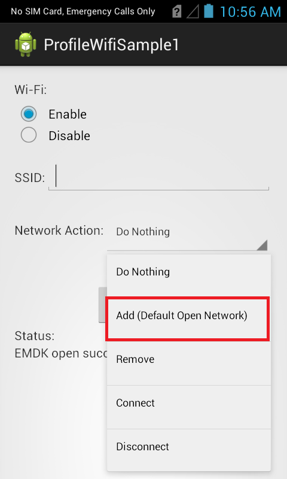
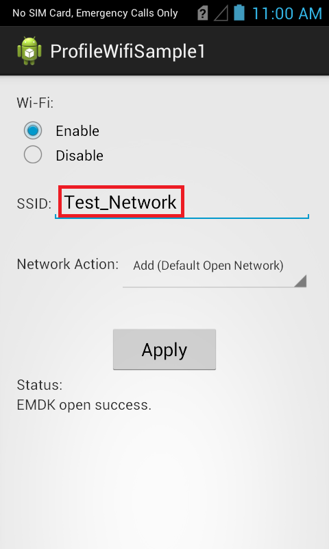
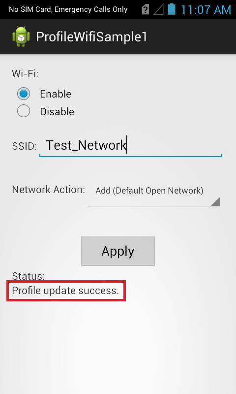

##Overview
The EMDK for Android allows you to configure Wi-Fi of a Symbol device. 

The available actions are:
  
* Disable Wi-Fi  
* Enable Wi-Fi  
* Add a Network  
* Connect to a Network
* Enable a Network
* Disconnect from a Network
* Disable a Network
* Remove a Network

> Note: In order to perform all Wi-Fi network operations, Wi-Fi should be enabled.  

This sample application will allow you to perform all the above mentioned Wi-Fi actions on Symbol device.

##Requirements
Android API 22 (or higher) must be installed via the SDK Manager before attempting to load this sample.

##Loading the Sample Application
The following guide will walk you through setting up the EMDK samples in your IDE.

* [Android Studio](/emdk-for-android/7-1/guide/emdksamples_androidstudio)

##Using This Sample

1. When the application starts it should look like the following.
  
  
  
2. Select the Wi-Fi operation you want (Enable/Disable).
   
     

3. Select the Network action you want to execute from the Network Action drop-down. 
  Let us select "Add(Default Open Network)" option.

  

  > Note: You could also add Personal Network with Passphrase and Enterprise Network with required certificate, which is not in the scope of this sample. 
4. Provide some SSID to the network you want to add in SSID field (Ex. Test_Network).

  

5. Click "Apply" button.

6. Check the status field.
   
    
  

