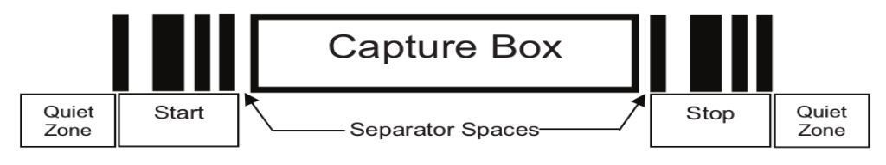

## Overview

Overview

The EMDK Barcode API exposes the Signature Capture feature that provides applications with the ability to capture an area with a predefined specially formatted area as an image. This functionality is modeled as another decoder types exposed out of Barcode API. User can retrieve the Signature Capture image via processing the data returned to the application from a Scan event via the OnData callback on a successful scan. This Programmer’s Guide will focus on the Signature Capture feature of the EMDK Barcode APIs, for API details not pertaining to Signature Capture, refer to the Barcode Scanning API Programmer's Guide.

*A typical signature capture barcode*. 

Enabling Signature Capture

Before an application can capture Signature, corresponding decoder (i.e. signature) must be enabled. Firstly, get an instance of a scanner object (refer to the Barcode Scanning API Programmer's Guide for instructions on how to initialize a scanner object). Once you have an initialized scanner object, you can then modify the scanner configuration as below.

    :::Java
    ScannerConfig config = scanner.getConfig();
    config.decoderParams.signature.enabled = true; //enables signature decoder
    scanner.setConfig(config);

-----

### Configuring Signature Capture Parameters

By default, the following values are configured for signature decoder parameters. You may change these parameters depending on the requirement.

    ScannerConfig config = scanner.getConfig();
 
    config.decoderParams.signature.format = ScannerConfig.SignatureImageFormat.BMP; //supported image formats: JPEG, BMP, TIFF

    config.decoderParams.signature.width = 400; //specifies the desired output image width in number of pixels. The aspect ratio of Width to Height must match the aspect ratio of the signature capture barcode to avoid distortion in captured image.

    config.decoderParams.signature.height = 400; //specifies the desired output image height in number of pixels. The aspect ratio of Width to Height must match the aspect ratio of the signature capture barcode to avoid distortion in captured image.

    config.decoderParams.signature.bpp = ScannerConfig.SignatureImageBitsPerPixel.BPP_8; //this parameter is not applicable if the signature format parameter is set to JPEG. Supported values: BPP_1 (2 levels), BPP_4 (64 levels), BPP_8 (256 levels)

    config.decoderParams.signature.jpegQuality = 65; //this parameter accepts values between 5 and 100 with a step of 5. 100 is the highest quality image and 5 means optimize for image size.
     
    scanner.setConfig(config);
 
-----

### Handling ScanData

When data is returned to the application from a Scan event via the OnData callback, the scanData will be contained in a ScanDataCollection object. The code snippet below demonstrates how to access the Signature Capture data.

    :::Java
    @Override
    public void onData(ScanDataCollection scanDataCollection) {

            if ((scanDataCollection != null) && (scanDataCollection.getResult() == ScannerResults.SUCCESS)) {
                ArrayList <ScanData> scanData = scanDataCollection.getScanData();
                for(ScanData data : scanData) {
                    if(data.getLabelType() == ScanDataCollection.LabelType.SIGNATURE) {
                        byte[] sigDataArr = data.getRawData(); //holds the complete signature data byte array

                    }
                }
            }
        }
 
-----

### Raw Signature Data

The code snippet below demonstrates how to access the raw signature data from a ScanDataCollection.
byte[] sigDataArr //holds the total signature data byte array
    
    :::Java 
    for(ScanData data : scanData) {
        if(data.getLabelType() == ScanDataCollection.LabelType.SIGNATURE) {
            sigDataArr = data.getRawData();
           
        }
    }

-----

### Parse Raw Signature Data

Byte array obtained from ScanData.getRawData() contains the captured signature image details. This byte array needs to be parsed according to the following guide lines to retrieve information like signature image format, type, size and image data.

-----

### Get Image Format

First byte of the signature data byte array holds the image format. 

    :::Java
    int imageFormat = sigDataArr[0]; //supported image formats: 1 - JPEG, 3 - BMP, 4 - TIFF

-----

### Get Signature Type

Second byte of the signature data byte array holds the signature type. The following describes how to interpret and differentiate signature types. 

Following table lists the accepted start/stop patterns. The bar and space widths are expressed as multiples of X. Values must be the same pattern on either side of a signature capture box. The signature type value is reported with the captured signature image.
 

 
 
    :::Java
    int signatureType = sigDataArr[1]; //supported signature types: 2, 5, 7, 8, 9

### Get Image Data Size

From byte 3 to 6 of signature data byte array holds the image data size.

    :::Java
    byte[] sigDataArr //holds the total signature data byte array

    byte[] sizeDataArr = Arrays.copyOfRange(sigDataArr, 2, 6); //holds the image data size byte array

-----
 
### Convert Byte Array to Integer
 
The following code can be used to convert byte array to integer.
 
    :::Java
    public static int byteArrayToInt(byte[] byteArr)
    {
        return byteArr[3] & 0xFF |
                (byteArr[2] & 0xFF) << 8 |
                (byteArr[1] & 0xFF) << 16 |
                (byteArr[0] & 0xFF) << 24;
    }
     
    int imageDataSize = byteArrayToInt(sizeDataArr);
 
-----

### Get Image Data
 
From byte 7 to N of signature data byte array holds the image data. 

    :::Java 
    byte[] sigDataArr //holds the total signature data byte array

    byte[] imgDataArr = Arrays.copyOfRange(sigDataArr, 6, sigDataArr.length);

-----

### Show Image as Bitmap
 
The following code can be used to show signature image data as a bitmap image.
 
    :::Java
    byte[] imgDataArr //holds the image data byte array
     
    ImageView imageView = (ImageView)findViewById(R.id.imageView);
    imageView.setImageResource(android.R.color.transparent);
    Bitmap bmp = BitmapFactory.decodeByteArray(imgDataArr, 0, imgDataArr.length);
    imageView.setImageBitmap(bmp);

