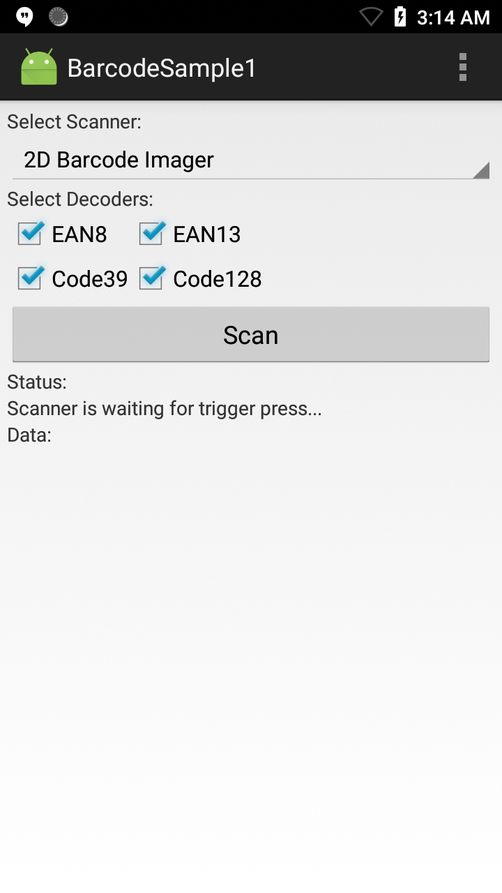

##Overview
EMDK for Android can be used handle all barcode scanning entirely in Java using [Barcode/Scanning APIs](/emdk-for-android/7-3/api). These APIs work independently of any [Data Capture profiles](/emdk-for-android/7-3/mx/data-capture/barcode).  

>**Note**: As of EMDK 6.8, DataWedge can no longer be configured for data capture through Profile Manager. Zebra recommends using the [DataWedge APIs](/datawedge/latest/guide/api/) instead.

The available actions in the [Barcode/Scanning API](/emdk-for-android/7-3/api) are:
  
* Set [Scanner Device](/emdk-for-android/7-3/api/barcode/BarcodeManager-DeviceIdentifier/)  
* Set [TriggerType](/emdk-for-android/7-3/api/barcode/Scanner)
* Set [Decoder Params](/emdk-for-android/7-3/api/barcode/ScannerConfig-DecoderParams)
* Set [Reader Params](/emdk-for-android/7-3/api/barcode/ScannerConfig-ReaderParams)
* Set [Scan Params](/emdk-for-android/7-3/api/barcode/ScannerConfig-ScanParams)
* Scan barcodes based on selected features   

This sample application permits barcode scanning based on the selected scanner and [Decoder Params](/emdk-for-android/7-3/api/barcode/ScannerConfig-DecoderParams).

##Requirements
* Android Studio on a Mac or Windows PC with Android API 22 (or higher) installed
* Two (2) Zebra Android devices, at least one of which is among the [supported devices](../../guide/about/#supporteddevices)
* A barcode that contains the Bluetooth MAC address of the second Zebra device (to pair with)

##Using Sample App

>**NOTE**: The appearance of sample app screens can vary by sample app version, Android version and screen size.

Before beginning, download, build and install the sample app. For help, please see the [Sample App Set-up Guide](/emdk-for-android/7-4/guide/emdksamples_androidstudio). 

##Using This Sample
1. When the application starts it should look similar to the image below:
  
   
  
2. Select a scanner to use. If the desired scanner is external to the mobile device (Bluetooth or wired), be sure it's connected and in "SSI" mode before making a selection. 

   

3. Check all Decoder checkboxes (or confirm that they're already checked) so the screen appears similar to the image below: 
    
   

4. Click the "Start" button. The Status section updates to indicate readiness similar to the image below:

   
 
5. Point the device at a barcode and press the scan trigger. The app displays the scanned barcode data similar to the image below: 
   
   
  
