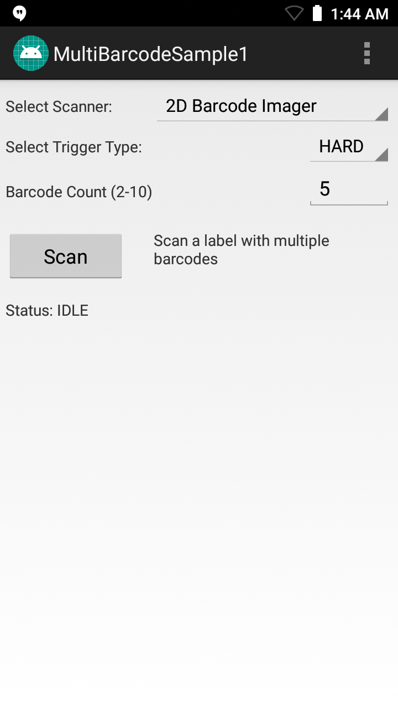

##Overview
This sample demonstrates simultaneous scanning of multiple Unique Device Identification (UDI) barcodes using capabilities in the Barcode/Scanning APIs introduced with EMDK for Android 6.8. These APIs work independently of any [Data Capture profiles](/emdk-for-android/7-3/mx/data-capture/barcode).  

#### Notes

* **This sample illustrates a single use-case** for implementing multi-barcode features; it is not a comprehensive example of the many ways this feature could be used. 
* **DataWedge cannot be configured for data capture through Profile Manager** when using EMDK-A 6.8 and higher. Zebra recommends using the [DataWedge APIs](/datawedge/latest/guide/api/) instead.
  
##Requirements
* Android Studio on a Mac or Windows PC with Android API 22 (or higher) installed. See [EMDK Setup Guide](/emdk-for-android/7-4/guide/setup) for help. 
* A supported Zebra Android device (see list above)
* A scan target with two or more UDI barcodes

##Using Sample App

>**NOTE**: The appearance of sample app screens can vary by sample app version, Android version and screen size.

**Before beginning, download, build and install the sample app**.  See the [Sample App Set-up Guide](../../guide/emdksamples_androidstudio) for help. 

1. **Launch the sample app**. It should appear similar to the image below:
  
  
2. **Select the desired scanner, point the device at a UDI scan target with multiple barcodes and tap the Scan button**. The status area should appear similar to the image below:  

  

> **NOTE: Sample apps are for demonstration purposes only and should not be used in production environments**.
 
  