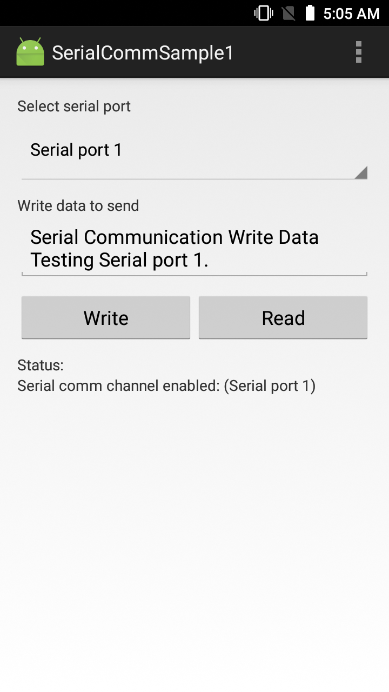
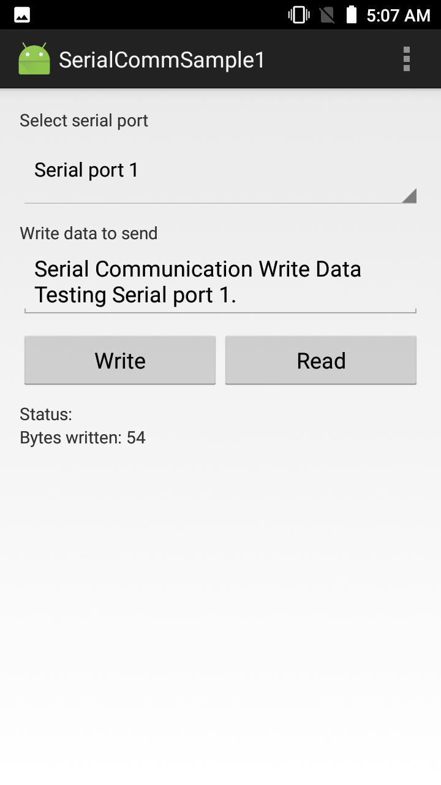
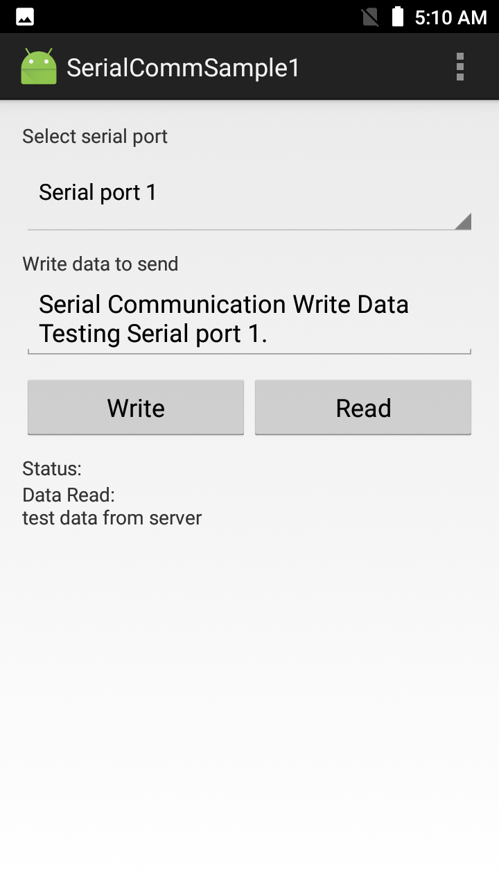

##Overview
This sample demonstrates the EMDK Serial Communication API to enable support for DEX (data exchange) in an application. DEX is a format for collecting audit and event data from vending machines.

>Note: Use of **Serial Read** functionality requires BSP 19.03 and LifeGuard 14 or later. To obtain this OS update patch, please visit the [Zebra support portal](https://www.zebra.com/us/en/support-downloads/software/operating-system/tc70-operating-system.html). 

##Requirements
* Android Studio on a Mac or Windows PC with Android API 22 (or higher) installed. See [EMDK Setup Guide](/emdk-for-android/7-4/guide/setup) for help. 
* A supported Zebra Android device (see list above)
* BSP 19.03 and LifeGuard 14 or later (see above for link)
* TC7X SNAP-On DEX cable ( CBL-TC7X-DEX1-01 )

##Using Sample App

>**NOTE**: The appearance of sample app screens can vary by sample app version, Android version and screen size.

Before beginning, download, build and install the sample app. For help, please see the [Sample App Set-up Guide](/emdk-for-android/7-4/guide/emdksamples_androidstudio). 

1. **Attach the DEX cable and launch the sample app**. The screen should look similar to the image below:  
    
2. **Press the Write button**. The app sends the text from the edit field and displays the number of bytes sent in the status area similar to the image below: 
      
3.  **Press the Read button**. The app continues to read for 10 seconds and displays the read data in the status area:
    
  
> **NOTE: Sample apps are for demonstration purposes only and should not be used in production environments**.
