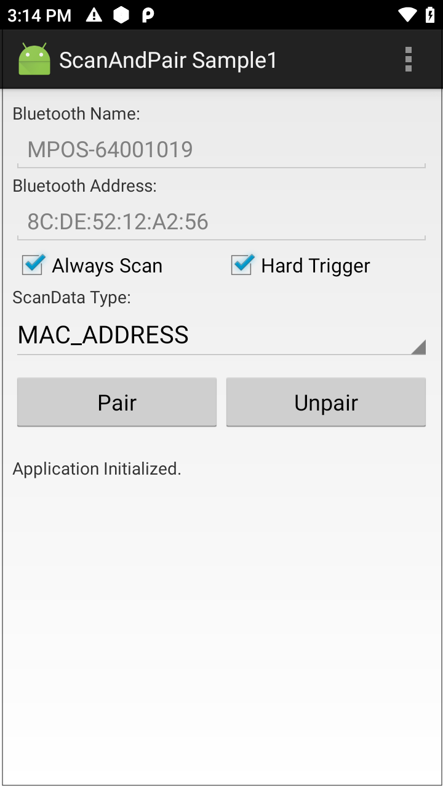
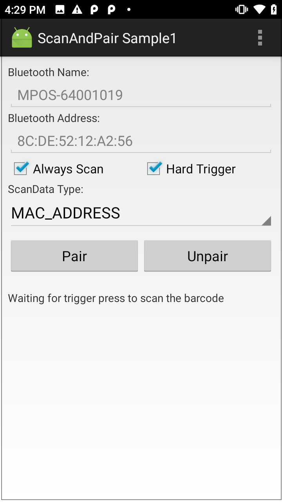
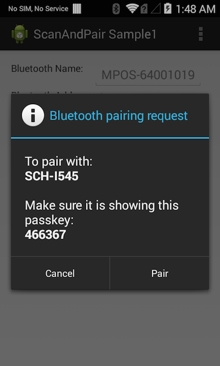

##Overview
This sample app shows how the Scan and Pair API is used to programmatically pair two Bluetooth devices.

##Requirements
* Android Studio on a Mac or Windows PC with Android API 22 (or higher) installed
* Two (2) Zebra Android devices, at least one of which is among the [supported devices](../../guide/about/#supporteddevices)
* A barcode that contains the Bluetooth MAC address of the second Zebra device (to pair with)

##Using Sample App

>**NOTE**: The appearance of sample app screens can vary by sample app version, Android version and screen size.

&#49;. Download, build and install the sample app. For help, please see the [Sample App Set-up Guide](/emdk-for-android/7-4/guide/emdksamples_androidstudio). 

&#50;. When the application starts, it should look similar to the image below. **Confirm that the "Always Scan" and "Hard Trigger" check boxes are checked and that the "ScanData Type" is set to "MAC_ADDRESS**."

<!--     
 -->   
  

&#51;. **Press the "Pair" button**. The status label (in the lower section of the app) indicates that the Scan and Pair process has started and prompts the user to press the hard scan trigger.

<!--      
 -->
  

&#52;. **Place the pairing barcode in view of the device's scan window and press the hard scan trigger**. The app retrieves the MAC address from the barcode, places it in the **Bluetooth Address** field and initiates the pairing and connection process. **Press Pair in the pairing request dialog** (as seen below) to complete the pairing process. 

<!--    
 -->  

**Pairing has completed successfully when the status label displays "Bluetooth device is paired successfully**."
