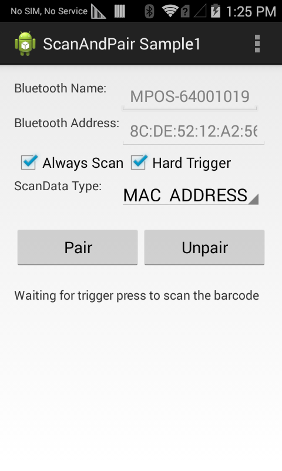

##Overview
This sample app shows how the Scan and Pair API is used to programmatically pair two bluetooth devices.

##Prerequisites

This sample requires two Android Bluetooth devices, one of which that supports EMDK. Also required is a barcode that contains the Bluetooth MAC address of the Bluetooth device (not running the EMDK app) to pair with.

##Requirements
Android API 22 (or higher) must be installed via the SDK Manager before attempting to load this sample.

##Loading the Sample Application
The following guide walks through set-up of the EMDK samples in the IDE.

* [Android Studio](/emdk-for-android/7-4/guide/emdksamples_androidstudio)

##Using This Sample

&#49;. When the application starts, it should look similar to the image below. **Confirm that the "Always Scan" and "Hard Trigger" check boxes are checked and that the "ScanData Type" is set to "MAC_ADDRESS**."

<!--     
 -->   
  

&#50;. **Press the "Pair" button**. The status label (in the lower section of the app) indicates that the Scan and Pair process has started and prompts the user to press the hard scan trigger.

<!--      
 -->
  

&#51;. **Place the pairing barcode in view of the device's scan window and press the hard scan trigger**. The app retrieves the MAC address from the barcode, places it in the **Bluetooth Address** field and initiates the pairing and connection process. **Press Pair in the pairing request dialog** (as seen below) to complete the pairing process. 

<!--    
 -->  

**Pairing has completed successfully when the status label displays "Bluetooth device is paired successfully**."
