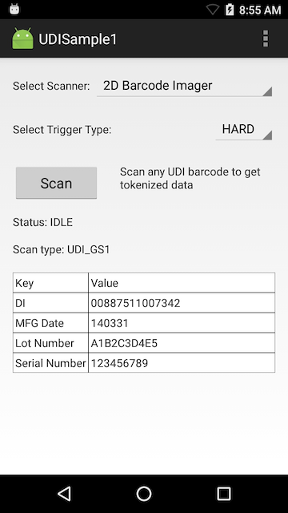

##Overview
This sample application shows how the Barcode API's UDI Label scanning features can be used to scan Barcodes in a UDI Label. This API supports scanning of labels from three issuing agencies ( GS1, ICCBBA, and HIBCC).

#### NOTES
* **This sample illustrates a single use-case** for implementing UDI label scanning features; it is not a comprehensive example of the many ways this feature could be used. 
* **For a complete example of barcode scanning implementation**, see [Barcode Sample 1](../barcode).

<!-- 6/27/19- removed, per eng. Runtime NA. 
##Prerequisites
Although this sample may work with previous versions of the EMDK, it is advised to [update the EMDK runtime](../../guide/setupDevice/) on your device before loading this sample.
 -->
##Loading the Sample Application
The following guide will walk you through setting up the EMDK samples in your IDE.

* [Android Studio](/emdk-for-android/7-4/guide/emdksamples_androidstudio)

>**NOTE**: The appearance of sample app screens can vary by sample app version, Android version and screen size.

##Using This Sample

**1.**  With Trigger type set to **Hard**, Press the **Scan** button to enable the scanner.

* Status Label will display **Waiting**
  

**2.**  Now point the scanner of your device at a UDI Label and press the Hardware Scan Trigger.

* Upon a successful scan, the type of UDI label and a table of UDI Data will be displayed.
  
