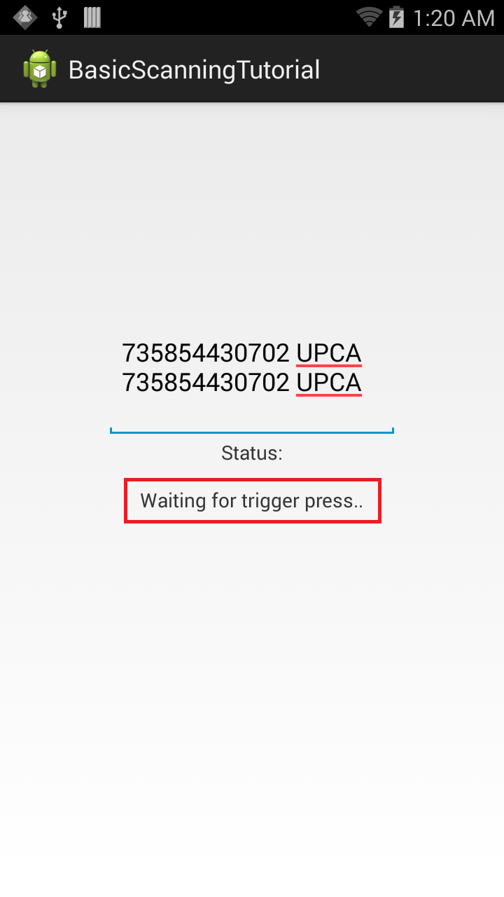

 <button type="button" class="close" data-dismiss="alert" aria-label="Close">×</button> <h4>Important information about data capture interfaces:</h4> 
Zebra <u>strongly recommends using DataWedge</u> for all applications that require barcode scanning and data capture. If using EMDK native Barcode APIs, migration to DataWedge interfaces is strongly advised.
 
 Here are the facts:
    
<ul>
        <li><b>DataWedge APIs have the same capabilities</b> currently available in EMDK.</li>
        <li>DataWedge intent-based APIs are <b>easier and faster to implement</b> than EMDK APIs.</li>
        <li><b>New features are always added to DataWedge first</b> before being <i>considered</i> for addition to EMDK; there is no guarantee that the same features will be exposed in EMDK APIs.</li>
    </ul>
     
    <a href="/datawedge" class="btn btn-danger">Learn About DataWedge</a>  

 

## Overview

This guide provides a walk-through of the steps for creating an application that uses [Barcode/Scanning APIs](../../guide/api) to perform Scanning operations on a Zebra Android device without using Profile Wizard. The API uses [Barcode Manager](../../guide/barcode_scanning_guide/), which is the primary object for accessing barcode scanning features. 

> Note: **The demo app in this guide is intended for tutorial purposes only** and should not be used in production environments. 

-----

### Create The Project

Start by creating a new project in Android Studio. Call it `BasicScanningTutorial` to match later references in this guide. For help, see the [Android Studio tutorial](../../tutorial/tutCreateProjectAndroidStudio). 

### Enable Android Permissions

Modify the application's `Manifest.xml` file to use the EMDK library and to set permissions for EMDK to scan the barcodes. 

1. Enable permissions for `com.symbol.emdk.permission.EMDK`:  

        :::xml
		<manifest xmlns:android="http://schemas.android.com/apk/res/android"
		    package="com.example.basicscanningtotorial">
		    <uses-permission android:name="com.symbol.emdk.permission.EMDK" />
		    <application>
				...
		    </application>
		</manifest>

2. Enable the EMDK library in the application node:  
      
        :::xml
        <uses-library android:name="com.symbol.emdk" />

3. Add references to the libraries:  

        :::java
        import com.symbol.emdk.EMDKManager;
		import com.symbol.emdk.EMDKManager.EMDKListener;
		import com.symbol.emdk.barcode.ScanDataCollection;
		import com.symbol.emdk.barcode.Scanner.DataListener;
		import com.symbol.emdk.barcode.Scanner.StatusListener;
		import com.symbol.emdk.barcode.StatusData;   

4. Extend the activity to implement `EMDKListener`, implement `StatusListener` for notifying client applications to notify scan events, and override its `onStatus` function.
    
        :::java
        public class MainActivity extends Activity implements EMDKListener, StatusListener, DataListener{  
            //some lines of code omitted for clarity
            @Override  
            public void onClosed() {  
                   // TODO Auto-generated method stub  
            }  
            @Override  
            public void onOpened(EMDKManager emdkManager) {  
                   // TODO Auto-generated method stub  
            }
            @Override
            public void onData(ScanDataCollection scanDataCollection) {
                        // TODO Auto-generated method stub
            }
            @Override
            public void onStatus(StatusData statusData) {
                        // TODO Auto-generated method stub
            }
        }

5. Create some global variables to hold the instance objects of `EMDKManager`, `BarcodeManager` and `Scanner`. These variables are used throughout the code. This section also adds some UI elements starting with a [TextView](http://developer.android.com/reference/android/widget/TextView.html) to display the status of the scanning operation and [EditText](http://developer.android.com/reference/android/widget/EditText.html) to populate scanned barcode data.
    
        :::java
        // Declare a variable to store EMDKManager object
		private EMDKManager emdkManager = null;
	
		// Declare a variable to store Barcode Manager object
		private BarcodeManager barcodeManager = null;
	
		// Declare a variable to hold scanner device to scan
		private Scanner scanner = null;
	
		// Text view to display status of EMDK and Barcode Scanning Operations
		private TextView statusTextView = null;
	
		// Edit Text used to display scanned barcode data
		private EditText dataView = null;

		// boolean flag to start scanning after scanner initialization
		// Used in OnStatus callback to ensure scanner is idle before read() method is called 
		private boolean startRead = false;

6. Design a simple UI that has a [TextView](http://developer.android.com/reference/android/widget/TextView.html) to display the status of scanning operation. Above that is an [EditText](http://developer.android.com/reference/android/widget/EditText.html) element to populate scanned barcode data.

7. Remove all the code inside the `res/layout/activity_main.xml` folder and add the following XML layout code for the UI:

        :::xml
        <RelativeLayout xmlns:android="http://schemas.android.com/apk/res/android"
        xmlns:tools="http://schemas.android.com/tools"
        android:layout_width="match_parent"
        android:layout_height="match_parent"
        android:padding="16dip"
        tools:context=".MainActivity" >

          <EditText
          android:id="@+id/editText1"
          android:layout_width="wrap_content"
          android:layout_height="wrap_content"
          android:layout_above="@+id/textViewStatusTitle"
          android:layout_centerHorizontal="true"
          android:ems="10"
          android:fadeScrollbars="true"
          android:inputType="none|textMultiLine" />

          <TextView
          android:id="@+id/textViewStatus"
          android:layout_width="wrap_content"
          android:layout_height="wrap_content"
          android:layout_centerInParent="true"
          android:text="" />

          <TextView
          android:id="@+id/textViewStatusTitle"
          android:layout_width="wrap_content"
          android:layout_height="wrap_content"
          android:layout_above="@+id/textViewStatus"
          android:layout_centerHorizontal="true"
          android:layout_marginBottom="15dp"
          android:text="Status:" />

        </RelativeLayout>

8. In the onCreate method, take the reference of UI elements that are declared in `res/layout/activity_main.xml` to use them in the [Activity](http://developer.android.com/reference/android/app/Activity.html). Then call `getEMDKManager` to initialize EMDK and confirm that it's ready. 

        :::java
        // Reference to UI elements
		statusTextView = (TextView) findViewById(R.id.textViewStatus);
		dataView = (EditText) findViewById(R.id.editText1);

		// The EMDKManager object will be created and returned in the callback.
		EMDKResults results = EMDKManager.getEMDKManager(
				getApplicationContext(), this);
		// Check the return status of getEMDKManager and update the status Text
		// View accordingly
		if (results.statusCode != EMDKResults.STATUS_CODE.SUCCESS) {
			statusTextView.setText("EMDKManager Request Failed");
		}

9. Write a method `initializeScanner` to initialize and enable the scanner and its listeners by using the Barcode Manager object. The `enable` method enables the scanner hardware. This method does not turn on the laser to start scanning, but makes the scanner available to the application. If the same scanner is enabled by another application, calling the `enable()` method results in a `ScannerException`. 

        :::java
        // Method to initialize and enable Scanner and its listeners
		private void initializeScanner() throws ScannerException {
			if (scanner == null) {
				// Get the Barcode Manager object
				barcodeManager = (BarcodeManager) this.emdkManager
						.getInstance(FEATURE_TYPE.BARCODE);
				// Get default scanner defined on the device
				scanner = barcodeManager.getDevice(DeviceIdentifier.DEFAULT);
				// Add data and status listeners
				scanner.addDataListener(this);
				scanner.addStatusListener(this);
				// Hard trigger. When this mode is set, the user has to manually
				// press the trigger on the device after issuing the read call.
				scanner.triggerType = TriggerType.HARD;
				// Enable the scanner
				scanner.enable();
				//set startRead flag to true. this flag will be used in the OnStatus callback to insure 
				//the scanner is at an IDLE state and a read is not pending before calling scanner.read()
				startRead = true;
			}
		}

10. Create a method to release scanner resources when no longer required. Name this method `deInitilazeScanner`, and call the `disable()` method to unlock the scanner and make it available to other applications.

        :::java
		private void deInitializeScanner() throws ScannerException {
			if (scanner != null) {
				
				try {
					if(scanner.isReadPending()){
						scanner.cancelRead();
					}
                	scanner.disable();
				} catch (Exception e) {
					e.printStackTrace();
            	}
				try {
					scanner.removeDataListener(this);
                	scanner.removeStatusListener(this);
				} catch (Exception e) {
					e.printStackTrace();
				}
				try {
                	scanner.release();
				} catch (Exception e) {
					e.printStackTrace();
            	}

            scanner = null;
			}
		}

11. Use the `onOpened` method to get a reference to the `EMDKManager`. The `EMDKListener` interface triggers this event when the EMDK is ready to be used. The EMDKListener interface must be implemented to get a reference to the `EMDKManager` APIs. This event passes the `EMDKManager` instance and assigns it to the global variable `emdkManager` created in the earlier steps. Used that instance to get an instance of [Barcode Manager](/emdk-for-android/6-10/api/barcode/BarcodeManager) to enable scanning.

        :::java
        this.emdkManager = emdkManager;

		try {
			// Call this method to enable Scanner and its listeners
			initializeScanner();
		} catch (ScannerException e) {
			e.printStackTrace();
		}
		
12. When a barcode is scanned, its data is received in the `onData` method callback. This step gets that data, processes it in the desired format and populates the [EditText](http://developer.android.com/reference/android/widget/EditText.html) UI element.

	The received data should be processed in a background thread so as not to block the UI thread. This can be done using Android's [AsyncTask](http://developer.android.com/reference/android/os/AsyncTask.html). Create the AsyncTask `AsyncDataUpdate` that takes [ScanDataCollection](/emdk-for-android/6-10/api/barcode/ScanDataCollection) that has the scanned data. The `doInBackground` method parses the barcode data and label type into strings, which are passed to the UI thread in the `onPostExecute` method of AsyncTask to populate.   

	As referenced earlier, it's possible to call the `read()` method in this callback so that the user can scan multiple barcodes.

        :::java
        // Update the scan data on UI
		int dataLength = 0;
	
		// AsyncTask that configures the scanned data on background
		// thread and updated the result on UI thread with scanned data and type of
		// label
		private class AsyncDataUpdate extends
				AsyncTask<ScanDataCollection, Void, String> {
	
			@Override
			protected String doInBackground(ScanDataCollection... params) {
	
				// Status string that contains both barcode data and type of barcode
				// that is being scanned
				String statusStr = "";
	
				try {
	
					// Starts an asynchronous Scan. The method will NOT turn ON the
					// scanner, but puts it in a state in which the scanner can be turned 
					// on automatically or by pressing a hardware trigger

					scanner.read();	
					ScanDataCollection scanDataCollection = params[0];

					// The ScanDataCollection object gives scanning result and the
					// collection of ScanData. So check the data and its status

					if (scanDataCollection != null
							&& scanDataCollection.getResult() == ScannerResults.SUCCESS) {
	
						ArrayList<ScanData> scanData = scanDataCollection
								.getScanData();
	
						// Iterate through scanned data and prepare the statusStr
						for (ScanData data : scanData) {

							// Get the scanned data
							String a = data.getData();
							// Get the type of label being scanned
							LabelType labelType = data.getLabelType();
							// Concatenate barcode data and label type
							statusStr = barcodeData + " " + labelType;
						}
					}
	
				} catch (ScannerException e) {
					// TODO Auto-generated catch block
					e.printStackTrace();
				}
	
				// Return result to populate on UI thread
				return statusStr;
			}
	
			@Override
			protected void onPostExecute(String result) {
				// Update the dataView EditText on UI thread with barcode data and
				// its label type
				if (dataLength++ > 50) {
					// Clear the cache after 50 scans
					dataView.getText().clear();
					dataLength = 0;
				}
				dataView.append(result + "\n");
			}
	
			@Override
			protected void onPreExecute() {
			}
	
			@Override
			protected void onProgressUpdate(Void... values) {
			}
		}

    We call this AsyncTask in overridden `onData` method, by creating an instance of `AsyncDataUpdate` and passing the `scanDataCollection` for further processing.

        :::java
        // Use the scanned data, process it on background thread using AsyncTask
		// and update the UI thread with the scanned results
		new AsyncDataUpdate().execute(scanDataCollection);
  
7. Whether scanning the barcode by pressing the hard scan key or keeping it idle, it returns the status of the scanner at a specific point in time in the overridden `onStatus` method of the implemented `StatusListener` interface. Since the status also is being displayed along with barcode data, the app can make use of this method and populate the status.

	Just like scanned data, the scanner status is being processed in a background thread. Hence another [AsyncTask](http://developer.android.com/reference/android/os/AsyncTask.html) (named `AsyncStatusUpdate`) is created to take [StatusData](/emdk-for-android/6-10/api/barcode/StatusData) and processes it in the `doInBackground` method to retrieve the state in string format. This is populated in status Text View in the UI thread in the `onPostExecute` method of the AsyncTask. 

        :::java
        // AsyncTask that configures the current state of scanner on background
		// thread and updates the result on UI thread
		private class AsyncStatusUpdate extends AsyncTask<StatusData, Void, String> {
	
			@Override
			protected String doInBackground(StatusData... params) {
				String statusStr = "";
				// Get the current state of scanner in background
				StatusData statusData = params[0];
				ScannerStates state = statusData.getState();
				// Different states of Scanner
				switch (state) {
				// Scanner is IDLE
				case IDLE:
					statusStr = "The scanner enabled and its idle";
					break;
				// Scanner is SCANNING
				case SCANNING:
					statusStr = "Scanning..";
					break;
				// Scanner is waiting for trigger press
				case WAITING:
					statusStr = "Waiting for trigger press..";
					break;
				// Scanner is not enabled
				case DISABLED:
					statusStr = "Scanner is not enabled";
					break;
				default:
					break;
				}
	
				// Return result to populate on UI thread
				return statusStr;
			}
	
			@Override
			protected void onPostExecute(String result) {
				// Update the status text view on UI thread with current scanner
				// state
				statusTextView.setText(result);
			}
	
			@Override
			protected void onPreExecute() {
			}
	
			@Override
			protected void onProgressUpdate(Void... values) {
			}
		}

    We call this AsyncTask in overridden `onStatus` method, by creating an instance of `AsyncStatusUpdate` and passing the `StatusData` for further processing.

        :::java
        // process the scan status event on the background thread using
		// AsyncTask and update the UI thread with current scanner state
		new AsyncStatusUpdate().execute(statusData);

8. Override the `onDestroy` method to release the EMDKManager resources:  

        :::java
        @Override
	    protected void onDestroy() {
		 super.onDestroy();
		 if (emdkManager != null) {

			// Clean up the objects created by EMDK manager
			emdkManager.release();
			emdkManager = null;
		 }
	    } 

9. When the app is done scanning, scanner hardware resources must be released for other applications to use. Override `onStop` method and disable the scanner to release it:

        :::java
        @Override
	    protected void onStop() {
		  // TODO Auto-generated method stub
		  super.onStop();
		  try {
			if (scanner != null) {
				// Releases the scanner hardware resources for other application
				// to use. Must be called as soon as scanning is done. 
				//
				scanner.removeDataListener(this);
				scanner.removeStatusListener(this);
				scanner.disable();
				scanner = null;
			}
		  } catch (ScannerException e) {
			e.printStackTrace();
		  }
	    }

10. Lastly, clean up the objects created by EMDK manager in `onClosed` method in case EMDK closed abruptly:

        :::java
        // The EMDK closed abruptly. // Clean up the objects created by EMDK
		// manager
		if (this.emdkManager != null) {

			this.emdkManager.release();
			this.emdkManager = null;
		}
        	
#### The sample app is now ready to use. 

-----
 
## Running the Application

1. Connect the device to a USB port on the development host. 
	**Note**: The device must be in USB Debug mode.
 
2. Run the application.

    

    A [Toast message](http://developer.android.com/guide/topics/ui/notifiers/toasts.html) appears indicating that the Scanner has been enabled and scans can begin by pressing hard scan button of the device.
  
3. Pressing the hard scan button causes the status listener in the code to start working; the current status of Scanner (which is "Scanning") is displayed in the Status [TextView](http://developer.android.com/reference/android/widget/TextView.html).  

    

4. Once finished with scanning, release the hard scan button. Data is populated to [EditText](http://developer.android.com/reference/android/widget/EditText.html) and status "Idle" is displayed in the Status [TextView](http://developer.android.com/reference/android/widget/TextView.html).

      

This is how [Barcode/Scanning APIs](/emdk-for-android/6-10/api) can be used to perform Basic Scanning operations on Zebra devices without using the Profile Wizard. 

-----

##Important Programming Tips

### Edit the manifest

1. Be sure to make the following required changes in the application's AndroidManifest.xml:  
  
    >Note:
    >* Include the permission for EMDK:  
    
        :::xml
        <uses-permission android:name="com.symbol.emdk.permission.EMDK"/>
    
	>Note:
    >* Use the EMDK library:  
    
        :::xml
        <uses-library android:name="com.symbol.emdk"/>
   
2. Use DataWedge v1.7.12 or higher to test the `ProfileManager.processProfile()` for DataWedge profiles.

### Content Backup

Once the barcode is enabled, the `read` method is called on the scanner and the scanning API provides starts an asynchronous scan. The method does turn on the scanner, but puts the scanner in a state in which it can be turned ON either automatically or by pressing a hardware trigger as determined by the `Scanner.TriggerType`. The data notification must registered in order to scan and get the scan data. The read request can be canceled by issuing a `cancelRead`. If a `read()` is submitted while another read is pending, the method call fails. Therefore, **Zebra recommends checking whether a read is pending by calling** `isReadPending()` before submitting a `read()`. A read() also can be submitted from within `onData` and `onStatus` events. If called within `onStatus`, it should be called only when IDLE status is received. If called within `onData`, then checking for `isReadPending()` is recommended.

> Note: The `read` method allows a single barcode scan only. If multiple scans are desired, the `read` method must be called multiple times.

-----

## What's Next
After completing this basic tutorial, the next logical step might be to explore the [Barcode/Scanning APIs](/emdk-for-android/6-10/api) in depth, and use them to perform advanced scanning operations.
