## Overview

This guide will walk you through creating an EMDK For Android application that will use Mx features introduced in EMDK for Android API to perform device configurations. Mx represents a suite of Enterprise Features on top of standard, commercially available Android Open Source Project. So this tutorial will focus on configuring Access Points of the mobile networks present in your Symbol Android device using [GPRS Manager](../../mx/gprsmgr) feature of Mx. [GPRS Manager](../../mx/gprsmgr) allows you to perform following operations on Access Points of your device's mobile network: 

**1. Add/Replace named APN:**

Using this feature, user can add a new APN (Access Point Name) or replace an existing APN on your device's Mobile Network. User can also set a specific APN as default. The EMDK wizard for GPRS Manager requires various inputs such as GPRS Carrier (ATT, T-Mobile or Custom), APN Name and supply details for APN (Access Point, User Name and Password).

   > Note: For ATT and T-Mobile option the user and password filed are required. 

**2. Remove existing named APN:**

This removes a specific named APN from the list of APN's in the device's mobile network. The user just have to provide "APN Name" and it will remove that particular named APN from your device's mobile network. 

**3. Remove all existing APN's:**  

This GPRS Manager feature allows user to remove all the existing APN's from the device's mobile network. The user does not need to provide any additional input except selecting the APN Action as "Remove all existing APN's".

So now we will create a tutorial to demonstrate how to configure Access Points in the device's mobile Network by creating GPRS Profile in the EMDK Wizard.

   > Note: The device should have network carrier to test GPRS Manager Tutorial.     
   

## Creating The Project

> Note: Provide "MxGPRSTutorial" as the project name for this tutorial.

Start by creating a new Android Studio [project](/emdk-for-android/7-4/tutorial/tutCreateProjectAndroidStudio).

## Adding The GPRS Manager Profile Feature
1. Click [here](/emdk-for-android/7-4/tutorial/tutAddProfileManagerFeature) to see how to add a specific feature to the Profile Manager.

2. Provide "GPRSProfile" as the Profile Name for this tutorial.

	> Note: You can provide any Profile Name but make sure to access it with the similar name in the Android code.  
 
3. Now, you can see all these MX features on the left hand side of the Profile Editor window. Since this is GPRS Manager Tutorial, select the "GPRS Manager" feature from the list and click "Right Arrow".

    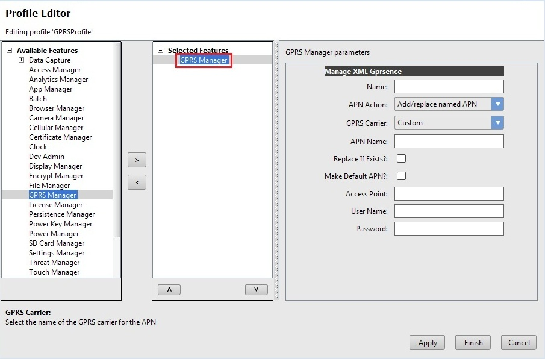

    So as discussed earlier we would now try the GPRS features one by one, by changing the "APN Action" attribute (Add/Replace, Remove, Remove All) in the wizard. In this step let us add a named APN by performing following actions. 

    * Provide some name in the Name field (Ex. MyGPRS). This helps in modifying a particular GPRS Manager of that name programmatically.
    * Select APN Action as "Add/Replace named APN"
    * Select GPRS Carrier from the drop-down menu. You can choose ATT, T-Mobile or Custom Carrier. As of now select "ATT".
    * Provide APN Name (Ex. ATT_APN_1)
    * Check the checkbox "Replace if Exixts?". This will replace APN with the same name from the list if exists.
    * Keep the "Make Default APN?" field as it is. (keep it unchecked).
    * Provide Access Point (Ex. wap.cingular)
    * Provide User Name (Ex. WAP@CINGULARGPRS.COM)
    * Enter Password (Ex. CINGULAR1)

    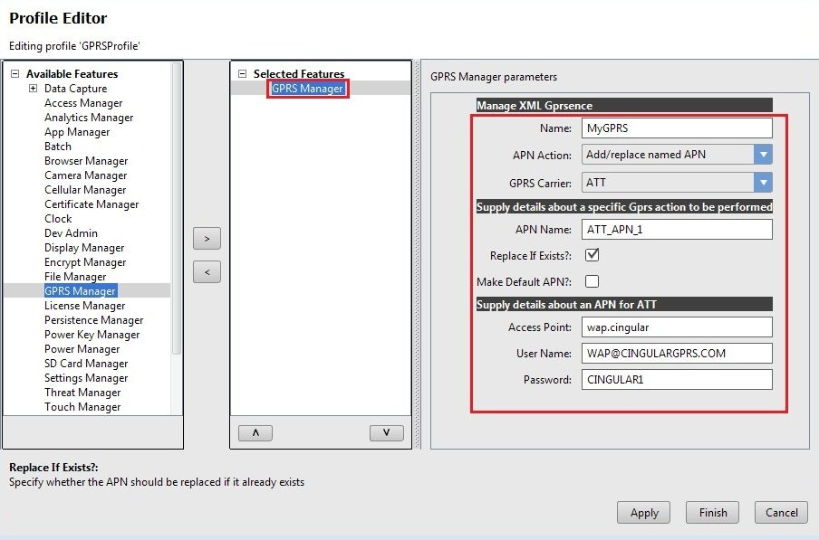   
 
4. Click Apply to apply the settings we provided    
  
    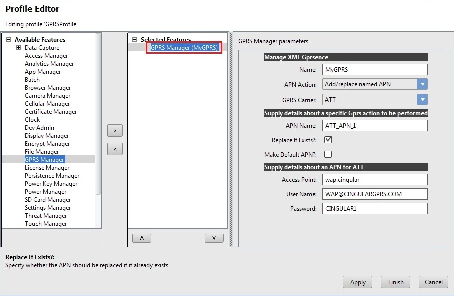

5. Click Finish and your GPRS profile for adding an APN is created.

     
  
6. Click "Close".

    >Note:  
    >Now the "EMDKConfig.xml" is created under "\assets" folder. This file will contain a definition of all of your profiles that you create. 
  
7. You can inspect the "EMDKConfig.xml" to see it is reflecting the changes made to the parameters via EMDK Profile Manager GUI earlier.  However, it is advised that this file not be manually updated and only be controlled via the Profile Manager.

    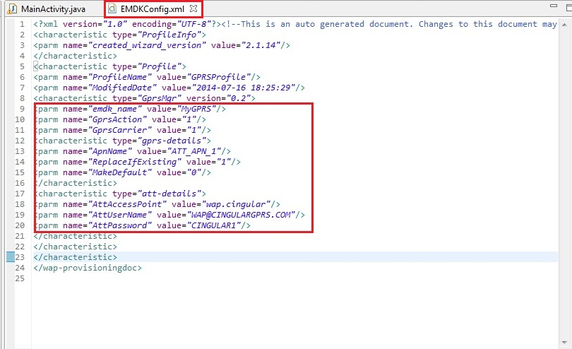    

## Enabling Android Permissions
1. Modify the Application's Manifest.xml to use the EMDK library and to set permission for the EMDK.
  
    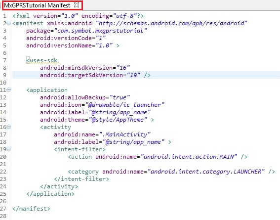

    You must first enable permissions for 'com.symbol.emdk.permission.EMDK':  
   
        :::xml
        <uses-permission android:name="com.symbol.emdk.permission.EMDK"/> 

    Then you must enable the library:  
      
        :::xml
        <uses-library android:name="com.symbol.emdk"/>

    When done, your manifest.xml should look like:

    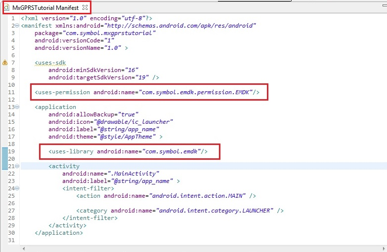 

##Adding Some Code    
1. Now we will start to add some code. 

    First you must add references to the libraries:  
    
        :::java
        import com.symbol.emdk.*;  
        import com.symbol.emdk.EMDKManager.EMDKListener;  
		import android.widget.Toast;    

    Then you must extend the activity to implement EMDKListener. 
    
        :::java
        public class MainActivity extends Activity implements EMDKListener {  
          
            .. .. .. .. .. .. ...  
          
            @Override  
            public void onClosed() {  
                   // TODO Auto-generated method stub  
            }  
          
            @Override  
            public void onOpened(EMDKManager emdkManager) {  
                   // TODO Auto-generated method stub  
            }  
          
        }      

    We will now create some global variables to hold the profile name as well as instance objects of EMDKManager and ProfileManager with a status variable while applying the profile. Some of the variables are used to hold the name, type and description in case of any errors. These variables would be used throughout the code. 

    >Note:
    >Verify the Profile name in the code with the one created in the Profile Manager. They both should be identical.    
    
        :::java
        // Assign the profile name used in EMDKConfig.xml
	    private String profileName = "GPRSProfile";

	    // Declare a variable to store ProfileManager object
	    private ProfileManager profileManager = null;

	    // Declare a variable to store EMDKManager object
	    private EMDKManager emdkManager = null;

		// Contains the parm-error name (sub-feature that has error)
		private String errorName = "";

		// Contains the characteristic-error type (Root feature that has error)
		private String errorType = "";

		// contains the error description for parm or characteristic error.
		private String errorDescription = "";

		// contains status of the profile operation
		private String status = "";

    In the onCreate method, we call getEMDKManager so that the EMDK can be initialized and checked to see if it is ready. 

        :::java
        //The EMDKManager object will be created and returned in the callback.  
        EMDKResults results = EMDKManager.getEMDKManager(getApplicationContext(), this);  
          
        //Check the return status of getEMDKManager  
		if (results.statusCode == EMDKResults.STATUS_CODE.SUCCESS) {

			// EMDKManager object creation success

		} else {

			// EMDKManager object creation failed

		}

    So far your code should look like:
     
     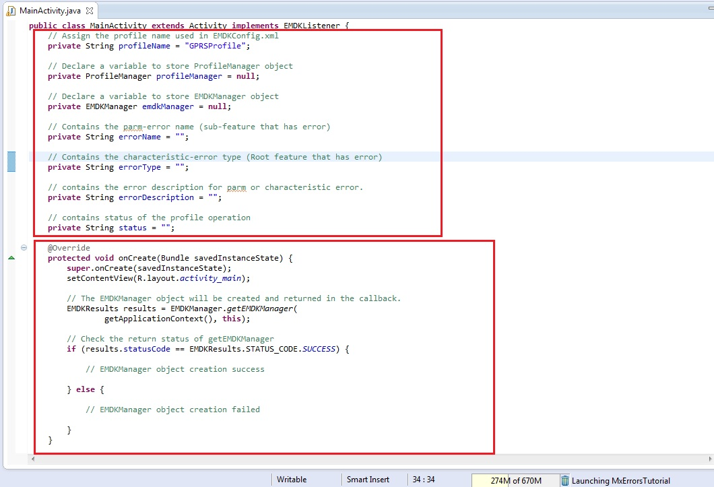 

2. Now we need to use the `onOpened` method to get a reference to the EMDKManager. The EMDKListener interface will trigger this event when the EMDK is ready to be used. The EMDKListener interface must be implemented in order to get a reference to the EMDKManager APIs. This event will pass the EMDKManager instance and we assign it to the global variable `emdkManager` that we created in the previous steps. We then use that instance object to get an instance of ProfileManager and assign it to the global variable `profileManager`. This is how we will interface with the APIs in the rest of the code:

    > Note: 
    > Rename the argument of `onOpened` method from `arg0` to `emdkManager`  

        :::java
        // This callback will be issued when the EMDK is ready to use.
		this.emdkManager = emdkManager;

		// Get the ProfileManager object to process the profiles
		profileManager = (ProfileManager) emdkManager
				.getInstance(EMDKManager.FEATURE_TYPE.PROFILE);         
    
    Now that we have a reference to ProfleManager, we use it to install and activate the profile we built earlier using the `processProfile` method. We could have also performed this action at a different time, say when someone pressed a button, but we chose to do it as soon as the EMDK was ready:

		:::java
		if (profileManager != null) {
			String[] modifyData = new String[1];

			// Call processPrfoile with profile name and SET flag to create the profile. The modifyData can be null.
			EMDKResults results = profileManager.processProfile(profileName,
					ProfileManager.PROFILE_FLAG.SET, modifyData);

			if (results.statusCode == EMDKResults.STATUS_CODE.CHECK_XML) {

			} else {
			  // Show dialog of Failure
				AlertDialog.Builder builder = new AlertDialog.Builder(this);
				builder.setTitle("Failure");
				builder.setMessage("Failed to apply profile...")
						.setPositiveButton("OK",
								new DialogInterface.OnClickListener() {
									public void onClick													(DialogInterface dialog,
											int id) {

									}
								});
				AlertDialog alert = builder.create();
				alert.show();
			}

		}

    This `processProfile` method returns the result of applying a particular profile that we set using EMDK Profile Wizard in [EMDKResults](/emdk-for-android/7-4/api/core/EMDKResults) reference. If the profile is successfully processed, it retuns the status as `CHECK_XML` and then we go on and parse the response to get further details whether the profile was applied successfully or not. Otherwise we display a Failure message in a [dialog](http://developer.android.com/reference/android/app/AlertDialog.html).

	> Note: 1. There is a difference between processing a profile successfully and applying a profile successfully.

	> Note: 2. If the status is other than `CHECK_XML`, we are simply displaying a failure message. You can actually go ahead and check different types of status and display the appropriate message accordingly, which is not in the scope of this sample tutorial.

	In case of `CHECK_XML` status, We retrieve  XML response string from the result using `getStatusString` method.

		:::java
		// Get XML response as a String
		String statusXMLResponse = results.getStatusString();

	Further, we would parse this XML response string using [XML Pull Parser](http://developer.android.com/reference/org/xmlpull/v1/XmlPullParser.html) in order to get the status and error parameters if any. XML Pull Parser is an interface that defines parsing functionality provided in [XMLPULL V1 API](http://www.xmlpull.org/) (visit this website to learn more about API and its implementations). In the parsing we would be looking for specific status tags (Error Name, Error Type and Error Description) in case of any errors and if found, we would get those values in the respective global variables that we have declared in previous step.

		:::java
		try {
			// Create instance of XML Pull Parser to parse the response
			XmlPullParser parser = Xml.newPullParser();
			// Provide the string response to the String Reader that reads
			// for the parser
			parser.setInput(new StringReader(statusXMLResponse));
			// Call method to parse the response
			parseXML(parser);
			} catch (XmlPullParserException e) {
				e.printStackTrace();
			}

	> Note: Here we have called the method `parseXML` to parse XML response string. We will declare the method in the next step. 

	Once the response is parsed, we would display the result of applying this profile in a [dialog](http://developer.android.com/reference/android/app/AlertDialog.html) by calling `displayResults` method, which we would declare in coming steps.

		:::java
		// Method call to display results in a dialog
		displayResults();

    Your complete `onOpened` method should now look like:
    
    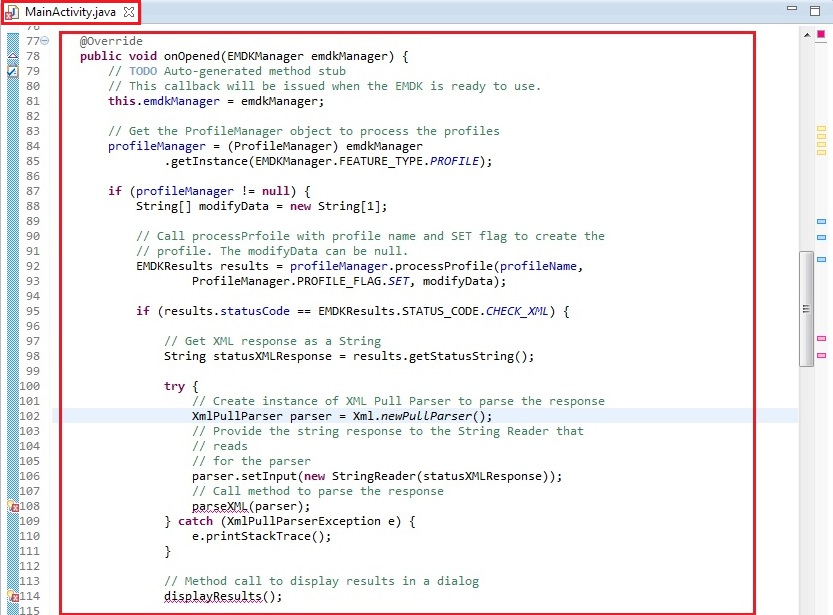 

    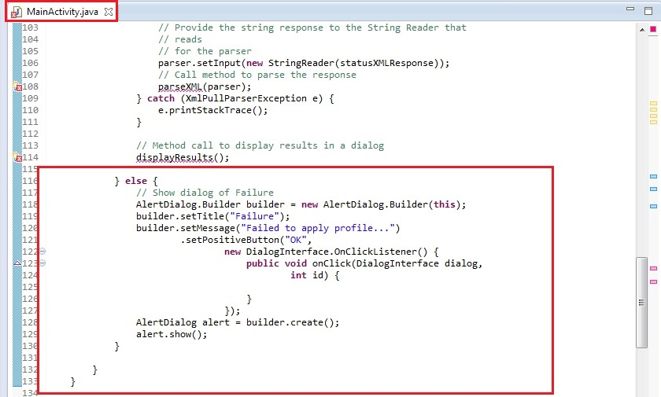

3. You will see few errors as we have not declared the respective methods to parse the response and display result. Lets do it one by one. In this step, we will create a method `parseXML` that uses [XML Pull Parser](http://developer.android.com/reference/org/xmlpull/v1/XmlPullParser.html) to parse the XML string response and set the status and error parameters if any.

	In the reponse, we are supposed to capture `name` and `desc` for `parm-error` tag, `type` and `desc` for `characteristic-error` tag in case of any errors.

		:::java
		// Method to parse the XML response using XML Pull Parser
		public void parseXML(XmlPullParser myParser) {
		int event;
		try {
			event = myParser.getEventType();
			while (event != XmlPullParser.END_DOCUMENT) {
				String name = myParser.getName();
				switch (event) {
				case XmlPullParser.START_TAG:
					// Get Status, error name and description in case of
					// parm-error
					if (name.equals("parm-error")) {
						status = "Failure";
						errorName = myParser.getAttributeValue(null, "name");
						errorDescription = myParser.getAttributeValue(null,
								"desc");

						// Get Status, error type and description in case of
						// parm-error
					} else if (name.equals("characteristic-error")) {
						status = "Failure";
						errorType = myParser.getAttributeValue(null, "type");
						errorDescription = myParser.getAttributeValue(null,
								"desc");
					}
					break;
				case XmlPullParser.END_TAG:

					break;
				}
				event = myParser.next();

			  }
		    } catch (Exception e) {
			e.printStackTrace();
		    }
		}

    Your complete `parseXML` method should now look like:
    
    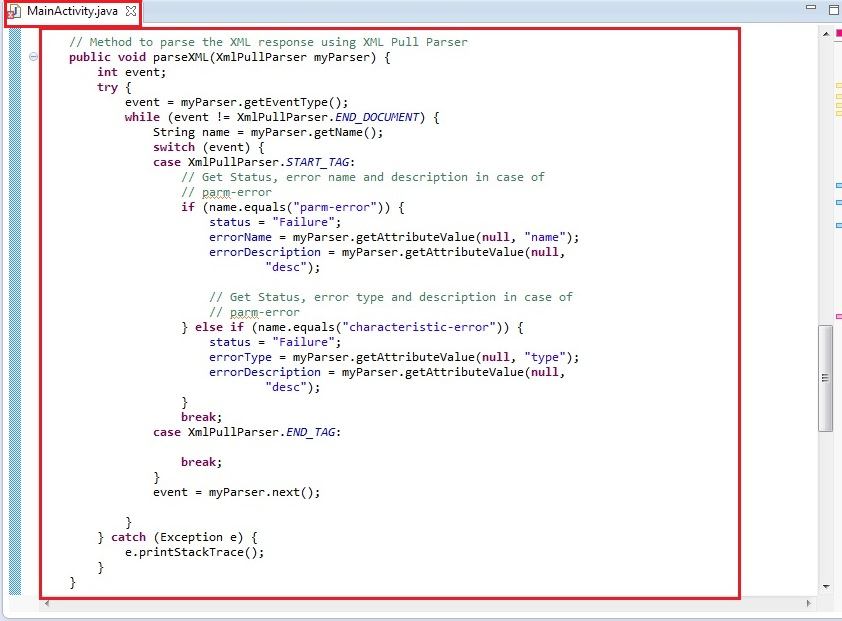 

4. You will still see one error as we need to declare `displayResults` method to display the result of profile operation in a [dialog](http://developer.android.com/reference/android/app/AlertDialog.html). Before displaying the results, we should form the content of the result to be shown first, specifically in case of errors. This could be done by creating `buildFailureMessage` method.
 
    In this method, the error message in case of error is formed using following way: 

    * Name and description of error if the response contains `parm-error`.
    * Type and description of error if the response contains `characteristic-error`.
    * Name, type and description of error if the response contains both `parm-error` and `characteristic-error`.

	The `buildFailureMessage` method would have following code to match the above mentioned criteria.  

		:::java
		// Method to build failure message that contains name, type and
		// description of respective error (parm, characteristic or both)
		public String buildFailureMessage() {
		  String failureMessage = "";
		  if (!TextUtils.isEmpty(errorName) && !TextUtils.isEmpty(errorType))
			 failureMessage = errorName + " :" + "\n" + errorType + " :" + "\n"
					+ errorDescription;
		  else if (!TextUtils.isEmpty(errorName))
			 failureMessage = errorName + " :" + "\n" + errorDescription;
		  else
			 failureMessage = errorType + " :" + "\n" + errorDescription;
		  return failureMessage;

		}

    `buildFailureMessage` method should look like:
    
    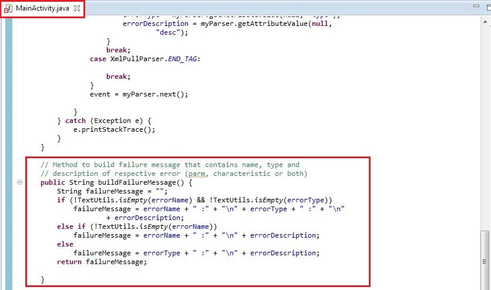

5. In this step, we will add `displayResults` method to display the result of profile operation in a [dialog](http://developer.android.com/reference/android/app/AlertDialog.html). The dialog would display status as `Success` or `Failure` with corresponding message based on the response of profile operation.

		:::java
		// Method to display results (Status, Error Name, Error Type, Error
		// Description) in a
		// dialog
		public void displayResults() {
		  // Alert Dialog to display the status of the Profile creation
		  // operation of MX features
		  AlertDialog.Builder alertDialogBuilder = new AlertDialog.Builder(
				MainActivity.this);

		  if (TextUtils.isEmpty(errorDescription)) {
			alertDialogBuilder.setTitle("Success");
			alertDialogBuilder.setMessage("Profile Successfully Applied...");
		  } else {
			// set title
			alertDialogBuilder.setTitle(status);
			// call buildFailureMessage() method to set failure message in
			// dialog
			alertDialogBuilder.setMessage(buildFailureMessage());
		  }

		  alertDialogBuilder.setCancelable(false).setPositiveButton("OK",
				new DialogInterface.OnClickListener() {
					public void onClick(DialogInterface dialog, int id) {
					}
				});
		  // create alert dialog
		  AlertDialog alertDialog = alertDialogBuilder.create();

		  // show it
		  alertDialog.show();

	    }  

    The method `displayResults` should look like:
    
    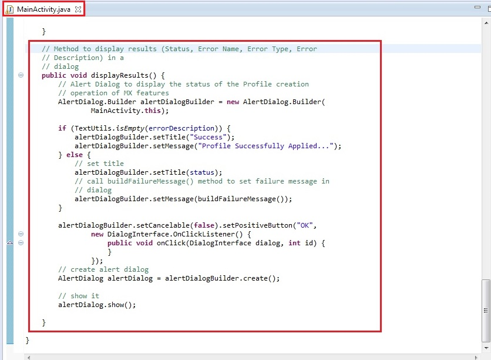
	
	You can see that all the errors are gone.  
    
6. Now let's override the "onDestroy" method so we can release the EMDKManager resources:  

        :::java
        @Override  
        protected void onDestroy() {  
            // TODO Auto-generated method stub  
            super.onDestroy();  
            //Clean up the objects created by EMDK manager  
            emdkManager.release();  
        } 

    Your onDestroy method should now look like this:  

    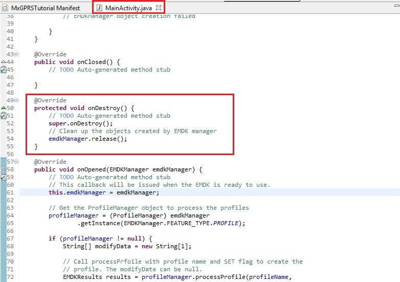 

That's it!!! We are done with all the coding and configuration part that will let us Add/Replace a named APN. Now let us run the application.
 
## Running the Application

1. Connect the device (having the latest EMDK runtime) to USB port. 

    > Note:   
    > Make sure the device is in USB debug.
    > Make sure the device has Network Carrier

    Before running the application, We will see the Access Points that are already present in the device's Mobile Network.

    Go to device's Settings -> More (in Wireless & Networks) -> Mobile Networks -> Access Point Names

    

    You can see there are two T-Mobile Access Points already present. After running this application, the ATT Access Point will be added in this list that we had created in GPRS Manager Wizard earlier.  

2. Run the application.

    

	You can see an [Alert Dialog](http://developer.android.com/reference/android/app/AlertDialog.html) with a success message.

	> Note: In case of any errors, you will see a Failure status with respective error message in that dialog.

    Now again go to device's Settings -> More (in Wireless & Networks) -> Mobile Networks -> Access Point Names 
  
	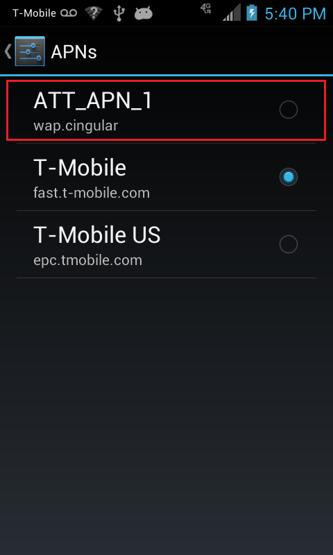

    You can see that the ATT Access Point that we created has been added successfully to the APN's list.

    > Note: The ATT Access Point is added but not selected as default because we kept "Make Default APN?" field unchecked in the Profile Creation Wizard.
  
3. In this step we will remove an existing named APN. So select the project "MxGPRSTutorial" and click EMDK button at the top-bar to go to "Profile Manager" option just like we did earlier.

      

4. Click Edit button and you will see our previous configuration of Add/Replace APN:

    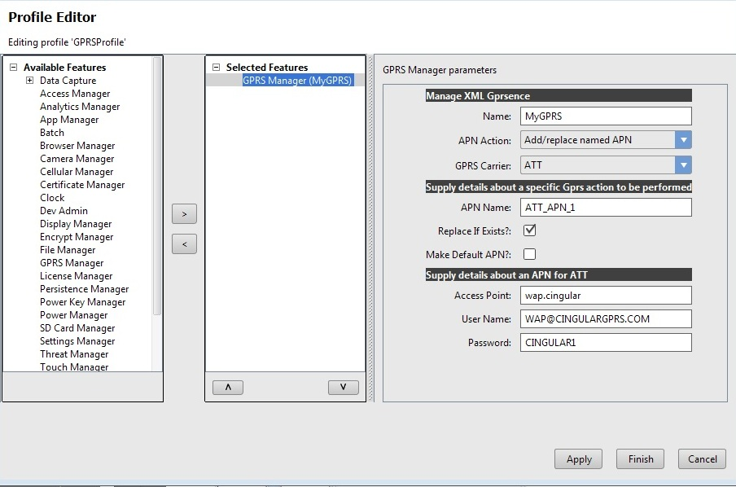

    Select "Remove existing named APN" option from the "APN Action" drop down.

    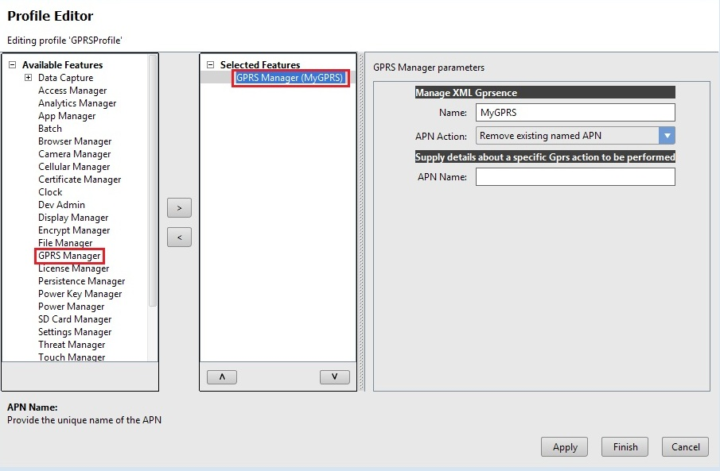

    Provide the unique name of the APN that you had set while Adding that named APN (Ex. ATT_APN_1)

    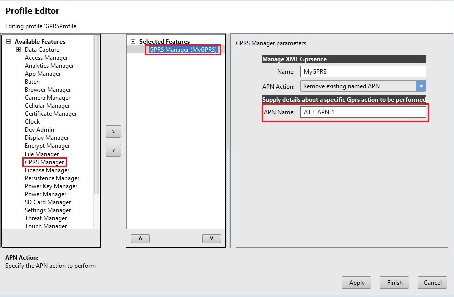

    Click Apply, Finish and then Close. The Profile has now been edited successfully to remove an existing named APN.

6. Run the application again. 
 
	

	You can see an [Alert Dialog](http://developer.android.com/reference/android/app/AlertDialog.html) with a success message.

	> Note: In case of any errors, you will see a Failure status with respective error message in that dialog.

    Go to device's Settings -> More (in Wireless & Networks) -> Mobile Networks -> Access Point Names

    

    You can see that the named APN "ATT_APN_1" has been successfully removed from the device's APN list. 

6. Finally, we would test the third feature of GPRS Manager that allows us to remove all the existing APN's.

    Select the project "MxGPRSTutorial", go to the Profile Manager and click edit button as we did in previous steps.

    Select "Remove all existing APN's" feature from the "APN Action" drop-down of GPRS Profile.

    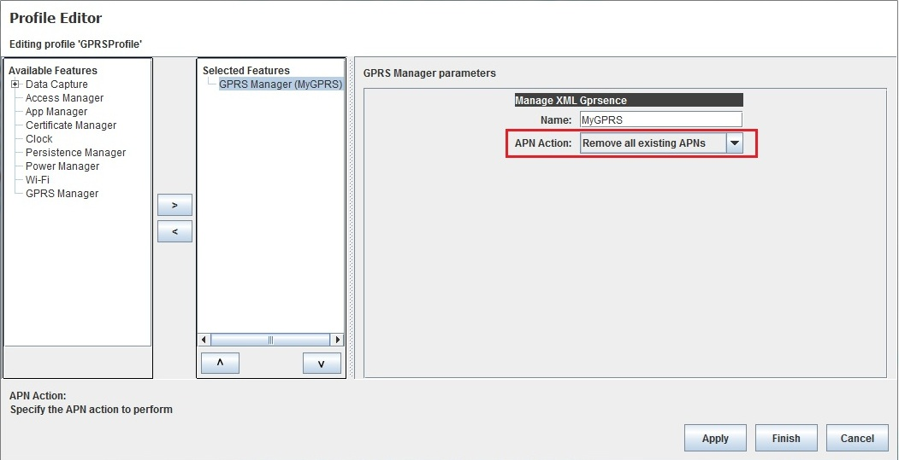

    Click Apply, Finish and then Close buttons.

7. Now Run the application for the final time to ensure all APN's are removed from the device's APN list.

    

	You can see an [Alert Dialog](http://developer.android.com/reference/android/app/AlertDialog.html) with a success message.

	> Note: In case of any errors, you will see a Failure status with respective error message in that dialog.

    To verify, go to device's Settings -> More (in Wireless & Networks) -> Mobile Networks -> Access Point Names 
  
	

    You can now see that all the APN's have been successfully removed from the device's APN list.

    This is how the GPRS manager lets us configure Access Points of the Symbol device.

##Important Programming Tips##

1. It is required to do the following changes in the application's AndroidManifest.xml:  
  
    >Note:
    >* Include the permission for EMDK:  
    
        :::xml
        <uses-permission android:name="com.symbol.emdk.permission.EMDK"/>
    
	>Note:
    >* Use the EMDK library:  
    
        :::xml
        <uses-library android:name="com.symbol.emdk"/>
  
2. Installing the EMDK for Android application without deploying the EMDK runtime on the Symbol Android device will fail because of missing shared library on the device.
 
4. Use the DataWedge v1.7.12 or higher version to test the ProfileManager.processProfile() for DataWedge profiles.

## What's Next
Now that you have learned how to configure the Access Points on your Symbol Android devices through applications, let us try to understand and implement some of the other Mx features. So in the next tutorial, we will concentrate on the "Access Manager" Mx feature and try to explore this feature by creating a tutorial.

