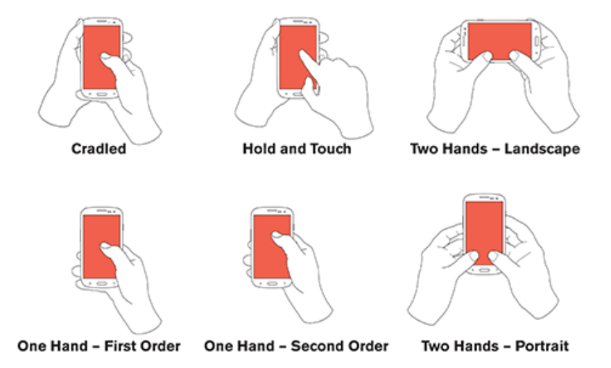
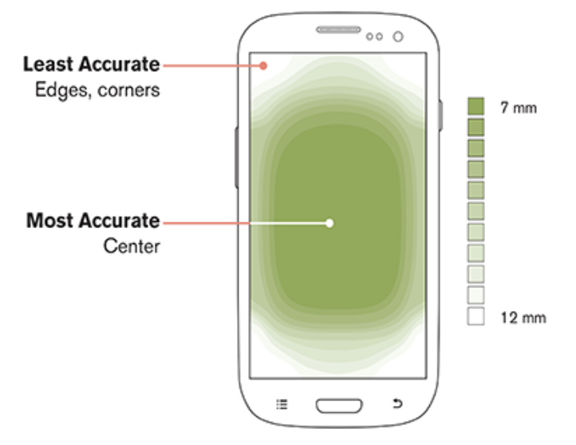
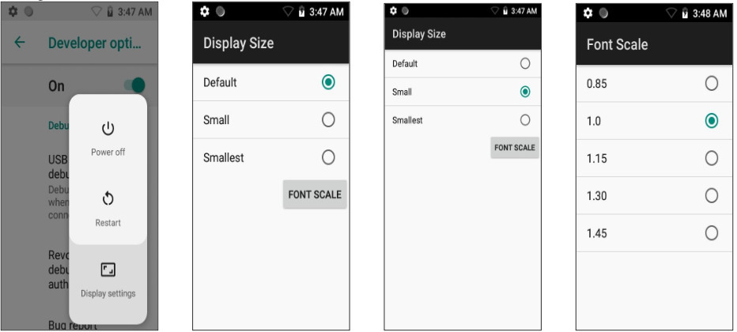

##Overview

The Zebra EC30 Enterprise Companion is an ultra-compact, fully functional mobile computing device that's small enough to fit in the palm of a hand, worn on the wrist or strung around the neck like a smart badge. Industrial applications include retail, health care, warehousing, field service and maintenance, hospitality and many others. 

_Click images to enlarge._

**Key applications of the EC30** include basic barcode scanning, assisted selling and WLAN-based voice and data communications. Employees equipped with the EC30 can query product information, manage inventory, communicate with fellow staff members via PTT or other VoIP apps, receive and track tasks and much more.

#### App Compatibility
The EC30 is built on the same platform as Zebra's TC52 and TC57 mobile computing devices; applications written for Zebra's TC-series should run on the EC30. However, the EC30's 3-inch display is about half the size of most others, so apps often require adjustments to ensure a pleasant user experience. 

**Zebra recommends reading Google's [screen compatibility overview](https://developer.android.com/guide/practices/screens_support) and guidelines for adapting apps to [support different screen sizes](https://developer.android.com/training/multiscreen/screensizes)**. These and other useful links can be found in the [Also See](#alsosee) section at the bottom of this document.

#### Deviations from TC-Series Devices

* **Split screen functionality disabled** due to smaller screen size
* **Capacitive navigation buttons are off-screen** to maximize screen space for apps
* **Height-adjusted soft input panel** (SIP) in portrait and landscape modes

-----

## EC30 Specifications

### Hardware
* **Outer dimensions**: 4.5 x 2.2 x 0.6 inches (114mm x 57mm x14mm) 
* **Weight**: Less than 4 oz. 
* **Display size**: 3.0 inches (diagonal) 
* **Screen dimensions**: 1.5 inches (37 mm) x 2.6 inches (67 mm)
* **Max. resolution**: 480 x 854 pixels (FWVGA)
* **Screen density**: 320 dpi (xhdpi)
* **Battery**: 1200 mAh Li-Ion PowerPrecision+ 
* **Battery life**: Up to 10 hours continuous operation
* **Modalities**: Pocket, neck lanyard, vest clip, arm- or belt-mounted
* **Sensors**: 3-axis accelerometer, gyroscope, e-compass
* **Radios**: Bluetooth 5.0, Wi-Fi 802.11 a/b/g/n/ac 
* **Scanner**: SE2100 1D/2D barcode scanner
* **Audio**: 3.5mm audio jack, built-in speaker
* **Mechanical buttons**: HOME, Power, PTT, volume up/down, scan  
* **Capacitive buttons**: BACK, RECENT 
* **Programmable buttons**: Scan, PTT, HOME, BACK, RECENT
* **Charging**: USB-C port, cradle (optional)

### Software

* **Operating System**: Android 8.1 (Oreo), upgradeable
* **[Mobility DNA](https://www.zebra.com/us/en/products/software/mobile-computers/mobility-dna.html)** including MX 9.2 and PTT Express
* **Google Mobile Services** (except China non-GMS model EC300K-2SA2ACN)
* **EC30 [intent-based APIs](../../intents/cradle)** for Locking SmartCradle

-----

## UX/UI Considerations

According to [research published in 2017](https://www.uxmatters.com/mt/archives/2017/03/design-for-fingers-touch-and-people-part-1.php) by [UX Matters](https://www.uxmatters.com/about-us/#mission-anchor), a large majority of people use only a thumb for input, and fewer than half hold the phone with one hand. Research also showed that device-holding position can vary for an individual depending on needs of the app, size, shape and orientation of the device and the type and context of the input required. 

_**Image source**: UXmatters.com_
 

### Hand-holding Modes
* **75% use one thumb** to tap the screen.
* **Fewer than 50% use one hand** to hold the device.
* **36% use two hands** to hold device for greater reach and stability.
* **10% cradle device in one hand** and tap a finger of the other hand.
* **Holding position varies** based on device size and orientation, app context, input requirements and other factors.
* **Holding position can change multiple times** during any app interaction.
* **4.7 mm minimum touch zone** (6 mm recommended)

### Tap Accuracy
UX Matters found that people prefer to tap on and view content in the center of the screen. Tap accuracy varies widely depending on screen location, something to keep in mind when positioning an app's touch zones. 

_**Image source**: UXmatters.com_

-----

## Making New Apps

<iframe width="560" height="315" src="https://www.youtube.com/embed/m1diVY4Uzjc" frameborder="0" allow="accelerometer; autoplay; encrypted-media; gyroscope; picture-in-picture" allowfullscreen></iframe>

**Zebra recommends using [Google Material Design](https://material.io/design/)** tools and its [design goals and principles](https://material.io/design/introduction/#principles) as a foundation for starting new apps. See the video above for an overview. Zebra also advises observing the guidelines below when building UI screens from scratch. 

> **What's a dp?**  
Modern UI tools use the term "density-dependent pixel" (dp) when referring to pixel-based screen spacing relative to a 160 dpi screen. This allows for the wide variety of screen densities available today. For example, 1dp (pronounced "one dip") is equal to one pixel on a 160-dpi screen and two pixels on a 320-dpi screen. 

### User Interactions 
When planning the app's Artboard, the following specs and guidelines might be helpful. 

* **Native resolution** of the EC30 is 480 x 854 pixels (WxH). 
* **Zebra recommends a resolution of 240 x 427 pixels** when sketching apps. 
* **For margins and spacing**, most measurements should align to an 8dp grid. For iconography, typography and other small components, use a 4dp grid. To avoid an "overcrowded" UI, set padding at 10&ndash;16dp. 
* **Font size** for body copy should be 14pt, and 12pt for captions. **No text should be smaller than 12pt**.  
* **Touch Zones** such as buttons should in most cases be set to 60dp for most screen regions, and 80dp in areas close to screen edges. However, this recommendation is flexible since using the 80dp spec for a button bar across the bottom of the EC30 screen could contain only three buttons. **Touch zones should be no less than 48dp**. 
* **Produce paper prototypes** to simulate an EC30 screen and visualize the app's UI design. The EC30 screen measures about 1.5 inches (37 mm) x 2.6 inches (67 mm).  to check the UI design. Be mindful about cramping more information and functions. Less is better for EC30.
* **For Layouts** it's usually better to implement a ConstraintLayout, which perform better and are more user friendly than relative layouts and scrollable view ports. 

-----

## Porting Existing Apps 
Apps created for Zebra's TC-series devices can be expected to execute perfectly well on the EC30. However, UIs designed for the 5+ inch TC-series displays often present usability issues when displayed on the EC30's 3-inch screen. These can include truncated screens or controls, buttons too small to touch and/or text too small to read. **Zebra recommends starting with the steps below when migrating apps to the EC30**. 

#### Process Summary  
1. **Install and launch the app to be migrated** on an EC30 device. 
2. **Operate the app through all use cases** and paths.
3. **Identify and list UI issues**. 
4. **Modify the app's UI** (font size, DPI, etc.) to address the issues.   
5. **Repeat Steps 1&ndash;4** until all UI issues are resolved.

### Compatibility
Keep in mind that apps designed for TC-series devices might contain functionality&ndash;WWAN communications, for example&ndash;not supported on the EC30. **To avoid malfunctions, remove unused features from EC30-migrated apps**. 

Similarly, TC-series apps also might implement use cases or journeys that don't apply to the EC30. It's therefore a good idea to carefully consider the EC30-specific use cases and prioritize the top features and/or content of the EC30 version of the app.

### Info Density, Task Flow
While a UX might be improved by displaying all app functions and info on a single screen, the EC30's small screen might make such a layout hard to use. It's therefore advisable to **implement the most important functions and information for each user task on separate, sequential screens** and "tuck away" supplementary information in a menu, "info" button or other access control. 

<!-- redundant to above
##### Break Up Existing Task Flow
With a device that has a bigger size screen, users may be able to finish their task within a single screen that can capture all the needed users’ inputs. For EC30, such single screen may be needed to break down as a series of screens to ensure usability and capture all necessary inputs to complete the same task. 
 -->

### Small-screen Tips
Part of an app's UX might live outside of the app itself. **Take a holistic view regarding how the EC30 app interacts with other devices or software components**. For example, by implementing scan-to-login, an EC30 app could eliminate the need to use the soft input panel for logging a user into an external system. 

#####UX Simplification Tips:

* **Implement scan-to-login** to avoid having to use the SIP
* **Set app to auto-launch** to quicken the start-of-workday process 
* **Consider enabling [Android accessibility](https://support.google.com/accessibility/android/answer/6006564?hl=en) features**:
 * **Voice Access** allows control with spoken commands
 * **TalkBack** combines touch with spoken input 
 * **Select to Speak** allows user to select when spoken output occurs
 * **Magnification** can temporarily zoom areas of the screen

### Alternative Input Layouts
Since it's likely that the EC30-targeted app is being ported from a device with higher resolution than the EC30's 480 x 854 pixels, it's probably better to create all new UI layouts than to squeeze existing ones onto a smaller screen. **A common EC30 UI issue comes when inputting text when in portrait mode**; the narrow keypad doesn't provide enough space between keys. One solution is to switch device orientation to landscape mode whenever text input is required, and to switch back again when finished.  

_It's easier to type on a wider SIP. Click to enlarge_. 

##### How to Toggle Landscape Mode

In essence, toggling landscape mode for text entry requires that the activity class implement the following listeners for touch and editor actions...

* `View.OnClickListener`
* `View.OnTouchListener`
* `TextView.OnEditorActionListenerhighlighted`

...that those three listeners are set for text input fields, and that these methods are overridden: 

* `onClick()`
* `onTouch()`
* `onEditorAction()`

####Set and lock desired screen orientation:   

    :::java
    public class MainActivity extends AppCompatActivity implements View.OnClickListener,View.OnTouchListener,TextView.OnEditorActionListener {

        private EditText editTextFirstName = null;
        private EditText editTextLastName = null;
        private EditText editTextMobile = null;

        @Override
        protected void onCreate(Bundle savedInstanceState) {
            super.onCreate(savedInstanceState);
            setContentView(R.layout.activity_main);

            //Set click and touch listeners to edit text fields:
            editTextFirstName = (EditText) findViewById(R.id.editFirstName);
            editTextFirstName.setOnClickListener(this);
            editTextFirstName.setOnTouchListener(this);
            editTextFirstName.setOnEditorActionListener(this);

            editTextLastName = (EditText) findViewById(R.id.editLastName);
            editTextLastName.setOnClickListener(this);
            editTextLastName.setOnTouchListener(this);
            editTextLastName.setOnEditorActionListener(this);

            editTextMobile = (EditText) findViewById(R.id.editMobile);
            editTextMobile.setOnClickListener(this);
            editTextLastName.setOnTouchListener(this);
            editTextMobile.setOnEditorActionListener(this);

            //Set click listener for submit button:
            Button button = (Button) findViewById(R.id.buttonSubmit);
            button.setOnClickListener(this);
        }

        @Override
        public void onClick(View v) {
            switch (v.getId()) {
                case R.id.buttonSubmit:

            // Unlock screen after tapping submit button:
                    setRequestedOrientation(ActivityInfo.SCREEN_ORIENTATION_FULL_SENSOR);
                    break;

                default:
            // If in portrait mode, put device in landscape mode and lock rotation. 
            // If already in landscape mode, just lock rotation:
                    if (getResources().getConfiguration().orientation  != Configuration.ORIENTATION_LANDSCAPE){
                        setRequestedOrientation(ActivityInfo.SCREEN_ORIENTATION_LANDSCAPE);
                    } else {
                        setRequestedOrientation(ActivityInfo.SCREEN_ORIENTATION_LOCKED);
                    }
                    break;
            }
        }

        @Override
        public boolean onEditorAction(TextView v, int actionId, KeyEvent event) {
            if(actionId != EditorInfo.IME_ACTION_DONE) {
                return false;
            }
            //Unlock the screen rotation:
            setRequestedOrientation(ActivityInfo.SCREEN_ORIENTATION_FULL_SENSOR);
            return false;
        }

        @Override
        protected void onDestroy() {
            super.onDestroy();
        }

        @Override
        public boolean onTouch(View v, MotionEvent event) {
            //On touch requesting the focus for the view.
            if (event.getAction() == MotionEvent.ACTION_DOWN) {
                v.requestFocus();
            }
            return false;
        }
    }

### Input Alternatives

To avoid manual text input through the SIP, implement drop-down "spinner" menus or "left-right navigators" whenever possible. Use the `setItemList` API to provide the list of items and the `getSelectedItem` API to get the text for the selected item text.

_Click image to enlarge._

####To use input alternatives:

1. Download the desired controls from the list below: 
    [dropdown.aar](dropdown.aar) | Drop-down spinner 
    [CustomSelectionView.aar](CustomSelectionView.aar) | Left-right navigator 
2. **Import the code**:  
**File->Project Structure -> “+" (plus sign in top-left corner) ->import .JAR/.AAR package -> [file name]**

3. **Add control to layout .xml** as below: 
    **Drop-down spinner**: 

        <com.zebra.dropdown.DropDown
            android:id="@+id/cdp1"
            android:layout_width="300dp"
            android:layout_height="40dp"
            android:layout_marginTop="30dp"
            android:layout_marginLeft="10dp"
            app:dd_gravity="CENTER"
            app:layout_constraintLeft_toLeftOf="parent"
            app:layout_constraintTop_toTopOf="parent"/>

    **Left-right navigator**: 

        <com.zebra.selectionview.CustomSelectionView
            android:id="@+id/csv1"
            android:layout_width="300dp"
            android:layout_height="40dp"
            android:layout_marginTop="30dp"
            android:layout_marginLeft="10dp"
            app:csv_gravity="CENTER"
            app:layout_constraintLeft_toLeftOf="parent"
            app:layout_constraintTop_toBottomOf="@+id/cdp1"/>

4. **Add items in the control** using the `setItemList()` method as below: 

        :::java
        public class MainActivity extends AppCompatActivity {

            private DropDown mCustomDropDown;
            private CustomSelectionView mCustomSelectionView;

            @Override
            protected void onCreate(Bundle savedInstanceState) {
                super.onCreate(savedInstanceState);
                setRequestedOrientation(ActivityInfo.SCREEN_ORIENTATION_PORTRAIT);
                setContentView(R.layout.activity_main);

                ArrayList<String> strings = new ArrayList<String>();
                for (int i = 0; i <= 50; i++) {
                    strings.add("Item " + i);
                }
                mCustomDropDown = (DropDown) findViewById(R.id.cdp1);
                mCustomDropDown.setItemList(strings);

                mCustomSelectionView = (CustomSelectionView) findViewById(R.id.csv1);
                mCustomSelectionView.setItemList(strings);
        }

5. **Access selected item from drop-down or left-right navigator control** using the `getSelectedItem()` method as below: 

        :::java
        public void onSubmitClick(View view){
                Toast.makeText(this,"Selected Item on Drop down is = " + mCustomDropDown.getSelectedItem() 
                            "\n Selected Item on Left Right Navigator is = " + mCustomSelectionView.getSelectedItem(),Toast.LENGTH_SHORT).show();
        }
 
-----

### Embedded Tools

The EC30 implements embedded tools to simplify changes to display size and font scaling during development. Accessed through the "Power-off" menu when developer options are enabled on the device, the tools are designed to simplify changes to the UX for testing and can be easily disabled before device deployment. 

_Click image to enlarge._

### Remove Small-screen Restriction

The EC30 falls to the category of small-screen devices, and a migrated app will fail to launch if the “smallScreens” attribute in its Android manifest file is to "false." To prevent this issue in the migrated app, the smallScreens attribute must be "true" in the app's manifest:

    <supports-screens 
                      android:resizeable=["true"| "false"]
                      android:smallScreens=["true" | "false"] <-- SET TO "true" FOR EC30
                      android:normalScreens=["true" | "false"]
                      android:largeScreens=["true" | "false"]
                      android:xlargeScreens=["true" | "false"]
                      android:anyDensity=["true" | "false"]
                      android:requiresSmallestWidthDp="integer"
                      android:compatibleWidthLimitDp="integer"
                      android:largestWidthLimitDp="integer“
    /> 

-----

## Power Management

The EC30's 1200 mAh Li-Ion PowerPrecision+ battery is rated to provide a full 10 hours of continuous operation. However, battery performance varies greatly depending on device settings, especially those of the display panel and backlight. **To maximize operation of EC30 devices while on battery power, Zebra recommends the following power-management best practices**:

#####To Prolong Battery Life:

* Set screen brightness to minimum level for use
* Set a short screen timeout interval (10-15 seconds)
* Set the device to wake after pressing scan trigger or PTT button
* Optimize all EC30 apps for Doze and App Standby
* Observe [Doze Restrictions](https://developer.android.com/training/monitoring-device-state/doze-standby)
* Ensure apps are managing activities during the Doze maintenance window
* Do not disable Doze mode through MX
* Do not "whitelist" an app for battery optimization (prevents Doze mode)
* Test app to ensure proper operation when entering/exiting Doze mode 

-----

## Also See

* **[Google Material Design](https://material.io/) | Google app design tool**
* **[Screen compatibility overview](https://developer.android.com/guide/practices/screens_support) | Google development community**
* **[Support different screen sizes](https://developer.android.com/training/multiscreen/screensizes) | Google development community** 
* [Support different pixel densities](https://developer.android.com/training/multiscreen/screendensities) | Google development community
* [Optimize for battery life](https://developer.android.com/topic/performance/power/) | Google development community
* [Keeping an app running when it wants to sleep](https://developer.zebra.com/community/home/blog/2018/10/26/keeping-your-application-running-when-the-device-wants-to-sleep) | Zebra engineering

<!-- 7/28/19- removed from "Set and lock desired screen orientation" section, per eng. 
1. Have the app's `activity` class implement the listeners below for Touch and EditorAction:

        :::Java
        public class MainActivity extends AppCompatActivity implements View.OnClickListener, View.OnTouchListener,TextView.OnEditorActionListener { 
         
        ……………..
        …………………….
        ……………………………
        }

2. Override `onClick()`, `onTouch()` and `onEditorAction()` methods, set the three listeners (referenced above) for all text fields in the app UI, and also set a hint for them:

        :::Java
        @Override
        public void onClick(View v) {

        switch (v.getId()) {
        case R.id.buttonSubmit:

        // Unlock screen after tapping submit button:
        setRequestedOrientation(ActivityInfo.SCREEN_ORIENTATION_FULL_SENSOR);
        break;

        default:
        // If in portrait mode, put device into landscape mode and lock rotation. 
        // If already in landscape mode, just lock rotation:
        
        if (getResources().getConfiguration().orientation  != Configuration.ORIENTATION_LANDSCAPE){
        setRequestedOrientation(ActivityInfo.SCREEN_ORIENTATION_LANDSCAPE);
        } 

        else {
        setRequestedOrientation(ActivityInfo.SCREEN_ORIENTATION_LOCKED);
        }

        break;
        }
        }
         
        @Override
        public boolean onEditorAction(TextView v, int actionId, KeyEvent event) {
            if(actionId != EditorInfo.IME_ACTION_DONE) {
                return false;
            }
            //Unlock the screen rotation:
            setRequestedOrientation(ActivityInfo.SCREEN_ORIENTATION_FULL_SENSOR);
            return false;
        }
         
        @Override
        public boolean onTouch(View v, MotionEvent event) {
            Log.d(MainActivity.class.getName(),"onTouch()");
            //On touch requesting the focus for the view.
            if (event.getAction() == MotionEvent.ACTION_DOWN) {
                v.requestFocus();
            }
            return false;
        }
 -->
