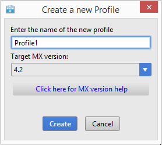
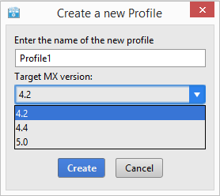
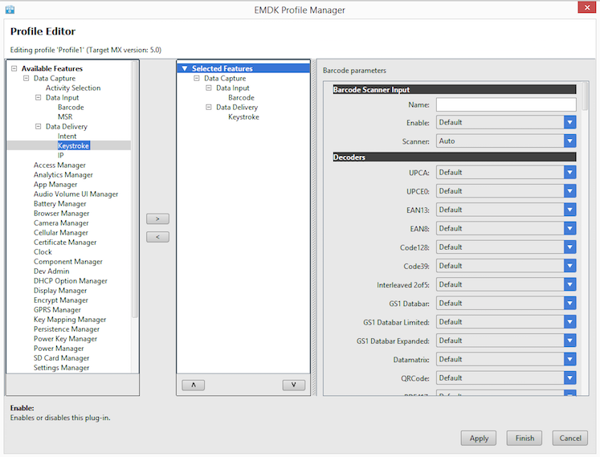
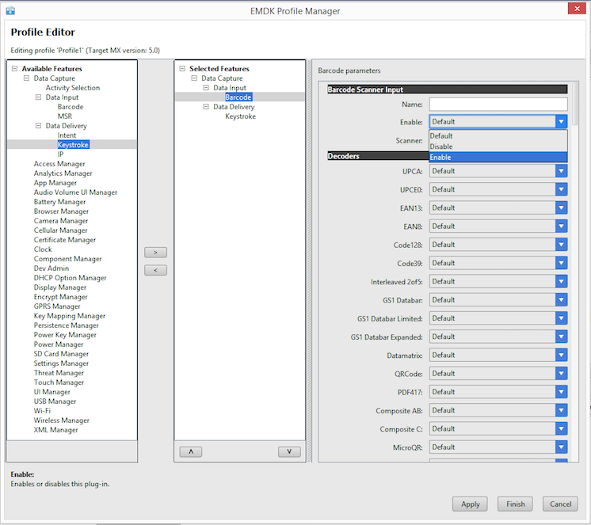
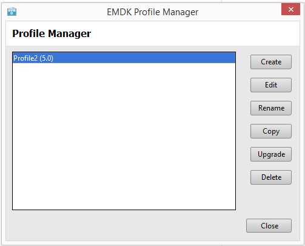
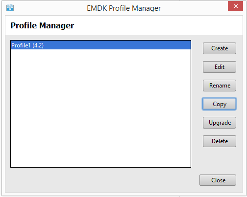
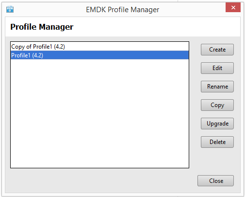
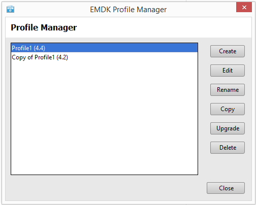
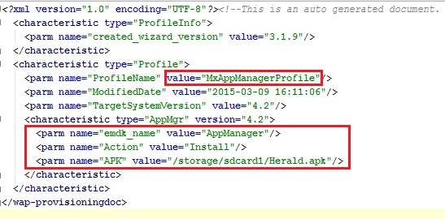

Profile Manager enhances Android IDE with a GUI-based tool for generating all the code required to access and configure Zebra device features and settings. This enables developers to target Zebra devices with fewer lines of code, fewer errors and reduced overall development time.

**This guide requires the Zebra Profile Manager plug-in**. If necessary, see the [EMDK Setup guide](../setup) and follow Steps 1&ndash;3 before proceeding.  

-----

###Accessing the Profile Manager
1. Inside the IDE, select an open Android project.

	NOTE: Profile Manager adds a profile xml file to the project. Selecting an open project tells Profile Manager which project to add the profile to. 

2. Select "EMDK" -> "Profile Manager" on the tool bar. 
 
    

###Creating a Profile

1. Open the "EMDK Profile Manager".  
2. Click "Create".  

    
3. Enter a name for your new Profile.  This name is how the profile will be identified by the EMDK. 

	  
4. Select the **MX** version you would like to use in your profile.
	
	Use the [Choosing a MX Version](/mx/choosing-a-version/) Guide as an aid to decide which MX version to use.

	

5. Select the features you would like to enable by selecting the item from the list of "Available Features" and clicking the right arrow button.
	>Note:  
	>
	> You must enable both a Data Capture Delivery Feature and a Data Capture Input Feature for the profile to send data to your application. For example "Barcode" and "Intent".
	>
	> You can remove a feature from the "Selected Features" list by clicking the left arrow button.

	  

6. Select a "Selected Features" and the list of parameters will populate on the right hand side of the dialog. When you click on a parameter a description with populate on the lower left hand corner of the dialog.  

	  
7. When complete click "Finish".
8. Click "Close".  

	
	>Note:  
	>The profile XML will be generated and saved to "EMDKConfig.XML" inside your projects "assets" folder.

###Editing a Profile

1. Open the EMDK Profile Manager.
2. Select a Profile to modify and click "Edit".  

	  
3. Edit the profile using the Profile Manager in the same way you would when creating a new profile.
4. When complete click "Finish".
5. Click "Close".  

	

	>Note:  
	>The profile XML will be updated and saved to "EMDKConfig.XML" inside your projects "assets" folder.

###Renaming a Profile

1. Open the EMDK Profile Manager.
2. Select a Profile to rename and click "Rename".  

	  
3. Enter the new name and click "Rename";  

	  
4. Click "Close".  

	  

	>Note:  
	>The profile XML will be updated and saved to "EMDKConfig.XML" inside your projects "assets" folder.

###Copying a Profile

1. Open the EMDK Profile Manager.
2. Select a Profile to copy and click "Copy".  

	  
3. Enter the a name profile name to uses and click "Copy";  

	  
4. Click "Close".  

	  

	>Note:  
	>The profile XML will be updated and saved to "EMDKConfig.XML" inside your projects "assets" folder.

###Upgrading a Profile

>Note: The Profile Manager does not provide a method to downgrade a profile, so the upgrade process is not reversible.  It is advised that you make a copy of your profile before upgrading.

1. Open the EMDK Profile Manager.
2. Select a Profile to upgrade and click "Upgrade".  

	  
3. Select the **MX** version you would like to upgrade to and click "Upgrade";  
	Use the [Choosing a MX Version](/mx/choosing-a-version/) Guide as an aid to decide which MX version to use.

	  

	  

4. Edit the profile using the Profile Manager in the same way you would when creating a new profile.

6. When complete click "Finish". 

	

###Deleting a Profile
1. Open the EMDK Profile Manager.
2. Select a Profile to delete and click "Delete".  

	  
3. Confirm delete by clicking "Delete";  

	  
4. Click "Close".  

	  

	>Note:  
	>The profile XML will be updated and saved to "EMDKConfig.XML" inside your projects "assets" folder.

##Using the Profile Manager API
Once you create your profiles using the Profile Manager, they will be bundled with your application and available to access using the [Profile Manager APIs](/emdk-for-android/7-5/api/core). These profiles will NOT be applied on the device until it is processed using these APIs.

## Multiple Ways to Access
In the ProfileManager API, you will see three methods for `processProfile`. Essentially the last parameter, `extraData`, is one of three types:

* **Document** - data will be handled as a XML Document.
* **String** - data will be handled as a raw string.
* **ProfileConfig** - data will be handled as a ProfileConfig class.

##Creating or Activating a Profile
A profile is created or activated with using the PROFILE_FLAG.SET option. If the profileFlag is set to SET, and if the given profile is not available, it will look for a valid profile in the extraData argument and if present, the profile  will be added to the internal XML volatile repository and also applied to the device.  If the profile is present, then it will be applied to the device.

> Note: The following example uses ProfileConfig object, which is currently only available for DataCapture profile features.

	:::java
	@Override  
    public void onOpened(EMDKManager emdkmanager)  
    {  
        //Create the Profile Config object  
        ProfileConfig profileConfigObj = new ProfileConfig();  

        //Get the Profile Manager  
        ProfileManager profileManager = (ProfileManager)emdkmanager.getInstance(FEATURE_TYPE.PROFILE);  

        //Create the new profile  
        EMDKResults results = profileManager.processProfile("ProfileName", ProfileManager.PROFILE_FLAG.SET, profileConfigObj);
    }  

##Getting a Profile
If profileFlag is set to GET and if the profile is present in the internal repository, it will be returned in the extraData object.

> Note: The following example uses ProfileConfig object, which is currently only available for DataCapture profile features.

	:::java
	@Override  
    public void onOpened(EMDKManager emdkmanager)  
    {  
        //Create the Profile Config object  
        ProfileConfig profileConfigObj = new ProfileConfig();  

        //Get the Profile Manager  
        ProfileManager profileManager = (ProfileManager)emdkmanager.getInstance(FEATURE_TYPE.PROFILE);  

        //Get the profile and store it in the ProfileConfig object  
        EMDKResults results = profileManager.processProfile("ProfileName", ProfileManager.PROFILE_FLAG.GET, profileConfigObj);
    }  

##Modifying a Profile
To modify a profile, you would:

* Use the PROFILE_FLAG.GET option to retrieve the profile (if it exists).
* Use the profileConfig Object and APIs to modify the feature parameters.
* Use the PROFILE_FLAG.SET option to save the parameters.

> Note: The following example uses ProfileConfig object, which is currently only available for DataCapture profile features.

 	:::java
 	@Override  
    public void onOpened(EMDKManager emdkmanager)  
    {  
        //Create the Profile Config object  
        ProfileConfig profileConfigObj = new ProfileConfig();  

        //Get the Profile Manager  
        ProfileManager profileManager = (ProfileManager)emdkmanager.getInstance(FEATURE_TYPE.PROFILE);  

        //Get the profile and store it in the ProfileConfig object  
        EMDKResults results = profileManager.processProfile("ProfileName", ProfileManager.PROFILE_FLAG.GET, profileConfigObj);  
        //Enable MSR  
        profileConfigObj.dataCapture.msr.msr_input_enabled = ENABLED_STATE.TRUE;  
        //Modify Profile  
        EMDKResults ModifyResults = profileManager.processProfile("ProfileName", ProfileManager.PROFILE_FLAG.SET, profileConfigObj);  
    }  

## Usage Notes

## Getting Started with Tutorial
This is an overview of how you can create and integrate Profiles using EMDK Profile Manager. Click [here](/emdk-for-android/7-5/tutorial/tutdatacaptureprofile) to get started with a detailed tutorial on Data Capture Profiles to understand better.  

## Multiple Instance of Features
There should only be one instance of the DataCapture feature. The EMDK Profile Manager will not allow you to add multiple DataCapture features, but may happen if you are manually editing the EMDKConfig.xml. Other profile features can have multiple instances and may be required in some cases. For example, you may need two 'Certificate Manager' features. The first one to initialize the certificate store and the second one to install a new certificate.

## Order of Features
The profile features will be applied synchronously in the order they appear. For example, you may want to set the clock before you attempt to connect to a Wi-Fi network.

## extraData as XML String
The processProfile method has an overload method that allows sending XML content in the `extraData` parameter as a String.  

Method Signature:

	:::java
	// Pass in a string in XML form
	processProfile(String profileName, ProfileManager.PROFILE_FLAG profileFlag, String extraData)

`profileName` can be:

1. `[Name of Profile]` - to reference the entire profile. ex: 'EMDKProfile1'
2. `[profileName]/[featureType]/[feature friendly name in profile parameters]` to just edit part of the profile. For example, if my profile is called 'Profile1' and the name I gave to the Clock feature is 'ckEST'. Passing 'profileName' as 'Profile1/Clock/ckEST' will just process this part of the profile.
	* Valid `[featureType]`:	ActivitySelection, Barcode, MSR, Intent, Keystroke, IP, Clock, PowerMgr, PersistMgr, CertMgr, AppMgr, AccessMgr, Wi-Fi, GprsMgr

## XML String Structure
One way you can see how this XML string should be structured is to use the Profile Manager.

1. Open any project that does not have a EMDK profile defined already (so you get just the parameters you want to change).
2. Select EMDK / Profile Manager from the menu.
3. Add the Profile features you want and selection the options you wish to use.
4. Click Finish when you are done with your selections.
5. Look in the `assets` folder and open `EMDKConfig.xml`

	
6. Notice the XML structure that is shown. This complete structure is to be passed in the extraData parameter as a string. You can choose to copy and paste this into your code to be used.

> WARNING!: XML parm names and values may not be the same as what is presented in the Profile Manager wizard. Pay close attention to the fields of interest. It is not recommended to manually edit this XML, use the Profile Manager Wizard to ensure proper formation of the XML structure and values.

## Profile Name Usage Notes
If the ProfileName node is given in extraData and the ProfileFlag is SET, ProfileName in ExtraData should match with the first parameter passed to processProfile.

Example:

	:::java
	String[] extraData = new String[1];
	extraData[0]=
	"<?xml version=\"1.0\" encoding=\"utf-8\"?>" +
	"<characteristic type=\"Profile\">" +
	"<parm name=\"ProfileName\" value=\" EMDKProfile1\"/>" +
	"<characteristic type=\"Clock\">" +
	"<parm name=\"emdk_name\" value=\"ck1\"/>" +
	"<parm name=\"Date\" value=\"2013-05-23\" />" +
	"<parm name=\"Time\" value=\"6:59:00\" />" +
	"<parm name=\"TimeZone\" value=\"America/Los_Angeles\" />" +
	"</characteristic>"+
	"</characteristic>";

	emdkStatus = mProfileManager.processProfile("EMDKProfile1", ProfileManager.PROFILE_FLAG.SET, extraData);

* If the ProfileName node is NOT given in extraData and the ProfileFlag is SET, the content will be merged with the profile given in the first parameter passed to processProfile.

* If the ProfileFlag is SET and the profile given in the first parameter passed to processProfile does not exist in EMDKConfig.xml, the profile will be appended to the internal repository.

* DataCapture content (Activity Selection, Barcode, MSR, Intent, Keystroke, IP) is considered as a whole and setting any individual feature will set as a whole. In other words, setting "EmdkSampleProfile-1/Keystroke" will push all the DataCapture features to the device.

## Feature Name Usage Notes
Each specific profile feature can be named so that only that portion of the profile can be referenced. This can be accomplished by:

1. Specifying a name for the specific feature within a profile.
2. Using the fully qualified name as the first parameter of the processProfile method.

* If the ProfileFlag is SET, the emdk_name given in ExtraData should match the third part of the profileName passed to the processProfile method (first parameter).

In the following example, we created a profile called `EMDKProfile1` and added the Clock feature with a name of `ck2`. Now we can modify that profile using the processProfile method, making sure we specify the `emdk_name` parameter as `ck2` and use a profileName of `EMDKProfile1/Clock/ck2` in the processProfile method:

	:::java
	String[] extraData = new String[1];
	extraData[0]=
	"<?xml version=\"1.0\" encoding=\"utf-8\"?>" +
	"<characteristic type=\"Profile\">" +
	"<parm name=\"ProfileName\" value=\" EMDKProfile1\"/>" +
	"<characteristic type=\"Clock\">" +
	"<parm name=\"emdk_name\" value=\"ck2\"/>" +
	"<parm name=\"Date\" value=\"2013-05-23\" />" +
	"<parm name=\"Time\" value=\"6:59:00\" />" +
	"<parm name=\"TimeZone\" value=\"America/Los_Angeles\" />" +
	"</characteristic>"+
	"</characteristic>";

	emdkStatus = mProfileManager.processProfile("EMDKProfile1/Clock/ck2", ProfileManager.PROFILE_FLAG.SET, extraData);

* If the ProfileFlag is SET, the emdk_name is NOT given in ExtraData and if the first parameter passed to processProfileis has the fully qualified name (ex: EMDKProfile1/Clock/ck2) , content will be appended to the profile (this only applicable for non-DataCapture features).

Example:  

	:::java
	String[] extraData = new String[1];
	extraData[0]=
	"<?xml version=\"1.0\" encoding=\"utf-8\"?>" +
	"<characteristic type=\"Profile\">" +
	"<parm name=\"ProfileName\" value=\" EMDKProfile1\"/>" +
	"<characteristic type=\"Clock\">" +
	"<parm name=\"Date\" value=\"2013-05-23\" />" +
	"<parm name=\"Time\" value=\"6:59:00\" />" +
	"<parm name=\"TimeZone\" value=\"America/Los_Angeles\" />" +
	"</characteristic>"+
	"</characteristic>";

	emdkStatus = mProfileManager.processProfile("EMDKProfile1/Clock", ProfileManager.PROFILE_FLAG.SET, extraData);

## PROFILE_FLAG.SET Usage Summary
Here is a summary of the above scenarios when using PROFILE_FLAG.SET and XML in the extraData parameter:

<table>
	<tr>
		<th>profileName</th>
		<th>EMDKConfig.XML</th>
		<th>extraData</th>
		<th>Behavior</th>
	</tr>
	<tr>
		<td>Profile1</td>
		<td>Contains all features in xml</td>
		<td>No</td>
		<td>Settings specified in XML will get applied to the device.</td>
	</tr>
	<tr>
		<td>Profile1/Barcode</td>
		<td>Contains all features in xml</td>
		<td>No</td>
		<td>Settings specified in DataCapture nodes in XML will get applied to the device.</td>
	</tr>
	<tr>
		<td>Profile1/Barcode/Bar1</td>
		<td>Contains all features in xml</td>
		<td>No</td>
		<td>Settings specified in DataCapture nodes in XML will get applied to the device given that the emdk_name is set as “Bar1”.</td>
	</tr>
	<tr>
		<td>Profile1/Clock</td>
		<td>Contains all features in xml(Clk1 and Clk2)</td>
		<td>No</td>
		<td>All the Clock feature nodes are applied to the device.</td>
	</tr>
	<tr>
		<td>Profile1/Clock/Clk1</td>
		<td>Contains all features in xml(Clk1 and Clk2)</td>
		<td>No</td>
		<td>Settings defined in the Clk1 node will be applied to the device.</td>
	</tr>
	<tr>
		<td>Profile1/Clock/Clk2</td>
		<td>Contains all features in xml(Clk1 and Clk2)</td>
		<td>No</td>
		<td>Settings defined in the Clk2 node will be applied to the device.</td>
	</tr>
	<tr>
		<td>Profile1</td>
		<td>Contains all features in xml</td>
		<td>Settings for Barcode and Clk2</td>
		<td>Settings in XML and in extraData gets applied to the device</td>
	</tr>
	<tr>
		<td>Profile1/Barcode</td>
		<td>Contains all features in xml</td>
		<td>Settings for Barcode and Clk2</td>
		<td>FAILURE is returned</td>
	</tr>
	<tr>
		<td>Profile1/Barcode/Bar1</td>
		<td>Contains all features in xml</td>
		<td>Settings for Barcode and Clk1</td>
		<td>FAILURE is returned</td>
	</tr>
	<tr>
		<td>Profile1/Clock</td>
		<td>Contains all features in xml(Clk1 and Clk2)</td>
		<td>Settings for Barcode and Clk1</td>
		<td>FAILURE is returned</td>
	</tr>
	<tr>
		<td>Profile1/Clock</td>
		<td>Contains all features in xml(Clk1 and Clk2)</td>
		<td>Settings for Barcode and Clk2</td>
		<td>FAILURE is returned</td>
	</tr>
	<tr>
		<td>Profile1/Clock/Clk1</td>
		<td>Contains all features in xml(Clk1 and Clk2)</td>
		<td>Settings for Barcode and Clk1</td>
		<td>FAILURE is returned</td>
	</tr>
</table>

