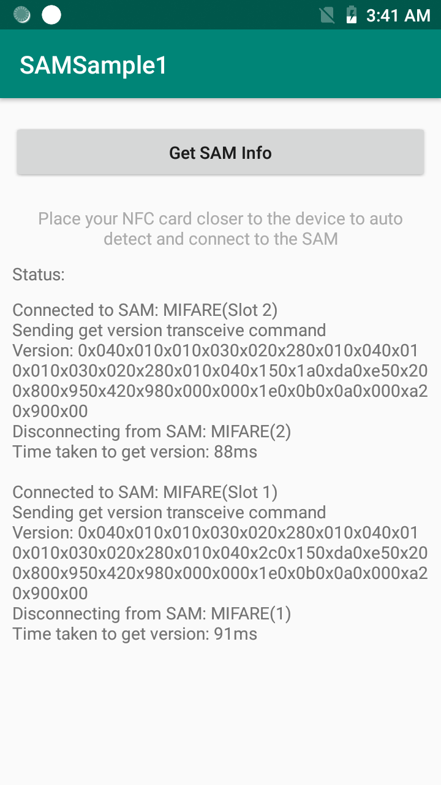

##Overview
EMDK for Android allows secure communication with NFC tags through use of the Secure Access Module (SAM). 

**Available SAM actions**:

* Get the SAM Manager
* Enumerate SAM objects  
* Use the SAM module  
* Tranceive data
* Disconnect the SAM module
* Get the SAM index
* Detect an NFC tag

## Requirements
* Supported Visual Studio version on a Mac or Windows PC with Android API 22 (or higher) installed. See [EMDK Setup Guide](../../guide/setup) for help. 
* A supported Zebra Android device (see list above)
* A Zebra SAM module installed and configured 

##Load Sample App

>**NOTE**: The appearance of sample app screens can vary by sample app version, Android version and screen size.

**Before beginning, download, build and install the sample app**.  See the [Sample App Set-up Guide](../../guide/emdksamples_androidstudio) for help. 

##Using This Sample

1. When the application starts it should look like the following:
  
  

2. **Note the information provided** by this static sample app. 

-----  

## Also See
[SAM API Programmers Guide](../../guide/samapiusage)

