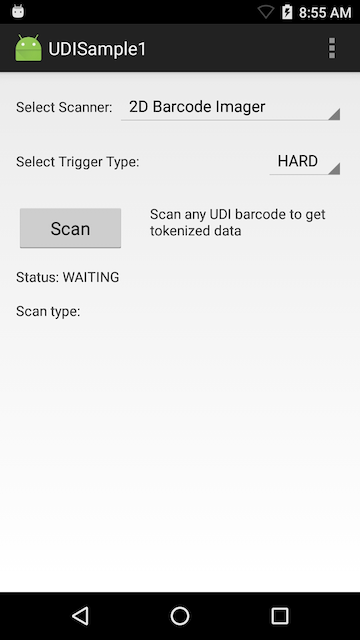

> **`IMPORTANT:`** Support for Unique Device Identification (UDI) standard barcodes such as GS1, HIBCC and ICCBBA in Barcode APIs has been deprecated. **UDI support will end when EMDK targets devices running Android 10 Q**.

##Overview
This sample app demonstrates how to scan barcodes that use any of the three Unique Device Identification (UDI) standards: GS1, ICCBBA, and HIBCC.

#### NOTES
* **This sample illustrates a single use-case** for implementing UDI label scanning features; it is not a comprehensive example of the many ways this feature could be used. 
* **For a complete barcode scanning implementation example**, see [Barcode Sample 1](../barcode).

##Requirements
* Android Studio on a Mac or Windows PC with Android API 22 (or higher) installed. See [EMDK Setup Guide](../../guide/setup) for help. 
* A supported Zebra Android device (see list above)
* A scan target containing a UDI barcode

##Using Sample App

>**NOTE**: The appearance of sample app screens can vary by sample app version, Android version and screen size.

**Before beginning, download, build and install the sample app**.  See the [Sample App Set-up Guide](../../guide/emdksamples_androidstudio) for help. 

1. **Set the Trigger type set to "Hard" and tap the Scan button** to enable the scanner. The status are displays "Waiting" similar to the image below:

   

2.  **Point the device at a UDI label and press the hardware scan trigger**. The UDI label type and its UDI data are displayed:

  

> **NOTE: Sample apps are for demonstration purposes only and should not be used in production environments**.

