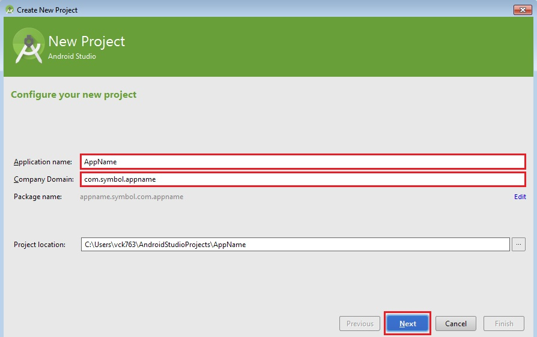

## Overview

This tutorial will aid you creating a new Android application project using Android Studio.

## Creating The Project

Open Android Studio. If you have a previous project open, close the project by clicking **Close Project** from the **File** menu.

1. Select **Start a new Android Studio project** under **Quick Start** section.

	

2. In the new project wizard we need to assign Application Name specific to your tutorial of EMDK feature along with Company Domain and click "Next".

	

3. Select the **Minimum SDK** that supports the SDK features your project requires and click **Next**.

	

4. Select **Blank Activity** option on **Add an activity to Mobile** screen and click **Next**.

	

5. Click **Finish** and your new Android Studio project will be created.

	

	>Note: The `\assets` folder is not present in the project structure by default; Profile Manager creates the folder when needed.

## Enable the EMDK for Android in your project

### Set EMDK as Compile SDK in Project Structure

After completing the steps in **Creating The Project**

1. Select **Project Structure** from the **File** menu.
2. In the Project Structure window select **app** from the left pane under **Modules**.
3. Now select **EMDK APIs, Android 23, rev XXX (API XX)** in from the **Compile Sdk Version drop-down box.
4. Now click the **OK** button.

**Your project is now ready to use the EMDK for Android APIs**

###  EMDK as a dependency in gradle.build

See Step 4 in the [EMDK-A Setup guide](../../guide/setup) for instructions.

<!-- 
Use this method to make use of the EMDK APIs in a project where the Compile SDK set above an Android API level that the EMDK currently has an Addon for.

After completing the steps in **Creating The Project**

1. In the project folder viewer, open the **build.gradle** file for the **app** module.
2. Add the following to the dependencies section

    **Windows**

		:::
		dependencies {
		provided fileTree(include: ['com.symbol.emdk.jar'], dir: 'C:\\Users\\<YOUR USER NAME>\\AppData\\Local\\Android\\sdk\\add-ons\\addon-symbol_emdk-symbol-19\\libs')
		compile fileTree(exclude: ['com.symbol.emdk.jar'], dir: 'libs')

    **Mac**

		:::
		dependencies {
		provided fileTree(include: ['com.symbol.emdk.jar'], dir: '/Users/<YOUR USERNAME/Library/Android/sdk/add-ons/addon-symbol_emdk-symbol-19/libs')
		compile fileTree(exclude: ['com.symbol.emdk.jar'], dir: 'libs')

3. Now rebuild your project by selecting **Make Project** from the **Build** menu.

**Your project is now ready to use the EMDK for Android APIs**

 -->

