
 <button type="button" class="close" data-dismiss="alert" aria-label="Close">×</button> <h4>Regarding EMDK Barcode Scanning APIs</h4> 
<u>Zebra strongly recommends the use of DataWedge for all applications that require barcode scanning</u>. <b>While Zebra will continue to support EMDK Barcode APIs</b>, the efficiency and feature richness of intent-based interfaces make it a simpler alternative to app development using EMDK Barcode APIs.
 
 <b>DataWedge facts</b>:
    
<ul>
        <li><b>DataWedge APIs have the same capabilities currently available in EMDK Barcode APIs.</li>
        <li><b>DataWedge intent-based APIs are easier and faster to implement than EMDK Barcode APIs.</li>
        <li><b>New features are added to DataWedge before being considered for EMDK Barcode APIs.</li>
    </ul>
     
    <a href="/datawedge" class="btn btn-danger">Learn About DataWedge</a>  

 

> **NOTE**: Data Capture is deprecated in EMDK-X 6.10 and later. Please refer to the [Basic Scanning Tutorial](../tutBasicScanningAPI) instead.  

## Developing an EMDK for Android Application Part 1

This guide will walk you through creating an EMDK For Android application that will use [Data Capture Profiles](/emdk-for-android/7-4/mx/data-capture/barcode) to get barcode data into your application using the [KeyStroke output](/emdk-for-android/7-4/mx/data-capture/keystroke) feature of EMDK Profiles.

>**Note**: As of EMDK 6.8, DataWedge can no longer be configured for data capture through Profile Manager. Zebra recommends using the [DataWedge APIs](/datawedge/latest/guide/api/) instead.

## Creating The Project

> Note: Provide "EMDKSample" as the project name for this tutorial.

Start by creating a new Android Studio [project](/emdk-for-android/7-4/tutorial/tutCreateProjectAndroidStudio).

## Adding a DataCapture Profile
1. Click [here](/emdk-for-android/7-4/guide/profile-manager/) to see how to add a specific feature to A profile with the Profile Manager.

2. Provide "DataCaptureProfile" as the Profile Name for this tutorial.

	> Note: You can provide any Profile Name but make sure to access it with the similar name in the Android code.  
  
3. Now, you can see all the available features on the left hand side of the Profile Editor window. Select any feature from the list and click "Right Arrow" (Ex: "ActivitySelection" has been selected. By using this feature Activities can be associated with the application. Then the data capture feature will be enabled automatically when the specified activity is in foreground).
  
    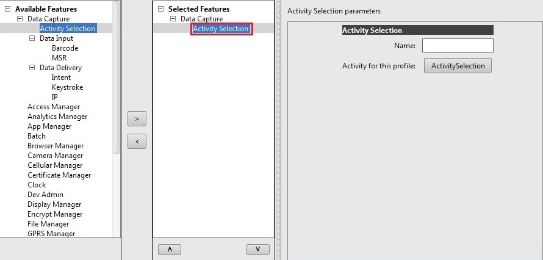
  
4. Click on the selected feature. The parameter list will be populated. 

	> Note:
	> The field "Name" contains user defined name to identify a particular feature. This is required when editing any specific feature programmatically, which is outside the scope of this tutorial. So we will keep the "Name" field empty. 
  
5. Click "ActivitySelection" under parameters.
  
   

6. Specify the applications package name and click "Apply".
  
    
  
7. Specify an Activity inside the application and click "Apply".
  
    
  
8. Click "OK".
  
    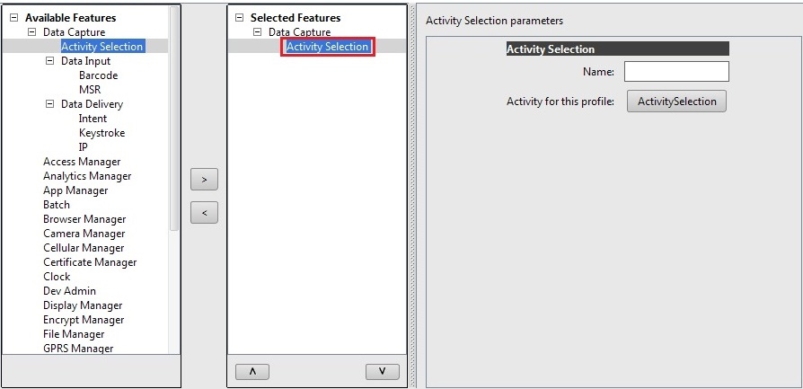
  
9. Select any data capture feature and click Right Arrow (Ex: "Barcode" has been selected).
  
    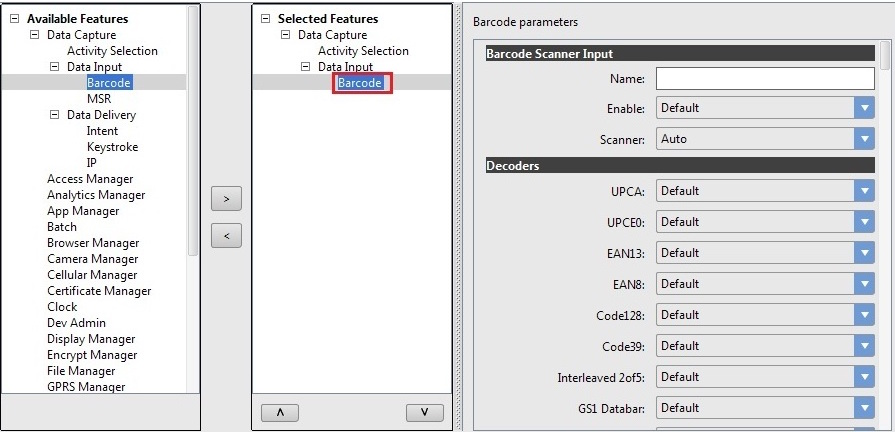
  
10. Click on the "Barcode" feature. The parameter list will be populated.
	> Note: 
	> The field "Name" contains user defined name to identify a particular Barcode feature. This is required when editing any specific Barcode feature programmatically, which is outside the scope of this tutorial. So we will keep the "Name" field empty.
  
11. Enable the feature and change some parameters.
    
    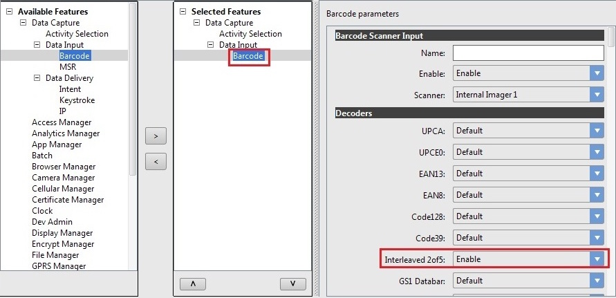
    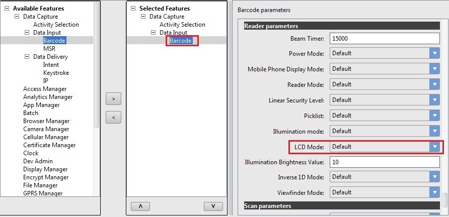
  
12.    Click "Apply". 
13.    Select the Keystroke feature and click "Right Arrow" (Ex: "Keystroke" has been selected).
	> Note:
	> The field "Name" contains user defined name to identify a particular Keystroke feature. This is required when editing any specific Keystroke feature programmatically, which is outside the scope of this tutorial. So we will keep the "Name" field empty.

    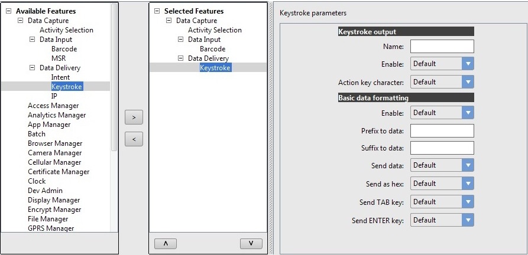
  
14. Enable the feature and change some parameters.
  
    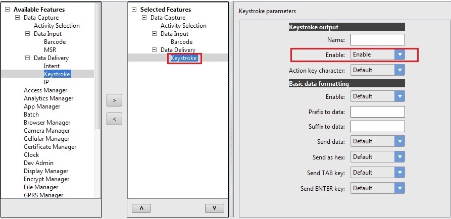
  
    
  
15. Click "Apply" and "Finish".
  
    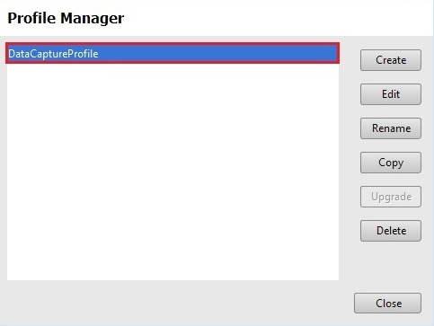
  
16.    Click "Close".  
    >Note:  
    >Now the "EMDKConfig.xml" is created under "\assets" folder. This file will contain a definition of all of your profiles that you create. 
  
17. You can inspect the EMDKConfig.xml to see it is reflecting the changes made to the parameters via EMDK Profile Manager GUI earlier.  However, it is advised that this file not be manually updated and only be controlled via the Profile Manager.

    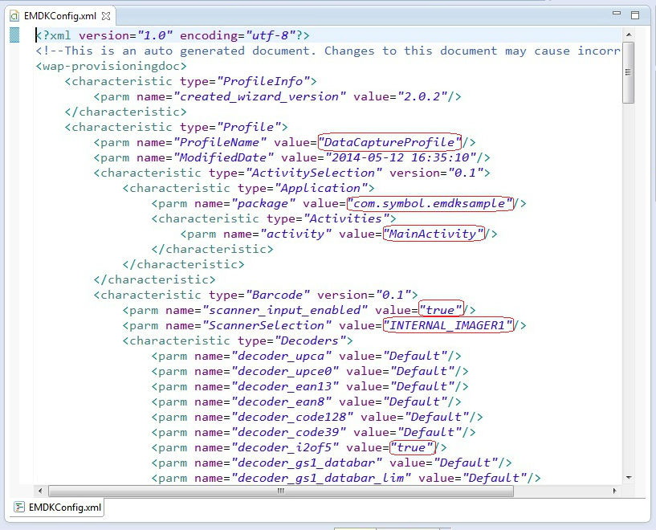
   
    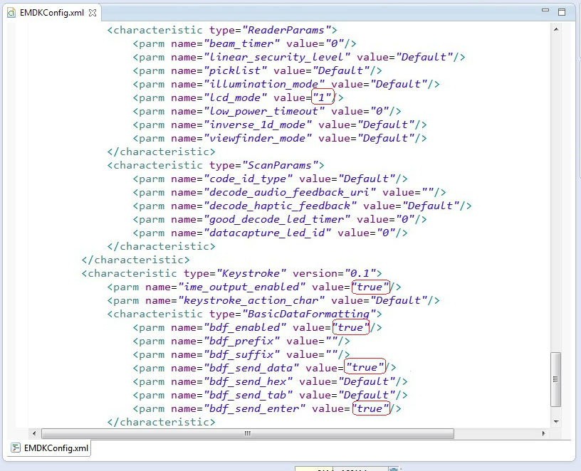   

## Enabling Android Permissions
1. Modify the Application's Manifest.xml to use the EMDK library and to set permission for the EMDK.
  
    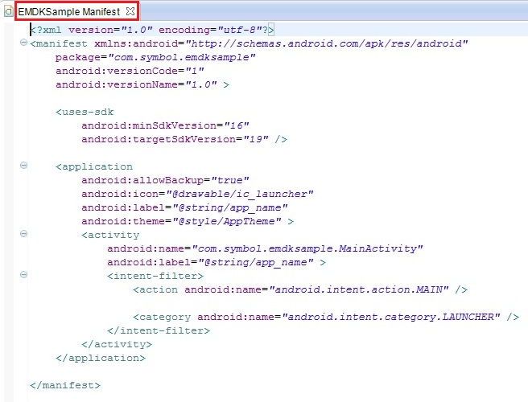

    You must first enable permissions for 'com.symbol.emdk.permission.EMDK':  
   
        :::xml
        <uses-permission android:name="com.symbol.emdk.permission.EMDK"/> 

    Then you must enable the library:  
      
        :::xml
        <uses-library android:name="com.symbol.emdk" />

    When done, your manifest.xml should look like:

    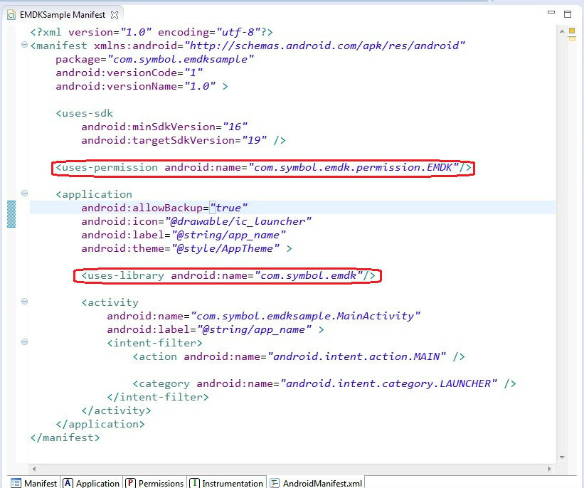  

##Adding Some Code    
1. Now we will start to add some code. 

    First you must add references to the libraries:  
    
        :::java
        import com.symbol.emdk.*;  
        import com.symbol.emdk.EMDKManager.EMDKListener;  
    
    Then you must extend the activity to implement EMDKListener.     
    
        :::java
        public class MainActivity extends Activity implements EMDKListener {  
          
            .. .. .. .. .. .. ...  
          
            @Override  
            public void onClosed() {  
                   // TODO Auto-generated method stub  
            }  
          
            @Override  
            public void onOpened(EMDKManager emdkManager) {  
                   // TODO Auto-generated method stub  
            }  
          
        }      

    We will now create some global variables to hold the profile name as well as instance objects of EMDKManager and ProfileManager that we will use throughout the code:  
    
        :::java
        //Assign the profile name used in EMDKConfig.xml  
        private String profileName = "DataCaptureProfile";  
          
        //Declare a variable to store ProfileManager object  
        private ProfileManager mProfileManager = null;  
          
        //Declare a variable to store EMDKManager object  
        private EMDKManager emdkManager = null;     

    In the onCreate method, we call getEMDKManager so that the EMDK can be initialized and checked to see if it is ready. 

        :::java
        //The EMDKManager object will be created and returned in the callback.  
        EMDKResults results = EMDKManager.getEMDKManager(getApplicationContext(), this);  
          
        //Check the return status of getEMDKManager  
        if(results.statusCode == STATUS_CODE.FAILURE)  
        {  
                //Failed to create EMDKManager object  
                
        }  

    So far your code should look like:
     
     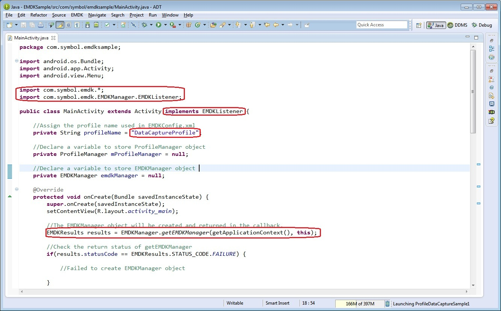 

2. Now we need to use the `onOpened` method to get a reference to the EMDKManager. The EMDKListener interface will trigger this event when the EMDK is ready to be used. This must be implemented in order to get a reference to the EMDKManager APIs. This event will pass the EMDKManager instance and we assign it to the global variable `emdkManager` that we created in the previous steps. We then use that instance object to get an instance of ProfileManager and assign it to the global variable `mProfileManager`. This is how we will interface with the APIs in the rest of the code:  

        :::java
        this.emdkManager = emdkManager;  
        //Get the ProfileManager object to process the profiles  
        mProfileManager = (ProfileManager) emdkManager.getInstance(EMDKManager.FEATURE_TYPE.PROFILE);         
    
    Now that we have a reference to ProfleManager, we use it to install and activate the profile we built earlier using the `processProfile` method. We could have also performed this action at a different time, say when someone pressed a button, but we chose to do it as soon as the EMDK was ready:  

        :::java
        if(mProfileManager != null)  
        {  
            try{

                String[] modifyData = new String[1];  
                //Call processPrfoile with profile name and SET flag to create the profile. The modifyData can be null.  
             
                EMDKResults results = mProfileManager.processProfile(profileName, ProfileManager.PROFILE_FLAG.SET, modifyData);  
                 if(results.statusCode == STATUS_CODE.FAILURE)  
                 {  
                     //Failed to set profile  
                 }  
             }catch (Exception ex){
                // Handle any exception
            }

        }  

    Your onOpened method should now look like this:
    
    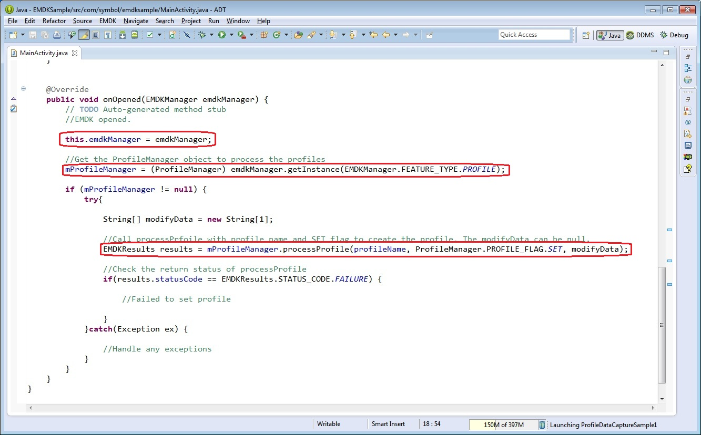  
    
3. Now let's override the "onDestroy" method so we can release the EMDKManager resources:  

        :::java
        @Override  
        protected void onDestroy() {  
            // TODO Auto-generated method stub  
            super.onDestroy();  
            //Clean up the objects created by EMDK manager  
            emdkManager.release();  
        } 

    Your onDestroy method should now look like this:  

    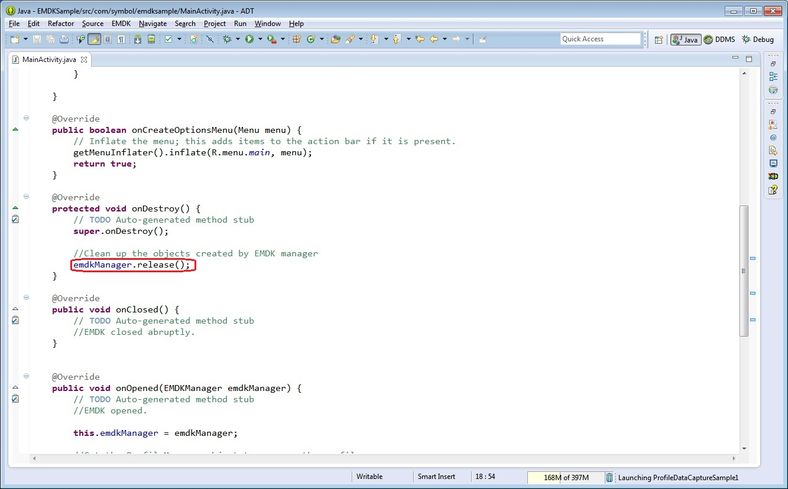  

4. Remove the default "TextView", inside "res/layout/activity_main.xml".

5. Add an EditText Field in the UI called "editTextBarcode", inside "res/layout/activity_main.xml".
    
        :::xml
        <EditText  
            android:id="@+id/editTextBarcode"  
            android:layout_width="wrap_content"  
            android:layout_height="wrap_content"  
            android:layout_marginTop="200dp"  
            android:layout_marginLeft="50dp"  
            android:ems="10" >  

6. Connect the device to a USB port.
    >Note:   
    >Make sure the device is in USB debug.
7. Run the application.
  
	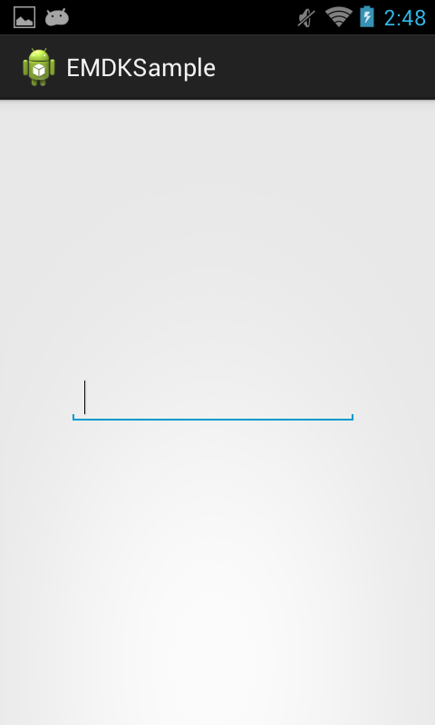
  
8. Press the trigger button and scan a barcode.
9. The scanned data will be populated in the Edit Text field added to the UI.
  
	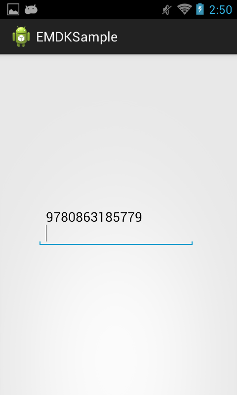  

##Important Programming Tips##

1. It is required to do the following changes in the application's AndroidManifest.xml:  
  
    >Note:
    >* Include the permission for EMDK:  
    
        :::xml
        <uses-permission android:name="com.symbol.emdk.permission.EMDK"/>
    
    >* Use the EMDK library:  
    
        :::xml
        <uses-library android:name="com.symbol.emdk"/>
  
2. When using the "Barcode" feature in EMDK Wizard, the specified value for "Scanner" is not supported on the device, it will be considered as "Auto" during runtime (Ex: BT_LASER1, BT_IMAGER1 and BT_CAMERA1).
3. Use DataWedge v1.7.12 or higher version to test the `ProfileManager.processProfile()` method for DataWedge profiles.
4. The final step is to create a dependency on EMDK in your app's **build.gradle** file. **[Learn how](../../guide/programming_practices/#emdkasadependencyinbuildgradle).** 

## What's Next
Now that you have learned the basics of an EMDK for Android application, the [next tutorial](/emdk-for-android/7-4/tutorial/tutdatacaptureprofilePt2)</a> will show you how to use the [Intent Output](/emdk-for-android/7-4/mx/data-capture/intent) feature of EMDK Profiles to handle Data Capture output programmatically.

> **Note**: As of EMDK 6.8, DataWedge can no longer be configured for data capture through Profile Manager. Zebra recommends using the [DataWedge APIs](/datawedge/latest/guide/api/) instead. 

