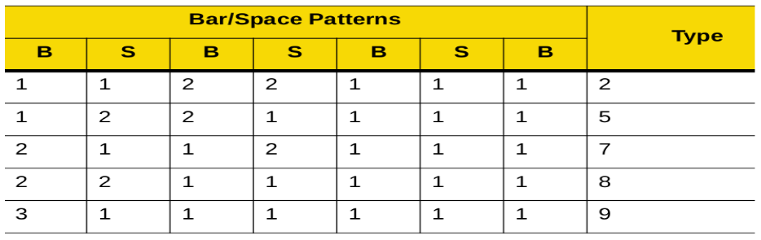

## Overview

The EMDK Barcode API enables an app to capture a signature by designating a predefined, specially formatted area of the screen as an image. This functionality is modeled as a decoder type exposed through the Barcode API. The captured signature can be retrieved by processing the data returned to the application from a scan event using the `OnData` callback. 

*A typical signature capture barcode*. 

For help creating a signature-capture barcode like the one above, please refer to the [Signature Capture Code Guide (pdf)](Decoder_Signature_v0.3.pdf). 

-----

## Enable Signature Capture

Before an application can capture a signature, the corresponding decoder (i.e. signature) must be enabled. Get an instance of a scanner object (see [Barcode Scanning API Programmer's Guide](../barcode_scanning_guide) for details). Once initialized, modify the scanner configuration as below:

    :::Java
    ScannerConfig config = scanner.getConfig();
    config.decoderParams.signature.enabled = true; //enables signature decoder
    scanner.setConfig(config);

-----

### Configure Parameters

By default, the following values are configured for signature decoder parameters. Change the parameters based on specific requirements.

    ScannerConfig config = scanner.getConfig();
 
    config.decoderParams.signature.format = ScannerConfig.SignatureImageFormat.BMP; //supported image formats: JPEG, BMP, TIFF

    config.decoderParams.signature.width = 400; //specifies the desired output image width in number of pixels. Match the width-to-height aspect ratio to that of the signature capture barcode to avoid distortion of captured image.

    config.decoderParams.signature.height = 400; //specifies the image height (in pixels) of the desired output. Match the width-to-height aspect ratio to that of the signature capture barcode to avoid distortion of captured image.

    config.decoderParams.signature.bpp = ScannerConfig.SignatureImageBitsPerPixel.BPP_8; //not applicable if the signature format parameter is set to JPEG. Supported values: BPP_1 (2 levels), BPP_4 (64 levels), BPP_8 (256 levels)

    config.decoderParams.signature.jpegQuality = 65; //accepts values from 5 (smallest size) to 100 (highest quality) in increments of 5.
     
    scanner.setConfig(config);
 
-----

### ScanData Handling

Data is returned to the application from a scan event through the `OnData` callback and is contained in a `ScanDataCollection` object. The code snippet below demonstrates how to access the captured signature:

    :::Java
    @Override
    public void onData(ScanDataCollection scanDataCollection) {

            if ((scanDataCollection != null) && (scanDataCollection.getResult() == ScannerResults.SUCCESS)) {
                ArrayList <ScanData> scanData = scanDataCollection.getScanData();
                for(ScanData data : scanData) {
                    if(data.getLabelType() == ScanDataCollection.LabelType.SIGNATURE) {
                        byte[] sigDataArr = data.getRawData(); //holds the complete signature data byte array

                    }
                }
            }
        }
 
-----

### Raw Signature Data

The code snippet below demonstrates how to access the raw signature data from a ScanDataCollection.
    
    :::Java 
    byte[] sigDataArr //holds the total signature data byte array
    for(ScanData data : scanData) {
        if(data.getLabelType() == ScanDataCollection.LabelType.SIGNATURE) {
            sigDataArr = data.getRawData();
           
        }
    }
 

#### Parse Raw Signature Data

Data obtained from the `ScanData.getRawData()` method contains the captured signature image details as a byte array. Information such as signature image format, type, size and image data can be parsed as below.

#### Get Image Format

The first byte of the byte array holds the image format. 

1. `.jpg`
2. (reserved)
3. `.bmp`
4. `.tiff`
 
##### Get the image format: 

    :::Java
    int imageFormat = sigDataArr[0];
 

#### Get Signature Type

The signature type is held in the second byte of the byte array. The image below illustrates how to differentiate signature types: 

The table below lists the accepted start/stop patterns. The bar and space widths are expressed as multiples of X. Values must be the same pattern on either side of a signature capture box. The signature type value is reported with the captured signature image.

For help creating a signature-capture barcode like the one above, please refer to the [Signature Capture Code Guide (pdf)](Decoder_Signature_v0.3.pdf). 

 
    :::Java
    int signatureType = sigDataArr[1]; //supported signature types: 2, 5, 7, 8, 9
 

#### Get Image Data Size

Bytes 3 through 6 of the byte array hold the image data size. Retrieve the data using the code below: 

    :::Java
    byte[] sigDataArr //holds the total signature data byte array

    byte[] sizeDataArr = Arrays.copyOfRange(sigDataArr, 2, 6); //holds the image data size byte array
 

#### Convert Byte Array to Integer
 
Convert the byte array data from hex to integer using the following code:
 
    :::Java
    public static int byteArrayToInt(byte[] byteArr)
    {
        return byteArr[3] & 0xFF |
                (byteArr[2] & 0xFF) << 8 |
                (byteArr[1] & 0xFF) << 16 |
                (byteArr[0] & 0xFF) << 24;
    }
     
    int imageDataSize = byteArrayToInt(sizeDataArr);
 

#### Get Image Data
 
The image data is held in bytes 7 through N of the byte array. Use the code below to retrieve the data: 

    :::Java 
    byte[] sigDataArr //holds the total signature data byte array

    byte[] imgDataArr = Arrays.copyOfRange(sigDataArr, 6, sigDataArr.length);
 

-----

### Show Image as Bitmap
 
To display the image as a bitmap, use the following code:
 
    :::Java
    byte[] imgDataArr //holds the image data byte array
     
    ImageView imageView = (ImageView)findViewById(R.id.imageView);
    imageView.setImageResource(android.R.color.transparent);
    Bitmap bmp = BitmapFactory.decodeByteArray(imgDataArr, 0, imgDataArr.length);
    imageView.setImageBitmap(bmp);

-----

## Also See 

* **[Barcode Scanning API Programmer's Guide](../barcode_scanning_guide)**
* **[Signature Capture Code Guide (pdf)](Decoder_Signature_v0.3.pdf)** 
