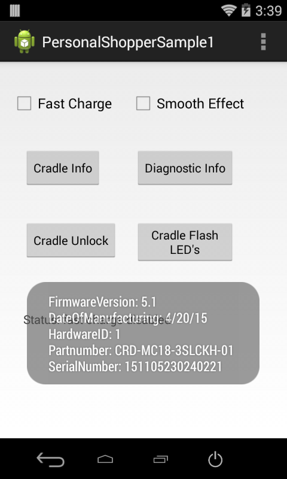
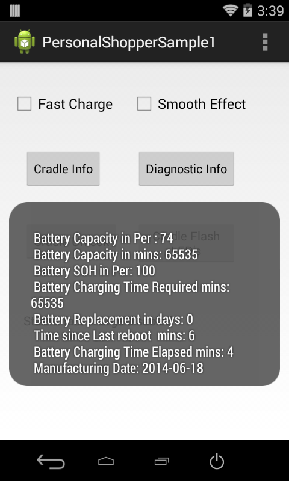
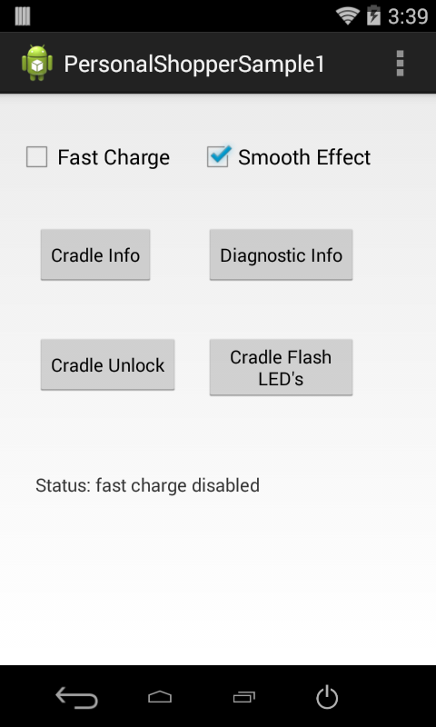

##Overview
This sample application shows how the Personal Shopper APIs can be used to interact programmatically with the device cradle.

##Requirements
Android API 22 (or higher) must be installed via the SDK Manager before attempting to load this sample.

##Loading the Sample Application
This guide walks through set-up of the EMDK samples in the IDE: 

* [Android Studio](/emdk-for-android/7-4/guide/emdksamples_androidstudio)

>**NOTE**: The appearance of sample app screens can vary by sample app version, Android version and screen size.

##Using This Sample

1.  With the device seated in the cradle, launch the PersonalShopper API sample.
 When the application starts it should look like the following:

  

2. Press the **Fast Charge** checkbox to enable/disable fast charging:

  

3. Press the **Cradle Info** button to retrieve information about the cradle, such as the cradle's firmware version:

  

4. Press the **Diagnostic Info** button to retrieve information such as the the device battery capacity:

  

5. Press the **Cradle Unlock** button to unlock the crade and allow the device to be removed:

  

6. Press the **Cradle Flash LED's** button, which will flash the cradle LEDs five times:

  

7. Press the **Smooth Effect** checkbox to enable/disable smoothing effect and then press the **Cradle Flash LED's** button again. Notice how the LEDs fade in and out, instead of an abrupt on/off state change.

  

