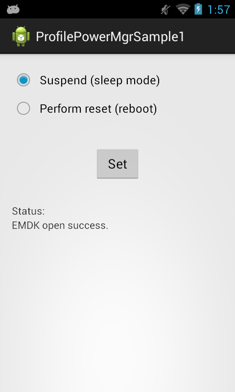
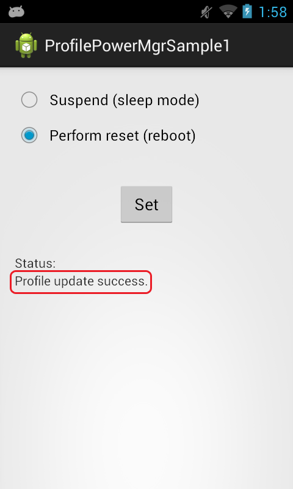

##Overview
The EMDK for Android allows you to control the power state of a Zebra device. 

The available actions are:  
- Do Nothing  
- Sleep Mode  
- Reboot  
- OS Update  

This sample application will allow you to set the power state of "Suspend" (sleep mode) or "Reset" (reboot).

##Requirements
Android API 22 (or higher) must be installed via the SDK Manager before attempting to load this sample.

##Loading the Sample Application
The following guide will walk you through setting up the EMDK samples in your IDE.

* [Android Studio](/emdk-for-android/7-5/guide/emdksamples_androidstudio)

>**NOTE**: The appearance of sample app screens can vary by sample app version, Android version and screen size.

##Using This Sample
1. When the application starts it should look like the following.  
    
2. Select the power mode you would like to set.  
      
3.  Click "Set" 
4.  Check the status field.   
    
  

