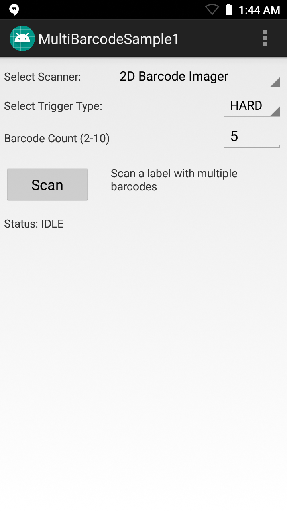

`WARNING:` This app offers an example of how to extract and generate a signature file from an app. <u>No support or warranty is expressed or implied</u>. **ZEBRA DOES NOT RECOMMEND USING THIS APP IN PRODUCTION ENVIRONMENTS**.  

## Overview
SigTools converts a certificate (either a direct DER-formated file or one extracted from an `.apk`) into
a byte array. The output is formatted as a Java class or a string of bytes and is automatically copied to the host-system clipboard. Optionally, the output can be written to a file (for JAVA OUTFORM). 

### SYNTAX
    java -jar SigTools COMMAND -INFORM [DER|APK] -OUTFORM [BYTES|JAVA] [-OUTFILE filename] -IN FILENAME [FILENAME]...[ARGUMENTS]

### DESCRIPTION
#### Commands:

**GETCERT -** Read the certificate

**VERSION -** Get the version of this JAR

#### Arguments:

**INFORM -** (REQUIRED) Format of the input file: **'APK'** or **'DER'**

**OUTFORM -** (REQUIRED) Format of the output: `BYTES` (a string representing the bytes in the certificate) or '`JAVA`' (a Java class)

**IN -** (REQUIRED) A space-separated list of file names (**NOTE**: Surround with quotes if there is a space in the name) 

**OUTFILE -** (Optional) The output file name if '`JAVA`' is used as the OUTFORM 

OLD OLD OLD
This sample demonstrates simultaneous scanning of multiple barcodes using capabilities in the Barcode/Scanning APIs introduced with EMDK for Android 6.8. These APIs work independently of any [Data Capture profiles](../../mx/data-capture/barcode).  

#### Notes

* **This sample illustrates a single use-case** for implementing multi-barcode features; it is not a comprehensive example of the many ways this feature could be used. 
* **DataWedge cannot be configured for data capture through Profile Manager** when using EMDK-A 6.8 and higher. Zebra recommends using the [DataWedge APIs](/datawedge/latest/guide/api/) instead.

##Requirements
* Android Studio on a Mac or Windows PC with Android API 22 (or higher) installed. See [EMDK Setup Guide](../../guide/setup) for help. 
* A supported Zebra Android device (see list above)
* A scan target with two or more barcodes

##Using Sample App

>**NOTE**: The appearance of sample app screens can vary by sample app version, Android version and screen size.

**Before beginning, download, build and install the sample app**.  See the [Sample App Set-up Guide](../../guide/emdksamples_androidstudio) for help. 

1. **Launch the sample app**. It should appear similar to the image below:
  
  
2. **Select the desired scanner, point the device at a scan target that contains multiple barcodes and tap the Scan button**. The status area should appear similar to the image below:  

  

> **NOTE: Sample apps are for demonstration purposes only and should not be used in production environments**.
