## Overview

This guide will walk you through creating an EMDK For Android application that will use some new MX features introduced in EMDK for Android API to perform device configurations. MX represents a suite of Enterprise Features on top of standard, commercially available Android Open Source Project. So this tutorial will focus on managing USB configurations on your Zebra Android device using [USB Manager](../../mx/usbmgr) feature of Mx.
 
So now we will create a tutorial and configure (Enable/Disable) the [ADB](http://developer.android.com/tools/help/adb.html) mode of the Zebra Android device using MX [USB Manager](../../mx/usbmgr) feature. ADB mode allows you to communicate with an emulator instance or connected Android-powered device in order to run your Android applications on them.   
        

## Creating The Project

> Note: Provide "MxUSBManagerTutorial" as the project name for this tutorial.

Start by creating a new Android Studio [project](/emdk-for-android/7-5/tutorial/tutCreateProjectAndroidStudio).  

## Adding The USB Manager Profile Feature
1. Click [here](/emdk-for-android/7-5/tutorial/tutAddProfileManagerFeature) to see how to add a specific feature to the Profile Manager.

2. Provide "USBManagerProfile" as the Profile Name for this tutorial.

	> Note: You can provide any Profile Name but make sure to access it with the similar name in the Android code.  
    
3. Now, you can see all these MX features on the left hand side of the Profile Editor window. Select the "USB Manager" feature from the list and click "Right Arrow".

    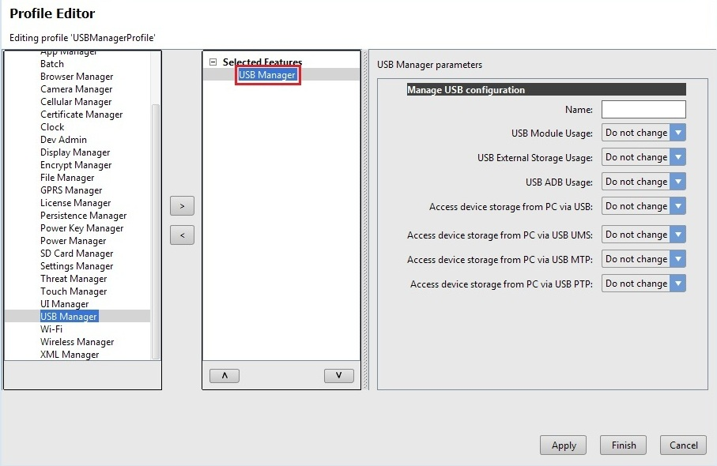

    Provide some name in the "Name" field (Ex. MyUSBManager). The "Name" field is used to identify each feature, which is required when editing features programmatically. You can also keep the "Name" field empty.

    You can see number of options for configuring different USB settings. Some of them are dependent on each other. We can configure every option in the profile editor window for USB Manager. As mentioned above we will configure the ADB mode (USB Debugging Mode) in this tutorial. Since we want to run our application on Zebra device, the ADB mode (USB Debugging Mode) is ON. So let us configure "USB ADB Usage" option. If you disable this option, you will not be able to run any Android application on the device as there will not be any communication between your machine and device. If you enable this option, the USB degugger will be turned ON and you can run your application on device again. So as of now we will keep "USB ADB Usage" option to "Do not change", which will keep the existing settings (In our case it is already ON). We will configure it programmatically by providing options (Enable/Disable) to the user on User Interface in coming steps.   

    > Note: If this option is disabled through Profile Wizard, you cannot enable this option manually by going into settings unless performed Factory Reset on it. So configure this feature programmatically to enable and disable ADB USB Usage in your application.      

    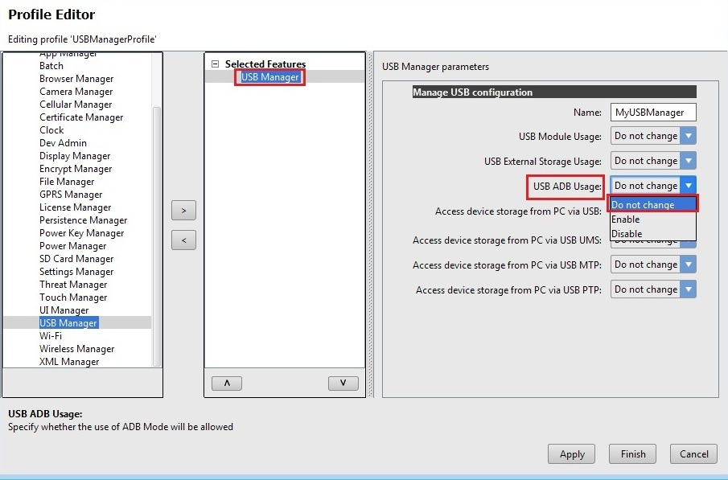

    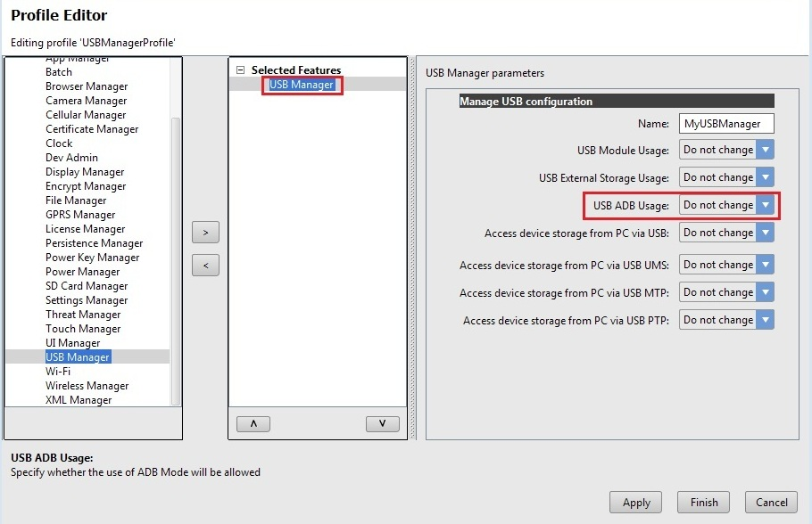    
 
4. Click Apply to apply the settings we provided    
  
    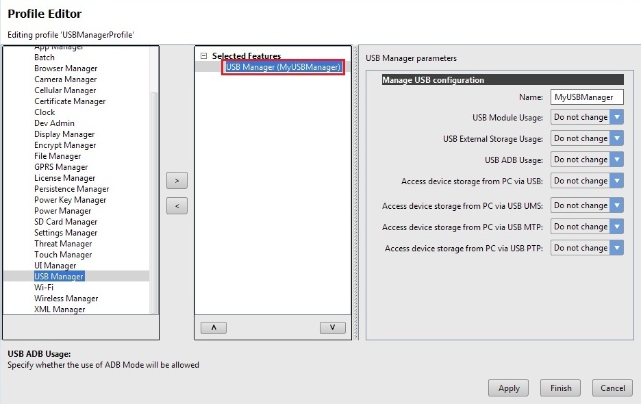

5. Click Finish and your USB Manager profile for configuring USB options is created.

    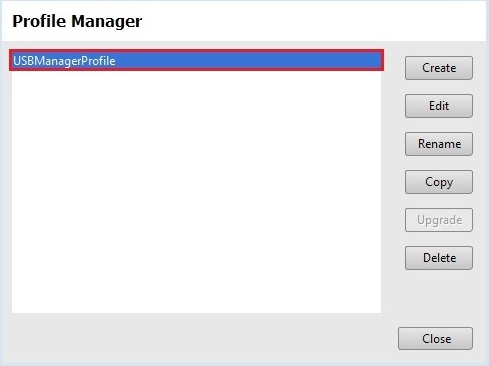 
  
6. Click "Close".

    >Note:  
    >Now the "EMDKConfig.xml" is created under "\assets" folder. This file will contain a definition of all of your profiles that you create. 
  
7. You can inspect the "EMDKConfig.xml" created under "\assets" folder to see it is reflecting the changes made to the parameters via EMDK Profile Manager GUI earlier.  However, it is advised that this file not be manually updated and only be controlled via the Profile Manager.

    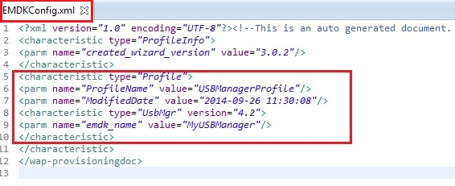    

## Enabling Android Permissions
1. Modify the Application's Manifest.xml to use the EMDK library and to set permission for the EMDK.
  
    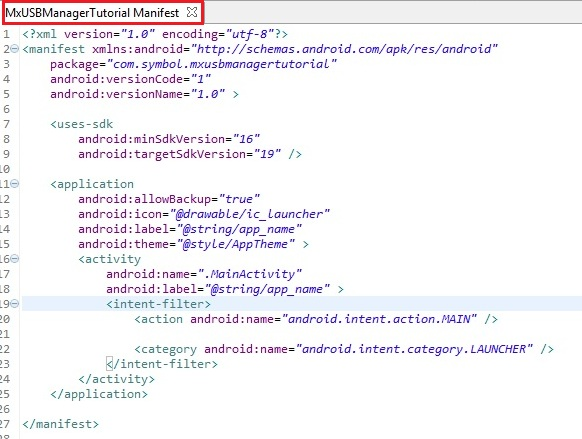

    You must first enable permissions for 'com.symbol.emdk.permission.EMDK':  
   
        :::xml
        <uses-permission android:name="com.symbol.emdk.permission.EMDK"/> 

    Then you must enable the library:   
      
        :::xml
        <uses-library android:name="com.symbol.emdk"/>

    When done, your manifest.xml should look like:

    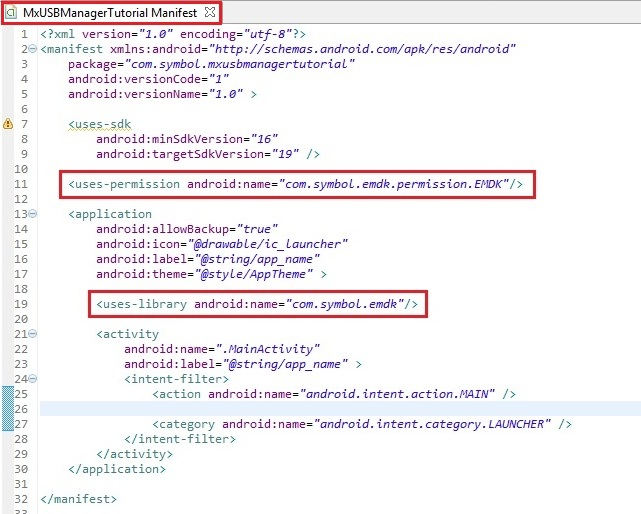 

##Adding Some Code    
1. Now we will start to add some code. 

    First you must add references to the libraries:  
    
        :::java
        import com.symbol.emdk.*;  
        import com.symbol.emdk.EMDKManager.EMDKListener;  
		import android.widget.Toast;    

    Then you must extend the activity to implement EMDKListener. 
    
        :::java
        public class MainActivity extends Activity implements EMDKListener {  
          
            .. .. .. .. .. .. ...  
          
            @Override  
            public void onClosed() {  
                   // TODO Auto-generated method stub  
            }  
          
            @Override  
            public void onOpened(EMDKManager emdkManager) {  
                   // TODO Auto-generated method stub  
            }  
          
        }      

    We will now create some global variables to hold the profile name as well as instance objects of EMDKManager and ProfileManager ProfileManager with a status variable while applying the profile. It contains [RadioGroup](http://developer.android.com/reference/android/widget/RadioGroup.html) to hold [Radio Buttons](http://developer.android.com/guide/topics/ui/controls/radiobutton.html), which allow user to select option to Enable or Disable ADB USB Usage. It also has a variable that contains user selected [Radio Button](http://developer.android.com/guide/topics/ui/controls/radiobutton.html) value for further processing. Some of the variables are used to hold the name, type and description in case of any errors. These variables would be used throughout the code. 

    >Note:
    >Verify the Profile name in the code with the one created in the Profile Manager. They both should be identical.    
    
        :::java
        // Assign the profile name used in EMDKConfig.xml
	    private String profileName = "USBManagerProfile";

	    // Declare a variable to store ProfileManager object
	    private ProfileManager profileManager = null;

	    // Declare a variable to store EMDKManager object
	    private EMDKManager emdkManager = null;

		// Contains the parm-error name (sub-feature that has error)
		private String errorName = "";
	
		// Contains the characteristic-error type (Root feature that has error)
		private String errorType = "";
	
		// contains the error description for parm or characteristic error.
		private String errorDescription = "";
	
		// contains status of the profile operation
		private String status = "";

	Declaration of global variables look like:

	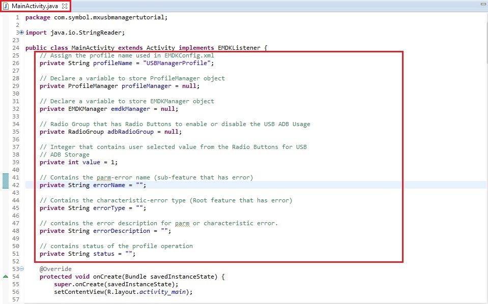

2. Let us add the required User Interface for this tutorial that will have two [Radio Buttons](http://developer.android.com/guide/topics/ui/controls/radiobutton.html) to Enable and Disable ADB USB Usage. The User Interface will also have a [Button](http://developer.android.com/reference/android/widget/Button.html) to apply changes selected by the user. 

So go inside "res/layout/activity_main.xml" of the project and remove all the code. Add following code for the desired User Interface.
  
		  		
	:::xml
	<RelativeLayout xmlns:android="http://schemas.android.com/apk/res/android"
	    xmlns:tools="http://schemas.android.com/tools"
	    android:layout_width="match_parent"
	    android:layout_height="match_parent"
	    tools:context="${relativePackage}.${activityClass}" >
	
	    <TextView
	        android:id="@+id/textView1"
	        android:layout_width="wrap_content"
	        android:layout_height="wrap_content"
	        android:layout_above="@+id/radioGroupADB"
	        android:layout_margin="15dip"
	        android:layout_marginBottom="20dp"
	        android:text="Select your USB ADB Usage Option:"
	        android:textSize="16sp"
	        android:textStyle="bold" />
	
	    <RadioGroup
	        android:id="@+id/radioGroupADB"
	        android:layout_width="wrap_content"
	        android:layout_height="wrap_content"
	        android:layout_centerInParent="true" >
	
	        <RadioButton
	            android:id="@+id/radioEnableADB"
	            android:layout_width="279dp"
	            android:layout_height="wrap_content"
	            android:text="Enable USB ADB Usage" />
	
	        <RadioButton
	            android:id="@+id/radioDisableADB"
	            android:layout_width="match_parent"
	            android:layout_height="wrap_content"
	            android:text="Disable USB ADB Usage" />
	    </RadioGroup>
	
	    <Button
	        android:id="@+id/buttonSet"
	        android:layout_width="wrap_content"
	        android:layout_height="wrap_content"
	        android:layout_below="@+id/radioGroupADB"
	        android:layout_centerHorizontal="true"
	        android:layout_marginTop="20dip"
	        android:text="Set" />
	
	</RelativeLayout>

The layout file 'activity_main.xml' should now look like:

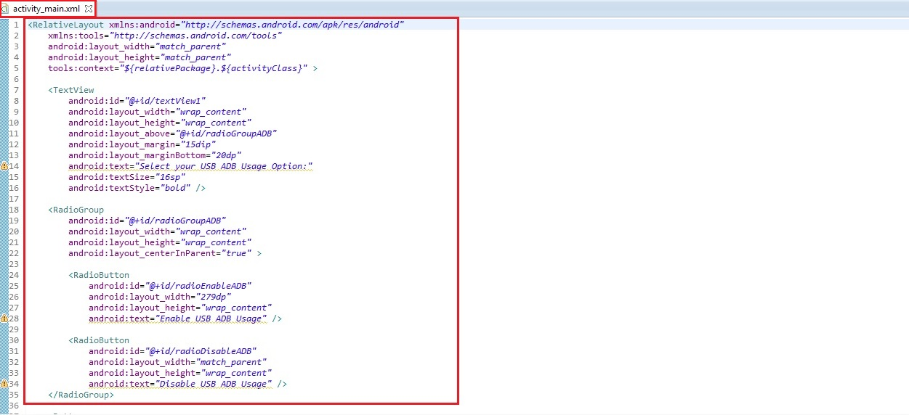

here is the remaining part:

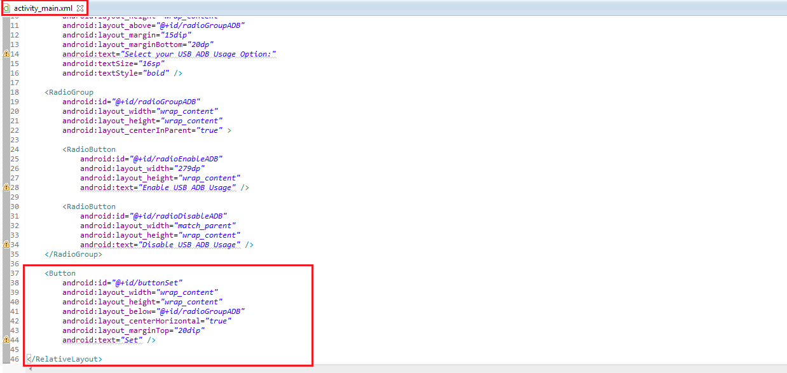   
	
3. Now come back to "MainActivity.java". In  `onCreate` method, we will get the references for UI element that we created in previous step followed by the listener for "Set" button. We will then call `getEMDKManager` so that the EMDK can be initialized and checked to see if it is ready. 

        :::java
        // Add reference to UI elements
		adbRadioGroup = (RadioGroup) findViewById(R.id.radioGroupADB);

		// Call the listener for Set Button to update user selected settings
		addSetButtonListener();

		// The EMDKManager object will be created and returned in the callback.
		EMDKResults results = EMDKManager.getEMDKManager(
				getApplicationContext(), this);

		// Check the return status of getEMDKManager
		if (results.statusCode == EMDKResults.STATUS_CODE.SUCCESS) {

			// EMDKManager object creation success

		} else {

			// EMDKManager object creation failed

		}

    The `onCreate` method should look like:
     
     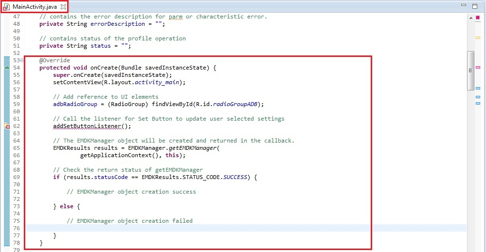

4. Now we need to use the `onOpened` method to get a reference to the EMDKManager. The EMDKListener interface will trigger this event when the EMDK is ready to be used. The EMDKListener interface must be implemented in order to get a reference to the EMDKManager APIs. This event will pass the EMDKManager instance and we assign it to the global variable `emdkManager` that we created in the previous steps. We then use that instance object to get an instance of ProfileManager and assign it to the global variable `profileManager`. This is how we will interface with the APIs in the rest of the code:

    > Note: 
    > Rename the argument of `onOpened` method from `arg0` to `emdkManager`  

        :::java
        // This callback will be issued when the EMDK is ready to use.
		this.emdkManager = emdkManager;

		// Get the ProfileManager object to process the profiles
		profileManager = (ProfileManager) emdkManager
				.getInstance(EMDKManager.FEATURE_TYPE.PROFILE);

	Your complete `onOpened` method should now look like:
    
    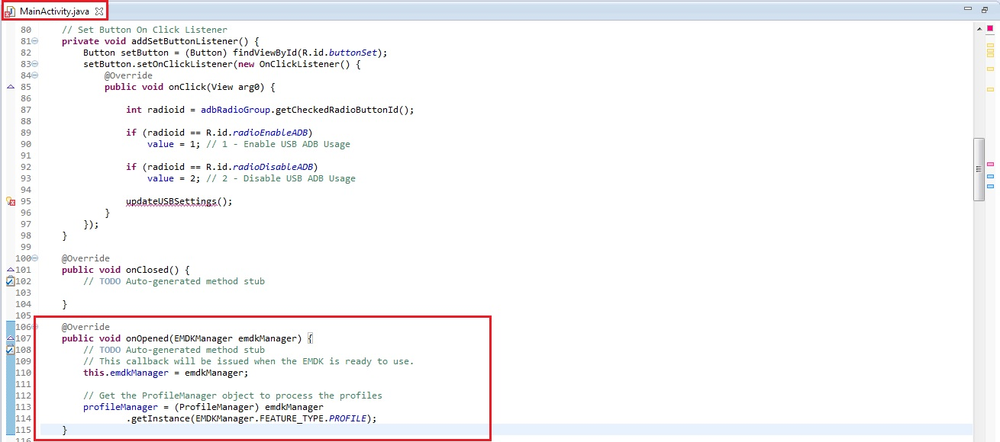 

5. It displays an error as we have not added the listener method for "Set" button. So let us add `addSetButtonListener` by using following code:

		:::java
		// Set Button On Click Listener
			private void addSetButtonListener() {
				Button setButton = (Button) findViewById(R.id.buttonSet);
				setButton.setOnClickListener(new OnClickListener() {
					@Override
					public void onClick(View arg0) {
		
						int radioid = adbRadioGroup.getCheckedRadioButtonId();
		
						if (radioid == R.id.radioEnableADB)
							value = 1; // 1 - Enable USB ADB Usage
		
						if (radioid == R.id.radioDisableADB)
							value = 2; // 2 - Disable USB ADB Usage
		
						updateUSBSettings();
					}
				});
			}

	The code sets variable `value` based on the [Radio Button](http://developer.android.com/guide/topics/ui/controls/radiobutton.html) option selected by the user. This variable will be used to update the profile settings.

	`value` = 1 -> Enable USB ADB Usage

	`value` = 2 -> Disable USB ADB Usage

	The `addSetButtonListener` method should look like:
     
    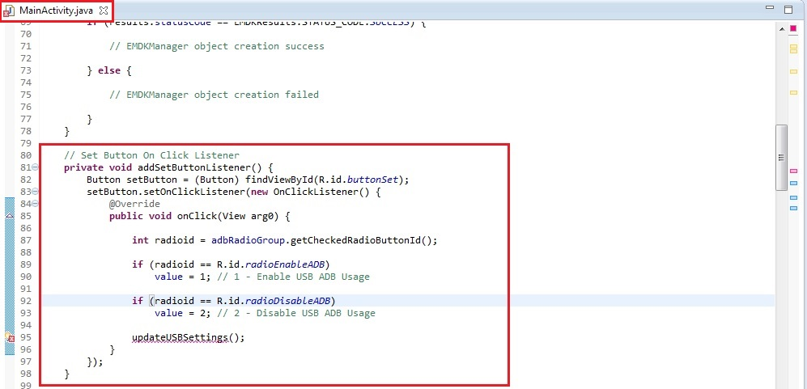

6. Let us declare the `updateUSBSettings` method that will enable or disable ADB USB based on `value` attribute that gets updated depending on user selected option from Radio Button. This method prepares the xml input for the `processProfile` method based on `value` attribute.

	This `processProfile` method returns the result of applying a particular profile that we set using EMDK Profile Wizard in [EMDKResults](/emdk-for-android/7-5/api/core/EMDKResults) reference. If the profile is successfully processed, it returns the status as `CHECK_XML` and then we go on and parse the response to get further details whether the profile was applied successfully or not. Otherwise we display a Failure message in a [dialog](http://developer.android.com/reference/android/app/AlertDialog.html).

	> Note: 1. There is a difference between processing a profile successfully and applying a profile successfully.

	> Note: 2. If the status is other than `CHECK_XML`, we are simply displaying a failure message. You can actually go ahead and check different types of status and display the appropriate message accordingly, which is not in the scope of this sample tutorial.

	In case of `CHECK_XML` status, We retrieve  XML response string from the result using `getStatusString` method. So the method `updateUSBSettings` has following code.

		:::java
		// Updates ADB USB settings by setting the profile based on user selected
		// option on UI
		public void updateUSBSettings() {
			// Reset values
			errorName = "";
			errorType = "";
			errorDescription = "";
			status = "";
		
			try {
		
			// Prepare XML to update the existing profile based on user selected
			// settings
			String[] modifyData = new String[1];
			modifyData[0] = "<?xml version=\"1.0\" encoding=\"utf-8\"?>"
							+ "<characteristic type=\"Profile\">"
							+ "<parm name=\"ProfileName\" value=\"USBManagerProfile\"/>"
							+ "<characteristic type=\"UsbMgr\">"
							+ "<parm name=\"UsbADBUsage\" value=\"" + value + "\"/>"
							+ "</characteristic>" + "</characteristic>";
		
			// Call processPrfoile with profile name and SET flag to create
			// the
			// profile. The modifyData can be null.
			EMDKResults results = profileManager.processProfile(profileName,
							ProfileManager.PROFILE_FLAG.SET, modifyData);
		
			if (results.statusCode == EMDKResults.STATUS_CODE.CHECK_XML) {
		
			// Get XML response as a String
			String statusXMLResponse = results.getStatusString();
		
			try {
			  // Create instance of XML Pull Parser to parse the
			  // response
			  XmlPullParser parser = Xml.newPullParser();
			  // Provide the string response to the String Reader that
			  // reads
			  // for the parser
			  parser.setInput(new StringReader(statusXMLResponse));
			  // Call method to parse the response
			  parseXML(parser);
			  } catch (XmlPullParserException e) {
			    e.printStackTrace();
			  }
		
			  if (TextUtils.isEmpty(errorDescription)) {
				// Method call to display success results in a dialog
				displayResults("Success", "Profile Successfully Applied...");
			  } else {
			    // Method call to display failure results in a dialog
							displayResults(status, buildFailureMessage());
			  }
		
			  } else {
				// Method call to display failure results in a dialog
				displayResults("Failure", "Failed to apply profile...");
			  }
			} catch (Exception ex) {
					ex.printStackTrace();
			}
		}

	The `updateUSBSettings` method should look like:
     
    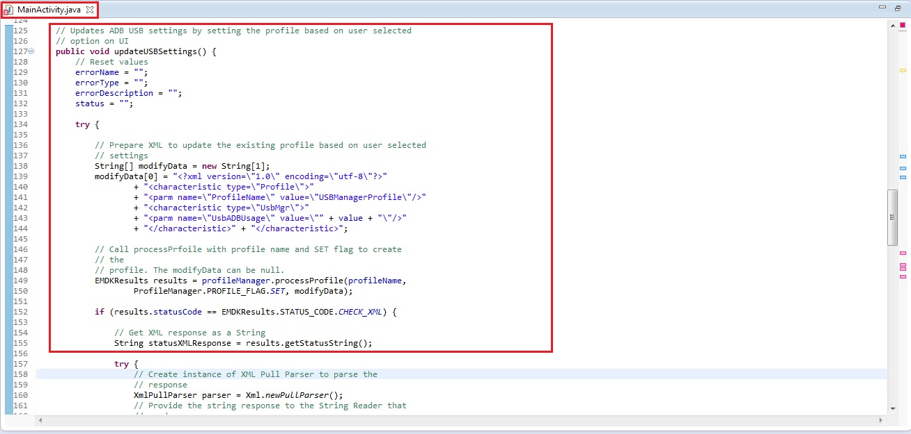

	and the remaining part of this method looks like:	

	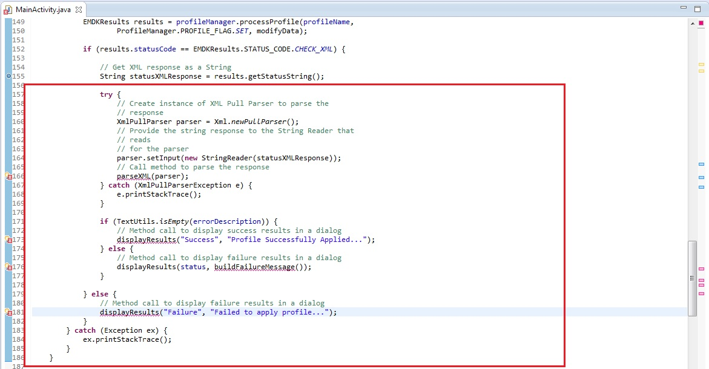

7. It displays few errors as we have not declared them. So let us declare them one by one. Once the response is received in string, we will call `parseXML` method to parse it and eventually call `displayResults` method to display output in a [dialog](http://developer.android.com/reference/android/app/AlertDialog.html). The `parseXML` method uses [XML Pull Parser](http://developer.android.com/reference/org/xmlpull/v1/XmlPullParser.html) to parse the XML string response and set the status and error parameters if any.

	In the reponse, we are supposed to capture `name` and `desc` for `parm-error` tag, `type` and `desc` for `characteristic-error` tag in case of any errors. 

		:::java
		// Method to parse the XML response using XML Pull Parser
		public void parseXML(XmlPullParser myParser) {
			int event;
			try {
				event = myParser.getEventType();
				while (event != XmlPullParser.END_DOCUMENT) {
					String name = myParser.getName();
					switch (event) {
					case XmlPullParser.START_TAG:
						// Get Status, error name and description in case of
						// parm-error
						if (name.equals("parm-error")) {
							status = "Failure";
							errorName = myParser.getAttributeValue(null, "name");
							errorDescription = myParser.getAttributeValue(null,
									"desc");
	
							// Get Status, error type and description in case of
							// parm-error
						} else if (name.equals("characteristic-error")) {
							status = "Failure";
							errorType = myParser.getAttributeValue(null, "type");
							errorDescription = myParser.getAttributeValue(null,
									"desc");
						}
						break;
					case XmlPullParser.END_TAG:
	
						break;
					}
					event = myParser.next();
	
				}
			} catch (Exception e) {
				e.printStackTrace();
			}
		}

	Your complete `parseXML` method should now look like:
    
    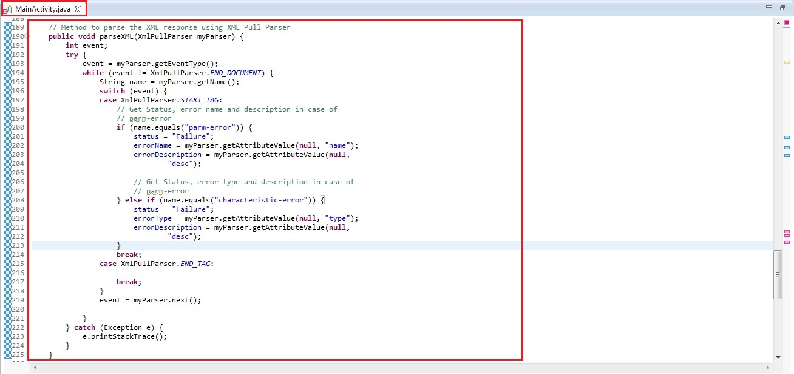

8. Once the response is parsed, we prepare status and error detail messages to handle errors using `buildFailureMessage` method. , in order to display to the user. 

	In this method, the error message in case of error is formed using following way: 

    * Name and description of error if the response contains `parm-error`.
    * Type and description of error if the response contains `characteristic-error`.
    * Name, type and description of error if the response contains both `parm-error` and `characteristic-error`.

	The `buildFailureMessage` method would have following code to match the above mentioned criteria.  

		:::java
		// Method to build failure message that contains name, type and
		// description of respective error (parm, characteristic or both)
		public String buildFailureMessage() {
		  String failureMessage = "";
		  if (!TextUtils.isEmpty(errorName) && !TextUtils.isEmpty(errorType))
			 failureMessage = errorName + " :" + "\n" + errorType + " :" + "\n"
					+ errorDescription;
		  else if (!TextUtils.isEmpty(errorName))
			 failureMessage = errorName + " :" + "\n" + errorDescription;
		  else
			 failureMessage = errorType + " :" + "\n" + errorDescription;
		  return failureMessage;

		}

    `buildFailureMessage` method should look like:
    
    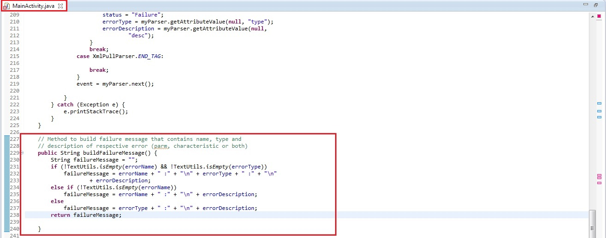

9. You will still see few errors as we have not yet declared `displayResults` method. So we now declare this generic method that takes two string arguments viz. `title` and `description` and displays them in a [dialog](http://developer.android.com/reference/android/app/AlertDialog.html) so that the user understands the status of its ADB USB operation. The field `title` represents the status of Profile Manager operation, which could be Success or Failure. The field `description` describes the respective status.

		:::java
		// Method to display results (Status, Error Name, Error Type, Error
		// Description if any) in a
		// dialog
		public void displayResults(String title, String description) {
			// Alert Dialog to display the status of the Profile creation
			// operation of MX features
			AlertDialog.Builder alertDialogBuilder = new AlertDialog.Builder(
					MainActivity.this);
	
			alertDialogBuilder.setTitle(title);
			alertDialogBuilder.setMessage(description);
			alertDialogBuilder.setCancelable(false).setPositiveButton("OK",
					new DialogInterface.OnClickListener() {
						public void onClick(DialogInterface dialog, int id) {
							// Cancels the dialog
						}
					});
			// create alert dialog
			AlertDialog alertDialog = alertDialogBuilder.create();
			// show it
			alertDialog.show();
		}

	The method `displayResults` method looks like:
    
    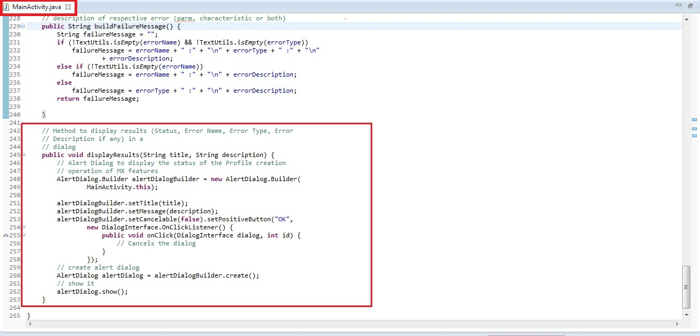  
       
	You can see that all the errors are gone.  
    
10. Now let's override the "onDestroy" method so we can release the EMDKManager resources:  

        :::java
        @Override  
        protected void onDestroy() {  
            // TODO Auto-generated method stub  
            super.onDestroy();  
            //Clean up the objects created by EMDK manager  
            emdkManager.release();  
        } 

    Your onDestroy method should now look like this:  

    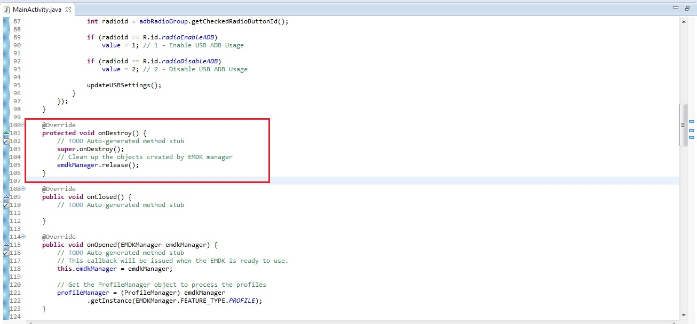 

That's it!!! We are done with all the coding and configuration part that will let us configure (Enable/Disable) the USB ADB Usage on Zebra Android device. Now let us run the application.
 
## Running the Application

1. Connect the device to a USB port (device must have USB debugging enabled). 

    > Note:   
    > Make sure the device is in USB debug.

    Before running the application, we will make sure that USB ADB mode is ON so that we can run this tutorial. So go to Settings -> Developer Options. Make sure that "USB debugging" (ADB Mode) option is ON.

    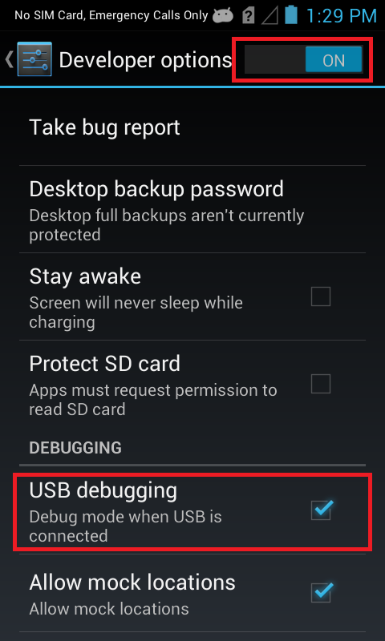

2. Run the application.

    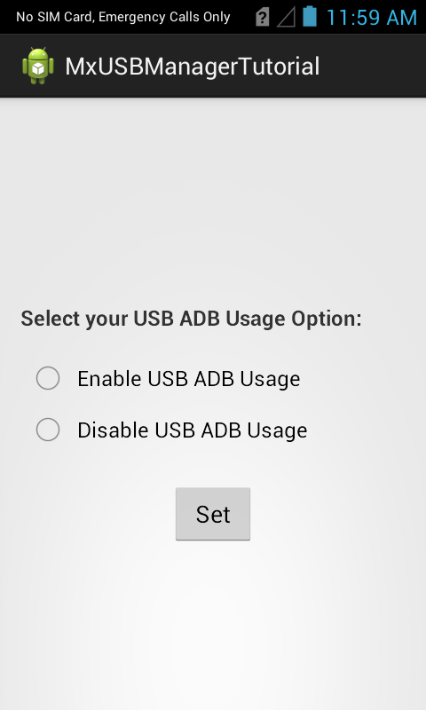

3. Now select your USB ADB option (We will select "Disable") and press "Set" button. 

	You can see an [Alert Dialog](http://developer.android.com/reference/android/app/AlertDialog.html) with a success message, which indicates that the app has successfully disabled USB ADB Mode.

	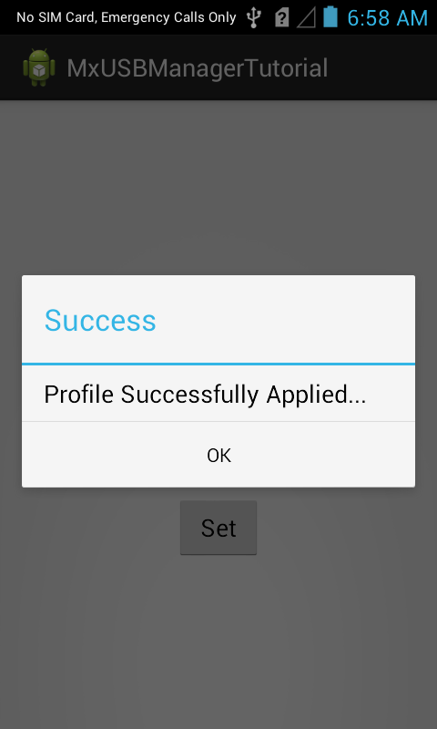

	> Note: In case of any errors, you will see a Failure status with respective error message in that dialog.

3. In other words, the USB debugging option on your Zebra device is turned OFF and you will not be able to run any Android application on this Zebra device. 

    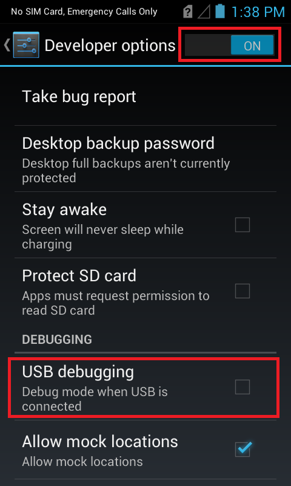

	You can select the enable option and press "Set" button to turn USB ADB Usage ON.

	This is how USB Manager is used to configure USB ADB Mode on your Zebra Android device using Profile Wizard. 
    
##Important Programming Tips##

1. Perform the following changes in the application's `AndroidManifest.xml` file:  
  
		//Include the permission for EMDK:  
        :::xml
        <uses-permission android:name="com.symbol.emdk.permission.EMDK"/>
    
		//Use the EMDK library:  
        :::xml
        <uses-library android:name="com.symbol.emdk"/>
   
2. Use DataWedge v1.7.12 or higher version to test the `ProfileManager.processProfile()` method for DataWedge profiles.

## What's Next
Now that you have learned how to Manage USB configurations using USB Manager on your Zebra devices through applications, let us try to understand and implement some of the other new MX features introduced in V 3.0. So in the next tutorial, we will concentrate on the "XML Manager" MX feature and try to explore this feature by creating a tutorial.

