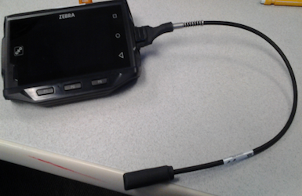

##Overview
This document provides an overview on design points to be considered during the development of an application that reads a barcode and notifies users leveraging the Notification API in a business application workflow.

##Notification API

**Zebra EMDK notification API is intended  to notify the user using remote devices such as RS6000 and pluggable External Vibrator**

A Ring Scanner such as RS6000 provides several annunciators to notify
the user of business application workflow events. The list of
annunciators includes multi-color LEDs, a beeper and a vibrator. 
Business applications leveraging the Notification API would have the ability to control these annunciators to notify the user of custom events in their workflow.

RS6000 with multi-colored LED (location highlighted)

###External Vibrator

The External Vibrator is a pluggable accessory for using with WT6000 device and supports only the vibration feature. This is meant for hearing impaired users and can be used to notify with vibration instead of beeping.

 

###API

NotificationManager is the primary object to enumerate the supported
notification devices and access the notification devices. The
NotificationManager can be used to control the notifications on the
accessories such as RS6000 and External Vibrator. This API can’t be used
to control the built-in notifications on the mobile devices.

A list of points to be considered during application design are
below:

*  The notification devices must be paired and connected before enabling the notification device; otherwise this will result in DEVICE_NOT_CONNECTED error.

* The applications can enumerate the supported devices and determine its supported notification capability of the remote device to minimize the confusion on setting the unsupported features. The capabilities can be determined using the methods of enumerated DeviceInfo object such as isLEDSupported(), isBeepSupported(), isVibrateSupported(). 

    The notification capabilities are:
	1. Line of sight LED
    2. Beeping
    3. Vibration

* When multiple pluggable External Vibrators connected to WT6000 device, the WT6000 device always chooses the first connected External Vibrator for sending the notifications.

*   Only one application is allowed to enable the notification device at a time. The recommendation for the application to disable notification device object when application doesn’t need the notification devices anymore.

*   The notification sent to the notification device will replace the previous notifications in progress and the applications must be designed to handle this based on the business requirements.

*   When the notification device such as RS6000 is disconnected and connected back, calling any method on the notification device will result DEVICE_INVALID error. The application has to release the previous and get a new notification device to work with the re-connected device. This behavior is applicable only to RS6000.  The application doesn’t need to release and get a new notification device when the pluggable External Vibrator gets disconnected and connected and can continue to use the same notification device.

*   Disabling the notification device cancels the pending notification in progress and closes the session for the others applications to utilize the notification device.

### Getting Notification Manager

 **EMDKManager > NotificationManager used in an application must be released before another application can use this feature.**

    :::Java
    NotificationManager notificationManager = (NotificationManager)emdkManager.getInstance(FEATURE_TYPE.NOTIFICATION);

### Getting Notification Device

There are two options here:

1.  **Get NotificationDevice using DeviceIdentifier without device
    enumeration**
    
    Use the NotificationManager.getDevice(DeviceIdentifier deviceIdentifier) API
    
    The valid Device Identifiers are:
    
    * BLUETOOTH_IMAGER_RS6000: Use the Ring Scanner “RS6000”
    * EXTERNAL_VIBRATOR1: Use the pluggable External Vibrator
    
    If the specified Device Identifier is not supported on the target platform, call to “getDevice” will return null.

        :::java
        NotificationDevice notificationDevice = notificationManager.getDevice(DeviceIdentifier.BLUETOOTH_IMAGER_RS6000);

2.  **Get NotificationDevice using DeviceInfo from device enumeration**

    Use the NotificationManager.getSupportedDevicesInfo() first and then pass one of the enumerated DeviceInfo to NotifcationManager.getDevice(DeviceInfo deviceInfo)

        :::java
        List<DeviceInfo> supportedDevList = notificationManager.getSupportedDevicesInfo();

        NotificationDevice notificationObject = null;

        Iterator<DeviceInfo> it = deviceList.iterator();

        while(it.hasNext()) {
            DeviceInfo devInfo = it.next();
            if(devInfo.getConnectionType()==BLUETOOTH_SSI&&devInfo.getDeviceType()==IMAGER){
                notificationObject = notificationManager.getDevice(devInfo);
                break;
            }
        }

### Using Notification Device

The notification device must be enabled before sending notifications to the notification devices and this opens the session with the hardware. If the notification device is already enabled by this application, it will throw an exception with error DEVICE_ALREADY_ENABLED. EMDKManager > NotificationManager used in an application must be released before another application can use that feature.

The business application can use the NotificationDevice.notify(Notification notification) method to send the notification to remote  device to notify the users.  Passing the null object to this method throws an exception. The notification sent to the notification device will replace the previous notifications in progress and the applications must be designed to handle this based on the business requirements.

The NotificationDevice.cancelNotification() method can be used to cancel
the active notifications on the remote device.

**Using Notification and Scanning at the same time**

Sending the notification to RS6000 by using Notification API while the
scanning in progress will lead to overlapping of notification sent by
NotificationManager API and successful barcode decode status
notifications on RS6000. Therefore the business application must be
designed avoid these overlapping to avoid confusions to the end user.
The Barcode API provides an option to disable successful barcode decode
status notification on RS6000 and these settings are available in
scanner configuration such as ScannerParams .decodeLEDFeedbackMode and
ScannerParams .decodeAudioFeedbackMode.

When using notification manager with RS6000, it will get disconnected
based on Connection Idle Timeout settings. Default timeout is 600 seconds and
either an EMDK scanning app or DataWedge may change this value. If the
behavior is not desirable, consider changing the Connection Idle Timeout
setting in the corresponding app or DataWedge.

