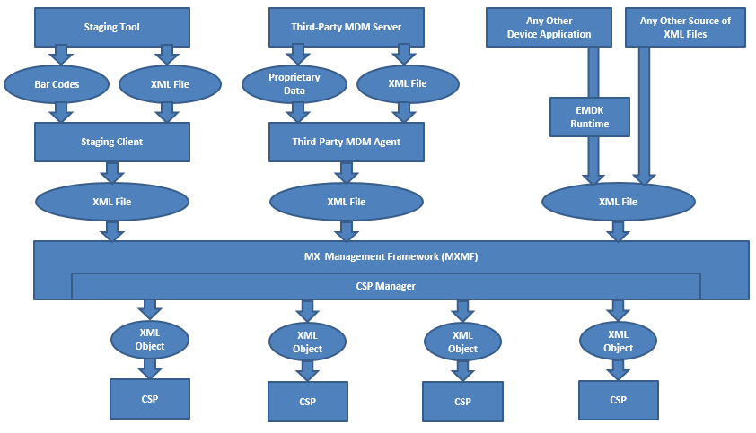

## Overview

The MX Management System (MXMS) provides a common interface to Zebra Android device capabilities utilizing XML that conforms to the standard OMA-CP PROV (Microsoft MSPROV) schema. This allows developers and administrators to have an extensible, efficient, reliable and scalable means for configuring and administrating Zebra Android devices. MXMS exposes capabilities that underlying CSPs provide to give the user access to both privileged and unprivileged APIs. 

## Definitions of Terms

### Board Support Package (BSP)

A BSP is the method that the device teams use to deliver the operating system for any of their devices. 

Every device ships with a specific BSP version pre-installed that is suitable for use on that device model, which is reported via the "Build number". The BSP version that ships in devices of a particular model may or may not be updated just because a new BSP becomes available for that device model. They can generally be updated by downloading a newer (or sometimes older) BSP from the Zebra support website and applying it to the device via the OS Update Process for that device.

### Android Open Source Project (AOSP)

AOSP is the method that Google uses to release and distribute the source code for the Android Operating System for royalty-free use by the open source community. OEMs are free to use, modify, and extend AOSP as needed, subject to certain standard licensing requirements. Each BSP for any of the Zebra Android devices includes an operating system that was derived, directly or indirectly, from AOSP. These BSPs generally also include modifications and/or enhancements beyond AOSP that provide additional value to our customers.

### Mobility Extensions (MX)

MX is the umbrella term used to refer collectively to the entire experience offered by the Zebra Android devices. This means that MX represents all the value that a BSP offers over and above that provided by AOSP, including:

* Changes and extensions to the Core Operating System (OSX)
* Value-Add Features (i.e. Multi-user, Whitelisting, etc.)
* The MX Management Framework (MXMF)
* Configuration Service Providers (CSPs)
* Changes and extensions to standard applications (i.e. Settings UI, browser, email client, etc.)

>**Note:** All of the above components may or may not be present on a device. Specifically, MXMF and the CSPs may be absent. Therefore, these components would need to be installed on the device before they can be used.

### Operating System Extensions (OSX)

OSX is the term used to refer to changes and extensions to the standard AOSP as included in a BSP. OSX is versioned and the version of OSX in a device is the primary way to determine which changes and extensions are present in the operating system of that device. As a general rule, the version of OSX that is in a device can ONLY be changed by loading a different BSP (that contains a different version of OSX) into that device, via the OS update process.

### MX Management Framework (MXMF)

MXMF is a device subsystem that provides an interface to applications that wish to set or query the configuration of device subsystems. It does not directly implement set and query functions but provides a framework to support and host CSPs that do. MXMF can be built-into a BSP or can be added to a BSP after a device is shipped (via a patch applied via the OS update process). Applications and the MXMF communicate through an interchange of XMLs that conform to the **XML.DTD**, as described in the document **MX MF XML DTD**.

### Configuration Service Provider (CSP)

A CSP is a device code module that implements the ability to set and query the configuration of a subsystem on a device (i.e. clock, Wi-Fi, etc.). The capabilities that are supported and exposed by a CSP are defined by a corresponding DSD. 

A CSP is a plug-in to the MXMF which can ship as part of the MXMF, can be included in a BSP along with the MXMF, or can be downloaded to a device as needed. Before it can be used on a device, a CSP must be registered with the MXMF on that device and all calls to a CSP must go through the MXMF. The MXMF and CSPs communicate through XMLs that conform to the **XML.DTD**, as described in the document **MX MF XML DTD**.

### MX Management System (MXMS)

MXMS is a term used to refer to the MXMF and all CSPs that are registered with the MXMF at a given point in time. It provides the ability to set and/or query the configuration of the device subsystems for which CSPs are registered with MXMF. There are three kinds of CSPs that are included in this:

* CSPs that are built-into the MXMF, such as the CertMgr CSP
* CSPs that are built-into a device and pre-registered with MXMF, such as the Wi-Fi CSP

MXMS can be thought of as "the MXMF and a collection of currently registered CSPs". Although applications submit XML to the MXMF, it is a bit more accurate to say that the MXMS (not just the MXMF) is the entity via which applications set and/or query configuration.

## MX Architecture and Data Flow

System components:

* MXMS
	* MXMF
	* CSPs
		* Unprivileged
		* Privileged
	* AOSP APIs
		* Unprivileged
		* Privileged
	* OSX APIs
		* Privileged
	* Core Applications

### Overview

### Android Device BSP

## MX on Devices

The MX version on a specific device can be effected by:

* OS Updates
* EMDK for Android Device Runtime Updates

With each version of MX, new CSPs can be introduced and pre-existing CSPs are sometimes updated with new behavior. Updates to MX generally DO NOT remove or change pre-existing behavior unless specifically noted.

