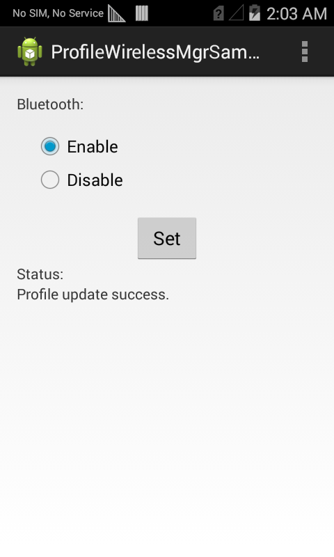

##Overview##
This sample application will show you how to enable or disable the bluetooth radio on a device

##Requirements
Android API 22 (or higher) must be installed via the SDK Manager before attempting to load this sample.

##Loading the Sample Application
The following guide will walk you through setting up the EMDK samples in your IDE.

* [Android Studio](/emdk-for-android/7-6/guide/emdksamples_androidstudio)

>**NOTE**: The appearance of sample app screens can vary by sample app version, Android version and screen size.

##Using This Sample
1. When the application starts it should look like the following.  
    
2. Select Enable or Disable, then click **Set**
  
  The Status field will update after submitting the profile.
  

